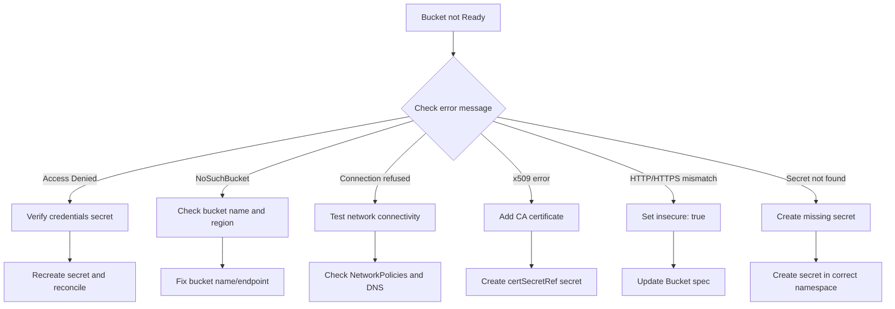

# How to Troubleshoot Bucket Source Connection Errors in Flux

Author: [nawazdhandala](https://github.com/nawazdhandala)

Tags: Flux CD, GitOps, Kubernetes, Bucket, Troubleshooting, Debugging

Description: Learn how to diagnose and fix common Bucket source connection errors in Flux CD including authentication failures, network issues, and TLS problems.

---

## Introduction

When configuring a Bucket source in Flux CD, connection errors are among the most common issues. These can stem from incorrect credentials, network connectivity problems, TLS certificate mismatches, or misconfigured endpoints. This guide provides a systematic approach to diagnosing and resolving Bucket source errors in Flux.

## Prerequisites

- Flux CD installed on your cluster
- `kubectl` access to the cluster
- Flux CLI installed locally

## Step 1: Check the Bucket Source Status

Start by examining the current state of the Bucket source.

```bash
# List all Bucket sources and their status
flux get sources bucket -A

# Get detailed status for a specific Bucket
kubectl describe bucket my-app -n flux-system
```

The status conditions on the Bucket resource contain the error message and reason. Look for the `Ready` condition and its message.

```bash
# Extract just the status conditions
kubectl get bucket my-app -n flux-system -o jsonpath='{.status.conditions[*].message}'
```

## Step 2: Check Source Controller Logs

The source-controller is responsible for fetching bucket contents. Its logs contain detailed error information.

```bash
# View source-controller logs filtered for bucket-related messages
kubectl logs -n flux-system deployment/source-controller | grep -i bucket

# Follow logs in real-time while triggering a reconciliation
kubectl logs -n flux-system deployment/source-controller -f &
flux reconcile source bucket my-app -n flux-system
```

## Common Errors and Solutions

### Error: Access Denied / 403 Forbidden

This indicates an authentication failure. The credentials are either incorrect, expired, or lack sufficient permissions.

**Diagnosis:**

```bash
# Verify the secret exists and has the expected keys
kubectl get secret bucket-creds -n flux-system -o jsonpath='{.data}' | jq -r 'keys'

# Decode and verify the access key (be careful with secret values)
kubectl get secret bucket-creds -n flux-system \
  -o jsonpath='{.data.accesskey}' | base64 -d
```

**Solution for generic/AWS provider:**

```bash
# Recreate the secret with correct credentials
kubectl delete secret bucket-creds -n flux-system
kubectl create secret generic bucket-creds \
  --namespace flux-system \
  --from-literal=accesskey=CORRECT_ACCESS_KEY \
  --from-literal=secretkey=CORRECT_SECRET_KEY

# Trigger reconciliation
flux reconcile source bucket my-app -n flux-system
```

**Solution for GCP provider:**

```bash
# Verify the service account key file is valid JSON
kubectl get secret gcp-bucket-creds -n flux-system \
  -o jsonpath='{.data.serviceaccount}' | base64 -d | jq .

# If invalid, recreate with the correct key file
kubectl delete secret gcp-bucket-creds -n flux-system
kubectl create secret generic gcp-bucket-creds \
  --namespace flux-system \
  --from-file=serviceaccount=./correct-sa-key.json
```

### Error: NoSuchBucket / Bucket Not Found

The bucket name is incorrect or does not exist in the specified region.

**Diagnosis:**

```bash
# Check the Bucket resource configuration
kubectl get bucket my-app -n flux-system -o yaml | grep -A5 spec
```

**Solution:**

Verify the bucket exists using your cloud provider CLI.

```bash
# AWS
aws s3 ls s3://my-manifests --region us-east-1

# GCP
gcloud storage ls gs://my-manifests

# Azure
az storage container show --name my-manifests --account-name mystorageaccount
```

Update the Bucket resource if the name or endpoint is wrong.

### Error: dial tcp: connection refused / timeout

The source-controller cannot reach the storage endpoint from within the cluster.

**Diagnosis:**

```bash
# Test connectivity from within the cluster
kubectl run -n flux-system net-test --rm -it --image=busybox:1.36 -- sh -c \
  "wget -q --spider -T 5 https://s3.amazonaws.com && echo 'reachable' || echo 'unreachable'"

# For internal endpoints like MinIO
kubectl run -n flux-system net-test --rm -it --image=busybox:1.36 -- sh -c \
  "wget -q --spider -T 5 http://minio.minio.svc.cluster.local:9000/minio/health/live && echo 'reachable' || echo 'unreachable'"
```

**Solution:**

Check for network policies blocking egress from the flux-system namespace.

```bash
# Check for NetworkPolicies in the flux-system namespace
kubectl get networkpolicies -n flux-system

# If policies exist, ensure they allow egress to the storage endpoint
```

Verify DNS resolution.

```bash
# Test DNS resolution from within the cluster
kubectl run -n flux-system dns-test --rm -it --image=busybox:1.36 -- \
  nslookup s3.amazonaws.com
```

### Error: x509 certificate signed by unknown authority

The storage endpoint uses a TLS certificate that the source-controller does not trust.

**Diagnosis:**

```bash
# Check if certSecretRef is configured
kubectl get bucket my-app -n flux-system -o jsonpath='{.spec.certSecretRef}'

# If configured, verify the secret exists and contains a valid certificate
kubectl get secret registry-ca -n flux-system -o jsonpath='{.data.ca\.crt}' | \
  base64 -d | openssl x509 -text -noout
```

**Solution:**

```bash
# Create or update the CA certificate secret
kubectl create secret generic bucket-ca \
  --namespace flux-system \
  --from-file=ca.crt=/path/to/correct-ca.crt \
  --dry-run=client -o yaml | kubectl apply -f -
```

Update the Bucket resource to reference the certificate.

```yaml
# Add certSecretRef to the Bucket spec
apiVersion: source.toolkit.fluxcd.io/v1beta2
kind: Bucket
metadata:
  name: my-app
  namespace: flux-system
spec:
  interval: 5m
  provider: generic
  bucketName: my-manifests
  endpoint: minio.internal.example.com
  secretRef:
    name: bucket-creds
  certSecretRef:
    name: bucket-ca
```

### Error: http: server gave HTTP response to HTTPS client

The storage endpoint runs HTTP but Flux is attempting HTTPS.

**Solution:**

Set `insecure: true` on the Bucket resource for HTTP endpoints.

```yaml
apiVersion: source.toolkit.fluxcd.io/v1beta2
kind: Bucket
metadata:
  name: my-app
  namespace: flux-system
spec:
  interval: 5m
  provider: generic
  bucketName: my-manifests
  endpoint: minio.dev.local:9000
  insecure: true
  secretRef:
    name: bucket-creds
```

### Error: Secret Not Found

The `secretRef` or `certSecretRef` points to a secret that does not exist.

**Diagnosis:**

```bash
# Check if the referenced secret exists
kubectl get secret bucket-creds -n flux-system

# Verify the secret is in the same namespace as the Bucket resource
kubectl get secrets -n flux-system
```

**Solution:**

Create the missing secret.

```bash
kubectl create secret generic bucket-creds \
  --namespace flux-system \
  --from-literal=accesskey=YOUR_KEY \
  --from-literal=secretkey=YOUR_SECRET
```

### Error: Provider Mismatch

Using the wrong provider can cause unexpected authentication failures.

**Diagnosis:**

Verify the provider matches your storage backend.

```bash
kubectl get bucket my-app -n flux-system -o jsonpath='{.spec.provider}'
```

**Solution:**

Use `aws` for Amazon S3, `gcp` for Google Cloud Storage, `azure` for Azure Blob Storage, and `generic` for all S3-compatible services (MinIO, DigitalOcean Spaces, Alibaba Cloud OSS, etc.).

## Troubleshooting Flowchart



## Forcing a Reconciliation

After making fixes, force the source-controller to retry.

```bash
# Trigger an immediate reconciliation
flux reconcile source bucket my-app -n flux-system

# If the source is stuck, suspend and resume it
flux suspend source bucket my-app -n flux-system
flux resume source bucket my-app -n flux-system
```

## Checking Events

Kubernetes events provide additional context about failures.

```bash
# View events related to the Bucket resource
kubectl events -n flux-system --for bucket/my-app

# Or use the older syntax
kubectl get events -n flux-system --field-selector involvedObject.name=my-app
```

## Best Practices

1. **Start with the error message.** The Bucket status condition message is usually specific enough to identify the problem category.

2. **Test connectivity separately.** Use a temporary pod to test network and DNS resolution before debugging Flux configuration.

3. **Verify secrets independently.** Decode and validate secret contents before assuming the Bucket configuration is wrong.

4. **Check the source-controller version.** Some features (like specific providers or authentication methods) require a minimum Flux version.

5. **Use events and logs together.** Kubernetes events and source-controller logs provide complementary information for diagnosis.

## Conclusion

Troubleshooting Bucket source connection errors in Flux CD follows a systematic process: check the status, read the error message, verify credentials and connectivity, and fix the root cause. Most issues fall into a few categories -- authentication failures, network problems, TLS issues, or configuration mistakes. By following the diagnosis steps and solutions in this guide, you can quickly resolve Bucket source errors and get your GitOps workflow back on track.
