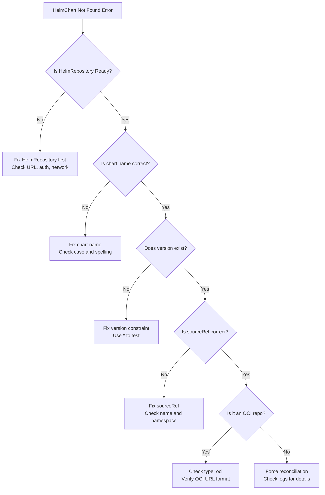

# How to Troubleshoot HelmChart Not Found Errors in Flux

Author: [nawazdhandala](https://github.com/nawazdhandala)

Tags: Flux CD, GitOps, Kubernetes, Helm, HelmChart, Troubleshooting, Debugging

Description: Learn how to diagnose and fix HelmChart not found errors in Flux CD, covering common causes like incorrect chart names, version mismatches, source misconfiguration, and authentication failures.

---

## Introduction

One of the most frustrating issues when working with Flux CD is the "chart not found" error. This error can stem from many causes: an incorrect chart name, a version constraint that matches nothing, a misconfigured HelmRepository, authentication failures, or network issues. This guide provides a systematic approach to diagnosing and resolving HelmChart not found errors in Flux CD.

## Common Error Messages

Before diving into troubleshooting, here are the typical error messages you might encounter.

```
chart "my-app" version "1.0.0" not found in HelmRepository "flux-system/my-repo"
```

```
failed to get chart version for remote reference: no chart version found for my-app-1.0.0
```

```
HelmChart 'flux-system/my-app' is not ready: chart pull error
```

## Step 1: Check HelmChart Status

Start by examining the HelmChart resource status for specific error details.

```bash
# Get the HelmChart status with conditions
kubectl get helmchart -n flux-system -o wide

# Describe the HelmChart for full condition details
kubectl describe helmchart -n flux-system my-app
```

Look at the `Conditions` section in the output. The `message` field usually contains the specific error.

```bash
# Extract just the condition messages
kubectl get helmchart -n flux-system my-app -o jsonpath='{range .status.conditions[*]}{.type}: {.message}{"\n"}{end}'
```

## Step 2: Verify the HelmRepository Source

The HelmChart depends on a healthy HelmRepository. Check that the source is ready.

```bash
# Check all HelmRepository sources
flux get sources helm

# Describe the specific HelmRepository referenced by the HelmChart
kubectl describe helmrepository -n flux-system my-repo
```

If the HelmRepository shows `READY: False`, the problem is at the source level, not the chart level. Common HelmRepository issues include:

- **URL is incorrect** -- Typo in the repository URL
- **Repository is down** -- The remote server is not responding
- **Authentication failure** -- Credentials are missing or invalid
- **TLS certificate error** -- Self-signed cert without CA configured

## Step 3: Verify the Chart Name

A very common cause of "chart not found" is an incorrect chart name. Chart names are case-sensitive and must match exactly.

```bash
# If you have Helm installed locally, add the repo and search for the chart
helm repo add my-repo https://charts.example.com
helm repo update
helm search repo my-repo/ --versions
```

Compare the chart name in your HelmChart resource against the available charts.

```yaml
# Check that the chart name matches exactly
apiVersion: source.toolkit.fluxcd.io/v1
kind: HelmChart
metadata:
  name: my-app
  namespace: flux-system
spec:
  # This name must match exactly what the repository provides
  # Common mistakes: wrong case, missing prefix, extra suffix
  chart: my-app  # Is this the correct name?
  version: "1.0.0"
  sourceRef:
    kind: HelmRepository
    name: my-repo
  interval: 10m
```

Common naming mistakes to watch for:

| Mistake | Example | Should Be |
|---------|---------|-----------|
| Wrong case | `MyApp` | `my-app` |
| Missing prefix | `nginx` | `bitnami-nginx` |
| Extra prefix | `stable/nginx` | `nginx` |
| Typo | `ngingx` | `nginx` |

## Step 4: Verify the Version Constraint

If the chart name is correct but no version matches, the version constraint may be the issue.

```bash
# List all available versions of the chart
helm search repo my-repo/my-app --versions
```

Check if your version constraint matches any available version.

```yaml
# Common version constraint issues
spec:
  chart: my-app
  # Problem: This exact version does not exist
  version: "1.0.0"

  # Problem: The range matches no available versions
  # version: ">=2.0.0 <2.1.0"

  # Fix: Use a version that exists or broaden the range
  # version: ">=1.0.0 <2.0.0"
  # version: "1.x"
```

To quickly test, temporarily set a very broad version constraint.

```yaml
# Temporarily use a wildcard to confirm the chart exists
spec:
  chart: my-app
  version: "*"
```

If this works, the issue is with your version constraint. Narrow it down from the wildcard.

## Step 5: Check Source Reference

Ensure the HelmChart `sourceRef` points to the correct HelmRepository.

```yaml
# Verify the sourceRef is correct
spec:
  chart: my-app
  sourceRef:
    # Must be HelmRepository, GitRepository, or Bucket
    kind: HelmRepository
    # Must match the metadata.name of the HelmRepository
    name: my-repo
    # If omitted, defaults to the HelmChart's namespace
    # namespace: flux-system
```

A common mistake is referencing a HelmRepository in a different namespace without specifying the namespace.

```bash
# List all HelmRepositories across all namespaces
kubectl get helmrepository --all-namespaces
```

## Step 6: Check for OCI-Specific Issues

If your HelmRepository uses the OCI protocol, there are additional things to verify.

```yaml
# For OCI repositories, ensure the type is set
apiVersion: source.toolkit.fluxcd.io/v1
kind: HelmRepository
metadata:
  name: my-oci-repo
  namespace: flux-system
spec:
  # This must be set to "oci" for OCI registries
  type: oci
  # URL must use the oci:// scheme
  url: oci://ghcr.io/my-org/charts
  interval: 30m
```

For OCI registries, the chart name maps to the artifact name in the registry. Verify the artifact exists.

```bash
# Use Helm to verify the OCI chart exists (Helm 3.8+)
helm show chart oci://ghcr.io/my-org/charts/my-app --version 1.0.0
```

Common OCI issues:

- **Missing type: oci** -- Flux treats it as a traditional repository and fails
- **Chart name in URL** -- The URL should not include the chart name; the chart name goes in `spec.chart`
- **Tag vs version** -- OCI artifacts use tags; ensure the tag matches your version constraint

## Step 7: Check Authentication

Authentication failures can manifest as "chart not found" instead of a clear authentication error.

```bash
# Check if the secret referenced by the HelmRepository exists
kubectl get secret -n flux-system helm-repo-creds

# Verify the secret has the expected keys
kubectl get secret -n flux-system helm-repo-creds -o jsonpath='{.data}' | python3 -m json.tool
```

Test the credentials manually.

```bash
# Test authentication with Helm CLI
helm repo add test-repo https://charts.example.com \
  --username my-user \
  --password my-password
helm search repo test-repo/
```

## Step 8: Check Network Connectivity

If the Flux source controller cannot reach the repository, it may report a chart not found error.

```bash
# Check source controller logs for network errors
kubectl logs -n flux-system deployment/source-controller | grep -i "my-app\|my-repo\|error\|failed"
```

```bash
# Test connectivity from within the cluster
kubectl run -n flux-system curl-test --rm -it --image=curlimages/curl -- \
  curl -s -o /dev/null -w "%{http_code}" https://charts.example.com/index.yaml
```

## Step 9: Force Reconciliation

Sometimes the source controller has stale data. Force a fresh reconciliation.

```bash
# Force the HelmRepository to re-fetch the index
flux reconcile source helm my-repo

# Then force the HelmChart to re-resolve
flux reconcile source chart my-app
```

## Step 10: Check Events and Logs

Kubernetes events and source controller logs provide additional context.

```bash
# Check events related to the HelmChart
kubectl get events -n flux-system --field-selector involvedObject.name=my-app --sort-by='.lastTimestamp'

# Check source controller logs for detailed errors
kubectl logs -n flux-system deployment/source-controller --since=10m | grep -i "helmchart\|my-app"
```

## Diagnostic Flowchart

Use this flowchart to systematically diagnose the issue.



## Quick Checklist

Run through this checklist when you encounter a chart not found error.

```bash
# 1. Is the HelmRepository ready?
flux get sources helm

# 2. What does the HelmChart condition say?
kubectl describe helmchart -n flux-system my-app

# 3. Does the chart exist in the repository?
helm repo update && helm search repo my-repo/my-app --versions

# 4. Is the secret present (if using authentication)?
kubectl get secret -n flux-system -l '!helm.sh/release'

# 5. Are there relevant events?
kubectl get events -n flux-system --sort-by='.lastTimestamp' | tail -20

# 6. What do the source controller logs say?
kubectl logs -n flux-system deployment/source-controller --tail=50
```

## Summary

HelmChart not found errors in Flux CD usually come down to one of a few root causes: an incorrect chart name, a version constraint that matches no available versions, a misconfigured or unhealthy HelmRepository source, authentication failures, or network connectivity issues. Work through the diagnostic steps systematically -- check the HelmChart conditions first, then verify the source, chart name, version, and authentication. Force a reconciliation after making changes and monitor the source controller logs for detailed error information.
