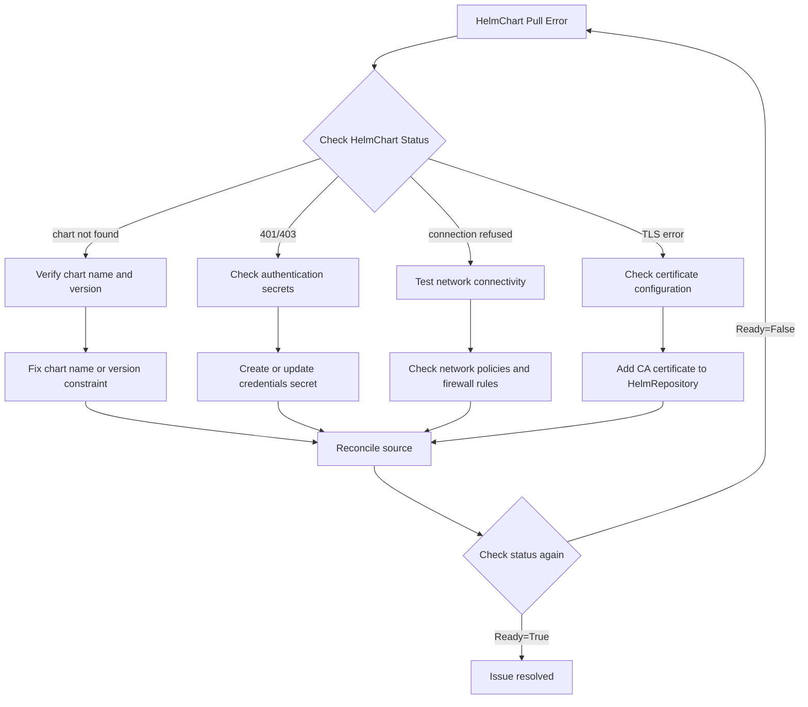

# How to Troubleshoot HelmChart Pull Errors in Flux

Author: [nawazdhandala](https://github.com/nawazdhandala)

Tags: Flux CD, GitOps, Kubernetes, Helm, HelmChart, Troubleshooting, Debugging

Description: A step-by-step guide to diagnosing and fixing HelmChart pull errors in Flux CD, covering authentication failures, network issues, and misconfigured sources.

---

## Introduction

HelmChart pull errors are among the most common issues encountered when using Flux CD for Helm-based deployments. When Flux cannot pull a chart from a HelmRepository, your deployments stall and reconciliation fails. These errors can stem from authentication problems, network restrictions, incorrect chart names or versions, or misconfigured HelmRepository sources.

This guide provides a systematic approach to diagnosing and resolving HelmChart pull errors in Flux.

## Prerequisites

- A Kubernetes cluster with Flux CD installed
- The `flux` CLI and `kubectl` installed
- Access to the cluster where Flux is running

## Step 1: Check the HelmChart Status

Start by examining the status of the HelmChart resource that is failing.

```bash
# Get the status of all HelmChart resources
flux get sources chart --all-namespaces
```

Look for resources with a `False` ready status. For more detail on a specific chart, use the following command.

```bash
# Describe a specific HelmChart to see detailed error messages
kubectl describe helmchart <chart-name> -n <namespace>
```

The `Status.Conditions` section will contain the error message that indicates what went wrong.

## Step 2: Examine Common Error Messages

### Error: "chart not found"

This error means Flux cannot find the specified chart in the repository.

```bash
# Verify the chart name and available versions
helm repo add temp-repo <repository-url>
helm search repo temp-repo/<chart-name> --versions
helm repo remove temp-repo
```

Check your HelmChart resource to ensure the chart name matches exactly.

```yaml
# Verify the chart field matches the actual chart name (case-sensitive)
apiVersion: source.toolkit.fluxcd.io/v1
kind: HelmChart
metadata:
  name: my-app
  namespace: flux-system
spec:
  chart: my-app          # Must match the exact chart name in the repository
  version: "1.2.3"       # Use a specific version or semver range like ">=1.0.0"
  sourceRef:
    kind: HelmRepository
    name: my-repo
  interval: 5m
```

### Error: "failed to fetch chart"

This typically indicates a network or connectivity issue.

```bash
# Check if the source controller pod can reach the repository URL
kubectl logs -n flux-system deploy/source-controller | grep -i "error\|failed\|chart"
```

### Error: "401 Unauthorized" or "403 Forbidden"

Authentication errors indicate that the credentials are missing, expired, or incorrect.

```bash
# Check if the referenced secret exists and has the correct keys
kubectl get secret <secret-name> -n flux-system -o jsonpath='{.data}' | jq 'keys'
```

## Step 3: Verify the HelmRepository Source

The HelmChart resource references a HelmRepository. If the repository itself is unhealthy, charts cannot be pulled.

```bash
# Check the status of all HelmRepository sources
flux get sources helm --all-namespaces
```

If the HelmRepository shows a failure, investigate it further.

```bash
# Get detailed status of the HelmRepository
kubectl describe helmrepository <repo-name> -n <namespace>
```

### Test Repository Connectivity

You can test whether the repository URL is reachable from within the cluster.

```bash
# Run a temporary pod to test connectivity to the repository URL
kubectl run curl-test --rm -it --restart=Never --image=curlimages/curl -- \
  curl -sI https://charts.example.com/index.yaml
```

## Step 4: Fix Authentication Issues

### For HTTP/HTTPS Repositories

If your repository requires authentication, create or update the credentials secret.

```bash
# Create a secret with basic auth credentials for the HelmRepository
kubectl create secret generic helm-repo-creds \
  --namespace=flux-system \
  --from-literal=username=my-user \
  --from-literal=password=my-password
```

Then reference it in your HelmRepository.

```yaml
# HelmRepository with authentication secret reference
apiVersion: source.toolkit.fluxcd.io/v1
kind: HelmRepository
metadata:
  name: my-private-repo
  namespace: flux-system
spec:
  interval: 10m
  url: https://charts.example.com
  secretRef:
    name: helm-repo-creds   # References the secret created above
```

### For OCI Repositories

OCI repositories use different authentication mechanisms.

```bash
# Create a docker-registry secret for OCI authentication
kubectl create secret docker-registry oci-creds \
  --namespace=flux-system \
  --docker-server=registry.example.com \
  --docker-username=my-user \
  --docker-password=my-token
```

## Step 5: Check Version Constraints

A common cause of pull failures is specifying a version that does not exist in the repository.

```yaml
# Common version constraint patterns
apiVersion: source.toolkit.fluxcd.io/v1
kind: HelmChart
metadata:
  name: my-app
  namespace: flux-system
spec:
  chart: my-app
  version: ">=1.0.0 <2.0.0"   # Semver range - pulls latest 1.x
  # version: "1.2.3"           # Exact version
  # version: "*"               # Any version (pulls latest)
  sourceRef:
    kind: HelmRepository
    name: my-repo
  interval: 5m
```

Verify that a chart version matching your constraint actually exists.

```bash
# List all available versions for a chart
helm search repo <repo-name>/<chart-name> --versions
```

## Step 6: Force Reconciliation

After making fixes, trigger an immediate reconciliation instead of waiting for the next interval.

```bash
# Force the HelmRepository to re-fetch its index
flux reconcile source helm <repo-name> -n flux-system

# Force the HelmChart to re-pull the chart
flux reconcile source chart <chart-name> -n flux-system
```

## Step 7: Check Source Controller Logs

The source controller is responsible for pulling charts. Its logs contain the most detailed error information.

```bash
# View source controller logs, filtered for errors
kubectl logs -n flux-system deploy/source-controller --since=10m | grep -E "error|ERR|failed"
```

For even more detail, you can increase the log verbosity.

```bash
# Patch the source controller to use debug-level logging
kubectl patch deployment source-controller -n flux-system \
  --type=json \
  -p='[{"op":"replace","path":"/spec/template/spec/containers/0/args","value":["--log-level=debug","--storage-path=/data","--events-addr=http://notification-controller.flux-system.svc.cluster.local./"]}]'
```

Remember to revert the log level after debugging.

## Step 8: Verify TLS and Certificate Issues

If the repository uses a self-signed certificate or a custom CA, you must configure the HelmRepository to trust it.

```bash
# Create a secret with the CA certificate
kubectl create secret generic repo-ca-cert \
  --namespace=flux-system \
  --from-file=ca.crt=/path/to/ca.crt
```

```yaml
# HelmRepository with custom CA certificate
apiVersion: source.toolkit.fluxcd.io/v1
kind: HelmRepository
metadata:
  name: my-repo
  namespace: flux-system
spec:
  interval: 10m
  url: https://charts.internal.example.com
  certSecretRef:
    name: repo-ca-cert    # Secret containing the CA certificate
```

## Debugging Flowchart

The following diagram illustrates the troubleshooting flow for HelmChart pull errors.



## Conclusion

HelmChart pull errors in Flux are almost always caused by one of a few root issues: incorrect chart names or versions, authentication failures, network connectivity problems, or TLS certificate mismatches. By following this systematic approach -- checking the chart status, verifying the repository health, examining controller logs, and testing connectivity -- you can quickly identify and resolve the underlying cause. After applying a fix, always force reconciliation and verify the resource reaches a Ready state.
