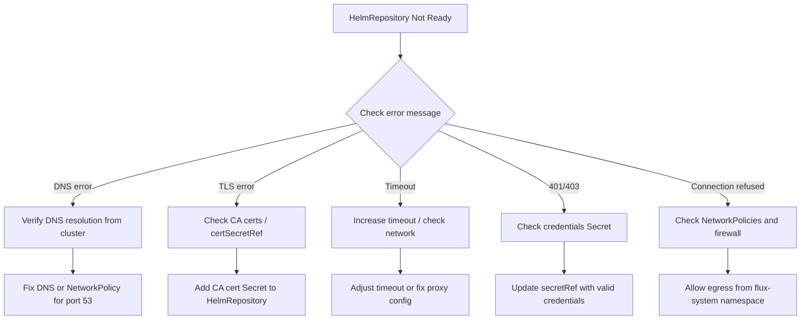

# How to Troubleshoot HelmRepository Connection Failures in Flux

Author: [nawazdhandala](https://github.com/nawazdhandala)

Tags: Flux CD, GitOps, Kubernetes, Helm, HelmRepository, Troubleshooting, Debugging

Description: A practical guide to diagnosing and resolving HelmRepository connection failures in Flux CD, covering common causes like network issues, TLS errors, and authentication problems.

---

When Flux CD cannot connect to a Helm repository, your entire deployment pipeline stalls. HelmRepository connection failures are among the most common issues Flux operators encounter, and they can stem from network policies, DNS resolution, TLS certificate problems, or authentication misconfigurations. This guide walks you through a systematic approach to diagnosing and fixing these failures.

## Understanding HelmRepository Status

The first step in troubleshooting is always to check the current status of your HelmRepository resource. Flux stores detailed condition information on every resource it manages.

Run the following command to inspect the HelmRepository status:

```bash
# Check the status and conditions of a specific HelmRepository
kubectl get helmrepository <repo-name> -n flux-system -o yaml
```

You can also use the Flux CLI for a more readable output:

```bash
# Use the Flux CLI to get a summary of all HelmRepositories
flux get sources helm -A
```

Look for the `Ready` condition. If it shows `False`, the `message` field will contain the error details.

## Common Failure Scenarios and Fixes

### 1. DNS Resolution Failures

If your cluster cannot resolve the Helm repository hostname, you will see errors like `dial tcp: lookup charts.example.com: no such host`.

Check DNS resolution from within the cluster:

```bash
# Run a DNS lookup from inside the cluster using a debug pod
kubectl run dns-test --image=busybox:1.36 --rm -it --restart=Never -- nslookup grafana.github.io
```

If DNS fails, verify your cluster DNS configuration and check whether NetworkPolicies are blocking DNS traffic on port 53.

### 2. TLS Certificate Errors

TLS errors such as `x509: certificate signed by unknown authority` occur when the Helm repository uses a certificate not trusted by the Flux source-controller.

You can provide a custom CA bundle by creating a Secret and referencing it in your HelmRepository:

```yaml
# Create a Secret containing your custom CA certificate
apiVersion: v1
kind: Secret
metadata:
  name: helm-repo-ca
  namespace: flux-system
type: Opaque
data:
  # Base64-encoded CA certificate file
  ca.crt: <base64-encoded-ca-cert>
---
# Reference the CA certificate in your HelmRepository
apiVersion: source.toolkit.fluxcd.io/v1
kind: HelmRepository
metadata:
  name: my-private-repo
  namespace: flux-system
spec:
  interval: 10m
  url: https://charts.example.com
  certSecretRef:
    name: helm-repo-ca
```

### 3. Network Policy Blocking Egress

If your cluster enforces NetworkPolicies, the source-controller pod may not be able to reach external registries. You need to allow egress traffic from the `flux-system` namespace.

Create a NetworkPolicy to allow the source-controller to reach external HTTPS endpoints:

```yaml
# Allow the Flux source-controller to make outbound HTTPS connections
apiVersion: networking.k8s.io/v1
kind: NetworkPolicy
metadata:
  name: allow-source-controller-egress
  namespace: flux-system
spec:
  podSelector:
    matchLabels:
      app: source-controller
  policyTypes:
    - Egress
  egress:
    # Allow DNS resolution
    - ports:
        - port: 53
          protocol: UDP
        - port: 53
          protocol: TCP
    # Allow HTTPS traffic to Helm repositories
    - ports:
        - port: 443
          protocol: TCP
```

### 4. HTTP Proxy Configuration

If your cluster routes traffic through a proxy, the source-controller needs proxy environment variables. You can patch the source-controller deployment:

```bash
# Patch the source-controller deployment to add proxy environment variables
kubectl patch deployment source-controller -n flux-system --type=json -p='[
  {
    "op": "add",
    "path": "/spec/template/spec/containers/0/env/-",
    "value": {
      "name": "HTTPS_PROXY",
      "value": "http://proxy.example.com:3128"
    }
  },
  {
    "op": "add",
    "path": "/spec/template/spec/containers/0/env/-",
    "value": {
      "name": "NO_PROXY",
      "value": ".cluster.local,.svc,10.0.0.0/8"
    }
  }
]'
```

### 5. Timeout Issues

For slow connections or large repository indexes, you may need to increase the timeout on the HelmRepository resource:

```yaml
# Increase the timeout for slow or large repositories
apiVersion: source.toolkit.fluxcd.io/v1
kind: HelmRepository
metadata:
  name: large-repo
  namespace: flux-system
spec:
  interval: 30m
  url: https://charts.example.com
  timeout: 120s  # Default is 60s; increase for slow connections
```

## Checking Source-Controller Logs

The source-controller is the Flux component responsible for fetching Helm repository indexes. Its logs are invaluable for diagnosing connection problems.

```bash
# Stream logs from the source-controller to see real-time fetch attempts
kubectl logs -n flux-system deployment/source-controller -f --since=10m
```

Filter for specific repository errors:

```bash
# Filter source-controller logs for a specific HelmRepository
kubectl logs -n flux-system deployment/source-controller | grep "my-repo-name"
```

## Forcing a Reconciliation

After applying a fix, you can force Flux to immediately retry the connection instead of waiting for the next reconciliation interval:

```bash
# Force Flux to immediately reconcile the HelmRepository
flux reconcile source helm <repo-name> -n flux-system
```

## Diagnostic Flowchart

Use this flowchart to systematically diagnose HelmRepository connection failures:



## Verifying the Fix

Once you have applied your fix, confirm the HelmRepository is healthy:

```bash
# Verify the HelmRepository is now ready
flux get sources helm -A

# Check that the last reconciliation succeeded
kubectl get helmrepository <repo-name> -n flux-system -o jsonpath='{.status.conditions[?(@.type=="Ready")].message}'
```

A healthy HelmRepository will show `Ready: True` with a message indicating the stored artifact revision. If the problem persists, revisit the source-controller logs and verify that your fix was applied correctly. Systematic elimination of each possible cause will lead you to the root issue.
