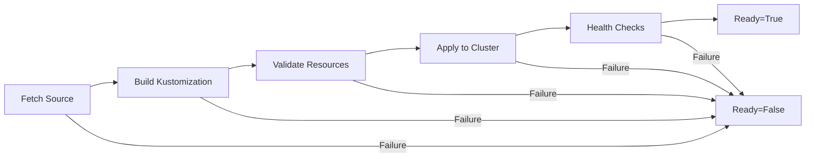

# How to Troubleshoot Kustomization Not Ready Status in Flux

Author: [nawazdhandala](https://github.com/nawazdhandala)

Tags: Flux CD, GitOps, Kubernetes, Kustomize, Troubleshooting, Not Ready, Health Check

Description: Learn how to diagnose and resolve Kustomization resources stuck in a Not Ready state in Flux CD.

---

## Introduction

A Kustomization stuck in a "Not Ready" status is one of the most common issues when working with Flux CD. The `READY=False` condition can be triggered by many different root causes -- from source fetch failures and build errors to health check timeouts and dependency issues. This guide provides a structured approach to diagnosing and resolving Not Ready statuses.

## Prerequisites

- A Kubernetes cluster with Flux CD installed
- The `flux` CLI installed and configured
- kubectl access to the cluster

## Understanding the Not Ready Status

A Kustomization goes through several phases during reconciliation. A failure at any phase results in a Not Ready condition.



## Step 1: Check the Kustomization Status

Start by getting the current status of all Kustomizations:

```bash
# List all Kustomizations and their status
flux get ks
```

Example output with a Not Ready Kustomization:

```text
NAME        REVISION        SUSPENDED  READY  MESSAGE
infra       main@sha1:abc   False      True   Applied revision: main@sha1:abc
my-app      main@sha1:abc   False      False  Health check failed after 3m0s timeout: ...
monitoring                  False      False  Source artifact not found
```

Get detailed information about the failing Kustomization:

```bash
# Get verbose status for the failing Kustomization
kubectl describe kustomization my-app -n flux-system
```

## Step 2: Identify the Root Cause Category

The error message in the status points to one of several categories. Below are the most common ones with their solutions.

### Category 1: Source Not Found or Not Ready

The Kustomization cannot find its source (GitRepository, OCIRepository, or Bucket).

Symptoms:

```text
Source artifact not found
```

Diagnose by checking the source status:

```bash
# Check the status of all Git repositories
flux get sources git

# Check the status of all OCI repositories
flux get sources oci

# Check the status of all Buckets
flux get sources bucket
```

If the source itself is Not Ready, investigate the source:

```bash
# Get detailed info about the Git source
flux get source git my-repo --verbose

# Check source-controller logs for fetch errors
kubectl logs -n flux-system deploy/source-controller --tail=100 | grep "my-repo"
```

Common source issues and fixes:

```bash
# Authentication failure - verify the secret exists and is correct
kubectl get secret my-repo-auth -n flux-system -o yaml

# URL is wrong - check the GitRepository spec
kubectl get gitrepository my-repo -n flux-system -o jsonpath='{.spec.url}'

# Branch does not exist - verify the branch reference
kubectl get gitrepository my-repo -n flux-system -o jsonpath='{.spec.ref}'
```

### Category 2: Kustomize Build Failure

The kustomization cannot be built from the source files.

Symptoms:

```text
kustomize build failed: accumulating resources: ...
kustomize build failed: ... not found
```

Debug by building locally:

```bash
# Clone the repo and test the kustomize build locally
git clone <your-repo-url>
cd <your-repo>/path/to/kustomization
kustomize build .
```

Common build issues:

- Missing resources referenced in `kustomization.yaml`
- Incorrect file paths (case sensitivity matters)
- Invalid patches or overlays

### Category 3: Health Check Failure

The resources were applied successfully, but one or more resources failed their health checks within the timeout period.

Symptoms:

```text
Health check failed after 3m0s timeout: Deployment/my-app not ready: 0/3 replicas available
```

Investigate the unhealthy resources:

```bash
# Check the deployment status
kubectl get deployment my-app -n production
kubectl describe deployment my-app -n production

# Check pod status and events
kubectl get pods -l app=my-app -n production
kubectl describe pod <pod-name> -n production

# Check pod logs for application errors
kubectl logs -l app=my-app -n production --tail=50
```

Common causes of health check failures:

- Image pull errors (wrong tag, missing registry credentials)
- Insufficient resources (CPU/memory limits too low)
- Failing readiness probes
- CrashLoopBackOff due to application errors

If the application just needs more time to start, increase the health check timeout:

```yaml
# Kustomization with increased health check timeout
apiVersion: kustomize.toolkit.fluxcd.io/v1
kind: Kustomization
metadata:
  name: my-app
  namespace: flux-system
spec:
  interval: 10m
  # Increase timeout from the default 3 minutes to 5 minutes
  timeout: 5m
  sourceRef:
    kind: GitRepository
    name: my-repo
  path: ./apps/my-app
  prune: true
```

### Category 4: Dependency Not Ready

The Kustomization depends on another Kustomization that is not yet Ready.

Symptoms:

```text
dependency 'flux-system/infra' is not ready
```

Check the dependency chain:

```bash
# Check the status of the dependency
flux get ks infra

# View the dependsOn configuration
kubectl get kustomization my-app -n flux-system -o jsonpath='{.spec.dependsOn}' | jq .
```

Resolution: Fix the upstream dependency first. The downstream Kustomization will reconcile automatically once its dependencies are Ready.

### Category 5: Validation or Admission Errors

A webhook or admission controller rejected the resource.

Symptoms:

```text
apply failed: admission webhook "validate.example.com" denied the request
```

Check which admission controllers are running:

```bash
# List validating webhook configurations
kubectl get validatingwebhookconfigurations

# List mutating webhook configurations
kubectl get mutatingwebhookconfigurations
```

See the next section for more on webhook errors.

## Step 3: Check the Controller Logs

When the status message is unclear, the kustomize-controller logs provide the most detail:

```bash
# View kustomize-controller logs, filtered for errors
kubectl logs -n flux-system deploy/kustomize-controller --tail=200 | grep -i "error\|fail\|my-app"
```

## Step 4: Force Reconciliation After Fix

Once you have identified and fixed the issue, trigger a new reconciliation:

```bash
# Force reconcile with a source refresh
flux reconcile ks my-app --with-source
```

Monitor the result:

```bash
# Watch the Kustomization status until it becomes Ready
flux get ks my-app --watch
```

## Quick Reference Debugging Commands

Here is a summary of the most useful commands for troubleshooting Not Ready Kustomizations:

```bash
# Overview of all Flux resources
flux get all

# Detailed Kustomization status
flux get ks my-app --verbose

# Flux events for a Kustomization
flux events --for Kustomization/my-app

# Kustomize-controller logs
kubectl logs -n flux-system deploy/kustomize-controller --tail=200

# Source-controller logs
kubectl logs -n flux-system deploy/source-controller --tail=200

# Full Kubernetes conditions
kubectl get kustomization my-app -n flux-system -o yaml
```

## Conclusion

A Kustomization Not Ready status in Flux CD always has a specific root cause that can be identified through systematic investigation. Start with `flux get ks` to read the error message, check source availability, review build output, inspect health check targets, and examine controller logs. Most Not Ready conditions resolve quickly once the underlying issue -- whether it is a source problem, a build error, a health check failure, or a dependency issue -- is addressed.
