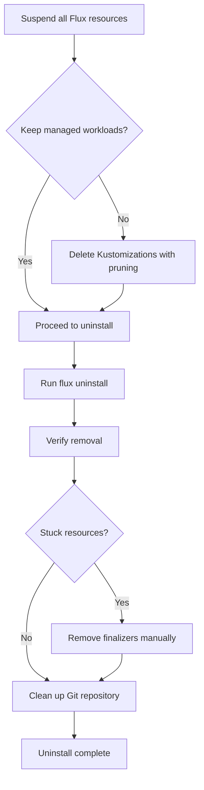

# How to Uninstall Flux CD from a Kubernetes Cluster

Author: [nawazdhandala](https://github.com/nawazdhandala)

Tags: Flux CD, GitOps, Kubernetes, Uninstall, Cluster Management

Description: A comprehensive guide to cleanly uninstalling Flux CD from a Kubernetes cluster, including removing controllers, custom resources, and finalizers.

---

There are several reasons you might need to uninstall Flux CD from a Kubernetes cluster: decommissioning a cluster, switching to a different GitOps tool, or troubleshooting a broken installation. Whatever the reason, it is important to uninstall Flux CD cleanly to avoid orphaned resources, stuck finalizers, or leftover custom resource definitions. This guide covers the complete uninstall process.

## Prerequisites

- A Kubernetes cluster with Flux CD installed
- `kubectl` configured with admin access to the cluster
- The Flux CLI installed on your local machine

## Understanding What Flux CD Installs

Before uninstalling, it helps to understand what Flux CD creates in your cluster. A standard installation includes:

- Controllers (source-controller, kustomize-controller, helm-controller, notification-controller) in the `flux-system` namespace
- Custom Resource Definitions (CRDs) for GitRepositories, Kustomizations, HelmReleases, and more
- RBAC resources (ClusterRoles, ClusterRoleBindings, ServiceAccounts)
- Network policies in the `flux-system` namespace
- Secrets containing deploy keys and other credentials

## Step 1: Suspend All Flux Resources

Before uninstalling, suspend all Flux resources to prevent reconciliation loops during the teardown.

```bash
# Suspend all Kustomizations across all namespaces
flux suspend kustomization --all -A

# Suspend all HelmReleases across all namespaces
flux suspend helmrelease --all -A

# Suspend all source resources
flux suspend source git --all -A
flux suspend source helm --all -A
```

This prevents Flux from re-creating resources as you remove them.

## Step 2: Decide Whether to Keep Managed Workloads

Flux-managed workloads (Deployments, Services, ConfigMaps, etc.) will remain in the cluster after Flux is uninstalled, unless they were created with pruning enabled and you trigger a final reconciliation. If you want to keep your workloads running after removing Flux, simply proceed with the uninstall.

If you want Flux to clean up the workloads it manages before uninstalling, delete the Kustomizations with pruning enabled:

```bash
# List all Kustomizations to see what Flux manages
flux get kustomizations -A

# Delete a specific Kustomization (this will prune managed resources if prune: true is set)
flux delete kustomization my-app -s --namespace flux-system
```

## Step 3: Uninstall Flux Using the CLI

The simplest and recommended way to uninstall Flux is with the `flux uninstall` command.

```bash
# Uninstall Flux and remove all its components
flux uninstall --silent
```

The `--silent` flag suppresses the confirmation prompt. Without it, you will be asked to confirm the uninstall.

This command performs the following actions:

1. Deletes all Flux custom resources (GitRepositories, Kustomizations, HelmReleases, etc.)
2. Deletes all Flux controllers and their Deployments
3. Deletes the `flux-system` namespace
4. Removes Flux CRDs from the cluster
5. Removes Flux RBAC resources (ClusterRoles, ClusterRoleBindings)

## Step 4: Verify the Uninstall

After the uninstall command completes, verify that all Flux resources have been removed.

```bash
# Check that the flux-system namespace is gone
kubectl get namespace flux-system

# Verify no Flux CRDs remain
kubectl get crds | grep fluxcd

# Check for any remaining Flux cluster roles
kubectl get clusterroles | grep flux

# Check for any remaining Flux cluster role bindings
kubectl get clusterrolebindings | grep flux
```

All of these commands should return empty results or "not found" errors.

## Handling Stuck Finalizers

Sometimes Flux resources get stuck during deletion because of finalizers. If the uninstall hangs or resources remain in a Terminating state, you may need to remove finalizers manually.

```bash
# Check for resources stuck in Terminating state
kubectl get all -n flux-system

# If a resource is stuck, patch it to remove the finalizer
kubectl patch kustomization my-kustomization -n flux-system \
  --type merge \
  -p '{"metadata":{"finalizers":null}}'

# For GitRepository resources stuck with finalizers
kubectl patch gitrepository my-repo -n flux-system \
  --type merge \
  -p '{"metadata":{"finalizers":null}}'
```

If the namespace itself is stuck in Terminating state:

```bash
# Get the namespace manifest and remove the finalizer
kubectl get namespace flux-system -o json | \
  jq '.spec.finalizers = []' | \
  kubectl replace --raw "/api/v1/namespaces/flux-system/finalize" -f -
```

## Removing Flux CRDs Manually

If the `flux uninstall` command did not remove all CRDs, you can delete them manually.

```bash
# List all Flux-related CRDs
kubectl get crds | grep -E "fluxcd|toolkit.fluxcd"

# Delete each CRD individually
kubectl delete crd gitrepositories.source.toolkit.fluxcd.io
kubectl delete crd kustomizations.kustomize.toolkit.fluxcd.io
kubectl delete crd helmreleases.helm.toolkit.fluxcd.io
kubectl delete crd helmrepositories.source.toolkit.fluxcd.io
kubectl delete crd helmcharts.source.toolkit.fluxcd.io
kubectl delete crd buckets.source.toolkit.fluxcd.io
kubectl delete crd ocirepositories.source.toolkit.fluxcd.io
kubectl delete crd receivers.notification.toolkit.fluxcd.io
kubectl delete crd alerts.notification.toolkit.fluxcd.io
kubectl delete crd providers.notification.toolkit.fluxcd.io
```

## Cleaning Up the Git Repository

If you bootstrapped Flux with a Git repository, the `flux uninstall` command does not modify your Git repository. You should clean up the Flux manifests from your repository manually.

```bash
# Remove the Flux system directory from your fleet repo
cd fleet-infra
rm -rf clusters/my-cluster/flux-system
git add -A
git commit -m "Remove Flux system manifests after uninstall"
git push origin main
```

## Uninstall Without the Flux CLI

If you do not have the Flux CLI available, you can uninstall using `kubectl` directly.

```bash
# Delete all Flux custom resources first
kubectl delete helmreleases.helm.toolkit.fluxcd.io --all -A
kubectl delete kustomizations.kustomize.toolkit.fluxcd.io --all -A
kubectl delete gitrepositories.source.toolkit.fluxcd.io --all -A
kubectl delete helmrepositories.source.toolkit.fluxcd.io --all -A
kubectl delete helmcharts.source.toolkit.fluxcd.io --all -A
kubectl delete buckets.source.toolkit.fluxcd.io --all -A
kubectl delete ocirepositories.source.toolkit.fluxcd.io --all -A
kubectl delete alerts.notification.toolkit.fluxcd.io --all -A
kubectl delete providers.notification.toolkit.fluxcd.io --all -A
kubectl delete receivers.notification.toolkit.fluxcd.io --all -A

# Delete the flux-system namespace
kubectl delete namespace flux-system

# Remove all Flux CRDs
kubectl get crds | grep toolkit.fluxcd.io | awk '{print $1}' | xargs kubectl delete crd

# Remove Flux cluster roles and bindings
kubectl get clusterroles | grep flux | awk '{print $1}' | xargs kubectl delete clusterrole
kubectl get clusterrolebindings | grep flux | awk '{print $1}' | xargs kubectl delete clusterrolebinding
```

## Uninstall Process Overview



## Summary

Uninstalling Flux CD is straightforward with the `flux uninstall` command, which handles removing controllers, CRDs, and the flux-system namespace. The key considerations are deciding whether to keep Flux-managed workloads running after removal, handling any stuck finalizers, and cleaning up the Git repository that was used for bootstrapping. Always verify the uninstall by checking for remaining CRDs, cluster roles, and namespaces.
