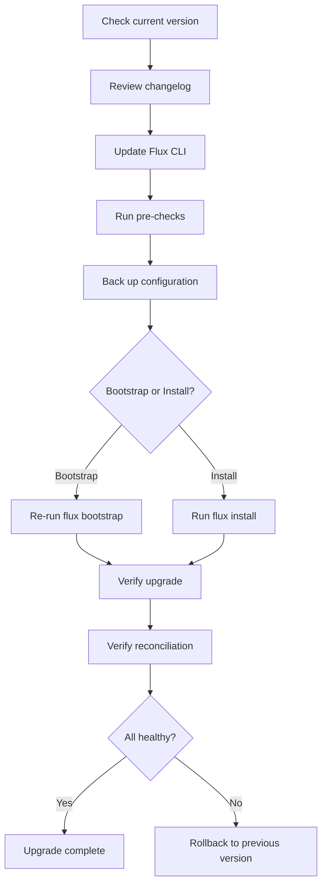

# How to Upgrade Flux CD to the Latest Version

Author: [nawazdhandala](https://github.com/nawazdhandala)

Tags: Flux CD, GitOps, Kubernetes, Upgrade, Version Management

Description: A step-by-step guide to safely upgrading Flux CD to the latest version in your Kubernetes cluster without disrupting running workloads.

---

Keeping Flux CD up to date is essential for security patches, bug fixes, and access to new features. Flux CD follows semantic versioning and provides a straightforward upgrade path using the Flux CLI. This guide walks you through upgrading Flux CD safely, including pre-upgrade checks, the upgrade process itself, and post-upgrade verification.

## Prerequisites

Before upgrading, ensure you have the following:

- A running Kubernetes cluster with Flux CD installed
- `kubectl` configured to communicate with your cluster
- The Flux CLI installed on your local machine
- Sufficient cluster permissions to modify resources in the `flux-system` namespace

## Step 1: Check Your Current Flux CD Version

Start by identifying the version of Flux CD currently running in your cluster.

```bash
# Check the installed Flux CLI version
flux version

# Check the versions of all Flux controllers running in the cluster
flux version --server
```

The output will show both the CLI version and the server-side controller versions. Note these down so you can verify the upgrade later.

## Step 2: Review the Changelog

Before upgrading, review the Flux CD release notes for any breaking changes or migration steps required between your current version and the target version.

```bash
# List available Flux CLI releases
flux version --client

# You can also check releases on GitHub
# https://github.com/fluxcd/flux2/releases
```

Pay close attention to any deprecation notices or API changes that might affect your existing Flux resources.

## Step 3: Update the Flux CLI

Install or update the Flux CLI to the latest version using the official install script.

```bash
# Install the latest Flux CLI using the official install script
curl -s https://fluxcd.io/install.sh | sudo bash

# Verify the new CLI version
flux version --client
```

Alternatively, if you installed Flux CLI via Homebrew:

```bash
# Update Flux CLI via Homebrew
brew upgrade fluxcd/tap/flux
```

## Step 4: Run Pre-Upgrade Checks

Before applying the upgrade, run the Flux pre-check to ensure your cluster meets the requirements for the new version.

```bash
# Run pre-flight checks against the cluster
flux check --pre

# Verify all existing Flux resources are in a healthy state
flux get all -A
```

Address any issues reported by the pre-check before proceeding. Common issues include insufficient RBAC permissions or incompatible Kubernetes versions.

## Step 5: Back Up Your Flux Configuration

Export your current Flux configuration as a safety measure.

```bash
# Export all Flux resources from the flux-system namespace
kubectl get gitrepositories,kustomizations,helmreleases,helmrepositories,helmcharts -A -o yaml > flux-backup.yaml

# Also back up the flux-system namespace secrets
kubectl get secrets -n flux-system -o yaml > flux-secrets-backup.yaml
```

If you bootstrapped Flux with a Git repository, your configuration is already stored there. However, having a local backup is still a good practice.

## Step 6: Upgrade Flux Controllers in the Cluster

If you bootstrapped Flux CD with a Git provider, the recommended upgrade path is to re-run the bootstrap command. This updates the Flux controllers while preserving your existing configuration.

```bash
# Re-run bootstrap to upgrade Flux in-cluster components
# Example for GitHub
flux bootstrap github \
  --owner=your-org \
  --repository=fleet-infra \
  --branch=main \
  --path=clusters/my-cluster \
  --personal
```

The bootstrap command is idempotent. It will update the controller manifests in your Git repository and apply them to the cluster.

If you installed Flux without bootstrap (using `flux install`), upgrade with:

```bash
# Upgrade Flux controllers directly
flux install
```

This upgrades all Flux controllers to match the CLI version. The command applies the latest manifests to the `flux-system` namespace.

## Step 7: Verify the Upgrade

After the upgrade completes, verify that all controllers are running the new version and are healthy.

```bash
# Check that all Flux components are running and up to date
flux check

# Verify the server-side versions match the CLI version
flux version

# Check that all pods in flux-system are running
kubectl get pods -n flux-system

# Verify all Flux resources are reconciling successfully
flux get all -A
```

Ensure that no pods are in a CrashLoopBackOff or Error state.

## Step 8: Verify Reconciliation

Confirm that your workloads are still being reconciled correctly after the upgrade.

```bash
# Trigger a reconciliation of all Kustomizations
flux reconcile kustomization flux-system

# Check the status of all GitRepositories
flux get sources git -A

# Check the status of all HelmReleases
flux get helmreleases -A
```

## Handling Upgrade Failures

If the upgrade fails or causes issues, you can roll back by applying the previous version.

```bash
# Install a specific version of the Flux CLI
curl -s https://fluxcd.io/install.sh | sudo FLUX_VERSION=2.3.0 bash

# Downgrade the in-cluster components to match
flux install
```

If you used bootstrap, revert the commit in your Git repository that updated the Flux manifests, and Flux will reconcile back to the previous version.

## Automating Flux Upgrades

You can automate Flux upgrades by using Flux itself to monitor its own releases. Create a Kustomization that references the Flux install manifests.

The following manifest configures Flux to watch for new versions of itself:

```yaml
# flux-system/gotk-sync.yaml
apiVersion: source.toolkit.fluxcd.io/v1
kind: GitRepository
metadata:
  name: flux-monitoring
  namespace: flux-system
spec:
  interval: 1h
  url: https://github.com/fluxcd/flux2
  ref:
    semver: ">=2.0.0"
```

However, for production environments, it is recommended to upgrade manually after reviewing release notes and testing in a staging environment first.

## Upgrade Workflow Diagram

The following diagram shows the recommended upgrade workflow:



## Summary

Upgrading Flux CD is a straightforward process when done methodically. Always review the release notes before upgrading, back up your configuration, and verify that all resources reconcile correctly after the upgrade. The bootstrap command makes upgrades especially smooth since it manages the controller manifests through Git, giving you a full audit trail and the ability to roll back via a Git revert.
