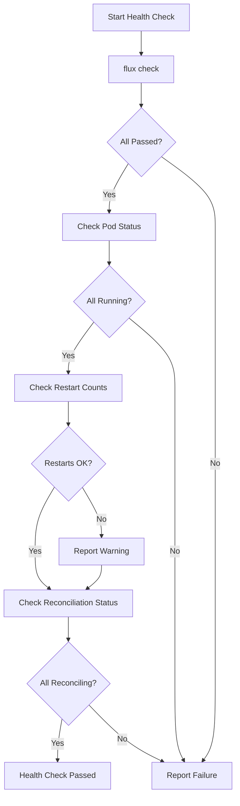

# How to Verify Flux CD Controller Health and Readiness

Author: [nawazdhandala](https://github.com/nawazdhandala)

Tags: Flux CD, GitOps, Kubernetes, Health Checks, Monitoring, Observability

Description: Learn how to verify the health and readiness of Flux CD controllers using CLI commands, Kubernetes probes, metrics, and automated monitoring.

---

## Why Monitor Flux CD Controller Health?

Flux CD controllers are the backbone of your GitOps workflow. If a controller is unhealthy, degraded, or not ready, your deployments will stall, drift will go undetected, and notifications will stop flowing. Monitoring controller health is essential for:

- **Early detection** of issues before they impact deployments.
- **Compliance requirements** that demand proof of continuous delivery system health.
- **Incident response** when deployments are not being applied as expected.
- **Capacity planning** to know when controllers need more resources.

This guide covers multiple methods to verify and monitor Flux CD controller health.

## Prerequisites

- A Kubernetes cluster with Flux CD installed
- `flux` CLI installed (v2.0+)
- `kubectl` configured to access your cluster

## Method 1: flux check Command

The simplest way to verify overall Flux CD health is the built-in `flux check` command:

```bash
# Run a comprehensive Flux health check
flux check
```

This command verifies:
- Flux CLI and controller version compatibility
- All controller deployments are available
- Custom Resource Definitions (CRDs) are installed
- Controllers are responding to readiness probes

Sample output for a healthy installation:

```text
-> checking prerequisites
-> Kubernetes 1.28.0 >=1.20.6-0
-> checking controllers
-> helm-controller: deployment ready
-> helm-controller: v2.1.0
-> kustomize-controller: deployment ready
-> kustomize-controller: v1.1.0
-> notification-controller: deployment ready
-> notification-controller: v1.1.0
-> source-controller: deployment ready
-> source-controller: v1.1.0
-> all checks passed
```

If any check fails, the output will clearly indicate which component is unhealthy.

## Method 2: Check Controller Pod Status

Inspect individual controller pods for detailed status information:

```bash
# Check all Flux controller pods
kubectl get pods -n flux-system

# Check pod conditions for each controller
kubectl get pods -n flux-system -o json | \
  jq '.items[] | {name: .metadata.name, phase: .status.phase, ready: .status.conditions[] | select(.type=="Ready") | .status, restarts: .status.containerStatuses[0].restartCount}'

# Check for any pods that are not in Running state
kubectl get pods -n flux-system --field-selector=status.phase!=Running
```

## Method 3: Verify Deployment Availability

Check that all Flux deployments have the desired number of ready replicas:

```bash
# Check deployment status for all Flux controllers
kubectl get deployments -n flux-system

# Detailed view with conditions
kubectl get deployments -n flux-system -o wide
```

Expected output:

```text
NAME                      READY   UP-TO-DATE   AVAILABLE   AGE
helm-controller           1/1     1            1           7d
kustomize-controller      1/1     1            1           7d
notification-controller   1/1     1            1           7d
source-controller         1/1     1            1           7d
```

If any deployment shows `0/1` in the READY column, investigate further:

```bash
# Get detailed deployment status including conditions
kubectl describe deployment source-controller -n flux-system

# Check events for scheduling or resource issues
kubectl get events -n flux-system --sort-by='.lastTimestamp' --field-selector type=Warning
```

## Method 4: Check Controller Logs for Errors

Controller logs reveal runtime issues that may not be visible in pod status:

```bash
# Check source-controller logs for errors
kubectl logs -n flux-system deployment/source-controller --tail=50 | grep -i "error\|fatal\|panic"

# Check helm-controller logs
kubectl logs -n flux-system deployment/helm-controller --tail=50 | grep -i "error\|fatal\|panic"

# Check kustomize-controller logs
kubectl logs -n flux-system deployment/kustomize-controller --tail=50 | grep -i "error\|fatal\|panic"

# Check notification-controller logs
kubectl logs -n flux-system deployment/notification-controller --tail=50 | grep -i "error\|fatal\|panic"
```

For a broader view of recent logs across all controllers:

```bash
# View recent logs from all Flux controllers
kubectl logs -n flux-system -l app.kubernetes.io/part-of=flux --tail=20 --prefix
```

## Method 5: Verify Reconciliation Status

Healthy controllers should be actively reconciling resources. Check reconciliation status:

```bash
# Check all GitRepository sources
flux get sources git --all-namespaces

# Check all HelmRepository sources
flux get sources helm --all-namespaces

# Check all Kustomizations
flux get kustomizations --all-namespaces

# Check all HelmReleases
flux get helmreleases --all-namespaces

# Get a summary of all Flux resources and their status
flux get all --all-namespaces
```

Look for resources stuck in a `False` ready state or with stale `Last Applied Revision`:

```bash
# Find resources that are not ready
flux get all --all-namespaces --status-selector ready=false
```

## Method 6: Check Controller Health Endpoints

Each Flux controller exposes `/healthz` and `/readyz` endpoints. You can query them directly:

```bash
# Port-forward to source-controller and check health
kubectl port-forward -n flux-system deployment/source-controller 8080:8080 &
curl -s http://localhost:8080/healthz
# Expected: {"status":"ok"}
curl -s http://localhost:8080/readyz
# Expected: {"status":"ok"}
kill %1

# Check readiness via the Kubernetes API (without port-forward)
kubectl get --raw /api/v1/namespaces/flux-system/pods/$(kubectl get pod -n flux-system -l app=source-controller -o jsonpath='{.items[0].metadata.name}')/proxy/healthz
```

## Method 7: Monitor with Prometheus Metrics

Flux controllers expose Prometheus metrics on port 8080. Set up a ServiceMonitor to scrape them:

```yaml
# ServiceMonitor to scrape Flux controller metrics
apiVersion: monitoring.coreos.com/v1
kind: ServiceMonitor
metadata:
  name: flux-controllers
  namespace: flux-system
spec:
  selector:
    matchLabels:
      app.kubernetes.io/part-of: flux
  endpoints:
    - port: http-prom
      interval: 30s
      path: /metrics
```

Key metrics to monitor:

```bash
# Port-forward to a controller and explore available metrics
kubectl port-forward -n flux-system deployment/source-controller 8080:8080 &

# Check reconciliation duration
curl -s http://localhost:8080/metrics | grep controller_runtime_reconcile_time

# Check reconciliation errors
curl -s http://localhost:8080/metrics | grep controller_runtime_reconcile_errors_total

# Check work queue depth (high values indicate controller is falling behind)
curl -s http://localhost:8080/metrics | grep workqueue_depth

kill %1
```

## Method 8: Automated Health Check Script

Create a comprehensive health check script for use in CI/CD pipelines or cron jobs:

```bash
#!/bin/bash
# flux-health-check.sh - Comprehensive Flux CD health verification

set -euo pipefail

echo "=== Flux CD Health Check ==="
echo "Date: $(date -u)"
echo ""

# Check 1: Flux pre-flight check
echo "--- Running flux check ---"
if flux check 2>&1; then
    echo "PASS: All Flux checks passed"
else
    echo "FAIL: Flux check reported issues"
    exit 1
fi
echo ""

# Check 2: All pods running
echo "--- Checking pod status ---"
NOT_RUNNING=$(kubectl get pods -n flux-system --no-headers | grep -v Running | wc -l | tr -d ' ')
if [ "$NOT_RUNNING" -eq "0" ]; then
    echo "PASS: All pods are running"
else
    echo "FAIL: $NOT_RUNNING pods are not running"
    kubectl get pods -n flux-system --no-headers | grep -v Running
    exit 1
fi
echo ""

# Check 3: No recent restarts (indicates instability)
echo "--- Checking for recent restarts ---"
HIGH_RESTARTS=$(kubectl get pods -n flux-system -o jsonpath='{range .items[*]}{.metadata.name}{" "}{.status.containerStatuses[0].restartCount}{"\n"}{end}' | awk '$2 > 5 {print}')
if [ -z "$HIGH_RESTARTS" ]; then
    echo "PASS: No controllers have excessive restarts"
else
    echo "WARN: Controllers with high restart counts:"
    echo "$HIGH_RESTARTS"
fi
echo ""

# Check 4: Sources reconciling
echo "--- Checking source reconciliation ---"
flux get sources git --all-namespaces --status-selector ready=false 2>/dev/null || true
flux get sources helm --all-namespaces --status-selector ready=false 2>/dev/null || true
echo ""

echo "=== Health check complete ==="
```

Make the script executable and run it:

```bash
chmod +x flux-health-check.sh
./flux-health-check.sh
```

## Health Check Flow



## Setting Up Continuous Health Monitoring

For production clusters, combine these checks into a Kubernetes CronJob:

```yaml
# CronJob that runs Flux health checks every 5 minutes
apiVersion: batch/v1
kind: CronJob
metadata:
  name: flux-health-check
  namespace: flux-system
spec:
  schedule: "*/5 * * * *"
  jobTemplate:
    spec:
      template:
        spec:
          serviceAccountName: flux-health-checker
          containers:
            - name: health-check
              image: ghcr.io/fluxcd/flux-cli:v2.1.0
              command:
                - /bin/sh
                - -c
                - |
                  flux check && \
                  flux get all --all-namespaces --status-selector ready=false | \
                  grep -c "False" && exit 1 || exit 0
          restartPolicy: Never
      backoffLimit: 1
```

## Summary

Verifying Flux CD controller health involves multiple layers: CLI checks with `flux check`, pod and deployment status inspection, log analysis, reconciliation status monitoring, health endpoint queries, and Prometheus metrics. For production environments, combine these into automated health check scripts or CronJobs that run continuously. The key indicators to watch are pod readiness, restart counts, reconciliation errors, and work queue depth. Setting up proper monitoring and alerting ensures you catch Flux health issues before they impact your deployments.
