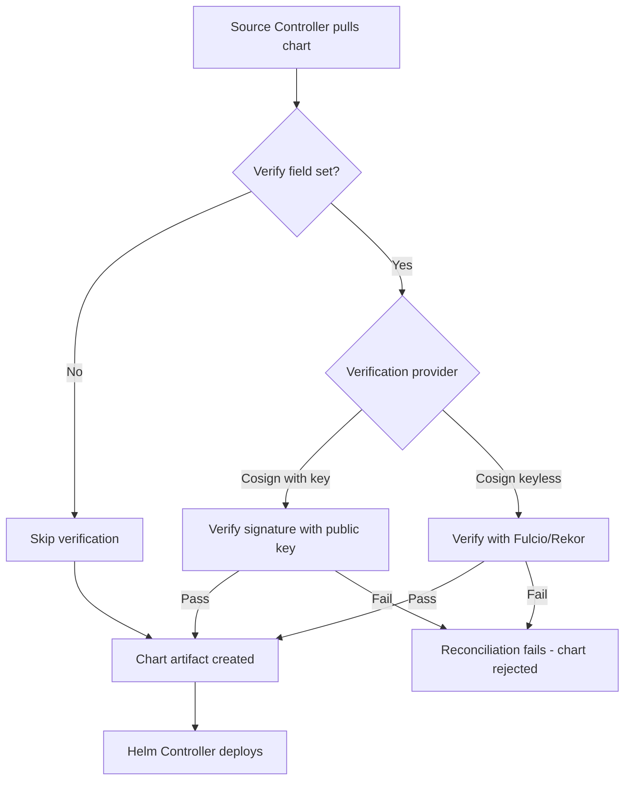

# How to Verify Helm Chart Integrity in Flux

Author: [nawazdhandala](https://github.com/nawazdhandala)

Tags: Flux CD, GitOps, Kubernetes, Helm, HelmChart, Security, Cosign, Provenance, Verification

Description: Learn how to verify the integrity and provenance of Helm charts in Flux CD using Cosign signatures and provenance files to ensure supply chain security.

---

## Introduction

Supply chain security is critical when deploying software to Kubernetes. Helm charts downloaded from external repositories could be tampered with or replaced with malicious versions. Flux CD provides built-in mechanisms to verify Helm chart integrity, including support for Cosign signatures on OCI artifacts and Helm provenance files for traditional chart repositories.

This guide covers how to configure Flux to verify Helm chart integrity before deployment, ensuring that only trusted and unmodified charts reach your cluster.

## Prerequisites

- A Kubernetes cluster with Flux CD v2.x installed
- The `flux` CLI, `kubectl`, `helm`, and `cosign` CLIs installed
- A Helm chart signed with either Cosign or Helm provenance
- For OCI verification: a Cosign-signed chart in an OCI registry

## Understanding Verification Methods

Flux supports two approaches to Helm chart verification:

1. **Cosign verification** (for OCI charts): Verifies Cosign signatures attached to OCI artifacts using keyless or key-based signing.
2. **Helm provenance verification** (for HTTP repositories): Verifies `.prov` provenance files generated by `helm package --sign`.

## Method 1: Cosign Verification for OCI Charts

### Sign a Helm Chart with Cosign

First, sign your chart after pushing it to an OCI registry.

```bash
# Generate a Cosign key pair (if you do not have one)
cosign generate-key-pair

# Push a Helm chart to an OCI registry
helm push my-app-1.0.0.tgz oci://ghcr.io/myorg/charts

# Sign the chart with Cosign
cosign sign --key cosign.key ghcr.io/myorg/charts/my-app:1.0.0
```

### Create a Verification Secret

Store the Cosign public key in a Kubernetes secret.

```bash
# Create a secret with the Cosign public key
kubectl create secret generic cosign-pub-key \
  --namespace=flux-system \
  --from-file=cosign.pub=cosign.pub
```

### Configure the HelmChart with Verification

When using a HelmRelease, configure the chart verification in the `spec.chart.spec.verify` field.

```yaml
# helmrelease-verified.yaml
# HelmRelease with Cosign signature verification
apiVersion: helm.toolkit.fluxcd.io/v2
kind: HelmRelease
metadata:
  name: my-app
  namespace: default
spec:
  interval: 10m
  chart:
    spec:
      chart: my-app
      version: "1.0.x"
      sourceRef:
        kind: HelmRepository
        name: oci-charts
        namespace: flux-system
      interval: 5m
      verify:
        provider: cosign                # Use Cosign for verification
        secretRef:
          name: cosign-pub-key          # Secret containing the public key
  values:
    replicaCount: 2
```

The corresponding OCI HelmRepository.

```yaml
# helmrepository-oci.yaml
# OCI HelmRepository for verified charts
apiVersion: source.toolkit.fluxcd.io/v1
kind: HelmRepository
metadata:
  name: oci-charts
  namespace: flux-system
spec:
  type: oci
  interval: 5m
  url: oci://ghcr.io/myorg/charts
```

### Apply and Verify

```bash
# Apply both resources
kubectl apply -f helmrepository-oci.yaml
kubectl apply -f helmrelease-verified.yaml

# Check the HelmChart status - it should show verification succeeded
flux get sources chart -n flux-system

# View detailed verification status
kubectl describe helmchart flux-system-my-app -n flux-system
```

If verification fails, the chart will not be deployed and the HelmChart resource will show an error condition.

## Keyless Cosign Verification with Fulcio

For keyless verification using the Sigstore public infrastructure (Fulcio and Rekor), configure the verify section without a secret reference.

```yaml
# HelmRelease with keyless Cosign verification
apiVersion: helm.toolkit.fluxcd.io/v2
kind: HelmRelease
metadata:
  name: my-app
  namespace: default
spec:
  interval: 10m
  chart:
    spec:
      chart: my-app
      version: "1.0.x"
      sourceRef:
        kind: HelmRepository
        name: oci-charts
        namespace: flux-system
      interval: 5m
      verify:
        provider: cosign
        matchOIDCIdentity:
          - issuer: "https://token.actions.githubusercontent.com"
            subject: "https://github.com/myorg/my-app/.github/workflows/release.yaml@refs/heads/main"
```

This configuration verifies that the chart was signed during a GitHub Actions workflow run from the specified repository and branch. No key management is required.

## Method 2: Helm Provenance Verification

For charts stored in traditional HTTP Helm repositories, you can use Helm's built-in provenance mechanism.

### Sign a Chart with Helm

```bash
# Generate a GPG key for signing (if you do not have one)
gpg --quick-generate-key "Helm Signing Key <helm@example.com>"

# Package and sign the chart
helm package --sign --key "Helm Signing Key" --keyring ~/.gnupg/secring.gpg ./my-app-chart/

# This produces:
#   my-app-1.0.0.tgz       (the chart package)
#   my-app-1.0.0.tgz.prov  (the provenance file)
```

Upload both the `.tgz` and `.prov` files to your chart repository.

### Configure Verification in Flux

For HTTP repositories, use the `verify` field with the `cosign` provider pointing to a key, or use an alternative approach by adding a verification step in your CI/CD pipeline before the chart reaches the repository.

Currently, Flux's native verification support is strongest for OCI charts with Cosign. For HTTP repositories, you can implement verification through admission controllers.

## Using an Admission Controller for Additional Verification

For comprehensive verification across all chart types, deploy an admission controller like Kyverno or OPA Gatekeeper.

```yaml
# kyverno-policy-verify-charts.yaml
# Kyverno policy to verify that HelmReleases use verified charts
apiVersion: kyverno.io/v1
kind: ClusterPolicy
metadata:
  name: require-helm-chart-verification
spec:
  validationFailureAction: Enforce
  rules:
    - name: require-verify-field
      match:
        any:
          - resources:
              kinds:
                - HelmRelease
      validate:
        message: "HelmReleases must have chart verification configured"
        pattern:
          spec:
            chart:
              spec:
                verify:
                  provider: "cosign"    # Require Cosign verification
```

## Verification Workflow



## Signing Charts in CI/CD

Integrate chart signing into your CI/CD pipeline. Here is an example using GitHub Actions.

```yaml
# .github/workflows/release-chart.yaml
# GitHub Actions workflow to sign and push a Helm chart
name: Release Helm Chart
on:
  push:
    tags:
      - 'v*'

permissions:
  contents: read
  packages: write
  id-token: write    # Required for keyless Cosign signing

jobs:
  release:
    runs-on: ubuntu-latest
    steps:
      - uses: actions/checkout@v4

      - name: Install Cosign
        uses: sigstore/cosign-installer@v3

      - name: Log in to GHCR
        run: echo "${{ secrets.GITHUB_TOKEN }}" | helm registry login ghcr.io -u $ --password-stdin

      - name: Package and push chart
        run: |
          helm package ./charts/my-app
          helm push my-app-*.tgz oci://ghcr.io/${{ github.repository_owner }}/charts

      - name: Sign chart with Cosign (keyless)
        run: |
          VERSION=$(grep '^version:' charts/my-app/Chart.yaml | awk '{print $2}')
          cosign sign ghcr.io/${{ github.repository_owner }}/charts/my-app:${VERSION}
```

## Troubleshooting Verification Failures

### Check the HelmChart Status

```bash
# View verification errors
kubectl describe helmchart -n flux-system <chart-name> | grep -A5 "Conditions"

# Check source controller logs for verification details
kubectl logs -n flux-system deploy/source-controller --since=10m | grep -i "verify\|cosign\|signature"
```

### Common Issues

1. **Signature not found**: Ensure the chart was signed after being pushed to the registry. The signature must exist as an OCI artifact alongside the chart.
2. **Key mismatch**: Verify that the public key in the secret matches the private key used for signing.
3. **Keyless identity mismatch**: For keyless verification, ensure the `issuer` and `subject` fields in `matchOIDCIdentity` exactly match the signing identity.
4. **Expired signature**: Check if the signature has expired and re-sign the chart if necessary.

## Conclusion

Verifying Helm chart integrity in Flux is a critical step for securing your software supply chain. Cosign verification for OCI charts is the most robust approach, supporting both key-based and keyless signing. By configuring the `verify` field in your HelmRelease chart spec, you can ensure that only charts signed by trusted parties are deployed to your cluster. Combine this with CI/CD signing workflows and admission controller policies for a comprehensive defense-in-depth strategy.
