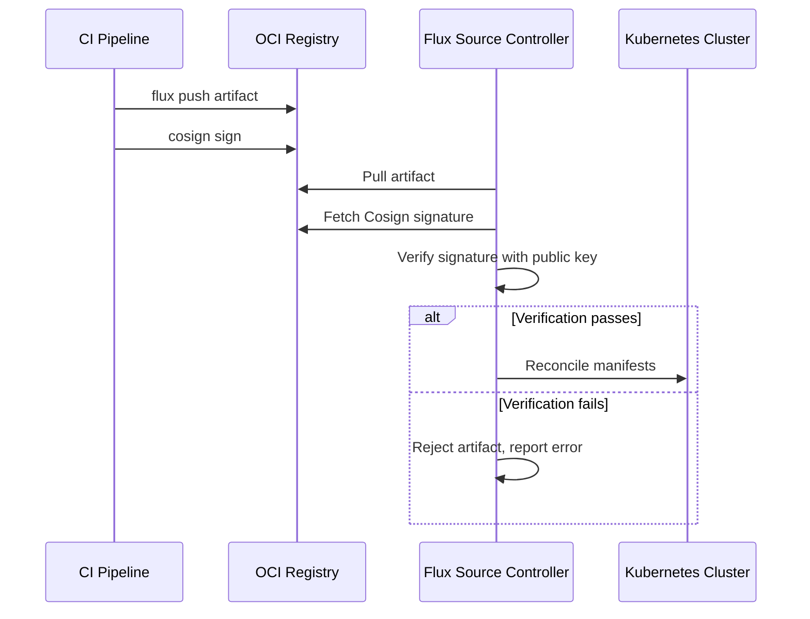

# How to Verify OCI Artifact Signatures with Cosign in Flux

Author: [nawazdhandala](https://github.com/nawazdhandala)

Tags: Flux CD, GitOps, Kubernetes, OCI, Cosign, Security, Supply Chain

Description: Learn how to sign OCI artifacts with Cosign and configure Flux CD to verify those signatures before deploying to your Kubernetes cluster.

---

## Introduction

Supply chain security is critical for production Kubernetes deployments. Flux CD integrates with Sigstore's Cosign to verify OCI artifact signatures before reconciling resources. This ensures that only artifacts signed by trusted parties are deployed to your cluster, preventing unauthorized or tampered manifests from reaching production.

This guide walks through generating Cosign keys, signing OCI artifacts, and configuring Flux's OCIRepository to verify signatures automatically.

## Prerequisites

- A Kubernetes cluster with Flux CD installed (v0.35 or later)
- The `flux` CLI installed
- The `cosign` CLI installed (v2.0 or later)
- An OCI-compatible container registry
- `kubectl` configured to access your cluster

## Step 1: Generate a Cosign Key Pair

Generate a key pair that will be used to sign and verify OCI artifacts.

```bash
# Generate a Cosign key pair (you will be prompted for a password)
cosign generate-key-pair
```

This creates two files:

- `cosign.key` -- the private key used for signing (keep this secure)
- `cosign.pub` -- the public key used for verification

## Step 2: Push an OCI Artifact

Push your Kubernetes manifests as an OCI artifact to your registry.

```bash
# Push manifests as an OCI artifact
flux push artifact oci://registry.example.com/manifests/app:v1.0.0 \
  --path=./deploy \
  --source="$(git config --get remote.origin.url)" \
  --revision="main@sha1:$(git rev-parse HEAD)" \
  --creds=username:$REGISTRY_PASSWORD
```

## Step 3: Sign the OCI Artifact with Cosign

Sign the artifact using the private key generated in Step 1.

```bash
# Sign the OCI artifact with Cosign
cosign sign --key cosign.key \
  registry.example.com/manifests/app:v1.0.0
```

You can verify the signature locally before configuring Flux.

```bash
# Verify the signature locally using the public key
cosign verify --key cosign.pub \
  registry.example.com/manifests/app:v1.0.0
```

If verification succeeds, you will see the signature payload printed to stdout.

## Step 4: Store the Public Key in Kubernetes

Create a Kubernetes secret containing the Cosign public key so Flux can use it for verification.

```bash
# Create a secret with the Cosign public key for Flux verification
kubectl create secret generic cosign-pub-key \
  --namespace=flux-system \
  --from-file=cosign.pub=./cosign.pub
```

## Step 5: Configure OCIRepository with Signature Verification

Create the OCIRepository resource with the `spec.verify` section configured to use Cosign.

```yaml
# ocirepository-verified.yaml -- OCIRepository with Cosign verification
apiVersion: source.toolkit.fluxcd.io/v1beta2
kind: OCIRepository
metadata:
  name: app-manifests
  namespace: flux-system
spec:
  interval: 5m
  url: oci://registry.example.com/manifests/app
  ref:
    tag: v1.0.0
  verify:
    # Use Cosign as the verification provider
    provider: cosign
    secretRef:
      # Reference the secret containing the Cosign public key
      name: cosign-pub-key
```

Apply the resource.

```bash
# Apply the OCIRepository with verification enabled
kubectl apply -f ocirepository-verified.yaml
```

## Step 6: Verify the Configuration

Check that Flux successfully verifies and pulls the artifact.

```bash
# Check the OCIRepository status
flux get sources oci

# Get detailed status including verification result
kubectl describe ocirepository app-manifests -n flux-system
```

When verification succeeds, the OCIRepository status conditions will show that the artifact was verified. If verification fails, Flux will refuse to use the artifact and report an error in the status.

## Using Keyless Signing with Sigstore

Cosign also supports keyless signing using Sigstore's Fulcio and Rekor services. This eliminates the need to manage key pairs and instead ties signatures to OIDC identities (such as GitHub Actions workflow identity).

### Sign Keylessly in CI

```bash
# Keyless signing in CI (uses ambient OIDC credentials)
COSIGN_EXPERIMENTAL=1 cosign sign \
  registry.example.com/manifests/app:v1.0.0
```

### Configure Flux for Keyless Verification

For keyless verification, configure the OCIRepository to use the Cosign provider with match expressions for the expected identity and issuer.

```yaml
# ocirepository-keyless.yaml -- OCIRepository with keyless Cosign verification
apiVersion: source.toolkit.fluxcd.io/v1beta2
kind: OCIRepository
metadata:
  name: app-manifests
  namespace: flux-system
spec:
  interval: 5m
  url: oci://registry.example.com/manifests/app
  ref:
    tag: v1.0.0
  verify:
    provider: cosign
    matchOIDCIdentity:
      - issuer: "https://token.actions.githubusercontent.com"
        subject: "https://github.com/YOUR_ORG/YOUR_REPO/.github/workflows/push.yaml@refs/heads/main"
```

This configuration verifies that the artifact was signed by a specific GitHub Actions workflow, providing strong supply chain assurance without managing any keys.

## End-to-End Workflow

The following diagram illustrates the complete signing and verification flow.



## CI Pipeline Integration

Here is an example GitHub Actions workflow that pushes and signs an artifact.

```yaml
# .github/workflows/deploy.yaml -- Push and sign OCI artifacts
name: Push and Sign Artifact
on:
  push:
    branches: [main]

permissions:
  packages: write
  id-token: write  # Required for keyless signing

jobs:
  push-and-sign:
    runs-on: ubuntu-latest
    steps:
      - uses: actions/checkout@v4

      - name: Setup Flux CLI
        uses: fluxcd/flux2/action@main

      - name: Install Cosign
        uses: sigstore/cosign-installer@main

      - name: Push artifact
        run: |
          flux push artifact \
            oci://ghcr.io/${{ github.repository }}/manifests:${{ github.sha }} \
            --path=./deploy \
            --source="${{ github.repositoryUrl }}" \
            --revision="main@sha1:${{ github.sha }}" \
            --creds=flux:${{ secrets.GITHUB_TOKEN }}

      - name: Sign artifact (keyless)
        run: |
          cosign sign \
            ghcr.io/${{ github.repository }}/manifests:${{ github.sha }}
        env:
          COSIGN_EXPERIMENTAL: "1"
```

## Troubleshooting

Common issues with Cosign verification in Flux:

- **verification failed: no matching signatures**: The artifact was not signed, or the signature does not match the provided public key. Re-sign the artifact and ensure the correct public key is in the secret.
- **secret not found**: Ensure the `cosign-pub-key` secret exists in the same namespace as the OCIRepository.
- **keyless verification fails**: Confirm the issuer and subject in `matchOIDCIdentity` exactly match the signer's OIDC identity. Check the Rekor transparency log for the expected values.

## Conclusion

Verifying OCI artifact signatures with Cosign in Flux adds a critical security layer to your GitOps pipeline. Whether you use traditional key-based signing or keyless signing with Sigstore, Flux ensures that only verified artifacts are reconciled to your cluster. This prevents supply chain attacks where an attacker might push malicious manifests to your registry. By integrating signing into your CI pipeline and verification into your Flux configuration, you establish a trust chain from code commit to cluster deployment.
