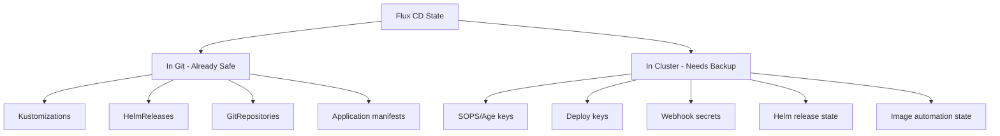

# How to Backup Flux CD Configuration and State

Author: [nawazdhandala](https://github.com/nawazdhandala)

Tags: Flux CD, Backup, Disaster Recovery, Kubernetes, GitOps, Velero, State Management

Description: A practical guide to backing up Flux CD configuration, secrets, and state to ensure recoverability in case of cluster failures.

---

## Introduction

While Flux CD's GitOps model means your desired state is always stored in Git, the actual cluster state includes additional components that Git alone does not capture. Flux CD secrets, custom resource statuses, Helm release state, and encryption keys all need proper backup strategies. This guide covers comprehensive backup approaches for Flux CD deployments.

## Prerequisites

- A Kubernetes cluster with Flux CD installed
- kubectl access to the cluster
- A backup storage destination (S3, GCS, or Azure Blob)
- Velero or similar backup tool (optional but recommended)

## What Needs to Be Backed Up

Understanding what Flux CD stores beyond Git is essential for a complete backup strategy.



## Backing Up Flux CD Secrets

Flux CD stores critical secrets that are not in Git. These include Git deploy keys, SOPS decryption keys, and webhook receiver secrets.

### Export All Flux Secrets

```bash
#!/bin/bash
# scripts/backup-flux-secrets.sh
# Exports all Flux CD secrets to encrypted backup files

BACKUP_DIR="flux-backup-$(date +%Y%m%d-%H%M%S)"
mkdir -p "$BACKUP_DIR"

echo "Backing up Flux CD secrets..."

# Export the flux-system namespace secrets
kubectl get secrets -n flux-system -o yaml > "$BACKUP_DIR/flux-secrets.yaml"

# Export specific critical secrets individually
# Git deploy key used by Flux to access the repository
kubectl get secret flux-system -n flux-system -o yaml > "$BACKUP_DIR/git-deploy-key.yaml"

# SOPS age key used for decrypting secrets
kubectl get secret sops-age -n flux-system -o yaml > "$BACKUP_DIR/sops-age-key.yaml" 2>/dev/null || echo "No SOPS age key found"

# Webhook receiver token
kubectl get secret webhook-token -n flux-system -o yaml > "$BACKUP_DIR/webhook-token.yaml" 2>/dev/null || echo "No webhook token found"

# Image pull secrets used by image automation
kubectl get secrets -n flux-system -l "toolkit.fluxcd.io/component=image-automation" -o yaml > "$BACKUP_DIR/image-automation-secrets.yaml" 2>/dev/null

# Notification provider secrets
kubectl get secrets -n flux-system -l "toolkit.fluxcd.io/component=notification-controller" -o yaml > "$BACKUP_DIR/notification-secrets.yaml" 2>/dev/null

echo "Secrets backed up to: $BACKUP_DIR/"
ls -la "$BACKUP_DIR/"
```

### Encrypt the Backup

```bash
#!/bin/bash
# scripts/encrypt-backup.sh
# Encrypts the backup directory using age encryption

BACKUP_DIR="$1"
AGE_RECIPIENT="$2"  # age public key

if [ -z "$BACKUP_DIR" ] || [ -z "$AGE_RECIPIENT" ]; then
  echo "Usage: $0 <backup-dir> <age-public-key>"
  exit 1
fi

# Create a tar archive of the backup
tar -czf "${BACKUP_DIR}.tar.gz" "$BACKUP_DIR"

# Encrypt with age
age -r "$AGE_RECIPIENT" -o "${BACKUP_DIR}.tar.gz.age" "${BACKUP_DIR}.tar.gz"

# Remove unencrypted files
rm -rf "$BACKUP_DIR" "${BACKUP_DIR}.tar.gz"

echo "Encrypted backup: ${BACKUP_DIR}.tar.gz.age"
```

## Backing Up Flux Custom Resources

Export all Flux CD custom resources and their statuses.

```bash
#!/bin/bash
# scripts/backup-flux-resources.sh
# Exports all Flux CD custom resources

BACKUP_DIR="flux-resources-$(date +%Y%m%d-%H%M%S)"
mkdir -p "$BACKUP_DIR"

echo "Backing up Flux CD custom resources..."

# Backup GitRepository sources
kubectl get gitrepositories -A -o yaml > "$BACKUP_DIR/gitrepositories.yaml"

# Backup HelmRepository sources
kubectl get helmrepositories -A -o yaml > "$BACKUP_DIR/helmrepositories.yaml"

# Backup HelmChart sources
kubectl get helmcharts -A -o yaml > "$BACKUP_DIR/helmcharts.yaml"

# Backup OCIRepository sources
kubectl get ocirepositories -A -o yaml > "$BACKUP_DIR/ocirepositories.yaml" 2>/dev/null

# Backup Kustomizations
kubectl get kustomizations -A -o yaml > "$BACKUP_DIR/kustomizations.yaml"

# Backup HelmReleases
kubectl get helmreleases -A -o yaml > "$BACKUP_DIR/helmreleases.yaml"

# Backup ImageRepositories and ImagePolicies
kubectl get imagerepositories -A -o yaml > "$BACKUP_DIR/imagerepositories.yaml" 2>/dev/null
kubectl get imagepolicies -A -o yaml > "$BACKUP_DIR/imagepolicies.yaml" 2>/dev/null
kubectl get imageupdateautomations -A -o yaml > "$BACKUP_DIR/imageupdateautomations.yaml" 2>/dev/null

# Backup Notification resources
kubectl get providers -A -o yaml > "$BACKUP_DIR/providers.yaml" 2>/dev/null
kubectl get alerts -A -o yaml > "$BACKUP_DIR/alerts.yaml" 2>/dev/null
kubectl get receivers -A -o yaml > "$BACKUP_DIR/receivers.yaml" 2>/dev/null

echo "Resources backed up to: $BACKUP_DIR/"
echo "Resource counts:"
for file in "$BACKUP_DIR"/*.yaml; do
  count=$(grep -c "^  name:" "$file" 2>/dev/null || echo "0")
  echo "  $(basename $file): $count resources"
done
```

## Backing Up Helm Release State

Helm releases store state in Kubernetes secrets. This state is needed for proper Helm upgrades and rollbacks.

```bash
#!/bin/bash
# scripts/backup-helm-state.sh
# Backs up Helm release secrets that store release history

BACKUP_DIR="helm-state-$(date +%Y%m%d-%H%M%S)"
mkdir -p "$BACKUP_DIR"

echo "Backing up Helm release state..."

# Find all Helm release secrets across all namespaces
kubectl get secrets -A -l "owner=helm" -o yaml > "$BACKUP_DIR/helm-release-secrets.yaml"

# Count the releases
RELEASE_COUNT=$(kubectl get secrets -A -l "owner=helm" --no-headers | wc -l)
echo "Backed up $RELEASE_COUNT Helm release state secrets"
```

## Automated Backup with CronJob

Create a Kubernetes CronJob that regularly backs up Flux CD state to object storage.

```yaml
# clusters/my-cluster/backup/namespace.yaml
apiVersion: v1
kind: Namespace
metadata:
  name: flux-backup
  labels:
    app.kubernetes.io/managed-by: flux

---
# clusters/my-cluster/backup/rbac.yaml
apiVersion: v1
kind: ServiceAccount
metadata:
  name: flux-backup
  namespace: flux-backup

---
apiVersion: rbac.authorization.k8s.io/v1
kind: ClusterRole
metadata:
  name: flux-backup-reader
rules:
  # Read Flux CD custom resources
  - apiGroups: ["source.toolkit.fluxcd.io"]
    resources: ["*"]
    verbs: ["get", "list"]
  - apiGroups: ["kustomize.toolkit.fluxcd.io"]
    resources: ["*"]
    verbs: ["get", "list"]
  - apiGroups: ["helm.toolkit.fluxcd.io"]
    resources: ["*"]
    verbs: ["get", "list"]
  - apiGroups: ["notification.toolkit.fluxcd.io"]
    resources: ["*"]
    verbs: ["get", "list"]
  - apiGroups: ["image.toolkit.fluxcd.io"]
    resources: ["*"]
    verbs: ["get", "list"]
  # Read secrets in flux-system namespace
  - apiGroups: [""]
    resources: ["secrets"]
    verbs: ["get", "list"]

---
apiVersion: rbac.authorization.k8s.io/v1
kind: ClusterRoleBinding
metadata:
  name: flux-backup-reader
roleRef:
  apiGroup: rbac.authorization.k8s.io
  kind: ClusterRole
  name: flux-backup-reader
subjects:
  - kind: ServiceAccount
    name: flux-backup
    namespace: flux-backup
```

```yaml
# clusters/my-cluster/backup/cronjob.yaml
apiVersion: batch/v1
kind: CronJob
metadata:
  name: flux-backup
  namespace: flux-backup
spec:
  # Run backup every 6 hours
  schedule: "0 */6 * * *"
  concurrencyPolicy: Forbid
  successfulJobsHistoryLimit: 3
  failedJobsHistoryLimit: 3
  jobTemplate:
    spec:
      template:
        spec:
          serviceAccountName: flux-backup
          containers:
            - name: backup
              image: bitnami/kubectl:1.29
              command:
                - /bin/bash
                - -c
                - |
                  set -e
                  TIMESTAMP=$(date +%Y%m%d-%H%M%S)
                  BACKUP_DIR="/tmp/flux-backup-${TIMESTAMP}"
                  mkdir -p "$BACKUP_DIR"

                  echo "Starting Flux CD backup at ${TIMESTAMP}"

                  # Export all Flux resources
                  for resource in gitrepositories helmrepositories kustomizations helmreleases; do
                    kubectl get "$resource" -A -o yaml > "${BACKUP_DIR}/${resource}.yaml"
                  done

                  # Export secrets from flux-system
                  kubectl get secrets -n flux-system -o yaml > "${BACKUP_DIR}/secrets.yaml"

                  # Export Helm release state
                  kubectl get secrets -A -l "owner=helm" -o yaml > "${BACKUP_DIR}/helm-state.yaml"

                  # Create tar archive
                  tar -czf "/tmp/flux-backup-${TIMESTAMP}.tar.gz" -C /tmp "flux-backup-${TIMESTAMP}"

                  # Upload to S3 (requires AWS credentials)
                  # aws s3 cp "/tmp/flux-backup-${TIMESTAMP}.tar.gz" \
                  #   "s3://my-backup-bucket/flux-backups/flux-backup-${TIMESTAMP}.tar.gz"

                  echo "Backup completed: flux-backup-${TIMESTAMP}.tar.gz"
              env:
                - name: AWS_ACCESS_KEY_ID
                  valueFrom:
                    secretKeyRef:
                      name: backup-s3-credentials
                      key: access-key-id
                - name: AWS_SECRET_ACCESS_KEY
                  valueFrom:
                    secretKeyRef:
                      name: backup-s3-credentials
                      key: secret-access-key
              resources:
                limits:
                  cpu: 200m
                  memory: 256Mi
                requests:
                  cpu: 100m
                  memory: 128Mi
          restartPolicy: OnFailure
```

## Backing Up with Velero

Velero provides cluster-wide backup capabilities that complement Flux-specific backups.

```yaml
# clusters/my-cluster/backup/velero-schedule.yaml
apiVersion: velero.io/v1
kind: Schedule
metadata:
  name: flux-system-backup
  namespace: velero
spec:
  # Run daily at 2 AM
  schedule: "0 2 * * *"
  template:
    # Include only the flux-system namespace
    includedNamespaces:
      - flux-system
    # Include all resource types
    includedResources:
      - secrets
      - configmaps
      - gitrepositories.source.toolkit.fluxcd.io
      - helmrepositories.source.toolkit.fluxcd.io
      - helmcharts.source.toolkit.fluxcd.io
      - kustomizations.kustomize.toolkit.fluxcd.io
      - helmreleases.helm.toolkit.fluxcd.io
      - providers.notification.toolkit.fluxcd.io
      - alerts.notification.toolkit.fluxcd.io
      - receivers.notification.toolkit.fluxcd.io
    # Store backups for 30 days
    ttl: 720h
    storageLocation: default
    volumeSnapshotLocations:
      - default
```

## Verifying Backups

```bash
# Verify the backup was created
ls -la flux-backup-*.tar.gz

# Check backup contents
tar -tzf flux-backup-*.tar.gz

# Verify Velero backups
velero backup get
velero backup describe flux-system-backup-<timestamp>

# Test restore in a separate namespace (dry run)
kubectl create namespace flux-restore-test
kubectl apply -f flux-backup-*/secrets.yaml --namespace flux-restore-test --dry-run=server
kubectl delete namespace flux-restore-test
```

## Backup Verification Automation

```yaml
# clusters/my-cluster/backup/verify-cronjob.yaml
apiVersion: batch/v1
kind: CronJob
metadata:
  name: flux-backup-verify
  namespace: flux-backup
spec:
  # Verify backups once a day, 1 hour after the backup runs
  schedule: "0 3 * * *"
  jobTemplate:
    spec:
      template:
        spec:
          serviceAccountName: flux-backup
          containers:
            - name: verify
              image: bitnami/kubectl:1.29
              command:
                - /bin/bash
                - -c
                - |
                  echo "Verifying latest Flux CD backup..."

                  # Check that critical secrets exist
                  DEPLOY_KEY=$(kubectl get secret flux-system -n flux-system -o name 2>/dev/null)
                  if [ -z "$DEPLOY_KEY" ]; then
                    echo "WARNING: Git deploy key not found!"
                    exit 1
                  fi

                  # Check Flux resource counts
                  GIT_REPOS=$(kubectl get gitrepositories -A --no-headers | wc -l)
                  KUSTOMIZATIONS=$(kubectl get kustomizations -A --no-headers | wc -l)
                  HELM_RELEASES=$(kubectl get helmreleases -A --no-headers | wc -l)

                  echo "Current Flux resources:"
                  echo "  GitRepositories: $GIT_REPOS"
                  echo "  Kustomizations: $KUSTOMIZATIONS"
                  echo "  HelmReleases: $HELM_RELEASES"

                  echo "Backup verification complete"
          restartPolicy: OnFailure
```

## Conclusion

Backing up Flux CD configuration and state requires attention to components that live outside Git: secrets, deploy keys, SOPS encryption keys, and Helm release state. By combining targeted secret exports, Flux resource backups, and cluster-wide tools like Velero, you create a comprehensive safety net. Automated CronJobs ensure backups happen regularly, and verification jobs confirm their integrity. With proper backups in place, you can confidently recover from cluster failures, secret rotations, or accidental deletions without losing your GitOps state.
