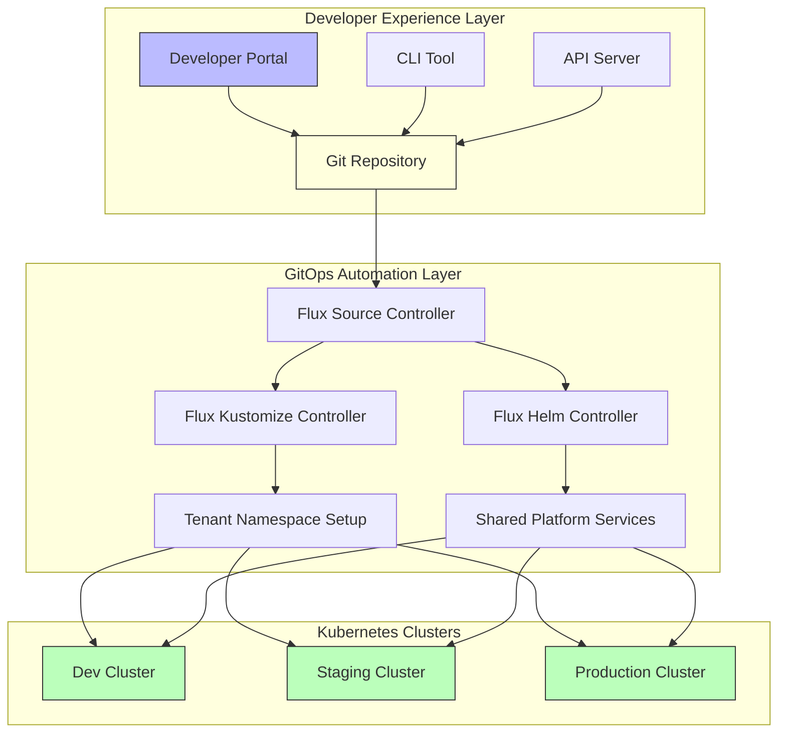
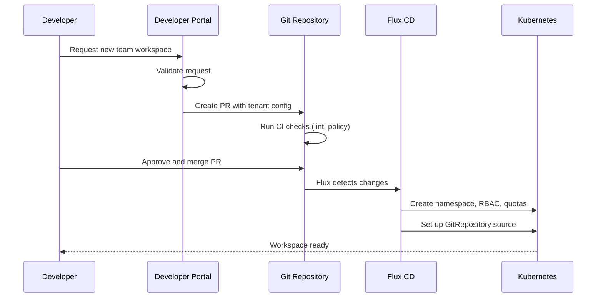

# How to Build an Internal Developer Platform with Flux CD

Author: [nawazdhandala](https://github.com/nawazdhandala)

Tags: Flux CD, GitOps, Kubernetes, Internal Developer Platform, IDP, Platform Engineering

Description: Learn how to build a self-service internal developer platform using Flux CD as the GitOps engine for automated deployments and environment management.

---

## Introduction

An Internal Developer Platform (IDP) provides developers with self-service capabilities for deploying, managing, and monitoring applications without requiring deep infrastructure knowledge. Flux CD serves as an excellent GitOps engine for building an IDP because it automates the reconciliation loop between desired state in Git and actual state in Kubernetes clusters.

In this guide, you will build a multi-tenant IDP that lets development teams onboard themselves, create environments, and deploy applications through Git pull requests, with Flux CD handling all the automation behind the scenes.

## Prerequisites

- A Kubernetes cluster (v1.24 or later)
- Flux CD installed (v2.0 or later)
- `kubectl` and `flux` CLI tools installed
- A Git repository for platform configuration
- Basic understanding of Kustomize and Helm

## Architecture Overview



The IDP uses a layered architecture. Developers interact through a portal, CLI, or API. All changes flow through Git, and Flux CD reconciles them to the target clusters.

## Step 1: Set Up the Platform Repository Structure

Organize your repository to separate platform infrastructure from tenant workloads.

```bash
# Platform repository structure
# platform-repo/
# ├── clusters/
# │   ├── dev/
# │   │   ├── flux-system/       # Flux bootstrap for dev
# │   │   └── tenants.yaml       # Kustomization pointing to tenants
# │   ├── staging/
# │   │   ├── flux-system/
# │   │   └── tenants.yaml
# │   └── production/
# │       ├── flux-system/
# │       └── tenants.yaml
# ├── infrastructure/
# │   ├── base/
# │   │   ├── ingress-nginx/
# │   │   ├── cert-manager/
# │   │   ├── monitoring/
# │   │   └── kustomization.yaml
# │   └── overlays/
# │       ├── dev/
# │       ├── staging/
# │       └── production/
# ├── tenants/
# │   ├── base/                  # Tenant template
# │   │   ├── namespace.yaml
# │   │   ├── rbac.yaml
# │   │   ├── network-policy.yaml
# │   │   ├── resource-quota.yaml
# │   │   └── kustomization.yaml
# │   └── instances/
# │       ├── team-alpha/
# │       ├── team-beta/
# │       └── team-gamma/
# └── apps/
#     ├── base/                  # App deployment templates
#     └── instances/
```

## Step 2: Create the Tenant Base Template

Define a reusable template that provisions everything a team needs.

```yaml
# tenants/base/namespace.yaml -- Namespace template for each tenant
apiVersion: v1
kind: Namespace
metadata:
  name: "${TENANT_NAME}"
  labels:
    # Labels for policy enforcement and monitoring
    platform.example.com/tenant: "${TENANT_NAME}"
    platform.example.com/managed-by: flux
```

```yaml
# tenants/base/rbac.yaml -- RBAC rules granting tenant teams access
apiVersion: rbac.authorization.k8s.io/v1
kind: RoleBinding
metadata:
  name: tenant-admin
  namespace: "${TENANT_NAME}"
roleRef:
  apiGroup: rbac.authorization.k8s.io
  kind: ClusterRole
  # Grants admin access within the tenant namespace only
  name: admin
subjects:
  - kind: Group
    name: "${TENANT_GROUP}"
    apiGroup: rbac.authorization.k8s.io
```

```yaml
# tenants/base/resource-quota.yaml -- Default resource limits per tenant
apiVersion: v1
kind: ResourceQuota
metadata:
  name: tenant-quota
  namespace: "${TENANT_NAME}"
spec:
  hard:
    # Default quotas; overridden per tenant via Kustomize patches
    requests.cpu: "4"
    requests.memory: 8Gi
    limits.cpu: "8"
    limits.memory: 16Gi
    persistentvolumeclaims: "10"
    services.loadbalancers: "2"
```

```yaml
# tenants/base/network-policy.yaml -- Isolate tenant namespaces by default
apiVersion: networking.k8s.io/v1
kind: NetworkPolicy
metadata:
  name: tenant-isolation
  namespace: "${TENANT_NAME}"
spec:
  podSelector: {}
  policyTypes:
    - Ingress
    - Egress
  ingress:
    - from:
        # Allow traffic only from the same namespace
        - namespaceSelector:
            matchLabels:
              platform.example.com/tenant: "${TENANT_NAME}"
        # Allow traffic from the ingress controller
        - namespaceSelector:
            matchLabels:
              kubernetes.io/metadata.name: ingress-nginx
  egress:
    - to:
        # Allow DNS resolution
        - namespaceSelector:
            matchLabels:
              kubernetes.io/metadata.name: kube-system
      ports:
        - protocol: UDP
          port: 53
    - to:
        # Allow egress to same namespace and internet
        - namespaceSelector:
            matchLabels:
              platform.example.com/tenant: "${TENANT_NAME}"
        - ipBlock:
            cidr: 0.0.0.0/0
            except:
              - 10.0.0.0/8
              - 172.16.0.0/12
              - 192.168.0.0/16
```

```yaml
# tenants/base/kustomization.yaml -- Base kustomization for tenant resources
apiVersion: kustomize.config.k8s.io/v1beta1
kind: Kustomization
resources:
  - namespace.yaml
  - rbac.yaml
  - resource-quota.yaml
  - network-policy.yaml
```

## Step 3: Onboard a New Tenant

Create a tenant instance by overlaying the base template.

```yaml
# tenants/instances/team-alpha/kustomization.yaml -- Team Alpha's tenant config
apiVersion: kustomize.config.k8s.io/v1beta1
kind: Kustomization
resources:
  - ../../base
  # Team Alpha's Flux source for their app repository
  - git-source.yaml
  - app-kustomization.yaml
patches:
  - target:
      kind: ResourceQuota
      name: tenant-quota
    patch: |
      - op: replace
        path: /spec/hard/requests.cpu
        # Team Alpha gets higher CPU quota
        value: "8"
      - op: replace
        path: /spec/hard/requests.memory
        value: "16Gi"
replacements:
  - source:
      kind: ConfigMap
      name: tenant-vars
      fieldPath: data.TENANT_NAME
    targets:
      - select:
          kind: Namespace
        fieldPaths:
          - metadata.name
      - select:
          kind: RoleBinding
        fieldPaths:
          - metadata.namespace
      - select:
          kind: ResourceQuota
        fieldPaths:
          - metadata.namespace
      - select:
          kind: NetworkPolicy
        fieldPaths:
          - metadata.namespace
---
# ConfigMap holding tenant-specific variables
apiVersion: v1
kind: ConfigMap
metadata:
  name: tenant-vars
data:
  TENANT_NAME: team-alpha
  TENANT_GROUP: team-alpha-devs
```

```yaml
# tenants/instances/team-alpha/git-source.yaml -- Flux watches Team Alpha's repo
apiVersion: source.toolkit.fluxcd.io/v1
kind: GitRepository
metadata:
  name: team-alpha-apps
  namespace: flux-system
spec:
  interval: 1m
  url: https://github.com/your-org/team-alpha-apps
  ref:
    branch: main
  secretRef:
    name: team-alpha-git-auth
```

```yaml
# tenants/instances/team-alpha/app-kustomization.yaml -- Deploy Team Alpha's apps
apiVersion: kustomize.toolkit.fluxcd.io/v1
kind: Kustomization
metadata:
  name: team-alpha-apps
  namespace: flux-system
spec:
  interval: 5m
  sourceRef:
    kind: GitRepository
    name: team-alpha-apps
  path: ./deploy
  prune: true
  # Restrict deployments to the tenant's namespace only
  targetNamespace: team-alpha
  serviceAccountName: team-alpha-deployer
  # Health checks ensure deployments are actually running
  healthChecks:
    - apiVersion: apps/v1
      kind: Deployment
      name: "*"
      namespace: team-alpha
  timeout: 10m
```

## Step 4: Configure Multi-Cluster Tenant Distribution

Use a cluster-level Kustomization to roll out tenants across environments.

```yaml
# clusters/dev/tenants.yaml -- Deploy all tenants to the dev cluster
apiVersion: kustomize.toolkit.fluxcd.io/v1
kind: Kustomization
metadata:
  name: tenants
  namespace: flux-system
spec:
  interval: 10m
  sourceRef:
    kind: GitRepository
    name: flux-system
  path: ./tenants/instances
  prune: true
  wait: true
  timeout: 5m
  # Post-build variable substitution for environment-specific values
  postBuild:
    substituteFrom:
      - kind: ConfigMap
        name: cluster-vars
```

```yaml
# clusters/dev/cluster-vars.yaml -- Environment-specific variables
apiVersion: v1
kind: ConfigMap
metadata:
  name: cluster-vars
  namespace: flux-system
data:
  ENVIRONMENT: dev
  CLUSTER_NAME: dev-us-east-1
  DOMAIN_SUFFIX: dev.platform.example.com
```

## Step 5: Create a Self-Service Onboarding Workflow



Automate the onboarding by creating a simple script or API that generates the tenant configuration.

```bash
#!/bin/bash
# onboard-tenant.sh -- Script to generate tenant configuration files
# Usage: ./onboard-tenant.sh <team-name> <git-repo-url> <ad-group>

TEAM_NAME=$1
GIT_REPO=$2
AD_GROUP=$3

TENANT_DIR="tenants/instances/${TEAM_NAME}"

# Create the tenant directory
mkdir -p "${TENANT_DIR}"

# Generate the kustomization with the team's specific values
cat > "${TENANT_DIR}/kustomization.yaml" <<EOF
apiVersion: kustomize.config.k8s.io/v1beta1
kind: Kustomization
resources:
  - ../../base
  - git-source.yaml
  - app-kustomization.yaml
replacements:
  - source:
      kind: ConfigMap
      name: tenant-vars
      fieldPath: data.TENANT_NAME
    targets:
      - select:
          kind: Namespace
        fieldPaths:
          - metadata.name
---
apiVersion: v1
kind: ConfigMap
metadata:
  name: tenant-vars
data:
  TENANT_NAME: ${TEAM_NAME}
  TENANT_GROUP: ${AD_GROUP}
EOF

# Generate the Git source pointing to the team's repository
cat > "${TENANT_DIR}/git-source.yaml" <<EOF
apiVersion: source.toolkit.fluxcd.io/v1
kind: GitRepository
metadata:
  name: ${TEAM_NAME}-apps
  namespace: flux-system
spec:
  interval: 1m
  url: ${GIT_REPO}
  ref:
    branch: main
  secretRef:
    name: ${TEAM_NAME}-git-auth
EOF

# Generate the Kustomization for the team's app deployments
cat > "${TENANT_DIR}/app-kustomization.yaml" <<EOF
apiVersion: kustomize.toolkit.fluxcd.io/v1
kind: Kustomization
metadata:
  name: ${TEAM_NAME}-apps
  namespace: flux-system
spec:
  interval: 5m
  sourceRef:
    kind: GitRepository
    name: ${TEAM_NAME}-apps
  path: ./deploy
  prune: true
  targetNamespace: ${TEAM_NAME}
  timeout: 10m
EOF

echo "Tenant '${TEAM_NAME}' configuration created in ${TENANT_DIR}"
echo "Create a PR to onboard this tenant."
```

## Step 6: Add Observability for the Platform

Give platform operators visibility into tenant health and Flux reconciliation status.

```yaml
# infrastructure/base/monitoring/flux-metrics.yaml -- Expose Flux metrics for the IDP
apiVersion: monitoring.coreos.com/v1
kind: PodMonitor
metadata:
  name: flux-controllers
  namespace: flux-system
spec:
  selector:
    matchLabels:
      app.kubernetes.io/part-of: flux
  podMetricsEndpoints:
    - port: http-prom
---
# Grafana dashboard ConfigMap for tenant overview
apiVersion: v1
kind: ConfigMap
metadata:
  name: idp-dashboard
  namespace: monitoring
  labels:
    grafana_dashboard: "true"
data:
  idp-overview.json: |
    {
      "dashboard": {
        "title": "IDP Tenant Overview",
        "panels": [
          {
            "title": "Flux Reconciliation Status by Tenant",
            "type": "table",
            "targets": [
              {
                "expr": "gotk_reconcile_condition{kind='Kustomization',type='Ready'}",
                "legendFormat": "{{name}} - {{status}}"
              }
            ]
          },
          {
            "title": "Resource Usage by Namespace",
            "type": "timeseries",
            "targets": [
              {
                "expr": "sum(container_memory_usage_bytes{namespace=~'team-.*'}) by (namespace)",
                "legendFormat": "{{namespace}}"
              }
            ]
          }
        ]
      }
    }
```

## Step 7: Implement Guardrails with Flux

Protect the platform by controlling what tenants can deploy.

```yaml
# tenants/base/flux-deployer-sa.yaml -- Restricted service account for tenant deployments
apiVersion: v1
kind: ServiceAccount
metadata:
  name: "${TENANT_NAME}-deployer"
  namespace: flux-system
---
apiVersion: rbac.authorization.k8s.io/v1
kind: ClusterRole
metadata:
  name: "${TENANT_NAME}-deployer"
rules:
  # Tenants can only create these resource types
  - apiGroups: ["apps"]
    resources: ["deployments", "statefulsets"]
    verbs: ["*"]
  - apiGroups: [""]
    resources: ["services", "configmaps", "secrets"]
    verbs: ["*"]
  - apiGroups: ["networking.k8s.io"]
    resources: ["ingresses"]
    verbs: ["*"]
  - apiGroups: ["autoscaling"]
    resources: ["horizontalpodautoscalers"]
    verbs: ["*"]
  # Tenants cannot create ClusterRoles, PVs, or CRDs
---
apiVersion: rbac.authorization.k8s.io/v1
kind: ClusterRoleBinding
metadata:
  name: "${TENANT_NAME}-deployer"
roleRef:
  apiGroup: rbac.authorization.k8s.io
  kind: ClusterRole
  name: "${TENANT_NAME}-deployer"
subjects:
  - kind: ServiceAccount
    name: "${TENANT_NAME}-deployer"
    namespace: flux-system
```

## Benefits of Using Flux CD for an IDP

- **Self-service through Git**: Developers onboard by submitting a PR, no tickets needed
- **Consistent environments**: The same tenant template is applied across all clusters
- **Audit trail**: Every change is tracked in Git history
- **Automated reconciliation**: Flux continuously ensures the actual state matches the desired state
- **Multi-tenancy built in**: Flux's service account impersonation and namespace targeting enforce boundaries

## Conclusion

Building an Internal Developer Platform with Flux CD gives your organization a scalable, self-service approach to Kubernetes multi-tenancy. By templating tenant resources and letting Flux handle reconciliation, you reduce operational burden while giving developers the autonomy they need. The Git-based workflow provides natural approval gates and audit trails, making it easy to onboard new teams and maintain governance across all environments.
