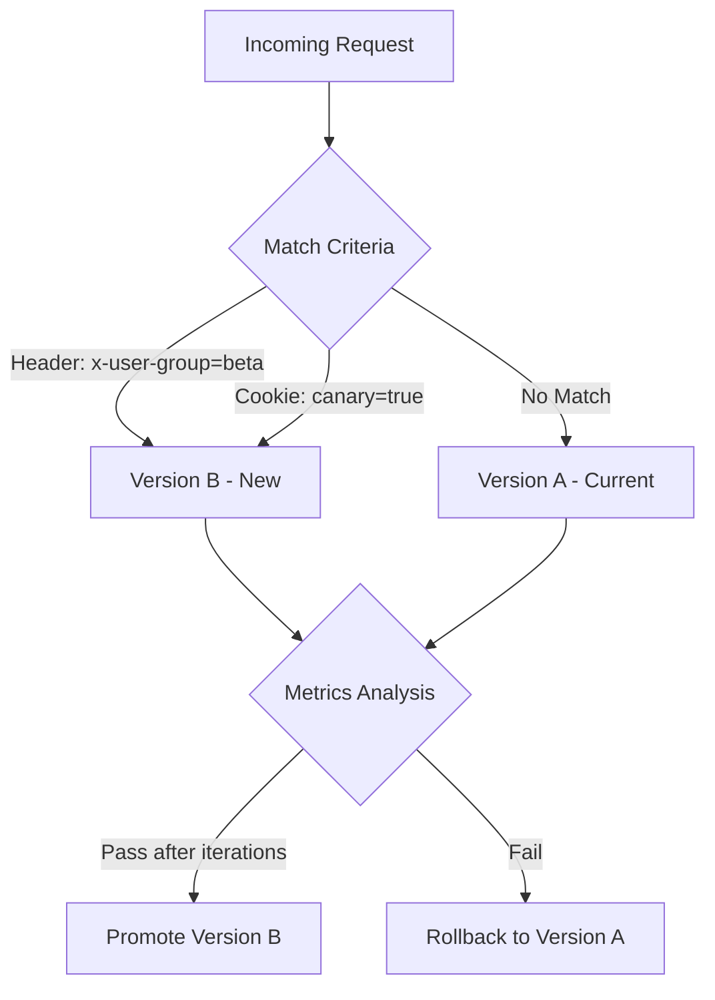

# How to Configure A/B Testing with Flagger and Flux

Author: [nawazdhandala](https://github.com/nawazdhandala)

Tags: Flagger, Flux CD, A/B Testing, Progressive Delivery, Kubernetes, GitOps, Traffic Routing, Feature Flags

Description: Learn how to configure A/B testing with Flagger and Flux CD to route traffic based on HTTP headers, cookies, and other request attributes.

---

## Introduction

A/B testing with Flagger lets you route traffic to different versions of your application based on HTTP request attributes such as headers, cookies, or query parameters. Unlike canary deployments that split traffic by percentage, A/B testing routes specific users or user segments to the new version. This is useful for testing features with specific user groups before rolling them out to everyone.

Flagger supports A/B testing with Istio, NGINX, Contour, and other service meshes and ingress controllers.

## Prerequisites

- A running Kubernetes cluster (v1.26 or later)
- Flux CD installed and bootstrapped
- Flagger installed
- Istio service mesh or NGINX Ingress Controller
- Prometheus for metrics collection
- kubectl configured to access your cluster

## How A/B Testing Works with Flagger



## Step 1: Deploy the Application

Create the base application that Flagger will manage for A/B testing.

```yaml
# apps/frontend/namespace.yaml
apiVersion: v1
kind: Namespace
metadata:
  name: frontend
  labels:
    # Required for Istio sidecar injection
    istio-injection: enabled
```

```yaml
# apps/frontend/deployment.yaml
# The deployment that Flagger will manage for A/B testing
apiVersion: apps/v1
kind: Deployment
metadata:
  name: frontend
  namespace: frontend
  labels:
    app: frontend
spec:
  replicas: 3
  selector:
    matchLabels:
      app: frontend
  template:
    metadata:
      labels:
        app: frontend
      annotations:
        prometheus.io/scrape: "true"
        prometheus.io/port: "9797"
    spec:
      containers:
        - name: frontend
          image: ghcr.io/stefanprodan/podinfo:6.5.0
          ports:
            - containerPort: 9898
              name: http
            - containerPort: 9797
              name: metrics
          command:
            - ./podinfo
            - --port=9898
            - --port-metrics=9797
          readinessProbe:
            httpGet:
              path: /readyz
              port: 9898
            initialDelaySeconds: 5
            periodSeconds: 10
          livenessProbe:
            httpGet:
              path: /healthz
              port: 9898
            initialDelaySeconds: 5
            periodSeconds: 10
          resources:
            requests:
              cpu: 100m
              memory: 64Mi
            limits:
              cpu: 250m
              memory: 128Mi
```

```yaml
# apps/frontend/hpa.yaml
apiVersion: autoscaling/v2
kind: HorizontalPodAutoscaler
metadata:
  name: frontend
  namespace: frontend
spec:
  scaleTargetRef:
    apiVersion: apps/v1
    kind: Deployment
    name: frontend
  minReplicas: 3
  maxReplicas: 10
  metrics:
    - type: Resource
      resource:
        name: cpu
        target:
          type: Utilization
          averageUtilization: 80
```

## Step 2: Configure the A/B Testing Canary with Istio

The Canary resource for A/B testing uses the `match` field to define routing rules based on request attributes.

```yaml
# apps/frontend/canary.yaml
# Flagger Canary configured for A/B testing with Istio
apiVersion: flagger.app/v1beta1
kind: Canary
metadata:
  name: frontend
  namespace: frontend
spec:
  # Reference to the target deployment
  targetRef:
    apiVersion: apps/v1
    kind: Deployment
    name: frontend

  # Autoscaler reference
  autoscalerRef:
    apiVersion: autoscaling/v2
    kind: HorizontalPodAutoscaler
    name: frontend

  # Service mesh configuration
  service:
    port: 9898
    targetPort: 9898
    # Istio traffic policy settings
    trafficPolicy:
      tls:
        mode: ISTIO_MUTUAL
    # Istio gateway reference (if using ingress gateway)
    gateways:
      - public-gateway.istio-system.svc.cluster.local
    # Hosts for the virtual service
    hosts:
      - frontend.example.com

  # A/B testing analysis configuration
  analysis:
    # How often to run the analysis
    interval: 1m
    # Number of failed checks before rollback
    threshold: 5
    # Number of successful iterations before promotion
    iterations: 10

    # A/B test routing rules - route specific users to the new version
    match:
      # Route requests with x-user-group: beta header to version B
      - headers:
          x-user-group:
            exact: "beta"
      # Route requests with canary cookie to version B
      - headers:
          cookie:
            regex: "^(.*?;)?(canary=true)(;.*)?$"
      # Route requests from specific source IP range (internal testing)
      - sourceLabels:
          app: internal-testing

    # Metrics to evaluate during A/B testing
    metrics:
      # Version B must maintain at least 99% success rate
      - name: request-success-rate
        thresholdRange:
          min: 99
        interval: 1m
      # Version B latency must stay below 500ms
      - name: request-duration
        thresholdRange:
          max: 500
        interval: 1m

    # Webhooks for testing
    webhooks:
      # Acceptance test before starting A/B test
      - name: acceptance-test
        type: pre-rollout
        url: http://flagger-loadtester.flagger-system/
        timeout: 30s
        metadata:
          type: bash
          cmd: "curl -sd 'test' http://frontend-canary.frontend:9898/token | grep token"

      # Generate load for version B (with the routing header)
      - name: load-test-b
        type: rollout
        url: http://flagger-loadtester.flagger-system/
        timeout: 5s
        metadata:
          type: cmd
          cmd: "hey -z 1m -q 10 -c 2 -H 'x-user-group: beta' http://frontend-canary.frontend:9898/"
          logCmdOutput: "true"

      # Also generate load for version A (without the routing header)
      - name: load-test-a
        type: rollout
        url: http://flagger-loadtester.flagger-system/
        timeout: 5s
        metadata:
          type: cmd
          cmd: "hey -z 1m -q 10 -c 2 http://frontend.frontend:9898/"
          logCmdOutput: "true"

    # Alerts for A/B test events
    alerts:
      - name: slack
        severity: info
        providerRef:
          name: slack
```

## Step 3: Configure A/B Testing with NGINX Ingress (Alternative)

If you are using NGINX Ingress Controller instead of Istio, configure the Canary differently.

```yaml
# apps/frontend/canary-nginx.yaml
# Flagger Canary for A/B testing with NGINX Ingress
apiVersion: flagger.app/v1beta1
kind: Canary
metadata:
  name: frontend
  namespace: frontend
spec:
  targetRef:
    apiVersion: apps/v1
    kind: Deployment
    name: frontend

  # Reference the NGINX Ingress resource
  ingressRef:
    apiVersion: networking.k8s.io/v1
    kind: Ingress
    name: frontend

  autoscalerRef:
    apiVersion: autoscaling/v2
    kind: HorizontalPodAutoscaler
    name: frontend

  service:
    port: 9898
    targetPort: 9898

  analysis:
    interval: 1m
    threshold: 5
    iterations: 10
    # NGINX A/B testing uses header-based routing
    match:
      # Route based on a custom header
      - headers:
          x-user-group:
            exact: "beta"
      # Route based on cookie
      - headers:
          cookie:
            regex: "^(.*?;)?(canary=true)(;.*)?$"
    metrics:
      - name: request-success-rate
        thresholdRange:
          min: 99
        interval: 1m
    webhooks:
      - name: load-test
        type: rollout
        url: http://flagger-loadtester.flagger-system/
        timeout: 5s
        metadata:
          type: cmd
          cmd: "hey -z 1m -q 10 -c 2 -H 'x-user-group: beta' http://frontend-canary.frontend:9898/"
```

```yaml
# apps/frontend/ingress.yaml
# NGINX Ingress for the frontend application
apiVersion: networking.k8s.io/v1
kind: Ingress
metadata:
  name: frontend
  namespace: frontend
  annotations:
    nginx.ingress.kubernetes.io/rewrite-target: /
spec:
  ingressClassName: nginx
  rules:
    - host: frontend.example.com
      http:
        paths:
          - path: /
            pathType: Prefix
            backend:
              service:
                name: frontend
                port:
                  number: 9898
```

## Step 4: Create Custom Metrics for A/B Comparison

Define metric templates that compare the performance of version A against version B.

```yaml
# apps/frontend/metric-templates.yaml
# Compare error rates between version A and version B
apiVersion: flagger.app/v1beta1
kind: MetricTemplate
metadata:
  name: ab-error-rate-comparison
  namespace: frontend
spec:
  provider:
    type: prometheus
    address: http://prometheus-server.monitoring:80
  query: |
    # Calculate the error rate difference between canary (B) and primary (A)
    (
      sum(rate(http_request_duration_seconds_count{
        namespace="{{ namespace }}",
        pod=~"{{ target }}-[0-9a-zA-Z]+(-[0-9a-zA-Z]+)",
        status=~"5.*"
      }[{{ interval }}]))
      /
      sum(rate(http_request_duration_seconds_count{
        namespace="{{ namespace }}",
        pod=~"{{ target }}-[0-9a-zA-Z]+(-[0-9a-zA-Z]+)"
      }[{{ interval }}]))
    ) * 100
---
# Compare response times between versions
apiVersion: flagger.app/v1beta1
kind: MetricTemplate
metadata:
  name: ab-latency-comparison
  namespace: frontend
spec:
  provider:
    type: prometheus
    address: http://prometheus-server.monitoring:80
  query: |
    histogram_quantile(0.99,
      sum(rate(http_request_duration_seconds_bucket{
        namespace="{{ namespace }}",
        pod=~"{{ target }}-[0-9a-zA-Z]+(-[0-9a-zA-Z]+)"
      }[{{ interval }}])) by (le)
    ) * 1000
```

## Step 5: Set Up the Alert Provider

```yaml
# apps/frontend/alert-provider.yaml
apiVersion: flagger.app/v1beta1
kind: AlertProvider
metadata:
  name: slack
  namespace: frontend
spec:
  type: slack
  channel: ab-testing
  secretRef:
    name: slack-webhook
---
apiVersion: v1
kind: Secret
metadata:
  name: slack-webhook
  namespace: frontend
type: Opaque
stringData:
  address: https://hooks.slack.com/services/YOUR/SLACK/WEBHOOK
```

## Step 6: Configure the Flux Kustomization

```yaml
# apps/frontend/kustomization.yaml
apiVersion: kustomize.config.k8s.io/v1beta1
kind: Kustomization
resources:
  - namespace.yaml
  - deployment.yaml
  - hpa.yaml
  - canary.yaml
  - metric-templates.yaml
  - alert-provider.yaml
```

```yaml
# clusters/my-cluster/frontend.yaml
apiVersion: kustomize.toolkit.fluxcd.io/v1
kind: Kustomization
metadata:
  name: frontend
  namespace: flux-system
spec:
  interval: 5m
  sourceRef:
    kind: GitRepository
    name: flux-system
  path: ./apps/frontend
  prune: true
  wait: true
  timeout: 5m
```

## Step 7: Trigger and Monitor an A/B Test

Update the image tag in Git to start the A/B test.

```bash
# Update the image to the new version
cd k8s-manifests
sed -i 's|podinfo:6.5.0|podinfo:6.6.0|' apps/frontend/deployment.yaml
git add . && git commit -m "A/B test frontend v6.6.0" && git push
```

Test the routing:

```bash
# Requests without the header go to version A (current)
curl http://frontend.example.com/api/info
# Returns: version 6.5.0

# Requests with the beta header go to version B (new)
curl -H "x-user-group: beta" http://frontend.example.com/api/info
# Returns: version 6.6.0

# Requests with the canary cookie go to version B
curl -b "canary=true" http://frontend.example.com/api/info
# Returns: version 6.6.0
```

Monitor the A/B test progress:

```bash
# Watch the canary status
kubectl get canary frontend -n frontend --watch

# NAME      STATUS        WEIGHT   LASTTRANSITIONTIME
# frontend  Progressing   0        2026-03-06T10:01:00Z
# frontend  Progressing   0        2026-03-06T10:02:00Z
# ...
# frontend  Promoting     0        2026-03-06T10:11:00Z
# frontend  Succeeded     0        2026-03-06T10:12:00Z

# Check Flagger logs
kubectl logs -n flagger-system deployment/flagger | grep frontend

# View detailed canary events
kubectl describe canary frontend -n frontend
```

## Step 8: Client-Side Integration

To route users to the A/B test from a web application, set the appropriate cookie or header.

```javascript
// Example: JavaScript code to opt users into the beta group
// Set a cookie to route the user to version B
function enableBetaFeatures() {
  document.cookie = "canary=true; path=/; max-age=86400";
  // Reload to get version B
  window.location.reload();
}

// Or add the header for API calls
async function fetchWithBeta(url) {
  const response = await fetch(url, {
    headers: {
      'x-user-group': 'beta'
    }
  });
  return response.json();
}
```

## Troubleshooting

### Traffic Not Routing to Version B

Verify the match rules are working:

```bash
# Check the Istio VirtualService created by Flagger
kubectl get virtualservice -n frontend -o yaml

# Verify the NGINX Ingress canary annotations (for NGINX)
kubectl get ingress -n frontend -o yaml

# Test with verbose curl output
curl -v -H "x-user-group: beta" http://frontend.example.com/
```

### Metrics Not Being Collected for Version B

Ensure load is being generated to version B:

```bash
# Check if the load tester is sending requests with the correct header
kubectl logs -n flagger-system deployment/flagger-loadtester

# Verify metrics exist in Prometheus
# Query for canary pod metrics
kubectl port-forward svc/prometheus-server -n monitoring 9090:80 &
curl 'http://localhost:9090/api/v1/query?query=http_request_duration_seconds_count{namespace="frontend"}'
```

### A/B Test Failing Due to Low Traffic

If there is not enough traffic to version B, the metrics may be unreliable:

```bash
# Increase load test concurrency in the webhook
# Change: cmd: "hey -z 1m -q 10 -c 2 ..."
# To:     cmd: "hey -z 1m -q 50 -c 10 ..."
```

## Summary

You now have A/B testing configured with Flagger and Flux CD. Specific user segments are routed to the new version based on HTTP headers or cookies, while all other users continue using the current version. Flagger monitors the metrics for both versions and promotes the new version after it passes all checks across the configured number of iterations. This gives you precise control over who sees the new version and solid metrics to validate the change before rolling it out to everyone.
