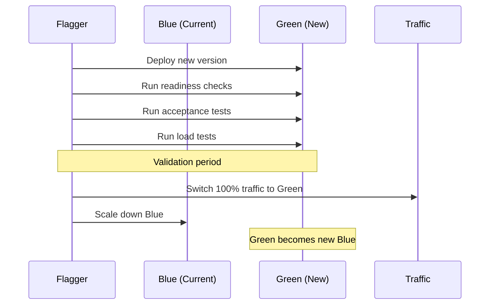

# How to Configure Blue-Green Deployments with Flagger and Flux

Author: [nawazdhandala](https://github.com/nawazdhandala)

Tags: Flagger, Flux CD, Blue-Green Deployment, Progressive Delivery, Kubernetes, GitOps, Zero Downtime

Description: A practical guide to configuring blue-green deployments with Flagger and Flux CD for zero-downtime releases with instant traffic switching.

---

## Introduction

Blue-green deployments maintain two identical environments: a "blue" environment running the current production version and a "green" environment running the new version. Once the green environment passes all health checks and tests, traffic is instantly switched from blue to green. Unlike canary deployments that gradually shift traffic, blue-green switches all traffic at once after validation.

Flagger automates blue-green deployments by managing the creation of the green environment, running tests against it, and switching traffic when everything passes.

## Prerequisites

- A running Kubernetes cluster (v1.26 or later)
- Flux CD installed and bootstrapped
- Flagger installed with a supported mesh provider
- Prometheus for metrics collection
- kubectl configured to access your cluster

## How Blue-Green Deployments Work



## Step 1: Deploy the Application

Create the base deployment that Flagger will manage in blue-green mode.

```yaml
# apps/webapp/namespace.yaml
apiVersion: v1
kind: Namespace
metadata:
  name: webapp
```

```yaml
# apps/webapp/deployment.yaml
# The target deployment - Flagger will create blue and green versions
apiVersion: apps/v1
kind: Deployment
metadata:
  name: webapp
  namespace: webapp
  labels:
    app: webapp
spec:
  replicas: 3
  selector:
    matchLabels:
      app: webapp
  template:
    metadata:
      labels:
        app: webapp
      annotations:
        prometheus.io/scrape: "true"
        prometheus.io/port: "9797"
    spec:
      containers:
        - name: webapp
          image: ghcr.io/stefanprodan/podinfo:6.5.0
          ports:
            - containerPort: 9898
              name: http
            - containerPort: 9797
              name: metrics
          readinessProbe:
            httpGet:
              path: /readyz
              port: 9898
            initialDelaySeconds: 5
            periodSeconds: 10
          livenessProbe:
            httpGet:
              path: /healthz
              port: 9898
            initialDelaySeconds: 5
            periodSeconds: 10
          resources:
            requests:
              cpu: 100m
              memory: 64Mi
            limits:
              cpu: 250m
              memory: 128Mi
```

```yaml
# apps/webapp/service.yaml
# Service for the application
apiVersion: v1
kind: Service
metadata:
  name: webapp
  namespace: webapp
spec:
  selector:
    app: webapp
  ports:
    - port: 80
      targetPort: 9898
      name: http
  type: ClusterIP
```

## Step 2: Create the Blue-Green Canary Resource

The key difference from a canary deployment is setting the analysis to use iterations instead of traffic weight stepping.

```yaml
# apps/webapp/canary.yaml
# Flagger Canary resource configured for blue-green deployment strategy
apiVersion: flagger.app/v1beta1
kind: Canary
metadata:
  name: webapp
  namespace: webapp
spec:
  # Reference to the deployment Flagger will manage
  targetRef:
    apiVersion: apps/v1
    kind: Deployment
    name: webapp

  # Autoscaler reference (optional)
  autoscalerRef:
    apiVersion: autoscaling/v2
    kind: HorizontalPodAutoscaler
    name: webapp

  # Service configuration for blue-green
  service:
    port: 9898
    targetPort: 9898

  # Blue-green analysis configuration
  analysis:
    # How often to run the analysis
    interval: 1m
    # Number of failed checks before rollback
    threshold: 3
    # Number of successful iterations before promotion
    # This is the key setting for blue-green: use iterations instead of weights
    iterations: 10

    # Metric checks during the validation period
    metrics:
      # Ensure the success rate of the green version is above 99%
      - name: request-success-rate
        thresholdRange:
          min: 99
        interval: 1m
      # Ensure P99 latency is below 500ms
      - name: request-duration
        thresholdRange:
          max: 500
        interval: 1m

    # Webhooks for testing the green version
    webhooks:
      # Pre-rollout: acceptance test before routing any traffic
      - name: acceptance-test
        type: pre-rollout
        url: http://flagger-loadtester.flagger-system/
        timeout: 30s
        metadata:
          type: bash
          cmd: "curl -sd 'test' http://webapp-canary.webapp:9898/token | grep token"

      # Rollout: generate load during the validation period
      - name: load-test
        type: rollout
        url: http://flagger-loadtester.flagger-system/
        timeout: 5s
        metadata:
          type: cmd
          cmd: "hey -z 1m -q 10 -c 2 http://webapp-canary.webapp:9898/"
          logCmdOutput: "true"

      # Post-rollout: run smoke tests after promotion
      - name: smoke-test
        type: post-rollout
        url: http://flagger-loadtester.flagger-system/
        timeout: 30s
        metadata:
          type: bash
          cmd: "curl -s http://webapp.webapp:9898/healthz | grep ok"

    # Alert on deployment events
    alerts:
      - name: slack
        severity: info
        providerRef:
          name: slack
```

## Step 3: Create the HPA

```yaml
# apps/webapp/hpa.yaml
# Horizontal Pod Autoscaler for the application
apiVersion: autoscaling/v2
kind: HorizontalPodAutoscaler
metadata:
  name: webapp
  namespace: webapp
spec:
  scaleTargetRef:
    apiVersion: apps/v1
    kind: Deployment
    name: webapp
  minReplicas: 3
  maxReplicas: 10
  metrics:
    - type: Resource
      resource:
        name: cpu
        target:
          type: Utilization
          averageUtilization: 80
```

## Step 4: Configure the Alert Provider

```yaml
# apps/webapp/alert-provider.yaml
# Slack notifications for blue-green deployment events
apiVersion: flagger.app/v1beta1
kind: AlertProvider
metadata:
  name: slack
  namespace: webapp
spec:
  type: slack
  channel: deployments
  secretRef:
    name: slack-webhook
---
apiVersion: v1
kind: Secret
metadata:
  name: slack-webhook
  namespace: webapp
type: Opaque
stringData:
  address: https://hooks.slack.com/services/YOUR/SLACK/WEBHOOK
```

## Step 5: Set Up Flux Kustomization

```yaml
# apps/webapp/kustomization.yaml
apiVersion: kustomize.config.k8s.io/v1beta1
kind: Kustomization
resources:
  - namespace.yaml
  - deployment.yaml
  - service.yaml
  - hpa.yaml
  - canary.yaml
  - alert-provider.yaml
```

```yaml
# clusters/my-cluster/webapp.yaml
# Flux Kustomization for the webapp with blue-green deployments
apiVersion: kustomize.toolkit.fluxcd.io/v1
kind: Kustomization
metadata:
  name: webapp
  namespace: flux-system
spec:
  interval: 5m
  sourceRef:
    kind: GitRepository
    name: flux-system
  path: ./apps/webapp
  prune: true
  wait: true
  timeout: 5m
```

## Step 6: Understand What Flagger Creates

When the Canary resource is applied, Flagger creates several resources automatically. Understanding these helps with debugging.

```bash
# After applying, Flagger creates these resources:
# 1. webapp-primary (Deployment) - the current stable version
# 2. webapp (Deployment) - scaled to zero, acts as the template
# 3. webapp-primary (Service) - routes to the primary deployment
# 4. webapp-canary (Service) - routes to the green deployment during testing

# View the resources Flagger created
kubectl get deployments -n webapp
# NAME              READY   UP-TO-DATE   AVAILABLE
# webapp            0/0     0            0
# webapp-primary    3/3     3            3

kubectl get services -n webapp
# NAME              TYPE        CLUSTER-IP      PORT(S)
# webapp            ClusterIP   10.96.100.1     80/TCP
# webapp-primary    ClusterIP   10.96.100.2     9898/TCP
# webapp-canary     ClusterIP   10.96.100.3     9898/TCP
```

## Step 7: Trigger a Blue-Green Deployment

Update the image tag in Git to trigger the blue-green deployment.

```bash
# Update the image to a new version
cd k8s-manifests
sed -i 's|podinfo:6.5.0|podinfo:6.6.0|' apps/webapp/deployment.yaml
git add . && git commit -m "Update webapp to 6.6.0" && git push
```

Monitor the blue-green deployment:

```bash
# Watch the canary status
kubectl get canary webapp -n webapp --watch

# Expected output:
# NAME    STATUS        WEIGHT   LASTTRANSITIONTIME
# webapp  Initializing  0        2026-03-06T10:00:00Z
# webapp  Progressing   0        2026-03-06T10:01:00Z
# webapp  Progressing   0        2026-03-06T10:02:00Z
# ...     (iterations continue at weight 0)
# webapp  Promoting     0        2026-03-06T10:11:00Z
# webapp  Finalising    0        2026-03-06T10:12:00Z
# webapp  Succeeded     0        2026-03-06T10:13:00Z

# Note: weight stays at 0 during blue-green because traffic is not gradually shifted.
# Instead, the green deployment is tested in isolation, then traffic switches instantly.

# Check detailed events
kubectl describe canary webapp -n webapp
```

## Step 8: Blue-Green with Manual Gating

For critical applications, you may want manual approval before the traffic switch.

```yaml
# apps/webapp/canary-gated.yaml
# Blue-green canary with manual gate
apiVersion: flagger.app/v1beta1
kind: Canary
metadata:
  name: webapp
  namespace: webapp
spec:
  targetRef:
    apiVersion: apps/v1
    kind: Deployment
    name: webapp
  service:
    port: 9898
    targetPort: 9898
  analysis:
    interval: 1m
    threshold: 3
    iterations: 10
    # Require manual confirmation before promoting
    match:
      - headers:
          x-canary:
            exact: "true"
    metrics:
      - name: request-success-rate
        thresholdRange:
          min: 99
        interval: 1m
    webhooks:
      # Gate webhook - Flagger will call this before promotion
      - name: promotion-gate
        type: confirm-promotion
        url: http://flagger-loadtester.flagger-system/gate/check
      # Rollback gate - confirm before rolling back
      - name: rollback-gate
        type: confirm-rollback
        url: http://flagger-loadtester.flagger-system/gate/check
```

To approve the promotion:

```bash
# Open the gate (approve promotion)
kubectl exec -n flagger-system deployment/flagger-loadtester -- \
  curl -s -X POST http://localhost:8080/gate/open

# Close the gate (block promotion)
kubectl exec -n flagger-system deployment/flagger-loadtester -- \
  curl -s -X POST http://localhost:8080/gate/close
```

## Step 9: Test the Green Environment Before Switching

During a blue-green deployment, you can test the green environment directly:

```bash
# Access the green (canary) version directly via the canary service
kubectl port-forward svc/webapp-canary -n webapp 8080:9898 &

# Run manual tests against the green version
curl http://localhost:8080/healthz
curl http://localhost:8080/api/info

# Or use header-based routing (if configured with match headers)
curl -H "x-canary: true" http://webapp.example.com/
```

## Troubleshooting

### Deployment Stuck in Progressing

If the canary stays in Progressing state, check the iterations:

```bash
# Check canary status details
kubectl get canary webapp -n webapp -o yaml | grep -A 20 status

# Check Flagger logs for analysis results
kubectl logs -n flagger-system deployment/flagger | grep webapp
```

### Green Pods Not Starting

If the green deployment pods are not becoming ready:

```bash
# Check the canary deployment pods
kubectl get pods -n webapp -l app=webapp
kubectl describe pod -n webapp -l app=webapp,role=canary
```

### Rollback Triggered Unexpectedly

Check which metric failed:

```bash
# Flagger logs show which metric caused the rollback
kubectl logs -n flagger-system deployment/flagger | grep -E "webapp.*failed|webapp.*threshold"

# Verify metrics in Prometheus
kubectl port-forward svc/prometheus-server -n monitoring 9090:80 &
# Query the relevant metrics in the Prometheus UI
```

## Blue-Green vs Canary: When to Use Which

| Aspect | Blue-Green | Canary |
|--------|-----------|--------|
| Traffic switching | Instant (all at once) | Gradual (percentage-based) |
| Resource usage | Higher (two full environments) | Lower (small canary) |
| Risk | Higher per switch | Lower due to gradual rollout |
| Testing | Full load testing possible | Tested with real traffic |
| Rollback speed | Instant | Instant |
| Best for | Database migrations, breaking changes | Incremental feature releases |

## Summary

You now have blue-green deployments configured with Flagger and Flux CD. When you update the container image in Git, Flagger creates a green environment, runs tests against it for a configured number of iterations, and then instantly switches all traffic from blue to green. If any metric check fails during the validation period, the green environment is discarded and traffic stays on the blue environment. This approach gives you the safety of pre-production testing with the simplicity of a single traffic switch.
