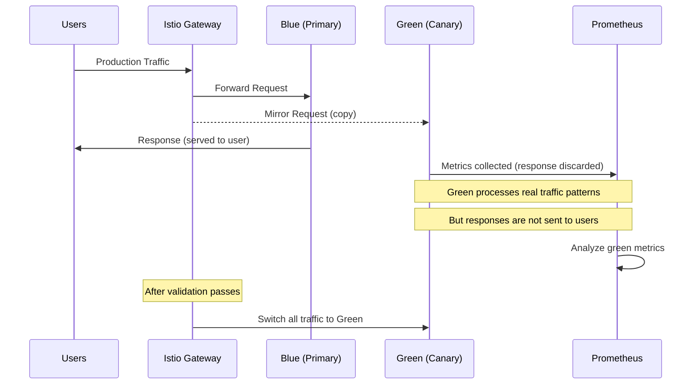

# How to Configure Blue-Green Mirroring with Flagger and Flux

Author: [nawazdhandala](https://github.com/nawazdhandala)

Tags: Flagger, Flux CD, Blue-green mirroring, Traffic Mirroring, Progressive Delivery, Kubernetes, GitOps, Istio

Description: A step-by-step guide to configuring blue-green deployments with traffic mirroring using Flagger and Flux CD for risk-free production testing.

---

## Introduction

Blue-green mirroring combines blue-green deployments with traffic mirroring (also called traffic shadowing). In this strategy, production traffic is mirrored to the green environment in real time. The mirrored traffic generates real-world load on the new version without affecting users, because the responses from the green environment are discarded. Once the green version proves stable under real production traffic patterns, Flagger switches traffic to it.

This approach is particularly valuable for testing performance under realistic conditions without any user impact.

## Prerequisites

- A running Kubernetes cluster (v1.26 or later)
- Flux CD installed and bootstrapped
- Flagger installed with Istio as the mesh provider (mirroring requires Istio)
- Istio service mesh installed and configured
- Prometheus for metrics collection
- kubectl configured to access your cluster

## How Blue-Green Mirroring Works



## Step 1: Verify Istio Installation

Blue-green mirroring requires Istio. Verify it is running.

```bash
# Check Istio components
kubectl get pods -n istio-system

# Verify Istio version (mirroring is supported in Istio 1.10+)
istioctl version

# Ensure the namespace has Istio sidecar injection enabled
kubectl get namespace default --show-labels | grep istio-injection
```

## Step 2: Create the Application Namespace

```yaml
# apps/api-service/namespace.yaml
# Namespace with Istio sidecar injection enabled
apiVersion: v1
kind: Namespace
metadata:
  name: api-service
  labels:
    istio-injection: enabled
```

## Step 3: Deploy the Application

```yaml
# apps/api-service/deployment.yaml
# The target deployment for blue-green mirroring
apiVersion: apps/v1
kind: Deployment
metadata:
  name: api-service
  namespace: api-service
  labels:
    app: api-service
spec:
  replicas: 3
  selector:
    matchLabels:
      app: api-service
  template:
    metadata:
      labels:
        app: api-service
      annotations:
        prometheus.io/scrape: "true"
        prometheus.io/port: "9797"
    spec:
      containers:
        - name: api-service
          image: ghcr.io/stefanprodan/podinfo:6.5.0
          ports:
            - containerPort: 9898
              name: http
            - containerPort: 9797
              name: metrics
          command:
            - ./podinfo
            - --port=9898
            - --port-metrics=9797
            - --level=info
          readinessProbe:
            httpGet:
              path: /readyz
              port: 9898
            initialDelaySeconds: 5
            periodSeconds: 10
          livenessProbe:
            httpGet:
              path: /healthz
              port: 9898
            initialDelaySeconds: 5
            periodSeconds: 10
          resources:
            requests:
              cpu: 100m
              memory: 64Mi
            limits:
              cpu: 500m
              memory: 256Mi
```

```yaml
# apps/api-service/hpa.yaml
apiVersion: autoscaling/v2
kind: HorizontalPodAutoscaler
metadata:
  name: api-service
  namespace: api-service
spec:
  scaleTargetRef:
    apiVersion: apps/v1
    kind: Deployment
    name: api-service
  minReplicas: 3
  maxReplicas: 10
  metrics:
    - type: Resource
      resource:
        name: cpu
        target:
          type: Utilization
          averageUtilization: 80
```

## Step 4: Create the Istio Gateway

```yaml
# apps/api-service/gateway.yaml
# Istio Gateway for the API service
apiVersion: networking.istio.io/v1
kind: Gateway
metadata:
  name: api-gateway
  namespace: api-service
spec:
  selector:
    istio: ingressgateway
  servers:
    - port:
        number: 80
        name: http
        protocol: HTTP
      hosts:
        - api.example.com
    - port:
        number: 443
        name: https
        protocol: HTTPS
      hosts:
        - api.example.com
      tls:
        mode: SIMPLE
        credentialName: api-tls-cert
```

## Step 5: Configure the Blue-Green Mirroring Canary

This is the core configuration. The `mirror: true` setting enables traffic mirroring, and `mirrorWeight: 100` mirrors all traffic.

```yaml
# apps/api-service/canary.yaml
# Flagger Canary configured for blue-green with traffic mirroring
apiVersion: flagger.app/v1beta1
kind: Canary
metadata:
  name: api-service
  namespace: api-service
spec:
  # Target deployment
  targetRef:
    apiVersion: apps/v1
    kind: Deployment
    name: api-service

  # Autoscaler reference
  autoscalerRef:
    apiVersion: autoscaling/v2
    kind: HorizontalPodAutoscaler
    name: api-service

  # Istio service configuration
  service:
    port: 9898
    targetPort: 9898
    # Istio gateway references
    gateways:
      - api-gateway
    hosts:
      - api.example.com
    # Istio traffic policy
    trafficPolicy:
      tls:
        mode: ISTIO_MUTUAL
    # Retries configuration for the primary
    retries:
      attempts: 3
      perTryTimeout: 1s
      retryOn: "gateway-error,connect-failure,refused-stream"

  # Blue-green mirroring analysis configuration
  analysis:
    # Check interval
    interval: 1m
    # Number of failed checks before rollback
    threshold: 5
    # Use iterations for blue-green (not stepWeight/maxWeight)
    iterations: 10

    # Enable traffic mirroring to the green version
    # This is the key configuration for blue-green mirroring
    mirror: true
    # Percentage of traffic to mirror (100 = all traffic)
    mirrorWeight: 100

    # Metrics to evaluate on the mirrored traffic
    metrics:
      # Success rate of the green version processing mirrored traffic
      - name: request-success-rate
        thresholdRange:
          min: 99
        interval: 1m

      # Latency of the green version under mirrored load
      - name: request-duration
        thresholdRange:
          max: 500
        interval: 1m

      # Custom metric: compare green latency to primary latency
      - name: latency-comparison
        templateRef:
          name: latency-comparison
          namespace: api-service
        thresholdRange:
          # Green should not be more than 20% slower than primary
          max: 1.2
        interval: 1m

    # Webhooks
    webhooks:
      # Pre-rollout: verify the green version is healthy before mirroring
      - name: acceptance-test
        type: pre-rollout
        url: http://flagger-loadtester.flagger-system/
        timeout: 30s
        metadata:
          type: bash
          cmd: "curl -sd 'test' http://api-service-canary.api-service:9898/token | grep token"

      # During rollout: generate additional load if needed
      - name: load-test
        type: rollout
        url: http://flagger-loadtester.flagger-system/
        timeout: 5s
        metadata:
          type: cmd
          cmd: "hey -z 1m -q 10 -c 2 http://api-service-canary.api-service:9898/"
          logCmdOutput: "true"

      # Confirm promotion manually (optional)
      - name: confirm-promotion
        type: confirm-promotion
        url: http://flagger-loadtester.flagger-system/gate/check

    # Alerts
    alerts:
      - name: slack
        severity: info
        providerRef:
          name: slack
```

## Step 6: Create Custom Metric Templates for Mirroring

Define metrics that compare the green version's performance against the primary.

```yaml
# apps/api-service/metric-templates.yaml
# Compare latency between primary and canary (green)
apiVersion: flagger.app/v1beta1
kind: MetricTemplate
metadata:
  name: latency-comparison
  namespace: api-service
spec:
  provider:
    type: prometheus
    address: http://prometheus.istio-system:9090
  query: |
    # Ratio of canary P99 latency to primary P99 latency
    # A value > 1 means canary is slower
    (
      histogram_quantile(0.99,
        sum(rate(istio_request_duration_milliseconds_bucket{
          destination_workload_namespace="{{ namespace }}",
          destination_workload="{{ target }}-canary"
        }[{{ interval }}])) by (le)
      )
    )
    /
    (
      histogram_quantile(0.99,
        sum(rate(istio_request_duration_milliseconds_bucket{
          destination_workload_namespace="{{ namespace }}",
          destination_workload="{{ target }}-primary"
        }[{{ interval }}])) by (le)
      )
    )
---
# Error rate specifically for mirrored traffic
apiVersion: flagger.app/v1beta1
kind: MetricTemplate
metadata:
  name: mirror-error-rate
  namespace: api-service
spec:
  provider:
    type: prometheus
    address: http://prometheus.istio-system:9090
  query: |
    sum(rate(istio_requests_total{
      destination_workload_namespace="{{ namespace }}",
      destination_workload="{{ target }}-canary",
      response_code=~"5.*"
    }[{{ interval }}]))
    /
    sum(rate(istio_requests_total{
      destination_workload_namespace="{{ namespace }}",
      destination_workload="{{ target }}-canary"
    }[{{ interval }}])) * 100
---
# Throughput comparison to ensure green handles the same load
apiVersion: flagger.app/v1beta1
kind: MetricTemplate
metadata:
  name: throughput-comparison
  namespace: api-service
spec:
  provider:
    type: prometheus
    address: http://prometheus.istio-system:9090
  query: |
    sum(rate(istio_requests_total{
      destination_workload_namespace="{{ namespace }}",
      destination_workload="{{ target }}-canary"
    }[{{ interval }}]))
```

## Step 7: Set Up the Alert Provider

```yaml
# apps/api-service/alert-provider.yaml
apiVersion: flagger.app/v1beta1
kind: AlertProvider
metadata:
  name: slack
  namespace: api-service
spec:
  type: slack
  channel: deployments
  secretRef:
    name: slack-webhook
---
apiVersion: v1
kind: Secret
metadata:
  name: slack-webhook
  namespace: api-service
type: Opaque
stringData:
  address: https://hooks.slack.com/services/YOUR/SLACK/WEBHOOK
```

## Step 8: Configure Flux Kustomization

```yaml
# apps/api-service/kustomization.yaml
apiVersion: kustomize.config.k8s.io/v1beta1
kind: Kustomization
resources:
  - namespace.yaml
  - deployment.yaml
  - hpa.yaml
  - gateway.yaml
  - canary.yaml
  - metric-templates.yaml
  - alert-provider.yaml
```

```yaml
# clusters/my-cluster/api-service.yaml
apiVersion: kustomize.toolkit.fluxcd.io/v1
kind: Kustomization
metadata:
  name: api-service
  namespace: flux-system
spec:
  interval: 5m
  sourceRef:
    kind: GitRepository
    name: flux-system
  path: ./apps/api-service
  prune: true
  wait: true
  timeout: 5m
```

## Step 9: Trigger and Monitor a Blue-Green Mirroring Deployment

Update the image tag to trigger the deployment.

```bash
# Update the image
cd k8s-manifests
sed -i 's|podinfo:6.5.0|podinfo:6.6.0|' apps/api-service/deployment.yaml
git add . && git commit -m "Update api-service to 6.6.0 with mirroring" && git push
```

Monitor the deployment:

```bash
# Watch the canary status
kubectl get canary api-service -n api-service --watch

# Expected output:
# NAME          STATUS        WEIGHT   LASTTRANSITIONTIME
# api-service   Initializing  0        2026-03-06T10:00:00Z
# api-service   Progressing   0        2026-03-06T10:01:00Z
# api-service   Progressing   0        2026-03-06T10:02:00Z
# ...
# api-service   Promoting     0        2026-03-06T10:11:00Z
# api-service   Succeeded     0        2026-03-06T10:12:00Z

# Verify mirroring is active by checking the Istio VirtualService
kubectl get virtualservice api-service -n api-service -o yaml
# Look for the "mirror" field in the VirtualService spec

# Check that mirrored traffic is hitting the green pods
kubectl logs -l app=api-service -n api-service --tail=20

# View Istio metrics for mirrored traffic
kubectl port-forward svc/prometheus -n istio-system 9090:9090 &
# Query: istio_requests_total{destination_workload="api-service-canary"}
```

Approve the promotion (if manual gating is enabled):

```bash
# Open the gate to approve promotion
kubectl exec -n flagger-system deployment/flagger-loadtester -- \
  curl -s -X POST http://localhost:8080/gate/open
```

## Step 10: Verify the Virtual Service Configuration

During mirroring, Istio's VirtualService will show the mirroring configuration:

```bash
# Check the VirtualService Flagger created
kubectl get virtualservice api-service -n api-service -o yaml
```

The VirtualService will contain a `mirror` section like this:

```yaml
# This is what Flagger generates during the mirroring phase
spec:
  hosts:
    - api.example.com
  gateways:
    - api-gateway
  http:
    - route:
        # All user traffic goes to the primary (blue)
        - destination:
            host: api-service-primary
            port:
              number: 9898
          weight: 100
      # Traffic is mirrored to the canary (green)
      mirror:
        host: api-service-canary
        port:
          number: 9898
      mirrorPercentage:
        value: 100.0
```

## Troubleshooting

### Mirrored Traffic Not Reaching Green Pods

Verify the Istio VirtualService has the mirror configuration:

```bash
kubectl get virtualservice -n api-service -o yaml | grep -A 5 mirror

# Check that the canary service has endpoints
kubectl get endpoints api-service-canary -n api-service

# Check Istio proxy logs for mirroring activity
kubectl logs -l app=api-service -c istio-proxy -n api-service | grep mirror
```

### Green Version Overwhelmed by Mirrored Traffic

If the green pods cannot handle the full production load, reduce the mirror percentage:

```yaml
# Reduce mirror percentage in the canary spec
analysis:
  mirror: true
  mirrorWeight: 50  # Mirror only 50% of traffic
```

### Metrics Not Available for Green Version

Ensure Prometheus is scraping the green pods:

```bash
# Check if Istio metrics are being generated
kubectl exec -n api-service -c istio-proxy deployment/api-service-primary -- \
  curl -s localhost:15090/stats/prometheus | grep istio_requests_total
```

## Summary

You now have blue-green deployments with traffic mirroring configured using Flagger and Flux CD. When a new version is deployed, real production traffic is mirrored to the green environment, allowing you to validate performance under realistic conditions without any user impact. Flagger monitors the metrics from the mirrored traffic and promotes the green version only after it passes all checks. This is one of the safest progressive delivery strategies available, as users are never exposed to the new version until it has been proven under real production load.
