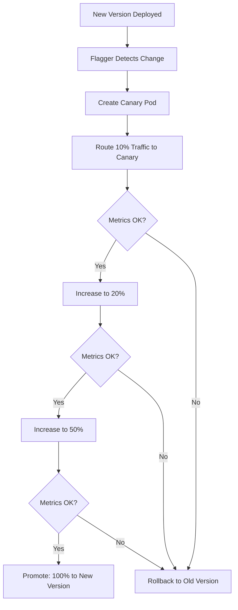

# How to Configure Canary Deployments with Flagger and Flux

Author: [nawazdhandala](https://github.com/nawazdhandala)

Tags: Flagger, Flux CD, Canary Deployment, Progressive Delivery, Kubernetes, GitOps, Traffic Shifting

Description: Learn how to configure automated canary deployments with Flagger and Flux CD to gradually roll out new versions with traffic shifting and metric analysis.

---

## Introduction

Canary deployments release a new version of your application to a small percentage of users first, then gradually increase the traffic while monitoring key metrics. If the metrics degrade, the deployment is automatically rolled back. Flagger automates this entire process when integrated with Flux CD.

This guide walks through configuring canary deployments from scratch, including metric templates, webhooks, and alerting.

## Prerequisites

- A running Kubernetes cluster (v1.26 or later)
- Flux CD installed and bootstrapped
- Flagger installed (see the Flagger installation guide)
- NGINX Ingress Controller or a service mesh (Istio, Linkerd)
- Prometheus for metrics collection
- kubectl configured to access your cluster

## How Canary Deployments Work



## Step 1: Deploy the Application

Create the base application deployment that Flagger will manage.

```yaml
# apps/podinfo/namespace.yaml
apiVersion: v1
kind: Namespace
metadata:
  name: podinfo
```

```yaml
# apps/podinfo/deployment.yaml
# The target deployment that Flagger will manage
# Flagger will create primary and canary versions of this deployment
apiVersion: apps/v1
kind: Deployment
metadata:
  name: podinfo
  namespace: podinfo
  labels:
    app: podinfo
spec:
  # Flagger will manage replicas, but set an initial value
  replicas: 3
  selector:
    matchLabels:
      app: podinfo
  template:
    metadata:
      labels:
        app: podinfo
      annotations:
        # Prometheus scraping annotations
        prometheus.io/scrape: "true"
        prometheus.io/port: "9797"
    spec:
      containers:
        - name: podinfo
          image: ghcr.io/stefanprodan/podinfo:6.5.0
          ports:
            - containerPort: 9898
              name: http
            - containerPort: 9797
              name: http-metrics
          command:
            - ./podinfo
            - --port=9898
            - --port-metrics=9797
            - --level=info
          readinessProbe:
            httpGet:
              path: /readyz
              port: 9898
            initialDelaySeconds: 5
            periodSeconds: 10
          livenessProbe:
            httpGet:
              path: /healthz
              port: 9898
            initialDelaySeconds: 5
            periodSeconds: 10
          resources:
            requests:
              cpu: 100m
              memory: 64Mi
            limits:
              cpu: 250m
              memory: 128Mi
```

```yaml
# apps/podinfo/hpa.yaml
# HPA for the application - Flagger will create HPAs for primary and canary
apiVersion: autoscaling/v2
kind: HorizontalPodAutoscaler
metadata:
  name: podinfo
  namespace: podinfo
spec:
  scaleTargetRef:
    apiVersion: apps/v1
    kind: Deployment
    name: podinfo
  minReplicas: 3
  maxReplicas: 10
  metrics:
    - type: Resource
      resource:
        name: cpu
        target:
          type: Utilization
          averageUtilization: 80
```

## Step 2: Create the Canary Resource

The Canary resource tells Flagger how to manage the progressive delivery of your application.

```yaml
# apps/podinfo/canary.yaml
# Flagger Canary resource defining the progressive delivery strategy
apiVersion: flagger.app/v1beta1
kind: Canary
metadata:
  name: podinfo
  namespace: podinfo
spec:
  # Reference to the target deployment
  targetRef:
    apiVersion: apps/v1
    kind: Deployment
    name: podinfo

  # Reference to the HPA (Flagger will manage scaling)
  autoscalerRef:
    apiVersion: autoscaling/v2
    kind: HorizontalPodAutoscaler
    name: podinfo

  # Ingress reference for traffic shifting (NGINX)
  ingressRef:
    apiVersion: networking.k8s.io/v1
    kind: Ingress
    name: podinfo

  # Service configuration - Flagger creates primary and canary services
  service:
    port: 9898
    targetPort: 9898
    # Gateway API or Ingress annotations
    apex:
      annotations:
        nginx.ingress.kubernetes.io/canary-by-header: "x-canary"

  # Progressive delivery analysis configuration
  analysis:
    # How often to check metrics
    interval: 1m
    # Number of failed checks before rollback
    threshold: 5
    # Max traffic percentage to route to canary
    maxWeight: 50
    # Traffic percentage increase per step
    stepWeight: 10
    # Number of iterations at max weight before promotion
    iterations: 5

    # Metric checks for canary health
    metrics:
      # Check that the success rate stays above 99%
      - name: request-success-rate
        thresholdRange:
          min: 99
        interval: 1m

      # Check that latency stays below 500ms at the 99th percentile
      - name: request-duration
        thresholdRange:
          max: 500
        interval: 1m

    # Webhooks for load testing and validation
    webhooks:
      # Pre-rollout check - run before starting the canary
      - name: acceptance-test
        type: pre-rollout
        url: http://flagger-loadtester.flagger-system/
        timeout: 30s
        metadata:
          type: bash
          cmd: "curl -sd 'test' http://podinfo-canary.podinfo:9898/token | grep token"

      # Load test - generate traffic during the canary analysis
      - name: load-test
        type: rollout
        url: http://flagger-loadtester.flagger-system/
        timeout: 5s
        metadata:
          type: cmd
          cmd: "hey -z 1m -q 10 -c 2 http://podinfo-canary.podinfo:9898/"
          logCmdOutput: "true"
```

## Step 3: Create the Ingress for Traffic Shifting

Flagger uses the NGINX Ingress Controller's canary annotations for traffic shifting.

```yaml
# apps/podinfo/ingress.yaml
# Ingress for the application - Flagger will create a canary ingress
apiVersion: networking.k8s.io/v1
kind: Ingress
metadata:
  name: podinfo
  namespace: podinfo
  annotations:
    # NGINX ingress controller annotations
    nginx.ingress.kubernetes.io/rewrite-target: /
spec:
  ingressClassName: nginx
  rules:
    - host: podinfo.example.com
      http:
        paths:
          - path: /
            pathType: Prefix
            backend:
              service:
                name: podinfo
                port:
                  number: 9898
```

## Step 4: Create Custom Metric Templates

Define custom metric templates for more sophisticated canary analysis.

```yaml
# apps/podinfo/metric-templates.yaml
# Custom metric template for error rate based on Prometheus queries
apiVersion: flagger.app/v1beta1
kind: MetricTemplate
metadata:
  name: error-rate
  namespace: podinfo
spec:
  provider:
    type: prometheus
    address: http://prometheus-server.monitoring:80
  query: |
    100 - sum(
      rate(
        http_request_duration_seconds_count{
          kubernetes_namespace="{{ namespace }}",
          kubernetes_pod_name=~"{{ target }}-[0-9a-zA-Z]+(-[0-9a-zA-Z]+)",
          status!~"5.*"
        }[{{ interval }}]
      )
    )
    /
    sum(
      rate(
        http_request_duration_seconds_count{
          kubernetes_namespace="{{ namespace }}",
          kubernetes_pod_name=~"{{ target }}-[0-9a-zA-Z]+(-[0-9a-zA-Z]+)"
        }[{{ interval }}]
      )
    ) * 100
---
# Custom metric template for P99 latency
apiVersion: flagger.app/v1beta1
kind: MetricTemplate
metadata:
  name: latency-p99
  namespace: podinfo
spec:
  provider:
    type: prometheus
    address: http://prometheus-server.monitoring:80
  query: |
    histogram_quantile(0.99,
      sum(
        rate(
          http_request_duration_seconds_bucket{
            kubernetes_namespace="{{ namespace }}",
            kubernetes_pod_name=~"{{ target }}-[0-9a-zA-Z]+(-[0-9a-zA-Z]+)"
          }[{{ interval }}]
        )
      ) by (le)
    )
```

To use custom metrics in the Canary, reference them by name:

```yaml
# Add to the canary analysis.metrics section
metrics:
  - name: error-rate
    templateRef:
      name: error-rate
      namespace: podinfo
    thresholdRange:
      max: 1
    interval: 1m
  - name: latency-p99
    templateRef:
      name: latency-p99
      namespace: podinfo
    thresholdRange:
      max: 0.5
    interval: 1m
```

## Step 5: Set Up Alerts for Canary Events

Configure Flagger to send alerts when canary events occur.

```yaml
# apps/podinfo/alert-provider.yaml
# Slack alert provider for canary events
apiVersion: flagger.app/v1beta1
kind: AlertProvider
metadata:
  name: slack
  namespace: podinfo
spec:
  type: slack
  channel: deployments
  # Slack webhook URL stored in a secret
  secretRef:
    name: slack-webhook
---
# Secret containing the Slack webhook URL
apiVersion: v1
kind: Secret
metadata:
  name: slack-webhook
  namespace: podinfo
type: Opaque
stringData:
  address: https://hooks.slack.com/services/YOUR/SLACK/WEBHOOK
```

Add the alert reference to the Canary resource:

```yaml
# Add to the canary spec
spec:
  analysis:
    alerts:
      - name: slack
        severity: info
        providerRef:
          name: slack
          namespace: podinfo
```

## Step 6: Configure Flux to Manage the Canary

Set up the Flux Kustomization for the application with Flagger canary resources.

```yaml
# apps/podinfo/kustomization.yaml
apiVersion: kustomize.config.k8s.io/v1beta1
kind: Kustomization
resources:
  - namespace.yaml
  - deployment.yaml
  - hpa.yaml
  - ingress.yaml
  - canary.yaml
  - metric-templates.yaml
  - alert-provider.yaml
```

```yaml
# clusters/my-cluster/podinfo.yaml
# Flux Kustomization for the podinfo application with Flagger
apiVersion: kustomize.toolkit.fluxcd.io/v1
kind: Kustomization
metadata:
  name: podinfo
  namespace: flux-system
spec:
  interval: 5m
  sourceRef:
    kind: GitRepository
    name: flux-system
  path: ./apps/podinfo
  prune: true
  wait: true
  timeout: 5m
```

## Step 7: Trigger a Canary Deployment

To trigger a canary deployment, update the container image tag in Git.

```bash
# Update the image tag to trigger a canary
cd k8s-manifests
sed -i 's|podinfo:6.5.0|podinfo:6.6.0|' apps/podinfo/deployment.yaml
git add . && git commit -m "Update podinfo to 6.6.0" && git push
```

Monitor the canary progress:

```bash
# Watch the canary status
kubectl get canary podinfo -n podinfo --watch

# Expected output progression:
# NAME      STATUS        WEIGHT   LASTTRANSITIONTIME
# podinfo   Initializing  0        2026-03-06T10:00:00Z
# podinfo   Progressing   10       2026-03-06T10:01:00Z
# podinfo   Progressing   20       2026-03-06T10:02:00Z
# podinfo   Progressing   30       2026-03-06T10:03:00Z
# podinfo   Progressing   40       2026-03-06T10:04:00Z
# podinfo   Progressing   50       2026-03-06T10:05:00Z
# podinfo   Promoting     0        2026-03-06T10:10:00Z
# podinfo   Succeeded     0        2026-03-06T10:11:00Z

# Check detailed canary events
kubectl describe canary podinfo -n podinfo

# View Flagger logs for this canary
kubectl logs -n flagger-system deployment/flagger | grep podinfo
```

## Step 8: Test a Rollback Scenario

Simulate a failed deployment to verify that rollback works.

```bash
# Deploy a version that returns errors
# (podinfo supports fault injection via command flags)
# Update the deployment to inject 50% errors
```

```yaml
# Temporarily update the deployment to simulate failures
spec:
  template:
    spec:
      containers:
        - name: podinfo
          image: ghcr.io/stefanprodan/podinfo:6.6.0
          command:
            - ./podinfo
            - --port=9898
            - --port-metrics=9797
            # Inject HTTP 500 errors for 50% of requests
            - --h2c
            - --random-error
```

Watch the canary fail and roll back:

```bash
# Watch the canary status - it should detect errors and roll back
kubectl get canary podinfo -n podinfo --watch

# Expected output:
# NAME      STATUS        WEIGHT   LASTTRANSITIONTIME
# podinfo   Progressing   10       2026-03-06T10:15:00Z
# podinfo   Progressing   10       2026-03-06T10:16:00Z
# podinfo   Failed        0        2026-03-06T10:20:00Z

# Check the events for failure details
kubectl describe canary podinfo -n podinfo | grep -A 10 "Events"
```

## Troubleshooting

### Canary Stuck in Initializing

If the Canary stays in Initializing state, check that the deployment and HPA exist:

```bash
kubectl get deployment podinfo -n podinfo
kubectl get hpa podinfo -n podinfo
kubectl describe canary podinfo -n podinfo
```

### Metrics Not Available

If Flagger reports metric errors, verify Prometheus connectivity:

```bash
# Check if Prometheus has the expected metrics
kubectl port-forward svc/prometheus-server -n monitoring 9090:80 &
curl -s 'http://localhost:9090/api/v1/query?query=http_request_duration_seconds_count' | jq .
```

### Load Tester Not Reachable

Verify the load tester service is running:

```bash
kubectl get pods -n flagger-system -l app=flagger-loadtester
kubectl get svc flagger-loadtester -n flagger-system
```

## Summary

You now have automated canary deployments configured with Flagger and Flux CD. Every time you update the container image tag in Git, Flagger automatically creates a canary, gradually shifts traffic while monitoring metrics, and either promotes or rolls back the deployment. This dramatically reduces the risk of bad deployments reaching all users.
