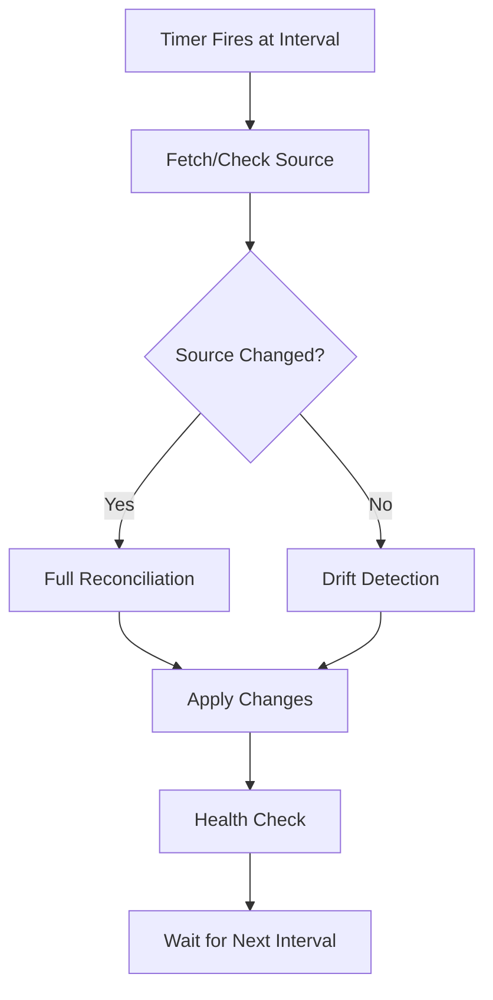

# How to Configure Efficient Reconciliation Intervals in Flux CD

Author: [nawazdhandala](https://github.com/nawazdhandala)

Tags: flux cd, kubernetes, gitops, reconciliation intervals, performance tuning, drift detection

Description: A practical guide to configuring reconciliation intervals in Flux CD to balance drift detection speed, resource consumption, and API server load.

---

Reconciliation intervals control how often Flux CD checks for changes and reapplies desired state. Intervals that are too short waste resources and overload the API server. Intervals that are too long delay deployments and drift detection. This guide helps you find the right balance for every type of Flux resource.

## How Reconciliation Intervals Work

Every Flux resource has an `interval` field that determines how frequently it is reconciled. The reconciliation cycle involves:

1. Checking if the source has changed (for source resources)
2. Computing the desired state
3. Comparing desired state with actual cluster state
4. Applying any differences
5. Running health checks



Even when nothing has changed, drift detection still makes API calls to compare desired and actual state. This means every reconciliation has a cost.

## Recommended Intervals by Resource Type

Different resource types have different optimal intervals based on their change frequency and importance.

### Source Resources

```yaml
# GitRepository - frequently changing application code
apiVersion: source.toolkit.fluxcd.io/v1
kind: GitRepository
metadata:
  name: app-source
  namespace: flux-system
spec:
  # Applications change frequently during business hours
  # 5m is a good balance between speed and resource usage
  interval: 5m
  url: https://github.com/org/app-manifests
  ref:
    branch: main
---
# GitRepository - stable infrastructure definitions
apiVersion: source.toolkit.fluxcd.io/v1
kind: GitRepository
metadata:
  name: infra-source
  namespace: flux-system
spec:
  # Infrastructure changes infrequently
  # 30m reduces source-controller load significantly
  interval: 30m
  url: https://github.com/org/infrastructure
  ref:
    branch: main
---
# HelmRepository - external chart repository
apiVersion: source.toolkit.fluxcd.io/v1
kind: HelmRepository
metadata:
  name: external-charts
  namespace: flux-system
spec:
  # External Helm repos update infrequently
  # Long interval avoids unnecessary index downloads
  interval: 6h
  url: https://charts.external.example.com
---
# HelmRepository - internal chart repository
apiVersion: source.toolkit.fluxcd.io/v1
kind: HelmRepository
metadata:
  name: internal-charts
  namespace: flux-system
spec:
  type: oci
  # Internal charts may update more frequently during releases
  interval: 30m
  url: oci://registry.internal.example.com/charts
```

### Kustomization Resources

```yaml
# Critical application - fast drift detection
apiVersion: kustomize.toolkit.fluxcd.io/v1
kind: Kustomization
metadata:
  name: payment-service
  namespace: flux-system
spec:
  # Critical services need fast drift correction
  interval: 5m
  # Quick retry on failures
  retryInterval: 1m
  path: ./apps/payment
  prune: true
  sourceRef:
    kind: GitRepository
    name: app-source
---
# Standard application - moderate interval
apiVersion: kustomize.toolkit.fluxcd.io/v1
kind: Kustomization
metadata:
  name: internal-tools
  namespace: flux-system
spec:
  # Internal tools can tolerate slightly longer intervals
  interval: 15m
  retryInterval: 3m
  path: ./apps/tools
  prune: true
  sourceRef:
    kind: GitRepository
    name: app-source
---
# CRD definitions - infrequent changes
apiVersion: kustomize.toolkit.fluxcd.io/v1
kind: Kustomization
metadata:
  name: crds
  namespace: flux-system
spec:
  # CRDs rarely change; 1 hour is sufficient
  interval: 1h
  retryInterval: 5m
  path: ./infrastructure/crds
  prune: false
  sourceRef:
    kind: GitRepository
    name: infra-source
---
# Cluster policies and RBAC - occasional changes
apiVersion: kustomize.toolkit.fluxcd.io/v1
kind: Kustomization
metadata:
  name: cluster-policies
  namespace: flux-system
spec:
  # Policies change occasionally but drift detection is important
  interval: 30m
  retryInterval: 5m
  path: ./infrastructure/policies
  prune: true
  sourceRef:
    kind: GitRepository
    name: infra-source
```

### HelmRelease Resources

```yaml
# Production HelmRelease with stable version
apiVersion: helm.toolkit.fluxcd.io/v2
kind: HelmRelease
metadata:
  name: production-app
  namespace: production
spec:
  # Pinned version, just need drift detection
  interval: 30m
  chart:
    spec:
      chart: my-app
      version: "2.1.0"
      sourceRef:
        kind: HelmRepository
        name: internal-charts
        namespace: flux-system
---
# Staging HelmRelease tracking latest
apiVersion: helm.toolkit.fluxcd.io/v2
kind: HelmRelease
metadata:
  name: staging-app
  namespace: staging
spec:
  # Staging needs faster updates
  interval: 5m
  chart:
    spec:
      chart: my-app
      version: ">=2.0.0"
      sourceRef:
        kind: HelmRepository
        name: internal-charts
        namespace: flux-system
```

## Using Webhooks to Supplement Long Intervals

Set long base intervals for resource efficiency, then use webhooks for immediate triggering on actual changes.

```yaml
# Long base interval supplemented by webhooks
apiVersion: source.toolkit.fluxcd.io/v1
kind: GitRepository
metadata:
  name: app-source
  namespace: flux-system
spec:
  # Long interval since webhooks handle immediate triggers
  interval: 1h
  url: https://github.com/org/app-manifests
  ref:
    branch: main
---
# Webhook receiver for immediate triggers on push events
apiVersion: notification.toolkit.fluxcd.io/v1
kind: Receiver
metadata:
  name: app-webhook
  namespace: flux-system
spec:
  type: github
  events:
    - "ping"
    - "push"
  secretRef:
    name: webhook-token
  resources:
    # Trigger immediate reconciliation on push
    - kind: GitRepository
      name: app-source
      namespace: flux-system
---
# Alert to notify on successful reconciliation
apiVersion: notification.toolkit.fluxcd.io/v1beta3
kind: Alert
metadata:
  name: app-reconciliation
  namespace: flux-system
spec:
  providerRef:
    name: slack-provider
  eventSeverity: info
  eventSources:
    - kind: Kustomization
      name: app-source
      namespace: flux-system
```

This pattern provides:
- Immediate response to actual changes (via webhook)
- Periodic drift detection (via interval)
- Lower resource consumption (long interval means fewer scheduled reconciliations)

## Configuring Retry Intervals

The `retryInterval` field controls how quickly Flux retries after a failed reconciliation. Set it shorter than the main interval.

```yaml
# Retry configuration for different criticality levels
apiVersion: kustomize.toolkit.fluxcd.io/v1
kind: Kustomization
metadata:
  name: critical-app
  namespace: flux-system
spec:
  interval: 10m
  # Retry quickly for critical apps
  retryInterval: 1m
  timeout: 5m
  path: ./apps/critical
  prune: true
  sourceRef:
    kind: GitRepository
    name: app-source
---
apiVersion: kustomize.toolkit.fluxcd.io/v1
kind: Kustomization
metadata:
  name: background-jobs
  namespace: flux-system
spec:
  interval: 30m
  # Longer retry for non-critical workloads
  retryInterval: 5m
  timeout: 10m
  path: ./apps/background
  prune: true
  sourceRef:
    kind: GitRepository
    name: app-source
```

## Calculating Resource Impact of Intervals

Estimate the API server load from your reconciliation configuration.

```yaml
# Example calculation for a cluster with:
# - 10 GitRepositories at 5m interval = 120 fetches/hour
# - 50 Kustomizations at 10m interval = 300 reconciliations/hour
# - 30 HelmReleases at 30m interval = 60 reconciliations/hour
# Total: ~480 reconciliation cycles per hour
#
# Each reconciliation makes roughly 5-20 API calls
# Estimated API load: 2,400 - 9,600 API calls/hour from Flux
#
# Compare with optimized intervals:
# - 10 GitRepositories at 1h interval + webhooks = 10 fetches/hour + on-demand
# - 50 Kustomizations at 30m interval = 100 reconciliations/hour
# - 30 HelmReleases at 1h interval = 30 reconciliations/hour
# Total: ~140 reconciliation cycles per hour (71% reduction)
```

## Monitoring Reconciliation Frequency

Track actual reconciliation rates to validate your interval configuration.

```yaml
# PrometheusRule for reconciliation rate monitoring
apiVersion: monitoring.coreos.com/v1
kind: PrometheusRule
metadata:
  name: flux-reconciliation-rate
  namespace: flux-system
spec:
  groups:
    - name: flux-intervals
      rules:
        # Track total reconciliation rate across all controllers
        - record: flux:reconciliation_rate:5m
          expr: |
            sum(rate(gotk_reconcile_duration_seconds_count[5m])) by (kind)

        # Alert when reconciliation rate is unexpectedly high
        - alert: FluxHighReconciliationRate
          expr: |
            sum(rate(gotk_reconcile_duration_seconds_count[5m])) > 5
          for: 10m
          labels:
            severity: warning
          annotations:
            summary: "Flux reconciliation rate is {{ $value }}/sec"
            description: "Check for resources with very short intervals or retry loops."

        # Alert when reconciliations are consistently failing and retrying
        - alert: FluxRetryLoop
          expr: |
            gotk_reconcile_condition{type="Ready", status="False"} == 1
          for: 30m
          labels:
            severity: warning
          annotations:
            summary: "{{ $labels.kind }}/{{ $labels.name }} stuck in retry loop"
```

Useful PromQL queries:

```promql
# Reconciliation rate per resource kind
sum(rate(gotk_reconcile_duration_seconds_count[1h])) by (kind)

# Resources with the highest reconciliation frequency
topk(10, rate(gotk_reconcile_duration_seconds_count[1h]))

# Average reconciliation duration per kind
avg(gotk_reconcile_duration_seconds_sum / gotk_reconcile_duration_seconds_count) by (kind)
```

## Summary

Guidelines for configuring efficient reconciliation intervals:

1. Use tiered intervals based on resource criticality and change frequency
2. Combine long intervals with webhook receivers for the best of both worlds
3. Set retry intervals shorter than main intervals for faster error recovery
4. GitRepositories for stable infrastructure: 30m to 1h
5. GitRepositories for active applications: 5m to 10m (or 1h with webhooks)
6. HelmRepositories: 1h to 6h depending on update frequency
7. Kustomizations: 5m for critical, 30m for standard, 1h for stable
8. Monitor reconciliation rates and adjust intervals based on actual load

The webhook-plus-long-interval pattern provides the best balance of responsiveness and efficiency. Prioritize setting this up before fine-tuning individual interval values.
