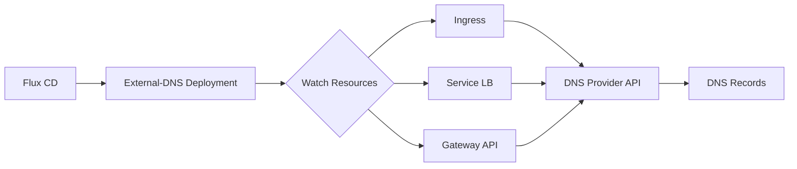

# How to Configure External-DNS with Flux CD

Author: [nawazdhandala](https://github.com/nawazdhandala)

Tags: flux cd, external-dns, kubernetes, gitops, networking, dns, route53, cloudflare

Description: A practical guide to deploying and configuring External-DNS in Kubernetes using Flux CD for automated DNS record management.

---

## Introduction

External-DNS is a Kubernetes add-on that automatically manages DNS records based on Ingress, Service, and other Kubernetes resources. It synchronizes exposed Kubernetes resources with DNS providers like AWS Route 53, Cloudflare, Google Cloud DNS, and many others. When combined with Flux CD, your DNS configuration becomes fully GitOps-driven, automatically creating and updating DNS records as services are deployed.

This guide walks through deploying External-DNS with Flux CD and configuring it for various DNS providers.

## Prerequisites

- A Kubernetes cluster (v1.24 or later)
- Flux CD installed and bootstrapped
- kubectl configured for your cluster
- A DNS zone managed by a supported DNS provider
- Appropriate cloud credentials for DNS management

## Architecture



## Adding the External-DNS Helm Repository

```yaml
# clusters/my-cluster/sources/external-dns-helmrepository.yaml
apiVersion: source.toolkit.fluxcd.io/v1
kind: HelmRepository
metadata:
  name: external-dns
  namespace: flux-system
spec:
  interval: 1h
  url: https://kubernetes-sigs.github.io/external-dns/
```

## Creating the Namespace and Credentials

```yaml
# clusters/my-cluster/namespaces/external-dns-namespace.yaml
apiVersion: v1
kind: Namespace
metadata:
  name: external-dns
  labels:
    toolkit.fluxcd.io/tenant: networking
```

### AWS Route 53 Credentials

For AWS, create a secret with your credentials, or use IRSA (IAM Roles for Service Accounts).

```yaml
# clusters/my-cluster/external-dns/aws-credentials.yaml
apiVersion: v1
kind: Secret
metadata:
  name: external-dns-aws
  namespace: external-dns
type: Opaque
stringData:
  credentials: |
    [default]
    aws_access_key_id = YOUR_ACCESS_KEY_ID
    aws_secret_access_key = YOUR_SECRET_ACCESS_KEY
```

Note: In production, use SOPS encryption with Flux CD to encrypt secrets in Git, or use IRSA for AWS.

### Cloudflare API Token

```yaml
# clusters/my-cluster/external-dns/cloudflare-credentials.yaml
apiVersion: v1
kind: Secret
metadata:
  name: external-dns-cloudflare
  namespace: external-dns
type: Opaque
stringData:
  CF_API_TOKEN: "your-cloudflare-api-token"
```

## Deploying External-DNS for AWS Route 53

```yaml
# clusters/my-cluster/helm-releases/external-dns-aws.yaml
apiVersion: helm.toolkit.fluxcd.io/v2
kind: HelmRelease
metadata:
  name: external-dns
  namespace: external-dns
spec:
  interval: 30m
  chart:
    spec:
      chart: external-dns
      version: "1.14.x"
      sourceRef:
        kind: HelmRepository
        name: external-dns
        namespace: flux-system
      interval: 12h
  values:
    # DNS provider
    provider:
      name: aws

    # AWS-specific configuration
    extraArgs:
      # Only manage records in these hosted zones
      - --aws-zone-type=public
      # Prevent accidental deletion
      - --policy=upsert-only
      # Filter by domain
      - --domain-filter=example.com
      # Use TXT records for ownership tracking
      - --txt-owner-id=my-cluster
      # Sync interval
      - --interval=1m

    # Sources to watch for DNS records
    sources:
      - ingress
      - service

    # Environment variables for AWS credentials
    env:
      - name: AWS_SHARED_CREDENTIALS_FILE
        value: /etc/aws/credentials

    # Mount AWS credentials
    extraVolumes:
      - name: aws-credentials
        secret:
          secretName: external-dns-aws
    extraVolumeMounts:
      - name: aws-credentials
        mountPath: /etc/aws
        readOnly: true

    # Resource limits
    resources:
      requests:
        cpu: 50m
        memory: 64Mi
      limits:
        cpu: 200m
        memory: 128Mi

    # Service account for IRSA (preferred over static credentials)
    serviceAccount:
      annotations:
        eks.amazonaws.com/role-arn: "arn:aws:iam::123456789012:role/external-dns"
```

## Deploying External-DNS for Cloudflare

```yaml
# clusters/my-cluster/helm-releases/external-dns-cloudflare.yaml
apiVersion: helm.toolkit.fluxcd.io/v2
kind: HelmRelease
metadata:
  name: external-dns
  namespace: external-dns
spec:
  interval: 30m
  chart:
    spec:
      chart: external-dns
      version: "1.14.x"
      sourceRef:
        kind: HelmRepository
        name: external-dns
        namespace: flux-system
      interval: 12h
  values:
    provider:
      name: cloudflare

    extraArgs:
      - --cloudflare-proxied
      - --domain-filter=example.com
      - --policy=sync
      - --txt-owner-id=my-cluster

    sources:
      - ingress
      - service

    env:
      - name: CF_API_TOKEN
        valueFrom:
          secretKeyRef:
            name: external-dns-cloudflare
            key: CF_API_TOKEN

    resources:
      requests:
        cpu: 50m
        memory: 64Mi
      limits:
        cpu: 200m
        memory: 128Mi
```

## Using External-DNS with Ingress Resources

External-DNS reads annotations and hostnames from Ingress resources to create DNS records.

```yaml
# apps/my-app/ingress.yaml
apiVersion: networking.k8s.io/v1
kind: Ingress
metadata:
  name: my-app-ingress
  namespace: default
  annotations:
    # External-DNS will create an A record for this hostname
    external-dns.alpha.kubernetes.io/hostname: app.example.com
    # Set the TTL for the DNS record
    external-dns.alpha.kubernetes.io/ttl: "300"
    # For Cloudflare, control proxy status
    external-dns.alpha.kubernetes.io/cloudflare-proxied: "true"
spec:
  ingressClassName: nginx
  rules:
    - host: app.example.com
      http:
        paths:
          - path: /
            pathType: Prefix
            backend:
              service:
                name: my-app-service
                port:
                  number: 80
```

## Using External-DNS with Services

```yaml
# apps/my-app/service.yaml
apiVersion: v1
kind: Service
metadata:
  name: my-app-lb
  namespace: default
  annotations:
    # Create a DNS record for the LoadBalancer
    external-dns.alpha.kubernetes.io/hostname: api.example.com
    external-dns.alpha.kubernetes.io/ttl: "60"
spec:
  type: LoadBalancer
  ports:
    - port: 80
      targetPort: 8080
  selector:
    app: my-app
```

## Using External-DNS with Gateway API

```yaml
# Update HelmRelease values to add gateway sources
spec:
  values:
    sources:
      - ingress
      - service
      - gateway-httproute
      - gateway-grpcroute
      - gateway-tlsroute
```

```yaml
# apps/my-app/httproute.yaml
apiVersion: gateway.networking.k8s.io/v1
kind: HTTPRoute
metadata:
  name: my-app-route
  namespace: default
spec:
  parentRefs:
    - name: main-gateway
  hostnames:
    # External-DNS will create a record for this hostname
    - "app.example.com"
  rules:
    - backendRefs:
        - name: my-app-service
          port: 80
```

## Flux Kustomization

```yaml
# clusters/my-cluster/external-dns-kustomization.yaml
apiVersion: kustomize.toolkit.fluxcd.io/v1
kind: Kustomization
metadata:
  name: external-dns
  namespace: flux-system
spec:
  interval: 10m
  sourceRef:
    kind: GitRepository
    name: flux-system
  path: ./clusters/my-cluster/external-dns
  prune: true
  # Decrypt SOPS-encrypted secrets
  decryption:
    provider: sops
    secretRef:
      name: sops-age
  healthChecks:
    - apiVersion: apps/v1
      kind: Deployment
      name: external-dns
      namespace: external-dns
  timeout: 5m
```

## Verifying DNS Records

```bash
# Check External-DNS logs to see created records
kubectl logs -n external-dns deploy/external-dns

# Verify DNS records via dig
dig app.example.com +short

# Check the External-DNS pod status
kubectl get pods -n external-dns

# Verify the HelmRelease
flux get helmreleases -n external-dns

# List TXT ownership records (used by External-DNS to track ownership)
dig TXT app.example.com +short
```

## Troubleshooting

```bash
# View detailed External-DNS logs
kubectl logs -n external-dns deploy/external-dns --follow

# Check for permission errors
kubectl logs -n external-dns deploy/external-dns | grep -i error

# Verify service account and IRSA annotation
kubectl get sa -n external-dns external-dns -o yaml

# Dry run to see what records would be created
# Add --dry-run flag to extraArgs in the HelmRelease
```

## Conclusion

External-DNS with Flux CD automates DNS record management as part of your GitOps workflow. When you deploy a new Ingress or Service, DNS records are automatically created and updated. When resources are removed, the corresponding DNS records are cleaned up. This eliminates manual DNS management and ensures your DNS configuration always matches your deployed services.
