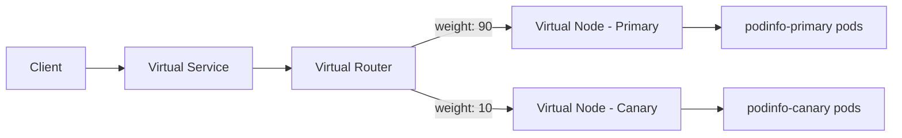

# How to Configure Flagger with AWS App Mesh and Flux

Author: [nawazdhandala](https://github.com/nawazdhandala)

Tags: flux, flagger, aws, app mesh, progressive delivery, canary, kubernetes, gitops, eks

Description: A comprehensive guide to setting up Flagger with AWS App Mesh and Flux for automated canary deployments on Amazon EKS.

---

**Note: AWS App Mesh has been deprecated by AWS and will be discontinued on September 30, 2026. New customers can no longer onboard to App Mesh as of September 24, 2024. AWS recommends migrating to Amazon VPC Lattice (for EKS workloads) or Amazon ECS Service Connect. The information below remains accurate for existing App Mesh users during the transition period.**

## Introduction

AWS App Mesh is a managed service mesh that provides application-level networking using the Envoy proxy. Flagger integrates with App Mesh to automate canary deployments by managing virtual nodes, virtual routers, and route weights. Combined with Flux for GitOps, you get a fully automated progressive delivery pipeline on AWS.

This guide walks you through setting up all components on Amazon EKS.

## Prerequisites

- An Amazon EKS cluster (v1.25 or later)
- kubectl configured for your EKS cluster
- AWS CLI configured with appropriate permissions
- Flux CLI installed
- The App Mesh Controller IAM permissions configured

## Step 1: Bootstrap Flux

```bash
flux bootstrap github \
  --owner=your-org \
  --repository=fleet-infra \
  --branch=main \
  --path=clusters/my-cluster \
  --personal
```

## Step 2: Install the AWS App Mesh Controller

The App Mesh Controller manages App Mesh resources in your cluster. Install it via Flux.

```yaml
# appmesh-helmrepository.yaml
apiVersion: source.toolkit.fluxcd.io/v1
kind: HelmRepository
metadata:
  name: eks-charts
  namespace: flux-system
spec:
  interval: 1h
  url: https://aws.github.io/eks-charts
```

```yaml
# appmesh-controller-helmrelease.yaml
apiVersion: helm.toolkit.fluxcd.io/v2
kind: HelmRelease
metadata:
  name: appmesh-controller
  namespace: appmesh-system
spec:
  interval: 1h
  chart:
    spec:
      chart: appmesh-controller
      version: "1.x"
      sourceRef:
        kind: HelmRepository
        name: eks-charts
        namespace: flux-system
  install:
    createNamespace: true
  values:
    region: us-east-1
    # Service account with IAM role for App Mesh access
    serviceAccount:
      create: true
      name: appmesh-controller
      annotations:
        eks.amazonaws.com/role-arn: arn:aws:iam::ACCOUNT_ID:role/appmesh-controller-role
    # Enable X-Ray tracing (optional)
    tracing:
      enabled: false
```

## Step 3: Create the App Mesh

Define the mesh resource that will contain all your service mesh configuration.

```yaml
# mesh.yaml
apiVersion: appmesh.k8s.aws/v1beta2
kind: Mesh
metadata:
  name: demo-mesh
spec:
  # Allow traffic from all namespaces
  namespaceSelector:
    matchLabels:
      appmesh.k8s.aws/sidecarInjectorWebhook: enabled
```

## Step 4: Install Prometheus

```yaml
# prometheus-helmrepository.yaml
apiVersion: source.toolkit.fluxcd.io/v1
kind: HelmRepository
metadata:
  name: prometheus-community
  namespace: flux-system
spec:
  interval: 1h
  url: https://prometheus-community.github.io/helm-charts
```

```yaml
# prometheus-helmrelease.yaml
apiVersion: helm.toolkit.fluxcd.io/v2
kind: HelmRelease
metadata:
  name: prometheus
  namespace: monitoring
spec:
  interval: 1h
  chart:
    spec:
      chart: prometheus
      version: "25.x"
      sourceRef:
        kind: HelmRepository
        name: prometheus-community
        namespace: flux-system
  install:
    createNamespace: true
  values:
    alertmanager:
      enabled: false
    prometheus-pushgateway:
      enabled: false
    server:
      persistentVolume:
        enabled: false
    # Scrape Envoy sidecar metrics from App Mesh
    extraScrapeConfigs: |
      - job_name: appmesh-envoy
        kubernetes_sd_configs:
          - role: pod
        relabel_configs:
          - source_labels: [__meta_kubernetes_pod_container_name]
            action: keep
            regex: envoy
          - source_labels: [__address__, __meta_kubernetes_pod_annotation_prometheus_io_port]
            action: replace
            regex: ([^:]+)(?::\d+)?;(\d+)
            replacement: ${1}:9901
            target_label: __address__
```

## Step 5: Install Flagger with App Mesh Provider

```yaml
# flagger-helmrepository.yaml
apiVersion: source.toolkit.fluxcd.io/v1
kind: HelmRepository
metadata:
  name: flagger
  namespace: flux-system
spec:
  interval: 1h
  url: https://flagger.app
```

```yaml
# flagger-helmrelease.yaml
apiVersion: helm.toolkit.fluxcd.io/v2
kind: HelmRelease
metadata:
  name: flagger
  namespace: flux-system
spec:
  interval: 1h
  chart:
    spec:
      chart: flagger
      version: "1.x"
      sourceRef:
        kind: HelmRepository
        name: flagger
        namespace: flux-system
  values:
    # Use AWS App Mesh as the provider
    meshProvider: "appmesh:v1beta2"
    metricsServer: http://prometheus-server.monitoring:80
```

## Step 6: Reconcile Infrastructure

```bash
git add -A && git commit -m "Add App Mesh, Prometheus, and Flagger"
git push
flux reconcile kustomization flux-system --with-source
```

## Step 7: Set Up the Application Namespace

The namespace must be labeled for App Mesh sidecar injection and associated with the mesh.

```yaml
# namespace.yaml
apiVersion: v1
kind: Namespace
metadata:
  name: demo
  labels:
    # Enable App Mesh sidecar injection
    appmesh.k8s.aws/sidecarInjectorWebhook: enabled
    # Associate with the mesh
    mesh: demo-mesh
```

## Step 8: Deploy the Application

```yaml
# deployment.yaml
apiVersion: apps/v1
kind: Deployment
metadata:
  name: podinfo
  namespace: demo
spec:
  replicas: 2
  selector:
    matchLabels:
      app: podinfo
  template:
    metadata:
      labels:
        app: podinfo
    spec:
      containers:
        - name: podinfo
          image: ghcr.io/stefanprodan/podinfo:6.3.0
          ports:
            - containerPort: 9898
              name: http
          resources:
            requests:
              cpu: 100m
              memory: 64Mi
```

```yaml
# service.yaml
apiVersion: v1
kind: Service
metadata:
  name: podinfo
  namespace: demo
spec:
  type: ClusterIP
  selector:
    app: podinfo
  ports:
    - name: http
      port: 9898
      targetPort: http
```

## Step 9: Create the Canary Resource

The Canary resource for App Mesh includes virtual node and virtual router configuration.

```yaml
# canary.yaml
apiVersion: flagger.app/v1beta1
kind: Canary
metadata:
  name: podinfo
  namespace: demo
spec:
  targetRef:
    apiVersion: apps/v1
    kind: Deployment
    name: podinfo
  service:
    port: 9898
    targetPort: http
    # App Mesh specific configuration
    meshName: demo-mesh
    # Backend services that this app can communicate with
    backends: []
    # Match incoming requests on specific headers (optional)
    match:
      - uri:
          prefix: /
    # Retry policy for failed requests
    retries:
      attempts: 3
      perTryTimeout: 1s
      retryOn: "gateway-error,connect-failure,refused-stream"
  analysis:
    interval: 30s
    threshold: 5
    maxWeight: 50
    stepWeight: 10
    metrics:
      - name: request-success-rate
        thresholdRange:
          min: 99
        interval: 1m
      - name: request-duration
        thresholdRange:
          max: 500
        interval: 1m
```

## Step 10: Deploy and Verify

```bash
git add -A && git commit -m "Add podinfo canary with App Mesh"
git push
flux reconcile kustomization flux-system --with-source
```

Verify the App Mesh resources were created:

```bash
# Check canary status
kubectl get canary -n demo

# Verify virtual nodes
kubectl get virtualnode -n demo

# Verify virtual router and routes
kubectl get virtualrouter -n demo
kubectl get virtualroute -n demo

# Verify virtual service
kubectl get virtualservice -n demo
```

## App Mesh Traffic Splitting Architecture



Flagger manages the virtual router route weights to gradually shift traffic to the canary version.

## Step 11: Trigger a Canary Release

```yaml
# Update image in deployment.yaml
spec:
  template:
    spec:
      containers:
        - name: podinfo
          image: ghcr.io/stefanprodan/podinfo:6.4.0
```

```bash
git add -A && git commit -m "Bump podinfo to 6.4.0"
git push
flux reconcile kustomization flux-system --with-source
```

## Step 12: Monitor the Rollout

```bash
# Watch canary events
kubectl describe canary podinfo -n demo

# Check virtual router weights
kubectl get virtualrouter podinfo -n demo -o yaml

# View Flagger logs
kubectl logs -f deploy/flagger -n flux-system
```

## Step 13: Add Custom Envoy Metrics for App Mesh

```yaml
# metric-template.yaml
apiVersion: flagger.app/v1beta1
kind: MetricTemplate
metadata:
  name: appmesh-error-rate
  namespace: demo
spec:
  provider:
    type: prometheus
    address: http://prometheus-server.monitoring:80
  query: |
    # Calculate error rate from App Mesh Envoy metrics
    sum(rate(
      envoy_cluster_upstream_rq{
        kubernetes_namespace="{{ namespace }}",
        kubernetes_pod_name=~"{{ target }}-canary-.*",
        envoy_response_code=~"5.*"
      }[{{ interval }}]
    )) /
    sum(rate(
      envoy_cluster_upstream_rq{
        kubernetes_namespace="{{ namespace }}",
        kubernetes_pod_name=~"{{ target }}-canary-.*"
      }[{{ interval }}]
    )) * 100
```

## Troubleshooting

### Sidecar not injected

Verify the namespace has the correct labels:

```bash
kubectl get ns demo --show-labels
```

Ensure the App Mesh controller webhook is running:

```bash
kubectl get pods -n appmesh-system
```

### Virtual node not created

Check Flagger logs for errors related to App Mesh resource creation:

```bash
kubectl logs deploy/flagger -n flux-system | grep -i "appmesh\|error"
```

### IAM permission errors

Ensure the App Mesh controller service account has the correct IAM role:

```bash
kubectl describe sa appmesh-controller -n appmesh-system
```

## Summary

You have configured Flagger with AWS App Mesh and Flux for automated canary deployments on EKS. This setup provides:

- AWS App Mesh for service mesh networking with Envoy sidecars
- Virtual nodes and virtual routers for traffic splitting
- Prometheus for collecting Envoy metrics from App Mesh sidecars
- Flagger for orchestrating progressive delivery
- Flux for GitOps-driven deployment management

This gives you a production-grade progressive delivery pipeline fully integrated with AWS services.
