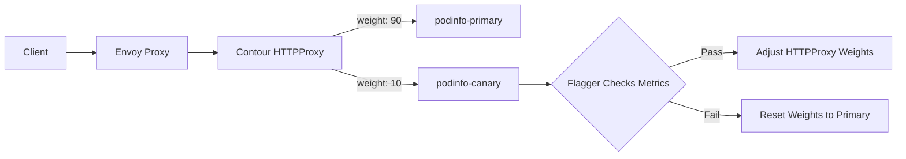

# How to Configure Flagger with Contour Ingress and Flux

Author: [nawazdhandala](https://github.com/nawazdhandala)

Tags: flux, flagger, contour, ingress, progressive delivery, canary, kubernetes, gitops, httpproxy

Description: A practical guide to configuring Flagger with Contour Ingress Controller and Flux for progressive canary deployments using HTTPProxy traffic splitting.

---

## Introduction

Contour is a Kubernetes ingress controller built on the Envoy proxy. It provides an HTTPProxy custom resource that supports advanced traffic management features including weighted routing. Flagger integrates with Contour to automate canary deployments by adjusting HTTPProxy weights during progressive delivery.

This guide covers the full setup of Contour, Flagger, and Flux working together for automated canary releases.

## Prerequisites

- A running Kubernetes cluster (v1.25 or later)
- kubectl configured for your cluster
- Flux CLI installed
- A Git repository for Flux configuration

## Step 1: Bootstrap Flux

```bash
flux bootstrap github \
  --owner=your-org \
  --repository=fleet-infra \
  --branch=main \
  --path=clusters/my-cluster \
  --personal
```

## Step 2: Install Contour via Flux

```yaml
# contour-helmrepository.yaml
apiVersion: source.toolkit.fluxcd.io/v1
kind: HelmRepository
metadata:
  name: bitnami
  namespace: flux-system
spec:
  interval: 1h
  url: https://charts.bitnami.com/bitnami
```

```yaml
# contour-helmrelease.yaml
apiVersion: helm.toolkit.fluxcd.io/v2
kind: HelmRelease
metadata:
  name: contour
  namespace: projectcontour
spec:
  interval: 1h
  chart:
    spec:
      chart: contour
      version: "17.x"
      sourceRef:
        kind: HelmRepository
        name: bitnami
        namespace: flux-system
  install:
    createNamespace: true
  values:
    # Enable Prometheus metrics on the Envoy proxy
    envoy:
      prometheus:
        enabled: true
    # Enable Contour metrics
    contour:
      prometheus:
        enabled: true
```

## Step 3: Install Prometheus

```yaml
# prometheus-helmrepository.yaml
apiVersion: source.toolkit.fluxcd.io/v1
kind: HelmRepository
metadata:
  name: prometheus-community
  namespace: flux-system
spec:
  interval: 1h
  url: https://prometheus-community.github.io/helm-charts
```

```yaml
# prometheus-helmrelease.yaml
apiVersion: helm.toolkit.fluxcd.io/v2
kind: HelmRelease
metadata:
  name: prometheus
  namespace: monitoring
spec:
  interval: 1h
  chart:
    spec:
      chart: prometheus
      version: "25.x"
      sourceRef:
        kind: HelmRepository
        name: prometheus-community
        namespace: flux-system
  install:
    createNamespace: true
  values:
    alertmanager:
      enabled: false
    prometheus-pushgateway:
      enabled: false
    server:
      persistentVolume:
        enabled: false
```

## Step 4: Install Flagger with Contour Provider

```yaml
# flagger-helmrepository.yaml
apiVersion: source.toolkit.fluxcd.io/v1
kind: HelmRepository
metadata:
  name: flagger
  namespace: flux-system
spec:
  interval: 1h
  url: https://flagger.app
```

```yaml
# flagger-helmrelease.yaml
apiVersion: helm.toolkit.fluxcd.io/v2
kind: HelmRelease
metadata:
  name: flagger
  namespace: flux-system
spec:
  interval: 1h
  chart:
    spec:
      chart: flagger
      version: "1.x"
      sourceRef:
        kind: HelmRepository
        name: flagger
        namespace: flux-system
  values:
    # Set Contour as the ingress provider
    meshProvider: contour
    # Point to Prometheus for metric analysis
    metricsServer: http://prometheus-server.monitoring:80
```

## Step 5: Push and Reconcile

```bash
git add -A && git commit -m "Add Contour, Prometheus, and Flagger"
git push
flux reconcile kustomization flux-system --with-source
```

Verify the installations:

```bash
kubectl get pods -n projectcontour
kubectl get pods -n monitoring
kubectl get pods -n flux-system | grep flagger
```

## Step 6: Deploy the Application

```yaml
# namespace.yaml
apiVersion: v1
kind: Namespace
metadata:
  name: demo
```

```yaml
# deployment.yaml
apiVersion: apps/v1
kind: Deployment
metadata:
  name: podinfo
  namespace: demo
spec:
  replicas: 2
  selector:
    matchLabels:
      app: podinfo
  template:
    metadata:
      labels:
        app: podinfo
    spec:
      containers:
        - name: podinfo
          image: ghcr.io/stefanprodan/podinfo:6.3.0
          ports:
            - containerPort: 9898
              name: http
          resources:
            requests:
              cpu: 100m
              memory: 64Mi
```

```yaml
# service.yaml
apiVersion: v1
kind: Service
metadata:
  name: podinfo
  namespace: demo
spec:
  type: ClusterIP
  selector:
    app: podinfo
  ports:
    - name: http
      port: 9898
      targetPort: http
```

## Step 7: Create the Canary Resource

When using Contour, Flagger manages an HTTPProxy resource for traffic splitting.

```yaml
# canary.yaml
apiVersion: flagger.app/v1beta1
kind: Canary
metadata:
  name: podinfo
  namespace: demo
spec:
  targetRef:
    apiVersion: apps/v1
    kind: Deployment
    name: podinfo
  service:
    port: 9898
    targetPort: http
  analysis:
    # Analysis interval
    interval: 30s
    # Maximum failed checks before rollback
    threshold: 5
    # Maximum canary traffic weight
    maxWeight: 50
    # Traffic weight increment per step
    stepWeight: 10
    metrics:
      - name: request-success-rate
        thresholdRange:
          min: 99
        interval: 1m
      - name: request-duration
        thresholdRange:
          max: 500
        interval: 1m
```

## Step 8: Create the HTTPProxy Resource

Define the Contour HTTPProxy that will be managed by Flagger:

```yaml
# httpproxy.yaml
apiVersion: projectcontour.io/v1
kind: HTTPProxy
metadata:
  name: podinfo
  namespace: demo
spec:
  virtualhost:
    fqdn: podinfo.example.com
  routes:
    - conditions:
        - prefix: /
      services:
        # Flagger will manage these service weights
        - name: podinfo-primary
          port: 9898
          weight: 100
        - name: podinfo-canary
          port: 9898
          weight: 0
```

## Step 9: Deploy and Verify

```bash
git add -A && git commit -m "Add podinfo with Contour canary"
git push
flux reconcile kustomization flux-system --with-source
```

Verify the canary initialization:

```bash
# Check canary status
kubectl get canary -n demo

# Verify HTTPProxy configuration
kubectl get httpproxy -n demo

# Check that primary and canary services exist
kubectl get svc -n demo
```

## Step 10: Trigger a Canary Release

Update the container image:

```yaml
# In deployment.yaml, change the image tag
spec:
  template:
    spec:
      containers:
        - name: podinfo
          image: ghcr.io/stefanprodan/podinfo:6.4.0
```

```bash
git add -A && git commit -m "Update podinfo to 6.4.0"
git push
flux reconcile kustomization flux-system --with-source
```

## How Contour HTTPProxy Traffic Splitting Works



Flagger modifies the weights in the HTTPProxy route services during each analysis step. Contour translates these into Envoy routing configuration.

## Step 11: Monitor the Rollout

```bash
# Watch canary progression
kubectl describe canary podinfo -n demo

# View the HTTPProxy weight changes in real time
watch kubectl get httpproxy podinfo -n demo -o jsonpath='{.spec.routes[0].services}'

# Check Flagger logs
kubectl logs -f deploy/flagger -n flux-system
```

## Step 12: Add Custom Envoy Metrics

Contour uses Envoy under the hood, so you can create custom MetricTemplates based on Envoy metrics:

```yaml
# metric-template.yaml
apiVersion: flagger.app/v1beta1
kind: MetricTemplate
metadata:
  name: envoy-success-rate
  namespace: demo
spec:
  provider:
    type: prometheus
    address: http://prometheus-server.monitoring:80
  query: |
    # Calculate the success rate from Envoy metrics
    sum(rate(
      envoy_cluster_upstream_rq{
        envoy_cluster_name=~"demo_podinfo-canary_9898",
        envoy_response_code!~"5.*"
      }[{{ interval }}]
    )) /
    sum(rate(
      envoy_cluster_upstream_rq{
        envoy_cluster_name=~"demo_podinfo-canary_9898"
      }[{{ interval }}]
    )) * 100
```

## Step 13: Configure Webhooks for Pre-Rollout Checks

Add webhook-based checks that run before each analysis step:

```yaml
# In the canary spec
spec:
  analysis:
    webhooks:
      - name: acceptance-test
        type: pre-rollout
        # Run acceptance tests before starting canary analysis
        url: http://flagger-loadtester.demo/
        timeout: 30s
        metadata:
          type: bash
          cmd: "curl -s http://podinfo-canary.demo:9898/healthz | grep ok"
      - name: load-test
        type: rollout
        # Generate load during canary analysis
        url: http://flagger-loadtester.demo/
        timeout: 5s
        metadata:
          type: cmd
          cmd: "hey -z 1m -q 10 -c 2 http://podinfo-canary.demo:9898/"
```

## Troubleshooting

### HTTPProxy shows invalid status

Check the Contour logs for validation errors:

```bash
kubectl logs -f deploy/contour -n projectcontour
```

### Canary not progressing

Ensure traffic is flowing to the service. Without actual requests, Flagger cannot compute success rates. Deploy the load tester:

```bash
kubectl apply -f https://raw.githubusercontent.com/fluxcd/flagger/main/kustomize/tester/deployment.yaml -n demo
```

### Envoy metrics not appearing

Verify Envoy stats are enabled and Prometheus is scraping them:

```bash
kubectl get pods -n projectcontour -l app.kubernetes.io/component=envoy -o yaml | grep prometheus
```

## Summary

You have configured Flagger with Contour Ingress and Flux for automated canary deployments. The setup leverages:

- Contour HTTPProxy resources for weighted traffic splitting via Envoy
- Prometheus for collecting Envoy proxy metrics
- Flagger for orchestrating the progressive delivery pipeline
- Flux for declarative GitOps management of all resources

Contour's HTTPProxy provides fine-grained traffic control, making it an excellent choice for progressive delivery workflows.
