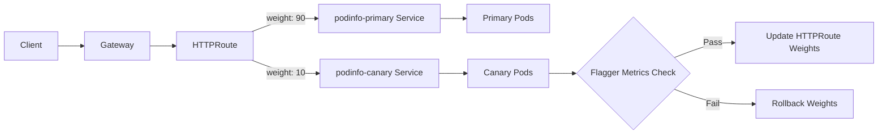

# How to Configure Flagger with Gateway API and Flux

Author: [nawazdhandala](https://github.com/nawazdhandala)

Tags: flux, flagger, gateway api, progressive delivery, canary, kubernetes, gitops, httproute

Description: A practical guide to configuring Flagger with the Kubernetes Gateway API and Flux for progressive canary deployments using HTTPRoute traffic splitting.

---

## Introduction

The Kubernetes Gateway API is the next-generation API for managing ingress traffic in Kubernetes. It provides a standardized set of resources (Gateway, HTTPRoute, etc.) that are implemented by various providers. Flagger supports the Gateway API for traffic splitting during canary deployments, making it possible to use progressive delivery with any Gateway API-compatible implementation.

This guide shows you how to configure Flagger with the Gateway API and Flux for automated canary releases.

## Prerequisites

- A running Kubernetes cluster (v1.25 or later)
- kubectl configured for your cluster
- Flux CLI installed
- A Git repository for Flux
- A Gateway API implementation (this guide uses Envoy Gateway as an example)

## Step 1: Bootstrap Flux

```bash
flux bootstrap github \
  --owner=your-org \
  --repository=fleet-infra \
  --branch=main \
  --path=clusters/my-cluster \
  --personal
```

## Step 2: Install Gateway API CRDs

The Gateway API CRDs must be installed before any implementation.

```yaml
# gateway-api-crds.yaml
apiVersion: source.toolkit.fluxcd.io/v1
kind: OCIRepository
metadata:
  name: gateway-api
  namespace: flux-system
spec:
  interval: 1h
  url: oci://ghcr.io/fluxcd/manifests/gateway-api
  ref:
    tag: v1.1.0
```

```yaml
# gateway-api-kustomization.yaml
apiVersion: kustomize.toolkit.fluxcd.io/v1
kind: Kustomization
metadata:
  name: gateway-api
  namespace: flux-system
spec:
  interval: 1h
  sourceRef:
    kind: OCIRepository
    name: gateway-api
  prune: true
  path: ./standard
```

Alternatively, install CRDs directly:

```bash
kubectl apply -f https://github.com/kubernetes-sigs/gateway-api/releases/download/v1.1.0/standard-install.yaml
```

## Step 3: Install a Gateway API Implementation

This example uses Envoy Gateway, but you can use any Gateway API-compatible provider (Istio, Cilium, etc.).

```yaml
# envoy-gateway-helmrepository.yaml
apiVersion: source.toolkit.fluxcd.io/v1
kind: HelmRepository
metadata:
  name: envoy-gateway
  namespace: flux-system
spec:
  interval: 1h
  url: https://gateway.envoyproxy.io/charts
```

```yaml
# envoy-gateway-helmrelease.yaml
apiVersion: helm.toolkit.fluxcd.io/v1
kind: HelmRelease
metadata:
  name: envoy-gateway
  namespace: envoy-gateway-system
spec:
  interval: 1h
  chart:
    spec:
      chart: gateway-helm
      version: "1.x"
      sourceRef:
        kind: HelmRepository
        name: envoy-gateway
        namespace: flux-system
  install:
    createNamespace: true
```

## Step 4: Create a Gateway Resource

```yaml
# gateway.yaml
apiVersion: gateway.networking.k8s.io/v1
kind: Gateway
metadata:
  name: demo-gateway
  namespace: demo
spec:
  # GatewayClass depends on your implementation
  gatewayClassName: envoy
  listeners:
    - name: http
      protocol: HTTP
      port: 80
      allowedRoutes:
        namespaces:
          from: Same
```

## Step 5: Install Prometheus

```yaml
# prometheus-helmrepository.yaml
apiVersion: source.toolkit.fluxcd.io/v1
kind: HelmRepository
metadata:
  name: prometheus-community
  namespace: flux-system
spec:
  interval: 1h
  url: https://prometheus-community.github.io/helm-charts
```

```yaml
# prometheus-helmrelease.yaml
apiVersion: helm.toolkit.fluxcd.io/v1
kind: HelmRelease
metadata:
  name: prometheus
  namespace: monitoring
spec:
  interval: 1h
  chart:
    spec:
      chart: prometheus
      version: "25.x"
      sourceRef:
        kind: HelmRepository
        name: prometheus-community
        namespace: flux-system
  install:
    createNamespace: true
  values:
    alertmanager:
      enabled: false
    prometheus-pushgateway:
      enabled: false
    server:
      persistentVolume:
        enabled: false
```

## Step 6: Install Flagger with Gateway API Provider

```yaml
# flagger-helmrepository.yaml
apiVersion: source.toolkit.fluxcd.io/v1
kind: HelmRepository
metadata:
  name: flagger
  namespace: flux-system
spec:
  interval: 1h
  url: https://flagger.app
```

```yaml
# flagger-helmrelease.yaml
apiVersion: helm.toolkit.fluxcd.io/v1
kind: HelmRelease
metadata:
  name: flagger
  namespace: flux-system
spec:
  interval: 1h
  chart:
    spec:
      chart: flagger
      version: "1.x"
      sourceRef:
        kind: HelmRepository
        name: flagger
        namespace: flux-system
  values:
    # Use Gateway API as the provider
    meshProvider: gatewayapi
    metricsServer: http://prometheus-server.monitoring:80
```

## Step 7: Reconcile Infrastructure

```bash
git add -A && git commit -m "Add Gateway API, Envoy Gateway, Prometheus, and Flagger"
git push
flux reconcile kustomization flux-system --with-source
```

## Step 8: Deploy the Application

```yaml
# namespace.yaml
apiVersion: v1
kind: Namespace
metadata:
  name: demo
```

```yaml
# deployment.yaml
apiVersion: apps/v1
kind: Deployment
metadata:
  name: podinfo
  namespace: demo
spec:
  replicas: 2
  selector:
    matchLabels:
      app: podinfo
  template:
    metadata:
      labels:
        app: podinfo
    spec:
      containers:
        - name: podinfo
          image: ghcr.io/stefanprodan/podinfo:6.3.0
          ports:
            - containerPort: 9898
              name: http
          resources:
            requests:
              cpu: 100m
              memory: 64Mi
```

```yaml
# service.yaml
apiVersion: v1
kind: Service
metadata:
  name: podinfo
  namespace: demo
spec:
  type: ClusterIP
  selector:
    app: podinfo
  ports:
    - name: http
      port: 9898
      targetPort: http
```

## Step 9: Create the HTTPRoute

Define an HTTPRoute that Flagger will manage for traffic splitting.

```yaml
# httproute.yaml
apiVersion: gateway.networking.k8s.io/v1
kind: HTTPRoute
metadata:
  name: podinfo
  namespace: demo
spec:
  parentRefs:
    - name: demo-gateway
      namespace: demo
  hostnames:
    - podinfo.example.com
  rules:
    - matches:
        - path:
            type: PathPrefix
            value: /
      backendRefs:
        # Flagger will manage the weights of these backend refs
        - name: podinfo-primary
          port: 9898
          weight: 100
        - name: podinfo-canary
          port: 9898
          weight: 0
```

## Step 10: Create the Canary Resource

```yaml
# canary.yaml
apiVersion: flagger.app/v1beta1
kind: Canary
metadata:
  name: podinfo
  namespace: demo
spec:
  targetRef:
    apiVersion: apps/v1
    kind: Deployment
    name: podinfo
  # Reference the Gateway API HTTPRoute
  routeRef:
    apiVersion: gateway.networking.k8s.io/v1
    kind: HTTPRoute
    name: podinfo
  service:
    port: 9898
    targetPort: http
  analysis:
    interval: 30s
    threshold: 5
    maxWeight: 50
    stepWeight: 10
    metrics:
      - name: request-success-rate
        thresholdRange:
          min: 99
        interval: 1m
      - name: request-duration
        thresholdRange:
          max: 500
        interval: 1m
```

Note the `routeRef` field, which is specific to the Gateway API provider and tells Flagger which HTTPRoute to manage.

## Step 11: Deploy and Verify

```bash
git add -A && git commit -m "Add podinfo with Gateway API canary"
git push
flux reconcile kustomization flux-system --with-source
```

Check the setup:

```bash
# Verify canary initialization
kubectl get canary -n demo

# Check the HTTPRoute weights
kubectl get httproute podinfo -n demo -o yaml

# List services created by Flagger
kubectl get svc -n demo
```

## Gateway API Traffic Splitting Flow



## Step 12: Trigger a Canary Release

```yaml
# Update deployment.yaml
spec:
  template:
    spec:
      containers:
        - name: podinfo
          image: ghcr.io/stefanprodan/podinfo:6.4.0
```

```bash
git add -A && git commit -m "Update podinfo to 6.4.0"
git push
flux reconcile kustomization flux-system --with-source
```

## Step 13: Monitor the Rollout

```bash
# Watch canary events
kubectl describe canary podinfo -n demo

# Watch HTTPRoute weight changes
watch kubectl get httproute podinfo -n demo -o jsonpath='{.spec.rules[0].backendRefs}'

# View Flagger logs
kubectl logs -f deploy/flagger -n flux-system
```

## Step 14: Add Custom Metric Templates

```yaml
# metric-template.yaml
apiVersion: flagger.app/v1beta1
kind: MetricTemplate
metadata:
  name: gateway-latency
  namespace: demo
spec:
  provider:
    type: prometheus
    address: http://prometheus-server.monitoring:80
  query: |
    # Calculate p99 latency for the canary service
    histogram_quantile(0.99,
      sum(rate(
        http_request_duration_seconds_bucket{
          namespace="{{ namespace }}",
          service="{{ target }}-canary"
        }[{{ interval }}]
      )) by (le)
    )
```

## Advantages of Using Gateway API

The Gateway API provides several benefits over traditional Ingress:

- **Standardized API**: Works across multiple implementations without vendor lock-in
- **Role-based resources**: Gateway (infra team) and HTTPRoute (app team) separation
- **Advanced routing**: Header-based routing, traffic mirroring, and weighted backends are built-in
- **Future-proof**: Gateway API is the successor to the Ingress API

## Troubleshooting

### HTTPRoute not accepted

Verify the Gateway is programmed and accepts routes from your namespace:

```bash
kubectl get gateway demo-gateway -n demo -o yaml
```

### Canary not detecting route

Ensure the `routeRef` in the Canary spec matches the HTTPRoute name exactly and that both are in the same namespace.

### Weight changes not taking effect

Check your Gateway API implementation supports HTTPRoute backend weights. Not all implementations support all features.

## Summary

You have configured Flagger with the Kubernetes Gateway API and Flux for progressive canary deployments. This approach provides:

- Standard Gateway API resources (Gateway, HTTPRoute) for traffic management
- Implementation-agnostic progressive delivery
- HTTPRoute weight-based traffic splitting managed by Flagger
- Flux GitOps automation for all configuration
- Easy migration between Gateway API providers without changing your canary configuration
