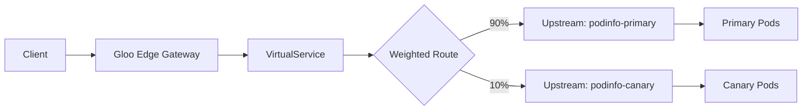

# How to Configure Flagger with Gloo Edge and Flux

Author: [nawazdhandala](https://github.com/nawazdhandala)

Tags: flux, flagger, Gloo, gloo edge, Progressive Delivery, Canary, Kubernetes, GitOps, Envoy

Description: A hands-on guide to setting up Flagger with Gloo Edge API gateway and Flux for progressive canary deployments using upstream weighted routing.

---

## Introduction

Gloo Edge is a Kubernetes-native API gateway built on top of Envoy proxy. It provides advanced routing capabilities including weighted destinations, making it a great fit for Flagger's progressive delivery model. Flagger integrates with Gloo Edge by managing upstream weights in route tables during canary analysis.

In this guide, you will set up Gloo Edge, configure Flagger, and create a canary deployment pipeline managed entirely through Flux and GitOps.

## Prerequisites

- A running Kubernetes cluster (v1.25 or later)
- kubectl configured for your cluster
- Flux CLI installed
- A Git repository for Flux configuration
- glooctl CLI installed (optional, for debugging)

## Step 1: Bootstrap Flux

```bash
flux bootstrap github \
  --owner=your-org \
  --repository=fleet-infra \
  --branch=main \
  --path=clusters/my-cluster \
  --personal
```

## Step 2: Install Gloo Edge via Flux

```yaml
# gloo-helmrepository.yaml
apiVersion: source.toolkit.fluxcd.io/v1
kind: HelmRepository
metadata:
  name: gloo
  namespace: flux-system
spec:
  interval: 1h
  url: https://storage.googleapis.com/solo-public-helm
```

```yaml
# gloo-helmrelease.yaml
apiVersion: helm.toolkit.fluxcd.io/v2
kind: HelmRelease
metadata:
  name: gloo
  namespace: gloo-system
spec:
  interval: 1h
  chart:
    spec:
      chart: gloo
      version: "1.x"
      sourceRef:
        kind: HelmRepository
        name: gloo
        namespace: flux-system
  install:
    createNamespace: true
  values:
    # Enable discovery for automatic upstream creation
    discovery:
      enabled: true
    # Enable Envoy metrics for Flagger analysis
    gatewayProxies:
      gatewayProxy:
        podTemplate:
          probes: true
          # Expose Envoy admin stats for Prometheus
          extraAnnotations:
            prometheus.io/scrape: "true"
            prometheus.io/port: "8081"
            prometheus.io/path: "/metrics"
```

## Step 3: Install Prometheus

```yaml
# prometheus-helmrepository.yaml
apiVersion: source.toolkit.fluxcd.io/v1
kind: HelmRepository
metadata:
  name: prometheus-community
  namespace: flux-system
spec:
  interval: 1h
  url: https://prometheus-community.github.io/helm-charts
```

```yaml
# prometheus-helmrelease.yaml
apiVersion: helm.toolkit.fluxcd.io/v2
kind: HelmRelease
metadata:
  name: prometheus
  namespace: monitoring
spec:
  interval: 1h
  chart:
    spec:
      chart: prometheus
      version: "25.x"
      sourceRef:
        kind: HelmRepository
        name: prometheus-community
        namespace: flux-system
  install:
    createNamespace: true
  values:
    alertmanager:
      enabled: false
    prometheus-pushgateway:
      enabled: false
    server:
      persistentVolume:
        enabled: false
```

## Step 4: Install Flagger with Gloo Provider

```yaml
# flagger-helmrepository.yaml
apiVersion: source.toolkit.fluxcd.io/v1
kind: HelmRepository
metadata:
  name: flagger
  namespace: flux-system
spec:
  interval: 1h
  url: https://flagger.app
```

```yaml
# flagger-helmrelease.yaml
apiVersion: helm.toolkit.fluxcd.io/v2
kind: HelmRelease
metadata:
  name: flagger
  namespace: flux-system
spec:
  interval: 1h
  chart:
    spec:
      chart: flagger
      version: "1.x"
      sourceRef:
        kind: HelmRepository
        name: flagger
        namespace: flux-system
  values:
    # Use Gloo as the mesh/ingress provider
    meshProvider: gloo
    metricsServer: http://prometheus-server.monitoring:80
```

## Step 5: Reconcile All Infrastructure

```bash
git add -A && git commit -m "Add Gloo Edge, Prometheus, and Flagger"
git push
flux reconcile kustomization flux-system --with-source
```

Verify the installations:

```bash
kubectl get pods -n gloo-system
kubectl get pods -n monitoring
kubectl get pods -n flux-system | grep flagger
```

## Step 6: Deploy the Application

```yaml
# namespace.yaml
apiVersion: v1
kind: Namespace
metadata:
  name: demo
```

```yaml
# deployment.yaml
apiVersion: apps/v1
kind: Deployment
metadata:
  name: podinfo
  namespace: demo
spec:
  replicas: 2
  selector:
    matchLabels:
      app: podinfo
  template:
    metadata:
      labels:
        app: podinfo
    spec:
      containers:
        - name: podinfo
          image: ghcr.io/stefanprodan/podinfo:6.3.0
          ports:
            - containerPort: 9898
              name: http
          resources:
            requests:
              cpu: 100m
              memory: 64Mi
```

```yaml
# service.yaml
apiVersion: v1
kind: Service
metadata:
  name: podinfo
  namespace: demo
spec:
  type: ClusterIP
  selector:
    app: podinfo
  ports:
    - name: http
      port: 9898
      targetPort: http
```

## Step 7: Create the Gloo Upstream and VirtualService

Gloo uses Upstreams and VirtualServices for routing. When discovery is enabled, Gloo auto-discovers upstreams. You need to create a VirtualService to route traffic.

```yaml
# virtualservice.yaml
apiVersion: gateway.solo.io/v1
kind: VirtualService
metadata:
  name: podinfo
  namespace: gloo-system
spec:
  virtualHost:
    domains:
      - podinfo.example.com
    routes:
      - matchers:
          - prefix: /
        routeAction:
          multi:
            destinations:
              # Primary upstream - Flagger will manage these weights
              - destination:
                  upstream:
                    name: demo-podinfo-primary-9898
                    namespace: gloo-system
                weight: 100
              # Canary upstream
              - destination:
                  upstream:
                    name: demo-podinfo-canary-9898
                    namespace: gloo-system
                weight: 0
```

## Step 8: Create the Canary Resource

```yaml
# canary.yaml
apiVersion: flagger.app/v1beta1
kind: Canary
metadata:
  name: podinfo
  namespace: demo
spec:
  targetRef:
    apiVersion: apps/v1
    kind: Deployment
    name: podinfo
  # Gloo upstream discovery settings
  upstreamRef:
    apiVersion: gloo.solo.io/v1
    kind: Upstream
    name: demo-podinfo-9898
    namespace: gloo-system
  service:
    port: 9898
    targetPort: http
  analysis:
    # Analysis configuration
    interval: 30s
    threshold: 5
    maxWeight: 50
    stepWeight: 10
    metrics:
      - name: request-success-rate
        thresholdRange:
          min: 99
        interval: 1m
      - name: request-duration
        thresholdRange:
          max: 500
        interval: 1m
```

## Step 9: Deploy and Initialize

```bash
git add -A && git commit -m "Add podinfo with Gloo canary"
git push
flux reconcile kustomization flux-system --with-source
```

Verify the setup:

```bash
# Check canary status
kubectl get canary -n demo

# Verify Gloo upstreams were created
kubectl get upstream -n gloo-system | grep podinfo

# Check VirtualService routing
kubectl get virtualservice -n gloo-system podinfo -o yaml
```

## How Gloo Edge Traffic Splitting Works



Flagger adjusts the destination weights in the Gloo VirtualService route action during each canary analysis step.

## Step 10: Trigger a Canary Release

```yaml
# Update deployment.yaml
spec:
  template:
    spec:
      containers:
        - name: podinfo
          # New version to trigger canary
          image: ghcr.io/stefanprodan/podinfo:6.4.0
```

```bash
git add -A && git commit -m "Update podinfo to 6.4.0"
git push
flux reconcile kustomization flux-system --with-source
```

## Step 11: Monitor the Rollout

```bash
# Watch canary events
kubectl describe canary podinfo -n demo

# Check Gloo upstream weights
kubectl get virtualservice podinfo -n gloo-system -o yaml | grep -A10 routeAction

# View Flagger logs
kubectl logs -f deploy/flagger -n flux-system
```

You can also use glooctl to inspect routing:

```bash
glooctl get virtualservice podinfo -n gloo-system
glooctl get upstream -n gloo-system | grep podinfo
```

## Step 12: Add Custom Envoy Metrics

Since Gloo Edge is built on Envoy, you can create custom MetricTemplates using Envoy metrics:

```yaml
# metric-template.yaml
apiVersion: flagger.app/v1beta1
kind: MetricTemplate
metadata:
  name: gloo-error-rate
  namespace: demo
spec:
  provider:
    type: prometheus
    address: http://prometheus-server.monitoring:80
  query: |
    # Calculate error rate from Gloo Edge Envoy metrics
    sum(rate(
      envoy_cluster_upstream_rq{
        envoy_cluster_name=~"demo-podinfo-canary.*",
        envoy_response_code=~"5.*"
      }[{{ interval }}]
    )) /
    sum(rate(
      envoy_cluster_upstream_rq{
        envoy_cluster_name=~"demo-podinfo-canary.*"
      }[{{ interval }}]
    )) * 100
```

Reference this metric in the canary:

```yaml
spec:
  analysis:
    metrics:
      - name: gloo-error-rate
        thresholdRange:
          max: 1
        interval: 1m
        templateRef:
          name: gloo-error-rate
          namespace: demo
```

## Step 13: Configure Webhooks

Add load testing and acceptance test webhooks:

```yaml
spec:
  analysis:
    webhooks:
      - name: acceptance-test
        type: pre-rollout
        url: http://flagger-loadtester.demo/
        timeout: 30s
        metadata:
          type: bash
          cmd: "curl -s http://podinfo-canary.demo:9898/healthz | grep ok"
      - name: load-test
        type: rollout
        url: http://flagger-loadtester.demo/
        timeout: 5s
        metadata:
          type: cmd
          cmd: "hey -z 1m -q 10 -c 2 http://podinfo-canary.demo:9898/"
```

## Troubleshooting

### Upstream not discovered

If Gloo discovery is not finding your services, manually check upstream status:

```bash
glooctl get upstream -n gloo-system
kubectl get upstream -n gloo-system -o wide
```

### VirtualService routing errors

Check Gloo proxy logs for routing errors:

```bash
kubectl logs -f deploy/gateway-proxy -n gloo-system
```

### Flagger cannot update weights

Ensure Flagger has RBAC permissions for Gloo CRDs:

```bash
kubectl get clusterrole flagger -o yaml | grep gloo
```

## Summary

You have configured Flagger with Gloo Edge and Flux for automated canary deployments. This setup uses:

- Gloo Edge API gateway with Envoy proxy for traffic routing
- Gloo VirtualService weighted destinations for traffic splitting
- Prometheus for collecting Envoy metrics
- Flagger for automating the progressive delivery lifecycle
- Flux for GitOps-based configuration management

Gloo Edge provides enterprise-grade API gateway features combined with progressive delivery through Flagger.
