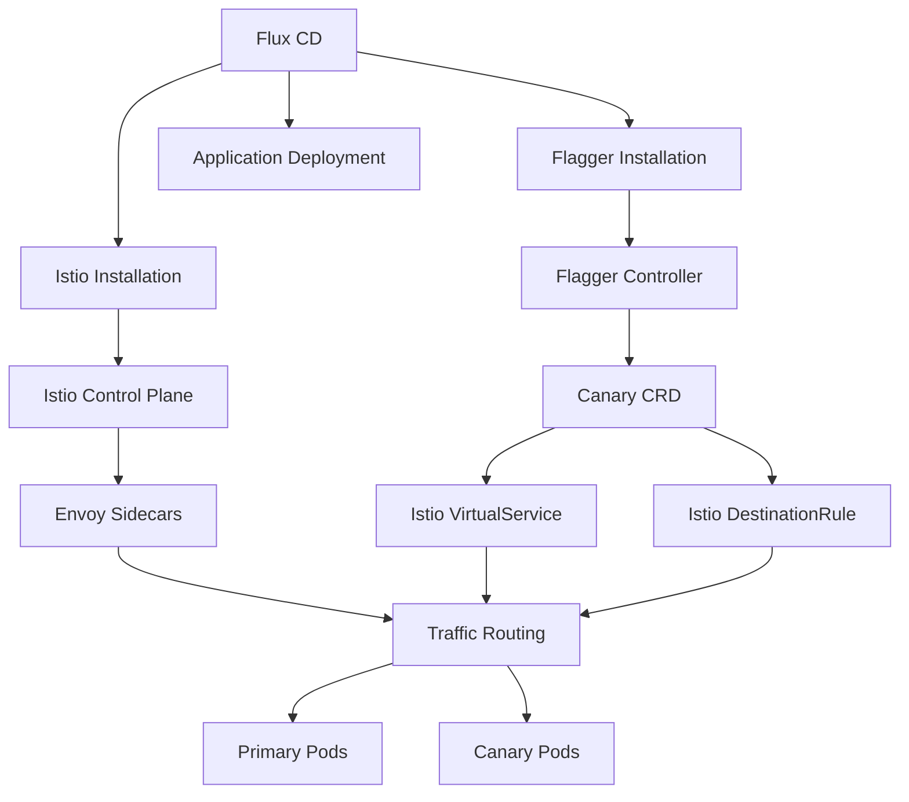

# How to Configure Flagger with Istio Service Mesh and Flux

Author: [nawazdhandala](https://github.com/nawazdhandala)

Tags: flagger, flux cd, istio, service mesh, progressive delivery, kubernetes, gitops, traffic management

Description: A comprehensive guide to configuring Flagger with Istio service mesh and Flux CD for advanced progressive delivery with traffic management.

---

## Introduction

Istio is a powerful service mesh that provides traffic management, observability, and security for microservices. When combined with Flagger and Flux CD, you get a complete GitOps-driven progressive delivery platform. Istio's advanced traffic routing capabilities enable Flagger to perform canary deployments, blue-green deployments, A/B testing, and traffic mirroring with fine-grained control.

This guide covers the full setup from installing Istio with Flux CD to configuring Flagger for progressive delivery using Istio's traffic management features.

## Prerequisites

- A running Kubernetes cluster (v1.26 or later)
- Flux CD installed and bootstrapped
- kubectl configured to access your cluster
- Helm v3 installed

## Architecture Overview



## Step 1: Install Istio with Flux CD

Use Flux's Helm controller to install Istio in a GitOps-friendly way.

```yaml
# infrastructure/istio/namespace.yaml
apiVersion: v1
kind: Namespace
metadata:
  name: istio-system
```

```yaml
# infrastructure/istio/helmrepository.yaml
# Istio Helm chart repository
apiVersion: source.toolkit.fluxcd.io/v1
kind: HelmRepository
metadata:
  name: istio
  namespace: istio-system
spec:
  interval: 24h
  url: https://istio-release.storage.googleapis.com/charts
```

```yaml
# infrastructure/istio/base-helmrelease.yaml
# Install Istio base (CRDs and cluster-wide resources)
apiVersion: helm.toolkit.fluxcd.io/v2
kind: HelmRelease
metadata:
  name: istio-base
  namespace: istio-system
spec:
  interval: 30m
  chart:
    spec:
      chart: base
      version: "1.22.x"
      sourceRef:
        kind: HelmRepository
        name: istio
        namespace: istio-system
  values:
    defaultRevision: default
```

```yaml
# infrastructure/istio/istiod-helmrelease.yaml
# Install Istiod (Istio control plane)
apiVersion: helm.toolkit.fluxcd.io/v2
kind: HelmRelease
metadata:
  name: istiod
  namespace: istio-system
spec:
  interval: 30m
  dependsOn:
    - name: istio-base
  chart:
    spec:
      chart: istiod
      version: "1.22.x"
      sourceRef:
        kind: HelmRepository
        name: istio
        namespace: istio-system
  values:
    # Pilot configuration
    pilot:
      autoscaleEnabled: true
      autoscaleMin: 2
      resources:
        requests:
          cpu: 200m
          memory: 256Mi
    # Global mesh configuration
    meshConfig:
      # Enable access logging for debugging
      accessLogFile: /dev/stdout
      # Enable Prometheus metrics
      enablePrometheusMerge: true
      # Default traffic policy
      defaultConfig:
        holdApplicationUntilProxyStarts: true
```

```yaml
# infrastructure/istio/gateway-helmrelease.yaml
# Install Istio Ingress Gateway
apiVersion: helm.toolkit.fluxcd.io/v2
kind: HelmRelease
metadata:
  name: istio-gateway
  namespace: istio-system
spec:
  interval: 30m
  dependsOn:
    - name: istiod
  chart:
    spec:
      chart: gateway
      version: "1.22.x"
      sourceRef:
        kind: HelmRepository
        name: istio
        namespace: istio-system
  values:
    service:
      type: LoadBalancer
    autoscaling:
      enabled: true
      minReplicas: 2
      maxReplicas: 5
```

## Step 2: Install Prometheus for Istio Metrics

Flagger needs Prometheus to query Istio's telemetry metrics.

```yaml
# infrastructure/monitoring/prometheus-helmrelease.yaml
# Prometheus configured to scrape Istio metrics
apiVersion: helm.toolkit.fluxcd.io/v2
kind: HelmRelease
metadata:
  name: prometheus
  namespace: istio-system
spec:
  interval: 30m
  chart:
    spec:
      chart: prometheus
      version: "25.x"
      sourceRef:
        kind: HelmRepository
        name: prometheus-community
        namespace: monitoring
  values:
    server:
      # Retain metrics for 15 days
      retention: 15d
      persistentVolume:
        size: 20Gi
    # Configure scraping for Istio metrics
    serverFiles:
      prometheus.yml:
        scrape_configs:
          # Scrape Istio control plane
          - job_name: 'istio-mesh'
            kubernetes_sd_configs:
              - role: endpoints
                namespaces:
                  names:
                    - istio-system
            relabel_configs:
              - source_labels: [__meta_kubernetes_service_name]
                action: keep
                regex: istio-telemetry
          # Scrape Envoy sidecars
          - job_name: 'envoy-stats'
            metrics_path: /stats/prometheus
            kubernetes_sd_configs:
              - role: pod
            relabel_configs:
              - source_labels: [__meta_kubernetes_pod_container_port_name]
                action: keep
                regex: '.*-envoy-prom'
```

## Step 3: Install Flagger for Istio

```yaml
# infrastructure/flagger/helmrelease.yaml
# Flagger configured for Istio mesh provider
apiVersion: helm.toolkit.fluxcd.io/v2
kind: HelmRelease
metadata:
  name: flagger
  namespace: istio-system
spec:
  interval: 30m
  chart:
    spec:
      chart: flagger
      version: "1.37.x"
      sourceRef:
        kind: HelmRepository
        name: flagger
        namespace: flagger-system
  values:
    # Configure Flagger for Istio
    meshProvider: istio
    # Point to the Prometheus instance in istio-system
    metricsServer: http://prometheus-server.istio-system:80
    # Log level
    logLevel: info
    # Watch all namespaces
    namespace: ""
    resources:
      requests:
        cpu: 50m
        memory: 128Mi
      limits:
        cpu: 250m
        memory: 256Mi
```

```yaml
# infrastructure/flagger/loadtester.yaml
# Flagger load tester for generating test traffic
apiVersion: apps/v1
kind: Deployment
metadata:
  name: flagger-loadtester
  namespace: istio-system
  labels:
    app: flagger-loadtester
spec:
  replicas: 1
  selector:
    matchLabels:
      app: flagger-loadtester
  template:
    metadata:
      labels:
        app: flagger-loadtester
      annotations:
        # Enable Istio sidecar for the load tester
        sidecar.istio.io/inject: "true"
    spec:
      containers:
        - name: loadtester
          image: ghcr.io/fluxcd/flagger-loadtester:0.31.0
          ports:
            - containerPort: 8080
          command:
            - ./loadtester
            - -port=8080
            - -log-level=info
            - -timeout=1h
          resources:
            requests:
              cpu: 50m
              memory: 64Mi
            limits:
              cpu: 250m
              memory: 256Mi
---
apiVersion: v1
kind: Service
metadata:
  name: flagger-loadtester
  namespace: istio-system
spec:
  selector:
    app: flagger-loadtester
  ports:
    - port: 80
      targetPort: 8080
  type: ClusterIP
```

## Step 4: Deploy an Application with Istio and Flagger

Create a complete application deployment with Istio Gateway, Flagger Canary, and progressive delivery.

```yaml
# apps/bookstore/namespace.yaml
apiVersion: v1
kind: Namespace
metadata:
  name: bookstore
  labels:
    # Enable automatic Istio sidecar injection
    istio-injection: enabled
```

```yaml
# apps/bookstore/deployment.yaml
apiVersion: apps/v1
kind: Deployment
metadata:
  name: bookstore
  namespace: bookstore
  labels:
    app: bookstore
spec:
  replicas: 3
  selector:
    matchLabels:
      app: bookstore
  template:
    metadata:
      labels:
        app: bookstore
    spec:
      containers:
        - name: bookstore
          image: ghcr.io/stefanprodan/podinfo:6.5.0
          ports:
            - containerPort: 9898
              name: http
            - containerPort: 9797
              name: metrics
          command:
            - ./podinfo
            - --port=9898
            - --port-metrics=9797
          readinessProbe:
            httpGet:
              path: /readyz
              port: 9898
            initialDelaySeconds: 5
            periodSeconds: 10
          livenessProbe:
            httpGet:
              path: /healthz
              port: 9898
            initialDelaySeconds: 5
            periodSeconds: 10
          resources:
            requests:
              cpu: 100m
              memory: 64Mi
            limits:
              cpu: 250m
              memory: 128Mi
```

```yaml
# apps/bookstore/hpa.yaml
apiVersion: autoscaling/v2
kind: HorizontalPodAutoscaler
metadata:
  name: bookstore
  namespace: bookstore
spec:
  scaleTargetRef:
    apiVersion: apps/v1
    kind: Deployment
    name: bookstore
  minReplicas: 3
  maxReplicas: 10
  metrics:
    - type: Resource
      resource:
        name: cpu
        target:
          type: Utilization
          averageUtilization: 80
```

## Step 5: Create the Istio Gateway

```yaml
# apps/bookstore/gateway.yaml
# Istio Gateway for external access
apiVersion: networking.istio.io/v1
kind: Gateway
metadata:
  name: bookstore-gateway
  namespace: bookstore
spec:
  selector:
    istio: ingressgateway
  servers:
    - port:
        number: 80
        name: http
        protocol: HTTP
      hosts:
        - bookstore.example.com
```

## Step 6: Configure the Flagger Canary with Istio

```yaml
# apps/bookstore/canary.yaml
# Flagger Canary with full Istio integration
apiVersion: flagger.app/v1beta1
kind: Canary
metadata:
  name: bookstore
  namespace: bookstore
spec:
  # Target deployment
  targetRef:
    apiVersion: apps/v1
    kind: Deployment
    name: bookstore

  # HPA reference
  autoscalerRef:
    apiVersion: autoscaling/v2
    kind: HorizontalPodAutoscaler
    name: bookstore

  # Istio service configuration
  service:
    port: 9898
    targetPort: 9898
    # Istio gateway references
    gateways:
      - bookstore-gateway
    # Hosts for the VirtualService
    hosts:
      - bookstore.example.com
    # Istio traffic policy
    trafficPolicy:
      tls:
        mode: ISTIO_MUTUAL
    # Istio retry policy
    retries:
      attempts: 3
      perTryTimeout: 2s
      retryOn: "gateway-error,connect-failure,refused-stream"
    # Request headers manipulation
    headers:
      request:
        add:
          x-envoy-upstream-rq-timeout-ms: "15000"
    # CORS policy (optional)
    corsPolicy:
      allowOrigins:
        - exact: https://bookstore.example.com
      allowMethods:
        - GET
        - POST
      allowHeaders:
        - Authorization
        - Content-Type
      maxAge: "24h"

  # Canary analysis configuration
  analysis:
    # Check interval
    interval: 1m
    # Number of failed checks before rollback
    threshold: 5
    # Maximum traffic percentage for canary
    maxWeight: 50
    # Traffic percentage increase per step
    stepWeight: 10

    # Istio-specific metrics
    metrics:
      # Built-in Istio success rate metric
      - name: request-success-rate
        thresholdRange:
          min: 99
        interval: 1m

      # Built-in Istio request duration metric
      - name: request-duration
        thresholdRange:
          max: 500
        interval: 1m

      # Custom Istio metric: 5xx error rate
      - name: istio-error-rate
        templateRef:
          name: istio-error-rate
          namespace: bookstore
        thresholdRange:
          max: 1
        interval: 1m

      # Custom Istio metric: request throughput
      - name: istio-throughput
        templateRef:
          name: istio-throughput
          namespace: bookstore
        thresholdRange:
          min: 10
        interval: 1m

    # Webhooks
    webhooks:
      - name: acceptance-test
        type: pre-rollout
        url: http://flagger-loadtester.istio-system/
        timeout: 30s
        metadata:
          type: bash
          cmd: "curl -sd 'test' http://bookstore-canary.bookstore:9898/token | grep token"

      - name: load-test
        type: rollout
        url: http://flagger-loadtester.istio-system/
        timeout: 5s
        metadata:
          type: cmd
          cmd: "hey -z 1m -q 10 -c 2 http://bookstore-canary.bookstore:9898/"
          logCmdOutput: "true"

    # Alerts
    alerts:
      - name: slack
        severity: info
        providerRef:
          name: slack
```

## Step 7: Create Istio-Specific Metric Templates

```yaml
# apps/bookstore/metric-templates.yaml
# Istio 5xx error rate metric
apiVersion: flagger.app/v1beta1
kind: MetricTemplate
metadata:
  name: istio-error-rate
  namespace: bookstore
spec:
  provider:
    type: prometheus
    address: http://prometheus-server.istio-system:80
  query: |
    sum(
      rate(
        istio_requests_total{
          reporter="destination",
          destination_workload_namespace="{{ namespace }}",
          destination_workload=~"{{ target }}",
          response_code=~"5.*"
        }[{{ interval }}]
      )
    )
    /
    sum(
      rate(
        istio_requests_total{
          reporter="destination",
          destination_workload_namespace="{{ namespace }}",
          destination_workload=~"{{ target }}"
        }[{{ interval }}]
      )
    ) * 100
---
# Istio request throughput metric
apiVersion: flagger.app/v1beta1
kind: MetricTemplate
metadata:
  name: istio-throughput
  namespace: bookstore
spec:
  provider:
    type: prometheus
    address: http://prometheus-server.istio-system:80
  query: |
    sum(
      rate(
        istio_requests_total{
          reporter="destination",
          destination_workload_namespace="{{ namespace }}",
          destination_workload=~"{{ target }}"
        }[{{ interval }}]
      )
    )
---
# Istio P99 latency metric
apiVersion: flagger.app/v1beta1
kind: MetricTemplate
metadata:
  name: istio-latency-p99
  namespace: bookstore
spec:
  provider:
    type: prometheus
    address: http://prometheus-server.istio-system:80
  query: |
    histogram_quantile(0.99,
      sum(
        rate(
          istio_request_duration_milliseconds_bucket{
            reporter="destination",
            destination_workload_namespace="{{ namespace }}",
            destination_workload=~"{{ target }}"
          }[{{ interval }}]
        )
      ) by (le)
    )
```

## Step 8: Set Up Alert Provider

```yaml
# apps/bookstore/alert-provider.yaml
apiVersion: flagger.app/v1beta1
kind: AlertProvider
metadata:
  name: slack
  namespace: bookstore
spec:
  type: slack
  channel: deployments
  secretRef:
    name: slack-webhook
---
apiVersion: v1
kind: Secret
metadata:
  name: slack-webhook
  namespace: bookstore
type: Opaque
stringData:
  address: https://hooks.slack.com/services/YOUR/SLACK/WEBHOOK
```

## Step 9: Configure Flux Kustomization

```yaml
# apps/bookstore/kustomization.yaml
apiVersion: kustomize.config.k8s.io/v1beta1
kind: Kustomization
resources:
  - namespace.yaml
  - deployment.yaml
  - hpa.yaml
  - gateway.yaml
  - canary.yaml
  - metric-templates.yaml
  - alert-provider.yaml
```

```yaml
# clusters/my-cluster/bookstore.yaml
apiVersion: kustomize.toolkit.fluxcd.io/v1
kind: Kustomization
metadata:
  name: bookstore
  namespace: flux-system
spec:
  interval: 5m
  dependsOn:
    - name: infrastructure
  sourceRef:
    kind: GitRepository
    name: flux-system
  path: ./apps/bookstore
  prune: true
  wait: true
  timeout: 5m
```

## Step 10: Trigger and Monitor a Deployment

```bash
# Update the image tag
cd k8s-manifests
sed -i 's|podinfo:6.5.0|podinfo:6.6.0|' apps/bookstore/deployment.yaml
git add . && git commit -m "Update bookstore to 6.6.0" && git push

# Watch the canary progression
kubectl get canary bookstore -n bookstore --watch

# Check the Istio VirtualService that Flagger manages
kubectl get virtualservice bookstore -n bookstore -o yaml

# Check the Istio DestinationRule
kubectl get destinationrule bookstore -n bookstore -o yaml

# View traffic distribution in real time
while true; do
  kubectl get canary bookstore -n bookstore \
    -o jsonpath='{.status.canaryWeight}' && echo "% canary"
  sleep 5
done

# Check Flagger events
kubectl describe canary bookstore -n bookstore | tail -20
```

## Troubleshooting

### Istio Sidecar Not Injected

Verify the namespace label and pod annotations:

```bash
# Check namespace labels
kubectl get namespace bookstore --show-labels

# If sidecar is not injected, restart the deployment
kubectl rollout restart deployment bookstore -n bookstore

# Verify sidecar is present
kubectl get pods -n bookstore -o jsonpath='{.items[*].spec.containers[*].name}'
```

### Istio Metrics Missing in Prometheus

```bash
# Check if Istio is generating metrics
kubectl exec -n bookstore -c istio-proxy deployment/bookstore-primary -- \
  curl -s localhost:15090/stats/prometheus | head -20

# Verify Prometheus is scraping Istio metrics
kubectl port-forward svc/prometheus-server -n istio-system 9090:80 &
curl 'http://localhost:9090/api/v1/query?query=istio_requests_total' | jq '.data.result | length'
```

### VirtualService Not Created

If Flagger does not create the VirtualService, check the Canary status:

```bash
kubectl describe canary bookstore -n bookstore
kubectl logs -n istio-system deployment/flagger | grep bookstore
```

## Summary

You now have a complete progressive delivery platform with Flagger, Istio, and Flux CD. Istio provides fine-grained traffic control through VirtualServices and DestinationRules, Flagger automates the progressive delivery process with metric analysis, and Flux CD manages everything through GitOps. This setup supports canary deployments, blue-green deployments, A/B testing, and traffic mirroring, giving you the flexibility to choose the right deployment strategy for each application.
