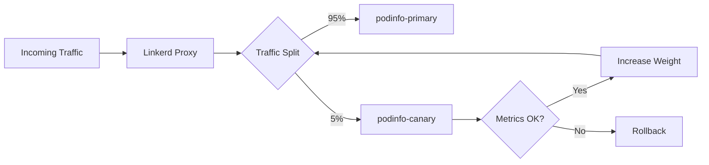

# How to Configure Flagger with Linkerd Service Mesh and Flux

Author: [nawazdhandala](https://github.com/nawazdhandala)

Tags: Flux, Flagger, Linkerd, Service Mesh, Progressive Delivery, Canary, Kubernetes, GitOps

Description: A practical guide to setting up Flagger with Linkerd service mesh and Flux for automated canary deployments in Kubernetes.

---

## Introduction

Flagger is a progressive delivery tool that works with Flux to automate the release process for applications running on Kubernetes. When combined with Linkerd service mesh, Flagger can leverage traffic splitting, request metrics, and mutual TLS to safely roll out new versions of your services.

In this guide, you will learn how to install and configure Flagger with Linkerd and Flux from scratch, set up a canary deployment, and observe the automated rollout process.

## Prerequisites

Before you begin, make sure you have the following:

- A running Kubernetes cluster (v1.25 or later)
- kubectl configured to communicate with your cluster
- Flux CLI installed on your local machine
- Linkerd CLI installed on your local machine

## Step 1: Bootstrap Flux on Your Cluster

Start by bootstrapping Flux into your cluster. This installs the Flux controllers and connects them to your Git repository.

```bash
# Bootstrap Flux with your GitHub repository
flux bootstrap github \
  --owner=your-org \
  --repository=fleet-infra \
  --branch=main \
  --path=clusters/my-cluster \
  --personal
```

Verify that the Flux controllers are running:

```bash
flux check
```

## Step 2: Install Linkerd

Install the Linkerd control plane onto your cluster using the Linkerd CLI.

```bash
# Validate that your cluster is ready for Linkerd
linkerd check --pre

# Install the Linkerd CRDs
linkerd install --crds | kubectl apply -f -

# Install the Linkerd control plane
linkerd install | kubectl apply -f -

# Verify the installation
linkerd check
```

## Step 3: Install Flagger for Linkerd via Flux

Create a Flux HelmRepository and HelmRelease to install Flagger with Linkerd as the mesh provider.

```yaml
# flagger-helmrepository.yaml
apiVersion: source.toolkit.fluxcd.io/v1
kind: HelmRepository
metadata:
  name: flagger
  namespace: flux-system
spec:
  interval: 1h
  url: https://flagger.app
```

```yaml
# flagger-helmrelease.yaml
apiVersion: helm.toolkit.fluxcd.io/v2
kind: HelmRelease
metadata:
  name: flagger
  namespace: flux-system
spec:
  interval: 1h
  releaseName: flagger
  chart:
    spec:
      chart: flagger
      version: "1.x"
      sourceRef:
        kind: HelmRepository
        name: flagger
        namespace: flux-system
  # Set the mesh provider to Linkerd
  values:
    meshProvider: linkerd
    metricsServer: http://prometheus.linkerd-viz:9090
```

Apply these resources to your Git repository and let Flux reconcile them:

```bash
git add -A && git commit -m "Add Flagger with Linkerd provider"
git push
flux reconcile kustomization flux-system --with-source
```

## Step 4: Install Linkerd Viz Extension

Flagger relies on Prometheus metrics exposed by the Linkerd Viz extension to evaluate canary health.

```bash
# Install the Linkerd Viz extension
linkerd viz install | kubectl apply -f -

# Verify the Viz extension is healthy
linkerd viz check
```

Alternatively, you can manage this through Flux with a Kustomization resource.

## Step 5: Deploy a Sample Application

Create a namespace and inject it into the Linkerd mesh, then deploy a sample application.

```yaml
# namespace.yaml
apiVersion: v1
kind: Namespace
metadata:
  name: demo
  annotations:
    # Enable Linkerd proxy injection for all pods in this namespace
    linkerd.io/inject: enabled
```

```yaml
# deployment.yaml
apiVersion: apps/v1
kind: Deployment
metadata:
  name: podinfo
  namespace: demo
spec:
  replicas: 2
  selector:
    matchLabels:
      app: podinfo
  template:
    metadata:
      labels:
        app: podinfo
    spec:
      containers:
        - name: podinfo
          # Starting version for the canary deployment
          image: ghcr.io/stefanprodan/podinfo:6.3.0
          ports:
            - containerPort: 9898
              name: http
          resources:
            requests:
              cpu: 100m
              memory: 64Mi
```

```yaml
# service.yaml
apiVersion: v1
kind: Service
metadata:
  name: podinfo
  namespace: demo
spec:
  type: ClusterIP
  selector:
    app: podinfo
  ports:
    - name: http
      port: 9898
      targetPort: http
```

## Step 6: Create a Canary Resource

Define a Flagger Canary resource that tells Flagger how to manage progressive delivery for the podinfo deployment.

```yaml
# canary.yaml
apiVersion: flagger.app/v1beta1
kind: Canary
metadata:
  name: podinfo
  namespace: demo
spec:
  # Reference to the deployment to manage
  targetRef:
    apiVersion: apps/v1
    kind: Deployment
    name: podinfo
  # The service that Flagger will modify for traffic splitting
  service:
    port: 9898
    targetPort: http
  analysis:
    # Schedule interval for the canary analysis
    interval: 30s
    # Maximum number of failed metric checks before rollback
    threshold: 5
    # Maximum traffic percentage routed to the canary
    maxWeight: 50
    # Canary increment step (percentage)
    stepWeight: 5
    # Linkerd Prometheus metrics checks
    metrics:
      - name: request-success-rate
        # Minimum request success rate (percentage)
        thresholdRange:
          min: 99
        interval: 1m
      - name: request-duration
        # Maximum request duration in milliseconds (p99)
        thresholdRange:
          max: 500
        interval: 1m
```

## Step 7: Commit and Reconcile

Push all the manifests to your Git repository:

```bash
git add -A && git commit -m "Add podinfo canary deployment with Linkerd"
git push
flux reconcile kustomization flux-system --with-source
```

## Step 8: Verify the Canary Setup

After Flux reconciles, verify that Flagger has initialized the canary:

```bash
# Check the canary status
kubectl get canary -n demo

# You should see output similar to:
# NAME      STATUS        WEIGHT   LASTTRANSITIONTIME
# podinfo   Initialized   0        2026-03-06T10:00:00Z
```

Flagger creates a primary deployment (podinfo-primary) and a ClusterIP service for traffic routing:

```bash
# List deployments in the demo namespace
kubectl get deployments -n demo

# List services created by Flagger
kubectl get svc -n demo
```

## Step 9: Trigger a Canary Deployment

Update the container image to trigger a canary release:

```yaml
# Update the image tag in deployment.yaml
spec:
  template:
    spec:
      containers:
        - name: podinfo
          # New version triggers canary analysis
          image: ghcr.io/stefanprodan/podinfo:6.4.0
```

Commit and push the change:

```bash
git add -A && git commit -m "Update podinfo to 6.4.0"
git push
flux reconcile kustomization flux-system --with-source
```

## Step 10: Monitor the Canary Rollout

Watch the canary progress using kubectl:

```bash
# Watch canary events in real time
kubectl describe canary podinfo -n demo

# Stream Flagger logs to see analysis decisions
kubectl logs -f deploy/flagger -n flux-system
```

You can also use the Linkerd Viz dashboard to observe traffic splitting:

```bash
linkerd viz dashboard
```

## Understanding the Traffic Splitting Flow

During a canary rollout with Linkerd, the traffic flow follows this pattern:



Flagger gradually shifts traffic from the primary to the canary. At each interval, it checks the configured metrics. If all checks pass, it increases the canary weight by the stepWeight value. If any check fails, it increments the failure counter and rolls back when the threshold is reached.

## Step 11: Configure Alerting

You can configure Flagger to send alerts to Slack or other providers when canary events occur.

```yaml
# alertprovider.yaml
apiVersion: flagger.app/v1beta1
kind: AlertProvider
metadata:
  name: slack
  namespace: demo
spec:
  type: slack
  # Slack incoming webhook URL
  address: https://hooks.slack.com/services/YOUR/SLACK/WEBHOOK
  channel: deployments
```

Then reference the alert provider in your canary:

```yaml
spec:
  analysis:
    alerts:
      - name: "slack-alert"
        severity: info
        providerRef:
          name: slack
```

## Troubleshooting

### Canary stuck in Initializing state

Make sure the Linkerd proxy is injected into the pods:

```bash
kubectl get pods -n demo -o jsonpath='{.items[*].spec.containers[*].name}'
```

You should see `linkerd-proxy` alongside your application container.

### Metrics not available

Verify that the Linkerd Viz Prometheus is scraping metrics:

```bash
kubectl port-forward -n linkerd-viz svc/prometheus 9090:9090
# Then open http://localhost:9090 and query for linkerd metrics
```

### Canary fails with no metrics

Ensure you have traffic hitting the service. Flagger needs actual requests to compute success rates and latencies. You can generate test traffic with:

```bash
# Generate load against the canary service
kubectl run loadgen --image=buoyantio/slow_cooker -- \
  slow_cooker -qps 10 -concurrency 2 http://podinfo.demo:9898
```

## Summary

You have successfully configured Flagger with Linkerd service mesh and Flux for automated canary deployments. The key components are:

- Flux manages the GitOps lifecycle and deploys all resources from Git
- Linkerd provides the service mesh layer with traffic splitting and mTLS
- Linkerd Viz exposes Prometheus metrics that Flagger uses for analysis
- Flagger automates the canary rollout based on metric thresholds

This setup gives you safe, automated progressive delivery with full observability through the Linkerd dashboard.
