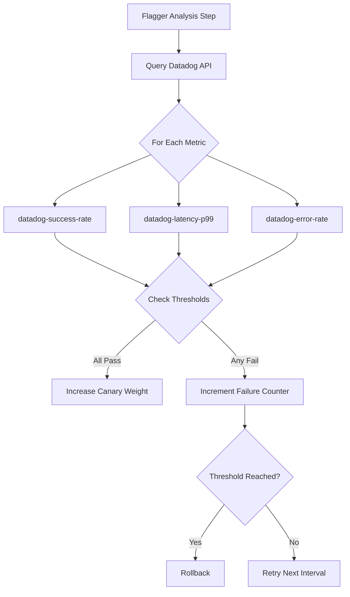

# How to Configure Flagger Metrics Analysis with Datadog

Author: [nawazdhandala](https://github.com/nawazdhandala)

Tags: flux, flagger, datadog, metrics, progressive delivery, canary, kubernetes, gitops, monitoring

Description: A step-by-step guide to configuring Flagger metrics analysis with Datadog for canary deployment validation using Datadog queries and API integration.

---

## Introduction

Flagger supports Datadog as a metrics provider for canary analysis. If your organization already uses Datadog for monitoring, you can leverage your existing metrics, dashboards, and alerting infrastructure to drive progressive delivery decisions. Flagger queries the Datadog API to evaluate canary health during rollouts.

This guide covers setting up the Datadog Agent, configuring Flagger to use Datadog as a metrics provider, and writing custom metric queries for canary analysis.

## Prerequisites

- A running Kubernetes cluster (v1.25 or later)
- kubectl configured for your cluster
- Flux CLI installed
- A Datadog account with API and application keys
- Flagger installed with any supported provider

## Step 1: Store Datadog Credentials

Create a Kubernetes secret with your Datadog API and application keys:

```bash
# Create the secret in the namespace where your canary resources live
kubectl create secret generic datadog-credentials \
  --namespace=demo \
  --from-literal=datadog_api_key=YOUR_API_KEY \
  --from-literal=datadog_application_key=YOUR_APP_KEY
```

For a GitOps approach, use a sealed secret or external secrets operator:

```yaml
# datadog-external-secret.yaml
apiVersion: external-secrets.io/v1beta1
kind: ExternalSecret
metadata:
  name: datadog-credentials
  namespace: demo
spec:
  refreshInterval: 1h
  secretStoreRef:
    name: aws-secretsmanager
    kind: ClusterSecretStore
  target:
    name: datadog-credentials
  data:
    - secretKey: datadog_api_key
      remoteRef:
        key: datadog/api-key
    - secretKey: datadog_application_key
      remoteRef:
        key: datadog/app-key
```

## Step 2: Install the Datadog Agent via Flux

```yaml
# datadog-helmrepository.yaml
apiVersion: source.toolkit.fluxcd.io/v1
kind: HelmRepository
metadata:
  name: datadog
  namespace: flux-system
spec:
  interval: 1h
  url: https://helm.datadoghq.com
```

```yaml
# datadog-helmrelease.yaml
apiVersion: helm.toolkit.fluxcd.io/v1
kind: HelmRelease
metadata:
  name: datadog
  namespace: datadog
spec:
  interval: 1h
  chart:
    spec:
      chart: datadog
      version: "3.x"
      sourceRef:
        kind: HelmRepository
        name: datadog
        namespace: flux-system
  install:
    createNamespace: true
  values:
    datadog:
      # Reference existing secret for API key
      apiKeyExistingSecret: datadog-credentials
      appKeyExistingSecret: datadog-credentials
      # Enable Kubernetes metrics collection
      kubeStateMetricsEnabled: true
      # Enable APM for request-level metrics
      apm:
        portEnabled: true
        socketEnabled: true
      # Enable log collection
      logs:
        enabled: true
        containerCollectAll: true
      # Enable process monitoring
      processAgent:
        enabled: true
        processCollection: true
```

## Step 3: Install Flagger

Install Flagger with your mesh provider. Datadog is configured per MetricTemplate, not at the Flagger installation level:

```yaml
# flagger-helmrelease.yaml
apiVersion: helm.toolkit.fluxcd.io/v1
kind: HelmRelease
metadata:
  name: flagger
  namespace: flux-system
spec:
  interval: 1h
  chart:
    spec:
      chart: flagger
      version: "1.x"
      sourceRef:
        kind: HelmRepository
        name: flagger
        namespace: flux-system
  values:
    meshProvider: kubernetes
    # Prometheus is still used for built-in metrics
    # Datadog is configured via MetricTemplates
    metricsServer: http://prometheus-server.monitoring:80
```

## Step 4: Create Datadog MetricTemplates

### Request Error Rate

```yaml
# datadog-error-rate.yaml
apiVersion: flagger.app/v1beta1
kind: MetricTemplate
metadata:
  name: datadog-error-rate
  namespace: demo
spec:
  provider:
    type: datadog
    # Reference the secret containing Datadog credentials
    secretRef:
      name: datadog-credentials
  query: |
    sum:trace.http.request.errors{
      service:{{ target }}-canary,
      kube_namespace:{{ namespace }}
    }.as_count() /
    sum:trace.http.request.hits{
      service:{{ target }}-canary,
      kube_namespace:{{ namespace }}
    }.as_count() * 100
```

### Request Latency (P99)

```yaml
# datadog-latency.yaml
apiVersion: flagger.app/v1beta1
kind: MetricTemplate
metadata:
  name: datadog-latency-p99
  namespace: demo
spec:
  provider:
    type: datadog
    secretRef:
      name: datadog-credentials
  query: |
    p99:trace.http.request.duration{
      service:{{ target }}-canary,
      kube_namespace:{{ namespace }}
    }
```

### Request Success Rate

```yaml
# datadog-success-rate.yaml
apiVersion: flagger.app/v1beta1
kind: MetricTemplate
metadata:
  name: datadog-success-rate
  namespace: demo
spec:
  provider:
    type: datadog
    secretRef:
      name: datadog-credentials
  query: |
    100 - (
      sum:trace.http.request.errors{
        service:{{ target }}-canary,
        kube_namespace:{{ namespace }}
      }.as_count() /
      sum:trace.http.request.hits{
        service:{{ target }}-canary,
        kube_namespace:{{ namespace }}
      }.as_count() * 100
    )
```

### CPU Utilization

```yaml
# datadog-cpu.yaml
apiVersion: flagger.app/v1beta1
kind: MetricTemplate
metadata:
  name: datadog-cpu-usage
  namespace: demo
spec:
  provider:
    type: datadog
    secretRef:
      name: datadog-credentials
  query: |
    avg:kubernetes.cpu.usage.total{
      kube_deployment:{{ target }}-canary,
      kube_namespace:{{ namespace }}
    }
```

### Custom APM Metric

```yaml
# datadog-apm-metric.yaml
apiVersion: flagger.app/v1beta1
kind: MetricTemplate
metadata:
  name: datadog-apm-throughput
  namespace: demo
spec:
  provider:
    type: datadog
    secretRef:
      name: datadog-credentials
  query: |
    sum:trace.http.request.hits{
      service:{{ target }}-canary,
      kube_namespace:{{ namespace }}
    }.as_rate()
```

## Step 5: Configure the Canary with Datadog Metrics

```yaml
# canary.yaml
apiVersion: flagger.app/v1beta1
kind: Canary
metadata:
  name: podinfo
  namespace: demo
spec:
  targetRef:
    apiVersion: apps/v1
    kind: Deployment
    name: podinfo
  service:
    port: 9898
    targetPort: http
  analysis:
    interval: 1m
    threshold: 5
    maxWeight: 50
    stepWeight: 10
    metrics:
      # Datadog success rate - must be above 99%
      - name: datadog-success-rate
        thresholdRange:
          min: 99
        interval: 1m
        templateRef:
          name: datadog-success-rate
          namespace: demo
      # Datadog p99 latency - must be under 0.5 seconds
      - name: datadog-latency-p99
        thresholdRange:
          max: 0.5
        interval: 1m
        templateRef:
          name: datadog-latency-p99
          namespace: demo
      # Datadog error rate - must be under 1%
      - name: datadog-error-rate
        thresholdRange:
          max: 1
        interval: 1m
        templateRef:
          name: datadog-error-rate
          namespace: demo
      # CPU usage - should not spike above 80%
      - name: datadog-cpu-usage
        thresholdRange:
          max: 80
        interval: 1m
        templateRef:
          name: datadog-cpu-usage
          namespace: demo
```

## Step 6: Deploy and Test

```bash
git add -A && git commit -m "Add Datadog metrics for Flagger canary"
git push
flux reconcile kustomization flux-system --with-source
```

Verify the canary is initialized:

```bash
kubectl get canary -n demo
kubectl describe canary podinfo -n demo
```

## Step 7: Trigger a Canary Release

```yaml
# Update deployment image
spec:
  template:
    spec:
      containers:
        - name: podinfo
          image: ghcr.io/stefanprodan/podinfo:6.4.0
```

```bash
git add -A && git commit -m "Update podinfo to 6.4.0"
git push
flux reconcile kustomization flux-system --with-source
```

## Datadog Metrics Analysis Flow



## Step 8: Monitor in Datadog Dashboard

Create a Datadog dashboard to visualize canary metrics:

1. Log into your Datadog console
2. Create a new dashboard
3. Add widgets for the following metrics:
   - `trace.http.request.hits` filtered by canary service
   - `trace.http.request.errors` filtered by canary service
   - `trace.http.request.duration` percentiles
   - `kubernetes.cpu.usage.total` by deployment

## Step 9: Configure Datadog Monitors as Webhooks

You can also use Datadog Monitors with Flagger webhooks for additional validation:

```yaml
spec:
  analysis:
    webhooks:
      - name: datadog-monitor-check
        type: rollout
        # Use the Datadog API to check monitor status
        url: http://flagger-loadtester.demo/
        timeout: 30s
        metadata:
          type: bash
          cmd: |
            curl -s "https://api.datadoghq.com/api/v1/monitor/MONITOR_ID" \
              -H "DD-API-KEY: ${DD_API_KEY}" \
              -H "DD-APPLICATION-KEY: ${DD_APP_KEY}" | \
              jq -e '.overall_state == "OK"'
```

## Troubleshooting

### Datadog query returns no data

Ensure the Datadog Agent is collecting metrics from your pods:

```bash
kubectl exec -it $(kubectl get pods -n datadog -l app=datadog -o name | head -1) -n datadog -- agent status
```

### Authentication errors

Verify the secret contains the correct keys:

```bash
kubectl get secret datadog-credentials -n demo -o jsonpath='{.data}' | jq
```

The secret must contain `datadog_api_key` and `datadog_application_key` fields.

### Metric template variables not resolving

Datadog MetricTemplate uses the same template variables as Prometheus:
- `{{ namespace }}` - canary namespace
- `{{ target }}` - canary target deployment name
- `{{ ingress }}` - ingress name (if applicable)

Note that Datadog queries use a different syntax than PromQL. Test your queries in the Datadog Metrics Explorer first.

## Summary

You have configured Flagger metrics analysis with Datadog. Key points:

- Datadog metrics are configured through MetricTemplate resources with `type: datadog`
- Credentials are stored in Kubernetes secrets and referenced by the MetricTemplate
- Datadog APM traces provide request-level metrics ideal for canary analysis
- You can combine Datadog metrics with Prometheus metrics in the same canary
- Template variables allow reusable metric definitions across multiple canaries
- The Datadog dashboard provides rich visualization of canary deployment progress
