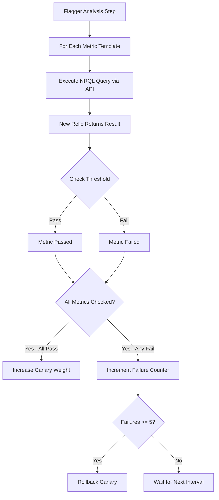

# How to Configure Flagger Metrics Analysis with New Relic

Author: [nawazdhandala](https://github.com/nawazdhandala)

Tags: flux, Flagger, New Relic, Metrics, Progressive Delivery, Canary, Kubernetes, GitOps, Observability

Description: A practical guide to configuring Flagger metrics analysis with New Relic for canary deployment validation using NRQL queries and the New Relic API.

---

## Introduction

Flagger supports New Relic as a metrics provider for canary analysis. If your team uses New Relic for application performance monitoring, you can use NRQL (New Relic Query Language) queries to drive Flagger's progressive delivery decisions. This means your existing New Relic instrumentation, dashboards, and alerts can be used to validate canary deployments automatically.

This guide covers setting up the New Relic Kubernetes integration, configuring Flagger MetricTemplates for New Relic, and building a complete canary analysis pipeline.

## Prerequisites

- A running Kubernetes cluster (v1.25 or later)
- kubectl configured for your cluster
- Flux CLI installed
- A New Relic account with a license key and Insights API key
- Flagger installed with any supported provider

## Step 1: Store New Relic Credentials

Create a Kubernetes secret with your New Relic API credentials:

```bash
# Create the secret for Flagger to use when querying New Relic
kubectl create secret generic newrelic-credentials \
  --namespace=demo \
  --from-literal=newrelic_account_id=YOUR_ACCOUNT_ID \
  --from-literal=newrelic_query_key=YOUR_NRQL_QUERY_API_KEY
```

For GitOps management, use an external secrets operator:

```yaml
# newrelic-external-secret.yaml
apiVersion: external-secrets.io/v1beta1
kind: ExternalSecret
metadata:
  name: newrelic-credentials
  namespace: demo
spec:
  refreshInterval: 1h
  secretStoreRef:
    name: vault-backend
    kind: ClusterSecretStore
  target:
    name: newrelic-credentials
  data:
    - secretKey: newrelic_account_id
      remoteRef:
        key: secret/data/newrelic
        property: account_id
    - secretKey: newrelic_query_key
      remoteRef:
        key: secret/data/newrelic
        property: query_key
```

## Step 2: Install the New Relic Kubernetes Integration

Deploy the New Relic infrastructure agent and Kubernetes integration via Flux.

```yaml
# newrelic-helmrepository.yaml
apiVersion: source.toolkit.fluxcd.io/v1
kind: HelmRepository
metadata:
  name: newrelic
  namespace: flux-system
spec:
  interval: 1h
  url: https://helm-charts.newrelic.com
```

```yaml
# newrelic-bundle-helmrelease.yaml
apiVersion: helm.toolkit.fluxcd.io/v1
kind: HelmRelease
metadata:
  name: newrelic-bundle
  namespace: newrelic
spec:
  interval: 1h
  chart:
    spec:
      chart: nri-bundle
      version: "5.x"
      sourceRef:
        kind: HelmRepository
        name: newrelic
        namespace: flux-system
  install:
    createNamespace: true
  values:
    global:
      # Your New Relic license key
      licenseKey: ""
      cluster: my-cluster
    # Reference existing secret for the license key
    newrelic-infrastructure:
      licenseKey: ""
      customSecretName: newrelic-license
      customSecretLicenseKey: license-key
    # Enable Kubernetes events forwarding
    kube-state-metrics:
      enabled: true
    # Enable Kubernetes metadata enrichment
    nri-metadata-injection:
      enabled: true
    # Enable log forwarding
    newrelic-logging:
      enabled: true
    # Enable Prometheus remote write (optional)
    nri-prometheus:
      enabled: true
```

## Step 3: Configure Application APM

Ensure your application is instrumented with a New Relic APM agent. For a Go application, add the agent to your code. For containerized applications, you can use auto-instrumentation:

```yaml
# deployment.yaml with New Relic labels
apiVersion: apps/v1
kind: Deployment
metadata:
  name: podinfo
  namespace: demo
spec:
  replicas: 2
  selector:
    matchLabels:
      app: podinfo
  template:
    metadata:
      labels:
        app: podinfo
        # Labels for New Relic Kubernetes metadata
        app.kubernetes.io/name: podinfo
      annotations:
        # Enable New Relic APM injection (if using auto-instrumentation)
        instrumentation.newrelic.com/inject-java: "true"
    spec:
      containers:
        - name: podinfo
          image: ghcr.io/stefanprodan/podinfo:6.3.0
          ports:
            - containerPort: 9898
              name: http
          env:
            # New Relic APM configuration
            - name: NEW_RELIC_APP_NAME
              value: "podinfo-canary"
            - name: NEW_RELIC_LICENSE_KEY
              valueFrom:
                secretKeyRef:
                  name: newrelic-license
                  key: license-key
          resources:
            requests:
              cpu: 100m
              memory: 64Mi
```

## Step 4: Create New Relic MetricTemplates

### Request Error Rate

```yaml
# newrelic-error-rate.yaml
apiVersion: flagger.app/v1beta1
kind: MetricTemplate
metadata:
  name: newrelic-error-rate
  namespace: demo
spec:
  provider:
    type: newrelic
    # Reference the secret with New Relic credentials
    secretRef:
      name: newrelic-credentials
  query: |
    SELECT
      filter(count(*), WHERE httpResponseCode >= '500') /
      count(*) * 100
    FROM Transaction
    WHERE appName = '{{ target }}-canary'
    AND kubernetes_namespace = '{{ namespace }}'
    SINCE 1 minute ago
```

### Request Success Rate

```yaml
# newrelic-success-rate.yaml
apiVersion: flagger.app/v1beta1
kind: MetricTemplate
metadata:
  name: newrelic-success-rate
  namespace: demo
spec:
  provider:
    type: newrelic
    secretRef:
      name: newrelic-credentials
  query: |
    SELECT
      filter(count(*), WHERE httpResponseCode < '500') /
      count(*) * 100
    AS 'success_rate'
    FROM Transaction
    WHERE appName = '{{ target }}-canary'
    AND kubernetes_namespace = '{{ namespace }}'
    SINCE 1 minute ago
```

### Request Duration (P99)

```yaml
# newrelic-latency.yaml
apiVersion: flagger.app/v1beta1
kind: MetricTemplate
metadata:
  name: newrelic-latency-p99
  namespace: demo
spec:
  provider:
    type: newrelic
    secretRef:
      name: newrelic-credentials
  query: |
    SELECT percentile(duration, 99)
    FROM Transaction
    WHERE appName = '{{ target }}-canary'
    AND kubernetes_namespace = '{{ namespace }}'
    SINCE 1 minute ago
```

### Throughput

```yaml
# newrelic-throughput.yaml
apiVersion: flagger.app/v1beta1
kind: MetricTemplate
metadata:
  name: newrelic-throughput
  namespace: demo
spec:
  provider:
    type: newrelic
    secretRef:
      name: newrelic-credentials
  query: |
    SELECT rate(count(*), 1 second)
    FROM Transaction
    WHERE appName = '{{ target }}-canary'
    AND kubernetes_namespace = '{{ namespace }}'
    SINCE 1 minute ago
```

### Apdex Score

```yaml
# newrelic-apdex.yaml
apiVersion: flagger.app/v1beta1
kind: MetricTemplate
metadata:
  name: newrelic-apdex
  namespace: demo
spec:
  provider:
    type: newrelic
    secretRef:
      name: newrelic-credentials
  query: |
    SELECT apdex(duration, 0.5)
    FROM Transaction
    WHERE appName = '{{ target }}-canary'
    AND kubernetes_namespace = '{{ namespace }}'
    SINCE 1 minute ago
```

### Custom Business Metric

```yaml
# newrelic-business-metric.yaml
apiVersion: flagger.app/v1beta1
kind: MetricTemplate
metadata:
  name: newrelic-checkout-errors
  namespace: demo
spec:
  provider:
    type: newrelic
    secretRef:
      name: newrelic-credentials
  query: |
    SELECT filter(count(*), WHERE name = 'WebTransaction/checkout' AND error IS true) /
      filter(count(*), WHERE name = 'WebTransaction/checkout') * 100
    FROM Transaction
    WHERE appName = '{{ target }}-canary'
    AND kubernetes_namespace = '{{ namespace }}'
    SINCE 2 minutes ago
```

## Step 5: Configure the Canary with New Relic Metrics

```yaml
# canary.yaml
apiVersion: flagger.app/v1beta1
kind: Canary
metadata:
  name: podinfo
  namespace: demo
spec:
  targetRef:
    apiVersion: apps/v1
    kind: Deployment
    name: podinfo
  service:
    port: 9898
    targetPort: http
  analysis:
    # Analysis runs every minute
    interval: 1m
    # Rollback after 5 consecutive failures
    threshold: 5
    # Maximum canary traffic weight
    maxWeight: 50
    # Weight increment per successful step
    stepWeight: 10
    metrics:
      # New Relic success rate - must be above 99%
      - name: newrelic-success-rate
        thresholdRange:
          min: 99
        interval: 1m
        templateRef:
          name: newrelic-success-rate
          namespace: demo
      # New Relic p99 latency - must be under 500ms (0.5s)
      - name: newrelic-latency-p99
        thresholdRange:
          max: 0.5
        interval: 1m
        templateRef:
          name: newrelic-latency-p99
          namespace: demo
      # New Relic error rate - must be under 1%
      - name: newrelic-error-rate
        thresholdRange:
          max: 1
        interval: 1m
        templateRef:
          name: newrelic-error-rate
          namespace: demo
      # New Relic Apdex - must be above 0.9
      - name: newrelic-apdex
        thresholdRange:
          min: 0.9
        interval: 1m
        templateRef:
          name: newrelic-apdex
          namespace: demo
```

## Step 6: Deploy and Verify

```bash
git add -A && git commit -m "Add New Relic metrics for Flagger canary"
git push
flux reconcile kustomization flux-system --with-source
```

Check the canary initialization:

```bash
# Verify canary status
kubectl get canary -n demo

# Check metric template resources
kubectl get metrictemplates -n demo

# Describe canary for detailed status
kubectl describe canary podinfo -n demo
```

## Step 7: Trigger a Canary Release

```yaml
# Update deployment.yaml
spec:
  template:
    spec:
      containers:
        - name: podinfo
          # New version triggers canary analysis
          image: ghcr.io/stefanprodan/podinfo:6.4.0
```

```bash
git add -A && git commit -m "Update podinfo to 6.4.0"
git push
flux reconcile kustomization flux-system --with-source
```

## New Relic Metrics Analysis Flow



## Step 8: Monitor in New Relic Dashboard

You can create a New Relic dashboard specifically for canary deployments:

```text
NRQL queries for your dashboard:

-- Canary vs Primary Error Rate Comparison
SELECT filter(count(*), WHERE httpResponseCode >= '500') / count(*) * 100
FROM Transaction
WHERE appName IN ('podinfo-primary', 'podinfo-canary')
FACET appName
TIMESERIES SINCE 30 minutes ago

-- Canary vs Primary Latency Comparison
SELECT percentile(duration, 50, 95, 99)
FROM Transaction
WHERE appName IN ('podinfo-primary', 'podinfo-canary')
FACET appName
SINCE 30 minutes ago

-- Canary Traffic Volume
SELECT count(*)
FROM Transaction
WHERE appName = 'podinfo-canary'
TIMESERIES SINCE 30 minutes ago
```

## Step 9: Testing NRQL Queries

Before using NRQL queries in MetricTemplates, test them in the New Relic Query Builder:

1. Log into New Relic One
2. Navigate to Query Your Data
3. Replace template variables with actual values:
   - `{{ target }}` becomes `podinfo`
   - `{{ namespace }}` becomes `demo`
4. Run the query and verify it returns a single scalar value

Example test query:

```sql
SELECT
  filter(count(*), WHERE httpResponseCode < '500') /
  count(*) * 100
AS 'success_rate'
FROM Transaction
WHERE appName = 'podinfo-canary'
AND kubernetes_namespace = 'demo'
SINCE 1 minute ago
```

## Step 10: Combine New Relic with Prometheus Metrics

You can use both New Relic and Prometheus metrics in the same canary:

```yaml
spec:
  analysis:
    metrics:
      # Prometheus built-in metric
      - name: request-success-rate
        thresholdRange:
          min: 99
        interval: 1m
      # New Relic APM metric
      - name: newrelic-apdex
        thresholdRange:
          min: 0.9
        interval: 1m
        templateRef:
          name: newrelic-apdex
          namespace: demo
      # New Relic custom business metric
      - name: newrelic-checkout-errors
        thresholdRange:
          max: 0.5
        interval: 1m
        templateRef:
          name: newrelic-checkout-errors
          namespace: demo
```

## Troubleshooting

### NRQL query returns no data

Verify that your application is reporting data to New Relic:

1. Check the New Relic APM section for your application
2. Ensure the app name matches what you use in the NRQL query
3. Verify the Kubernetes metadata labels are being applied

### Authentication errors

Check the secret format. The secret must contain these exact keys:

```bash
# Verify secret keys
kubectl get secret newrelic-credentials -n demo -o jsonpath='{.data}' | \
  python3 -c "import sys,json,base64; d=json.load(sys.stdin); [print(k) for k in d]"
```

Expected keys: `newrelic_account_id` and `newrelic_query_key`.

### Query returns multiple values

Flagger expects a single scalar value from each NRQL query. Make sure your query does not use `FACET` or `TIMESERIES` clauses, as these return multiple data points. Use aggregate functions like `SELECT count(*)`, `SELECT average(duration)`, or `SELECT percentile(duration, 99)`.

### Rate limiting

The New Relic Query API has rate limits. If you have many metrics with short intervals, you might hit these limits. Consider:

- Increasing the metric `interval` to 2m or more
- Reducing the number of custom metrics
- Using a New Relic Insights API key with higher limits

## Summary

You have configured Flagger metrics analysis with New Relic for canary deployment validation. Key takeaways:

- New Relic metrics are configured through MetricTemplate resources with `type: newrelic`
- NRQL queries provide powerful and flexible metric analysis capabilities
- Credentials are securely stored in Kubernetes secrets
- You can use APM data, infrastructure metrics, and custom events for canary analysis
- New Relic and Prometheus metrics can be combined in the same canary
- The Apdex score provides a high-level quality indicator ideal for canary validation
- Always test NRQL queries in the New Relic Query Builder before deploying MetricTemplates
