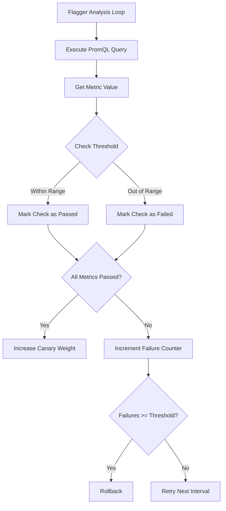

# How to Configure Flagger Metrics Analysis with Prometheus

Author: [nawazdhandala](https://github.com/nawazdhandala)

Tags: flux, flagger, Prometheus, Metrics, Progressive Delivery, Canary, Kubernetes, GitOps, Observability

Description: A detailed guide to configuring Flagger metrics analysis with Prometheus for canary deployment validation including built-in and custom metric templates.

---

## Introduction

Flagger uses metrics analysis to determine whether a canary deployment is healthy enough to continue receiving traffic. Prometheus is the most common metrics backend for Flagger and provides rich query capabilities through PromQL. Flagger ships with built-in Prometheus metrics for popular providers and also supports custom MetricTemplates for advanced use cases.

This guide covers everything from basic Prometheus setup to writing custom PromQL queries for Flagger canary analysis.

## Prerequisites

- A running Kubernetes cluster (v1.25 or later)
- kubectl configured for your cluster
- Flux CLI installed
- Flagger installed (with any supported provider)

## Step 1: Install Prometheus via Flux

```yaml
# prometheus-helmrepository.yaml
apiVersion: source.toolkit.fluxcd.io/v1
kind: HelmRepository
metadata:
  name: prometheus-community
  namespace: flux-system
spec:
  interval: 1h
  url: https://prometheus-community.github.io/helm-charts
```

```yaml
# prometheus-helmrelease.yaml
apiVersion: helm.toolkit.fluxcd.io/v1
kind: HelmRelease
metadata:
  name: prometheus
  namespace: monitoring
spec:
  interval: 1h
  chart:
    spec:
      chart: prometheus
      version: "25.x"
      sourceRef:
        kind: HelmRepository
        name: prometheus-community
        namespace: flux-system
  install:
    createNamespace: true
  values:
    alertmanager:
      enabled: false
    prometheus-pushgateway:
      enabled: false
    server:
      # Configure retention and storage
      retention: "15d"
      persistentVolume:
        enabled: true
        size: 10Gi
      # Global scrape interval
      global:
        scrape_interval: 15s
        evaluation_interval: 15s
```

## Step 2: Configure Flagger to Use Prometheus

When installing Flagger, point it to your Prometheus server:

```yaml
# flagger-helmrelease.yaml
apiVersion: helm.toolkit.fluxcd.io/v1
kind: HelmRelease
metadata:
  name: flagger
  namespace: flux-system
spec:
  interval: 1h
  chart:
    spec:
      chart: flagger
      version: "1.x"
      sourceRef:
        kind: HelmRepository
        name: flagger
        namespace: flux-system
  values:
    meshProvider: kubernetes
    # Point Flagger to your Prometheus instance
    metricsServer: http://prometheus-server.monitoring:80
```

## Step 3: Understanding Built-in Metrics

Flagger includes built-in metric checks for common providers. These are the two most important ones:

### Request Success Rate

Measures the percentage of successful HTTP requests (non-5xx responses):

```yaml
# Built-in metric - no MetricTemplate needed
metrics:
  - name: request-success-rate
    thresholdRange:
      # Minimum 99% success rate required
      min: 99
    # Evaluation window
    interval: 1m
```

### Request Duration

Measures the p99 HTTP request latency:

```yaml
# Built-in metric - no MetricTemplate needed
metrics:
  - name: request-duration
    thresholdRange:
      # Maximum 500ms p99 latency allowed
      max: 500
    interval: 1m
```

## Step 4: Create a Basic Canary with Built-in Metrics

```yaml
# canary.yaml
apiVersion: flagger.app/v1beta1
kind: Canary
metadata:
  name: podinfo
  namespace: demo
spec:
  targetRef:
    apiVersion: apps/v1
    kind: Deployment
    name: podinfo
  service:
    port: 9898
    targetPort: http
  analysis:
    interval: 30s
    threshold: 5
    maxWeight: 50
    stepWeight: 10
    metrics:
      # Check that at least 99% of requests succeed
      - name: request-success-rate
        thresholdRange:
          min: 99
        interval: 1m
      # Check that p99 latency stays under 500ms
      - name: request-duration
        thresholdRange:
          max: 500
        interval: 1m
```

## Step 5: Create Custom MetricTemplates

For metrics beyond the built-in ones, use MetricTemplate resources.

### Custom Error Rate Metric

```yaml
# error-rate-metric.yaml
apiVersion: flagger.app/v1beta1
kind: MetricTemplate
metadata:
  name: error-rate
  namespace: demo
spec:
  provider:
    type: prometheus
    address: http://prometheus-server.monitoring:80
  query: |
    # Calculate the percentage of 5xx responses for the canary
    # Variables available: namespace, target, ingress, interval
    100 - sum(
      rate(
        http_requests_total{
          namespace="{{ namespace }}",
          pod=~"{{ target }}-canary-[a-zA-Z0-9]+-[a-zA-Z0-9]+",
          status!~"5.*"
        }[{{ interval }}]
      )
    ) /
    sum(
      rate(
        http_requests_total{
          namespace="{{ namespace }}",
          pod=~"{{ target }}-canary-[a-zA-Z0-9]+-[a-zA-Z0-9]+"
        }[{{ interval }}]
      )
    ) * 100
```

### Custom Latency Percentile Metric

```yaml
# latency-metric.yaml
apiVersion: flagger.app/v1beta1
kind: MetricTemplate
metadata:
  name: latency-p95
  namespace: demo
spec:
  provider:
    type: prometheus
    address: http://prometheus-server.monitoring:80
  query: |
    # Calculate the 95th percentile latency for canary pods
    histogram_quantile(0.95,
      sum(
        rate(
          http_request_duration_seconds_bucket{
            namespace="{{ namespace }}",
            pod=~"{{ target }}-canary-[a-zA-Z0-9]+-[a-zA-Z0-9]+"
          }[{{ interval }}]
        )
      ) by (le)
    )
```

### Custom Throughput Metric

```yaml
# throughput-metric.yaml
apiVersion: flagger.app/v1beta1
kind: MetricTemplate
metadata:
  name: request-throughput
  namespace: demo
spec:
  provider:
    type: prometheus
    address: http://prometheus-server.monitoring:80
  query: |
    # Calculate requests per second for the canary
    sum(
      rate(
        http_requests_total{
          namespace="{{ namespace }}",
          pod=~"{{ target }}-canary-[a-zA-Z0-9]+-[a-zA-Z0-9]+"
        }[{{ interval }}]
      )
    )
```

## Step 6: Reference Custom Metrics in the Canary

```yaml
# canary-with-custom-metrics.yaml
apiVersion: flagger.app/v1beta1
kind: Canary
metadata:
  name: podinfo
  namespace: demo
spec:
  targetRef:
    apiVersion: apps/v1
    kind: Deployment
    name: podinfo
  service:
    port: 9898
    targetPort: http
  analysis:
    interval: 30s
    threshold: 5
    maxWeight: 50
    stepWeight: 10
    metrics:
      # Built-in success rate check
      - name: request-success-rate
        thresholdRange:
          min: 99
        interval: 1m
      # Custom error rate - must be below 1%
      - name: error-rate
        thresholdRange:
          max: 1
        interval: 1m
        templateRef:
          name: error-rate
          namespace: demo
      # Custom p95 latency - must be under 0.5 seconds
      - name: latency-p95
        thresholdRange:
          max: 0.5
        interval: 1m
        templateRef:
          name: latency-p95
          namespace: demo
      # Custom throughput - must have at least 10 RPS
      - name: request-throughput
        thresholdRange:
          min: 10
        interval: 1m
        templateRef:
          name: request-throughput
          namespace: demo
```

## Step 7: Provider-Specific Metrics

### Istio Metrics

```yaml
# istio-success-rate.yaml
apiVersion: flagger.app/v1beta1
kind: MetricTemplate
metadata:
  name: istio-success-rate
  namespace: demo
spec:
  provider:
    type: prometheus
    address: http://prometheus.istio-system:9090
  query: |
    # Istio request success rate using Envoy metrics
    sum(
      rate(
        istio_requests_total{
          reporter="destination",
          destination_workload_namespace="{{ namespace }}",
          destination_workload="{{ target }}-canary",
          response_code!~"5.*"
        }[{{ interval }}]
      )
    ) /
    sum(
      rate(
        istio_requests_total{
          reporter="destination",
          destination_workload_namespace="{{ namespace }}",
          destination_workload="{{ target }}-canary"
        }[{{ interval }}]
      )
    ) * 100
```

### NGINX Ingress Metrics

```yaml
# nginx-success-rate.yaml
apiVersion: flagger.app/v1beta1
kind: MetricTemplate
metadata:
  name: nginx-success-rate
  namespace: demo
spec:
  provider:
    type: prometheus
    address: http://prometheus-server.monitoring:80
  query: |
    # NGINX Ingress success rate for the canary
    sum(
      rate(
        nginx_ingress_controller_requests{
          namespace="{{ namespace }}",
          ingress="{{ ingress }}-canary",
          status!~"5.*"
        }[{{ interval }}]
      )
    ) /
    sum(
      rate(
        nginx_ingress_controller_requests{
          namespace="{{ namespace }}",
          ingress="{{ ingress }}-canary"
        }[{{ interval }}]
      )
    ) * 100
```

## Step 8: Understanding Threshold Ranges

Flagger supports three types of threshold configurations:

```yaml
metrics:
  # Minimum threshold - value must be ABOVE this
  - name: success-rate
    thresholdRange:
      min: 99
    interval: 1m

  # Maximum threshold - value must be BELOW this
  - name: error-rate
    thresholdRange:
      max: 1
    interval: 1m

  # Range threshold - value must be within range
  - name: cpu-usage
    thresholdRange:
      min: 10
      max: 80
    interval: 1m
```

## Step 9: Debugging Prometheus Queries

To test your PromQL queries before using them in MetricTemplates, port-forward to Prometheus:

```bash
# Port-forward to the Prometheus UI
kubectl port-forward -n monitoring svc/prometheus-server 9090:80
```

Then open http://localhost:9090 and test your queries. Replace template variables with actual values:

```promql
# Replace {{ namespace }} with "demo"
# Replace {{ target }} with "podinfo"
# Replace {{ interval }} with "1m"
sum(rate(http_requests_total{namespace="demo", pod=~"podinfo-canary-.*"}[1m]))
```

## Step 10: Configure Multiple Prometheus Instances

If you have different Prometheus servers for different metric types, you can specify the address per MetricTemplate:

```yaml
# Application metrics from one Prometheus
apiVersion: flagger.app/v1beta1
kind: MetricTemplate
metadata:
  name: app-metrics
  namespace: demo
spec:
  provider:
    type: prometheus
    # Application Prometheus
    address: http://prometheus-app.monitoring:80
  query: |
    sum(rate(app_requests_total{namespace="{{ namespace }}"}[{{ interval }}]))
---
# Infrastructure metrics from another Prometheus
apiVersion: flagger.app/v1beta1
kind: MetricTemplate
metadata:
  name: infra-metrics
  namespace: demo
spec:
  provider:
    type: prometheus
    # Infrastructure Prometheus
    address: http://prometheus-infra.monitoring:80
  query: |
    avg(container_cpu_usage_seconds_total{namespace="{{ namespace }}", pod=~"{{ target }}-canary-.*"})
```

## Metrics Analysis Flow



## Troubleshooting

### Query returns no data

Ensure your application is exposing metrics and Prometheus is scraping them:

```bash
# Check Prometheus targets
kubectl port-forward -n monitoring svc/prometheus-server 9090:80
# Visit http://localhost:9090/targets
```

### Metric check always fails

Check that the PromQL query returns a single scalar value, not a vector. Flagger expects a single number from each query.

### Template variables not resolved

The available template variables are:
- `{{ namespace }}` - canary namespace
- `{{ target }}` - canary target name
- `{{ ingress }}` - ingress name (if using ingress provider)
- `{{ interval }}` - the metric interval value

## Summary

You have learned how to configure Flagger metrics analysis with Prometheus. Key takeaways:

- Flagger provides built-in metrics for common providers (request-success-rate, request-duration)
- Custom MetricTemplates allow you to define any PromQL query for canary analysis
- Template variables make queries reusable across multiple canaries
- Threshold ranges support minimum, maximum, and range-based validation
- Multiple Prometheus instances can be used for different metric types
- Always test your PromQL queries in the Prometheus UI before deploying MetricTemplates
