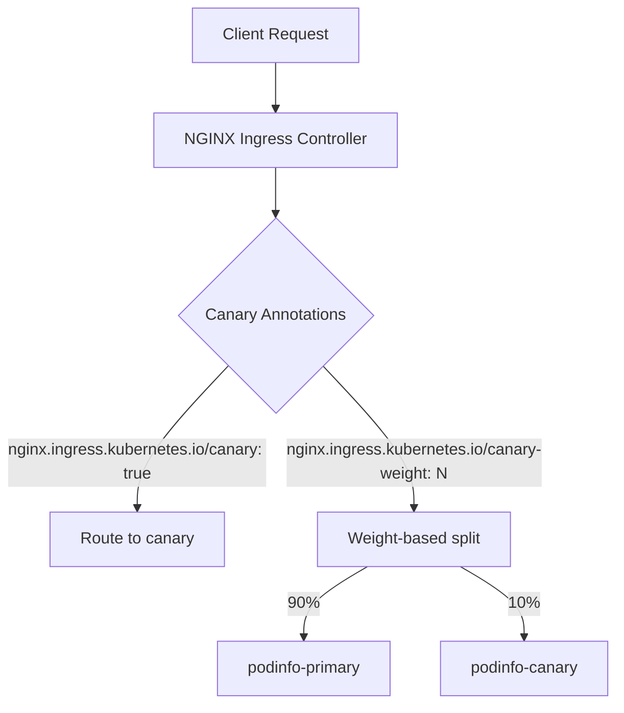

# How to Configure Flagger with NGINX Ingress and Flux

Author: [nawazdhandala](https://github.com/nawazdhandala)

Tags: Flux, Flagger, NGINX, Ingresses, Progressive Delivery, Canary, Kubernetes, GitOps

Description: A step-by-step guide to setting up Flagger with NGINX Ingress Controller and Flux for automated canary deployments using ingress-level traffic splitting.

---

## Introduction

Flagger can work with the NGINX Ingress Controller to perform canary deployments without requiring a full service mesh. NGINX Ingress supports traffic splitting through canary annotations, and Flagger automates this process by gradually shifting traffic based on metric analysis.

This guide walks you through installing NGINX Ingress, configuring Flagger, and deploying an application with automated canary releases managed by Flux.

## Prerequisites

- A running Kubernetes cluster (v1.25 or later)
- kubectl configured for your cluster
- Flux CLI installed
- A Git repository for Flux

## Step 1: Bootstrap Flux

Bootstrap Flux to connect your cluster to a Git repository:

```bash
flux bootstrap github \
  --owner=your-org \
  --repository=fleet-infra \
  --branch=main \
  --path=clusters/my-cluster \
  --personal
```

## Step 2: Install NGINX Ingress Controller via Flux

Create a HelmRepository and HelmRelease for the NGINX Ingress Controller.

```yaml
# nginx-ingress-helmrepository.yaml
apiVersion: source.toolkit.fluxcd.io/v1
kind: HelmRepository
metadata:
  name: ingress-nginx
  namespace: flux-system
spec:
  interval: 1h
  url: https://kubernetes.github.io/ingress-nginx
```

```yaml
# nginx-ingress-helmrelease.yaml
apiVersion: helm.toolkit.fluxcd.io/v1
kind: HelmRelease
metadata:
  name: ingress-nginx
  namespace: ingress-nginx
spec:
  interval: 1h
  chart:
    spec:
      chart: ingress-nginx
      version: "4.x"
      sourceRef:
        kind: HelmRepository
        name: ingress-nginx
        namespace: flux-system
  install:
    createNamespace: true
  values:
    controller:
      # Enable Prometheus metrics for Flagger analysis
      metrics:
        enabled: true
        serviceMonitor:
          enabled: false
      podAnnotations:
        prometheus.io/scrape: "true"
        prometheus.io/port: "10254"
```

## Step 3: Install Prometheus for Metrics

Flagger needs a metrics source to evaluate canary health. Install Prometheus to scrape NGINX Ingress metrics.

```yaml
# prometheus-helmrepository.yaml
apiVersion: source.toolkit.fluxcd.io/v1
kind: HelmRepository
metadata:
  name: prometheus-community
  namespace: flux-system
spec:
  interval: 1h
  url: https://prometheus-community.github.io/helm-charts
```

```yaml
# prometheus-helmrelease.yaml
apiVersion: helm.toolkit.fluxcd.io/v1
kind: HelmRelease
metadata:
  name: prometheus
  namespace: monitoring
spec:
  interval: 1h
  chart:
    spec:
      chart: prometheus
      version: "25.x"
      sourceRef:
        kind: HelmRepository
        name: prometheus-community
        namespace: flux-system
  install:
    createNamespace: true
  values:
    # Minimal Prometheus setup for Flagger
    alertmanager:
      enabled: false
    prometheus-pushgateway:
      enabled: false
    server:
      persistentVolume:
        enabled: false
```

## Step 4: Install Flagger with NGINX Provider

Deploy Flagger configured for the NGINX Ingress provider.

```yaml
# flagger-helmrepository.yaml
apiVersion: source.toolkit.fluxcd.io/v1
kind: HelmRepository
metadata:
  name: flagger
  namespace: flux-system
spec:
  interval: 1h
  url: https://flagger.app
```

```yaml
# flagger-helmrelease.yaml
apiVersion: helm.toolkit.fluxcd.io/v1
kind: HelmRelease
metadata:
  name: flagger
  namespace: flux-system
spec:
  interval: 1h
  chart:
    spec:
      chart: flagger
      version: "1.x"
      sourceRef:
        kind: HelmRepository
        name: flagger
        namespace: flux-system
  values:
    # Use NGINX as the mesh/ingress provider
    meshProvider: nginx
    # Point to the Prometheus server for metrics
    metricsServer: http://prometheus-server.monitoring:80
```

## Step 5: Push and Reconcile

```bash
git add -A && git commit -m "Add NGINX Ingress, Prometheus, and Flagger"
git push
flux reconcile kustomization flux-system --with-source
```

## Step 6: Deploy the Application

Create the application namespace, deployment, service, and ingress.

```yaml
# namespace.yaml
apiVersion: v1
kind: Namespace
metadata:
  name: demo
```

```yaml
# deployment.yaml
apiVersion: apps/v1
kind: Deployment
metadata:
  name: podinfo
  namespace: demo
spec:
  replicas: 2
  selector:
    matchLabels:
      app: podinfo
  template:
    metadata:
      labels:
        app: podinfo
    spec:
      containers:
        - name: podinfo
          image: ghcr.io/stefanprodan/podinfo:6.3.0
          ports:
            - containerPort: 9898
              name: http
          resources:
            requests:
              cpu: 100m
              memory: 64Mi
```

```yaml
# service.yaml
apiVersion: v1
kind: Service
metadata:
  name: podinfo
  namespace: demo
spec:
  type: ClusterIP
  selector:
    app: podinfo
  ports:
    - name: http
      port: 9898
      targetPort: http
```

```yaml
# ingress.yaml
apiVersion: networking.k8s.io/v1
kind: Ingress
metadata:
  name: podinfo
  namespace: demo
  annotations:
    kubernetes.io/ingress.class: nginx
spec:
  rules:
    - host: podinfo.example.com
      http:
        paths:
          - path: /
            pathType: Prefix
            backend:
              service:
                name: podinfo
                port:
                  number: 9898
```

## Step 7: Create the Canary Resource

Define the Flagger Canary resource for NGINX-based traffic splitting.

```yaml
# canary.yaml
apiVersion: flagger.app/v1beta1
kind: Canary
metadata:
  name: podinfo
  namespace: demo
spec:
  targetRef:
    apiVersion: apps/v1
    kind: Deployment
    name: podinfo
  # Reference the ingress for NGINX canary annotations
  ingressRef:
    apiVersion: networking.k8s.io/v1
    kind: Ingress
    name: podinfo
  service:
    port: 9898
    targetPort: http
  analysis:
    # How often to run the analysis
    interval: 1m
    # Max number of failed checks before rollback
    threshold: 5
    # Max canary traffic weight
    maxWeight: 50
    # Canary traffic increment per step
    stepWeight: 10
    metrics:
      - name: request-success-rate
        # Minimum percentage of successful requests
        thresholdRange:
          min: 99
        interval: 1m
      - name: request-duration
        # Maximum p99 latency in milliseconds
        thresholdRange:
          max: 500
        interval: 1m
```

## Step 8: Commit and Deploy

```bash
git add -A && git commit -m "Add podinfo with NGINX canary"
git push
flux reconcile kustomization flux-system --with-source
```

## Step 9: Verify the Setup

Check that Flagger has initialized the canary:

```bash
# Check canary status
kubectl get canary -n demo

# Verify Flagger created the canary ingress
kubectl get ingress -n demo
```

Flagger creates a second ingress with NGINX canary annotations. You should see both `podinfo` and `podinfo-canary` ingresses:

```bash
kubectl get ingress -n demo -o wide
```

## Step 10: Trigger a Canary Release

Update the image to trigger a new rollout:

```yaml
# Update deployment.yaml
spec:
  template:
    spec:
      containers:
        - name: podinfo
          # Bump the version to trigger canary analysis
          image: ghcr.io/stefanprodan/podinfo:6.4.0
```

```bash
git add -A && git commit -m "Update podinfo to 6.4.0"
git push
flux reconcile kustomization flux-system --with-source
```

## How NGINX Canary Annotations Work

When Flagger detects a new revision, it creates a canary ingress with the following NGINX annotations:



Flagger adjusts the `canary-weight` annotation at each step of the analysis. The NGINX Ingress Controller reads this annotation and splits traffic accordingly.

## Step 11: Monitor the Rollout

Watch the canary progression:

```bash
# Watch canary events
kubectl describe canary podinfo -n demo

# Check Flagger logs
kubectl logs -f deploy/flagger -n flux-system

# Observe NGINX metrics
kubectl port-forward -n monitoring svc/prometheus-server 9090:80
```

## Step 12: Configure Custom Metric Templates

You can define custom NGINX metrics for more granular analysis.

```yaml
# metric-template.yaml
apiVersion: flagger.app/v1beta1
kind: MetricTemplate
metadata:
  name: nginx-error-rate
  namespace: demo
spec:
  provider:
    type: prometheus
    address: http://prometheus-server.monitoring:80
  query: |
    # Calculate the error rate for the canary ingress
    sum(rate(
      nginx_ingress_controller_requests{
        namespace="{{ namespace }}",
        ingress="{{ ingress }}-canary",
        status=~"5.."
      }[{{ interval }}]
    )) /
    sum(rate(
      nginx_ingress_controller_requests{
        namespace="{{ namespace }}",
        ingress="{{ ingress }}-canary"
      }[{{ interval }}]
    )) * 100
```

Reference the custom metric in your canary:

```yaml
spec:
  analysis:
    metrics:
      - name: nginx-error-rate
        # Maximum error rate percentage
        thresholdRange:
          max: 1
        interval: 1m
        templateRef:
          name: nginx-error-rate
          namespace: demo
```

## Troubleshooting

### Canary ingress not created

Ensure the `ingressRef` in the Canary resource matches the name of your ingress exactly. Also verify the ingress class is set to nginx.

### Metrics returning no data

Check that Prometheus is scraping NGINX metrics:

```bash
# Port-forward to Prometheus and verify NGINX metrics exist
kubectl port-forward -n monitoring svc/prometheus-server 9090:80
# Query: nginx_ingress_controller_requests
```

### Traffic not splitting

Verify that the canary ingress has the correct annotations:

```bash
kubectl get ingress podinfo-canary -n demo -o yaml | grep -A5 annotations
```

## Summary

You have configured Flagger with NGINX Ingress Controller and Flux for automated canary deployments. This approach provides progressive delivery without the overhead of a service mesh. Key points:

- NGINX Ingress handles traffic splitting via canary annotations
- Prometheus collects NGINX metrics for Flagger analysis
- Flagger automates the weight adjustment and rollback decisions
- Flux ensures all configuration is managed through GitOps
