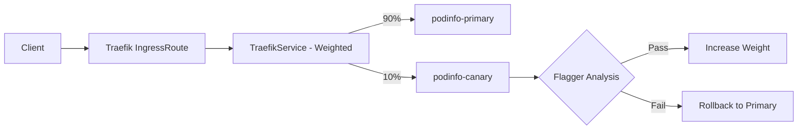

# How to Configure Flagger with Traefik Ingress and Flux

Author: [nawazdhandala](https://github.com/nawazdhandala)

Tags: flux, Flagger, Traefik, Ingress, Progressive Delivery, Canary, Kubernetes, GitOps

Description: Learn how to set up Flagger with Traefik Ingress Controller and Flux for progressive canary deployments using TraefikService weighted routing.

---

## Introduction

Traefik is a popular cloud-native ingress controller that supports weighted traffic splitting through its TraefikService custom resource. Flagger integrates with Traefik to automate canary deployments by adjusting service weights during progressive delivery.

This guide covers installing Traefik, configuring Flagger for the Traefik provider, and setting up a complete canary deployment pipeline managed by Flux.

## Prerequisites

- A running Kubernetes cluster (v1.25 or later)
- kubectl configured for your cluster
- Flux CLI installed
- A Git repository connected to Flux

## Step 1: Bootstrap Flux

```bash
flux bootstrap github \
  --owner=your-org \
  --repository=fleet-infra \
  --branch=main \
  --path=clusters/my-cluster \
  --personal
```

## Step 2: Install Traefik via Flux

Create the Helm resources for Traefik.

```yaml
# traefik-helmrepository.yaml
apiVersion: source.toolkit.fluxcd.io/v1
kind: HelmRepository
metadata:
  name: traefik
  namespace: flux-system
spec:
  interval: 1h
  url: https://traefik.github.io/charts
```

```yaml
# traefik-helmrelease.yaml
apiVersion: helm.toolkit.fluxcd.io/v1
kind: HelmRelease
metadata:
  name: traefik
  namespace: traefik
spec:
  interval: 1h
  chart:
    spec:
      chart: traefik
      version: "26.x"
      sourceRef:
        kind: HelmRepository
        name: traefik
        namespace: flux-system
  install:
    createNamespace: true
  values:
    # Enable Prometheus metrics for Flagger analysis
    metrics:
      prometheus:
        entryPoint: metrics
    # Expose the metrics entrypoint
    ports:
      metrics:
        port: 9100
        expose:
          default: false
        exposedPort: 9100
    # Enable access logs for detailed request tracking
    logs:
      access:
        enabled: true
```

## Step 3: Install Prometheus

```yaml
# prometheus-helmrepository.yaml
apiVersion: source.toolkit.fluxcd.io/v1
kind: HelmRepository
metadata:
  name: prometheus-community
  namespace: flux-system
spec:
  interval: 1h
  url: https://prometheus-community.github.io/helm-charts
```

```yaml
# prometheus-helmrelease.yaml
apiVersion: helm.toolkit.fluxcd.io/v1
kind: HelmRelease
metadata:
  name: prometheus
  namespace: monitoring
spec:
  interval: 1h
  chart:
    spec:
      chart: prometheus
      version: "25.x"
      sourceRef:
        kind: HelmRepository
        name: prometheus-community
        namespace: flux-system
  install:
    createNamespace: true
  values:
    alertmanager:
      enabled: false
    prometheus-pushgateway:
      enabled: false
    server:
      persistentVolume:
        enabled: false
    # Add a scrape config for Traefik metrics
    extraScrapeConfigs: |
      - job_name: traefik
        kubernetes_sd_configs:
          - role: pod
        relabel_configs:
          - source_labels: [__meta_kubernetes_pod_label_app_kubernetes_io_name]
            action: keep
            regex: traefik
          - source_labels: [__meta_kubernetes_pod_annotation_prometheus_io_port]
            action: replace
            target_label: __address__
            regex: (.+)
            replacement: ${1}:9100
```

## Step 4: Install Flagger with Traefik Provider

```yaml
# flagger-helmrepository.yaml
apiVersion: source.toolkit.fluxcd.io/v1
kind: HelmRepository
metadata:
  name: flagger
  namespace: flux-system
spec:
  interval: 1h
  url: https://flagger.app
```

```yaml
# flagger-helmrelease.yaml
apiVersion: helm.toolkit.fluxcd.io/v1
kind: HelmRelease
metadata:
  name: flagger
  namespace: flux-system
spec:
  interval: 1h
  chart:
    spec:
      chart: flagger
      version: "1.x"
      sourceRef:
        kind: HelmRepository
        name: flagger
        namespace: flux-system
  values:
    # Configure Flagger for Traefik
    meshProvider: traefik
    metricsServer: http://prometheus-server.monitoring:80
```

## Step 5: Reconcile All Infrastructure

```bash
git add -A && git commit -m "Add Traefik, Prometheus, and Flagger"
git push
flux reconcile kustomization flux-system --with-source
```

Verify all components are running:

```bash
kubectl get pods -n traefik
kubectl get pods -n monitoring
kubectl get pods -n flux-system
```

## Step 6: Deploy Your Application

```yaml
# namespace.yaml
apiVersion: v1
kind: Namespace
metadata:
  name: demo
```

```yaml
# deployment.yaml
apiVersion: apps/v1
kind: Deployment
metadata:
  name: podinfo
  namespace: demo
spec:
  replicas: 2
  selector:
    matchLabels:
      app: podinfo
  template:
    metadata:
      labels:
        app: podinfo
    spec:
      containers:
        - name: podinfo
          image: ghcr.io/stefanprodan/podinfo:6.3.0
          ports:
            - containerPort: 9898
              name: http
          resources:
            requests:
              cpu: 100m
              memory: 64Mi
```

```yaml
# service.yaml
apiVersion: v1
kind: Service
metadata:
  name: podinfo
  namespace: demo
spec:
  type: ClusterIP
  selector:
    app: podinfo
  ports:
    - name: http
      port: 9898
      targetPort: http
```

## Step 7: Create Traefik IngressRoute

Define a Traefik IngressRoute that points to a TraefikService. Flagger will manage the TraefikService to handle traffic splitting.

```yaml
# ingressroute.yaml
apiVersion: traefik.io/v1alpha1
kind: IngressRoute
metadata:
  name: podinfo
  namespace: demo
spec:
  entryPoints:
    - web
  routes:
    - match: Host(`podinfo.example.com`)
      kind: Rule
      services:
        # This TraefikService will be created by Flagger
        - name: podinfo
          kind: TraefikService
          namespace: demo
```

## Step 8: Create the Canary Resource

```yaml
# canary.yaml
apiVersion: flagger.app/v1beta1
kind: Canary
metadata:
  name: podinfo
  namespace: demo
spec:
  targetRef:
    apiVersion: apps/v1
    kind: Deployment
    name: podinfo
  service:
    port: 9898
    targetPort: http
  analysis:
    # Run analysis every 30 seconds
    interval: 30s
    # Rollback after 5 failed checks
    threshold: 5
    # Maximum canary traffic percentage
    maxWeight: 50
    # Weight increase per step
    stepWeight: 10
    metrics:
      - name: request-success-rate
        thresholdRange:
          min: 99
        interval: 1m
      - name: request-duration
        thresholdRange:
          max: 500
        interval: 1m
```

## Step 9: Deploy and Verify

```bash
git add -A && git commit -m "Add podinfo with Traefik canary"
git push
flux reconcile kustomization flux-system --with-source
```

Verify that Flagger initialized the canary:

```bash
# Check canary status
kubectl get canary -n demo

# Verify Flagger created the TraefikService
kubectl get traefikservice -n demo
```

Flagger creates a TraefikService that defines the weighted routing between primary and canary:

```bash
# Inspect the TraefikService weights
kubectl get traefikservice podinfo -n demo -o yaml
```

## Step 10: Trigger a Canary Deployment

```yaml
# Update deployment.yaml image tag
spec:
  template:
    spec:
      containers:
        - name: podinfo
          # New version triggers progressive delivery
          image: ghcr.io/stefanprodan/podinfo:6.4.0
```

```bash
git add -A && git commit -m "Bump podinfo to 6.4.0"
git push
flux reconcile kustomization flux-system --with-source
```

## How Traefik Traffic Splitting Works

Flagger manages a TraefikService resource that defines weighted routing between the primary and canary services:



## Step 11: Monitor the Rollout

```bash
# Watch canary events
kubectl describe canary podinfo -n demo

# View Flagger logs
kubectl logs -f deploy/flagger -n flux-system

# Check TraefikService weight distribution
kubectl get traefikservice podinfo -n demo -o jsonpath='{.spec.weighted}'
```

## Step 12: Add Custom Traefik Metrics

Create a custom MetricTemplate for Traefik-specific metrics:

```yaml
# metric-template.yaml
apiVersion: flagger.app/v1beta1
kind: MetricTemplate
metadata:
  name: traefik-error-rate
  namespace: demo
spec:
  provider:
    type: prometheus
    address: http://prometheus-server.monitoring:80
  query: |
    # Calculate the 5xx error rate for the canary service
    sum(rate(
      traefik_service_requests_total{
        service=~"{{ namespace }}-podinfo-canary-.*",
        code=~"5.."
      }[{{ interval }}]
    )) /
    sum(rate(
      traefik_service_requests_total{
        service=~"{{ namespace }}-podinfo-canary-.*"
      }[{{ interval }}]
    )) * 100
```

Reference in your canary:

```yaml
spec:
  analysis:
    metrics:
      - name: traefik-error-rate
        thresholdRange:
          max: 1
        interval: 1m
        templateRef:
          name: traefik-error-rate
          namespace: demo
```

## Troubleshooting

### TraefikService not created

Ensure Traefik CRDs are installed. The TraefikService CRD is required for weighted routing:

```bash
kubectl get crd traefikservices.traefik.io
```

### Canary not receiving traffic

Verify the IngressRoute points to the TraefikService (not the regular Service) and that the kind is set to `TraefikService`.

### Metrics unavailable

Check that Prometheus is scraping Traefik metrics:

```bash
kubectl port-forward -n monitoring svc/prometheus-server 9090:80
# Query: traefik_service_requests_total
```

## Summary

You have configured Flagger with Traefik Ingress and Flux for automated canary deployments. The setup uses:

- Traefik TraefikService resources for weighted traffic splitting
- Prometheus for collecting Traefik request metrics
- Flagger for automating the progressive delivery process
- Flux for GitOps-driven configuration management

This provides a lightweight progressive delivery solution that leverages Traefik's native traffic management capabilities.
