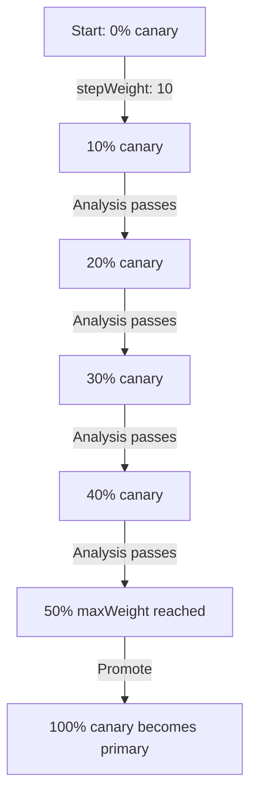

# How to Configure Flagger Traffic Weight Increments in Flux

Author: [nawazdhandala](https://github.com/nawazdhandala)

Tags: flux, flagger, Canary, traffic, weight, increments, Kubernetes, progressive-delivery

Description: A practical guide to configuring traffic weight increments for Flagger canary deployments in Flux CD to control the pace of progressive delivery.

---

## Introduction

Traffic weight increments determine how quickly Flagger shifts traffic from the primary to the canary version during a progressive deployment. Choosing the right increment strategy directly impacts both deployment speed and risk exposure. Small increments provide more safety but take longer; large increments are faster but riskier.

This guide explains how to configure and fine-tune traffic weight increments for Flagger canary deployments managed by Flux CD.

## Prerequisites

- A Kubernetes cluster with Flux CD installed
- Flagger installed with a supported service mesh (Istio, Linkerd, or Nginx)
- Prometheus for metrics collection
- Basic understanding of canary deployment concepts

## How Traffic Weight Increments Work

Flagger uses three key parameters to control traffic shifting:

- **stepWeight**: The percentage of traffic to add to the canary at each successful analysis interval
- **maxWeight**: The maximum percentage of traffic the canary will receive before promotion
- **stepWeightPromotion**: The increment used during the final promotion phase



## Step 1: Basic Linear Traffic Weight Configuration

The simplest configuration uses a constant step weight.

```yaml
# apps/my-app/canary.yaml
apiVersion: flagger.app/v1beta1
kind: Canary
metadata:
  name: my-app
  namespace: production
spec:
  targetRef:
    apiVersion: apps/v1
    kind: Deployment
    name: my-app
  service:
    port: 80
    targetPort: 8080
  analysis:
    # Time between each traffic increment
    interval: 1m
    # Number of failed checks before rollback
    threshold: 2
    # Traffic increment per successful analysis (percentage)
    # Each passing check adds 10% more traffic to canary
    stepWeight: 10
    # Maximum traffic percentage for canary
    # Once this is reached, Flagger promotes the canary
    maxWeight: 50
    metrics:
      - name: request-success-rate
        thresholdRange:
          min: 99
        interval: 1m
```

With this configuration, the traffic progression looks like:

| Step | Time | Primary | Canary | Action |
|------|------|---------|--------|--------|
| 0 | 0m | 100% | 0% | Canary detected |
| 1 | 1m | 90% | 10% | Analysis passes |
| 2 | 2m | 80% | 20% | Analysis passes |
| 3 | 3m | 70% | 30% | Analysis passes |
| 4 | 4m | 60% | 40% | Analysis passes |
| 5 | 5m | 50% | 50% | Max weight, promote |

## Step 2: Conservative Small Increments

For critical production services, use small increments to minimize risk.

```yaml
# apps/my-app/canary-conservative.yaml
apiVersion: flagger.app/v1beta1
kind: Canary
metadata:
  name: my-app
  namespace: production
spec:
  targetRef:
    apiVersion: apps/v1
    kind: Deployment
    name: my-app
  service:
    port: 80
    targetPort: 8080
  analysis:
    # Longer interval for thorough analysis
    interval: 2m
    # Low tolerance for failures
    threshold: 1
    # Very small increments for safety
    # Only 2% traffic increase per step
    stepWeight: 2
    # Cap at 30% before promoting
    maxWeight: 30
    metrics:
      - name: request-success-rate
        thresholdRange:
          # Very high success rate required
          min: 99.9
        interval: 2m
      - name: request-duration
        thresholdRange:
          max: 200
        interval: 2m
```

This configuration takes approximately 30 minutes to reach max weight (15 steps at 2 minutes each), providing extensive analysis time.

## Step 3: Aggressive Fast Increments

For non-critical services or development environments, use larger increments.

```yaml
# apps/my-app/canary-aggressive.yaml
apiVersion: flagger.app/v1beta1
kind: Canary
metadata:
  name: my-app
  namespace: staging
spec:
  targetRef:
    apiVersion: apps/v1
    kind: Deployment
    name: my-app
  service:
    port: 80
    targetPort: 8080
  analysis:
    # Short interval for fast feedback
    interval: 30s
    # Higher tolerance for failures
    threshold: 5
    # Large increments for speed
    # 20% traffic increase per step
    stepWeight: 20
    # High max weight before promotion
    maxWeight: 80
    metrics:
      - name: request-success-rate
        thresholdRange:
          # Lower success rate acceptable
          min: 95
        interval: 30s
```

This reaches 80% in just 2 minutes (4 steps at 30 seconds each).

## Step 4: Stepped Weight with Promotion Increments

Control the promotion phase separately from the analysis phase.

```yaml
# apps/my-app/canary-stepped.yaml
apiVersion: flagger.app/v1beta1
kind: Canary
metadata:
  name: my-app
  namespace: production
spec:
  targetRef:
    apiVersion: apps/v1
    kind: Deployment
    name: my-app
  service:
    port: 80
    targetPort: 8080
  analysis:
    interval: 1m
    threshold: 2
    # Moderate analysis increment
    stepWeight: 10
    maxWeight: 50
    # Separate increment for the promotion phase
    # Once analysis passes, promote traffic in 20% increments
    stepWeightPromotion: 20
    metrics:
      - name: request-success-rate
        thresholdRange:
          min: 99
        interval: 1m
```

## Step 5: Iteration-Based Promotion (Blue/Green Style)

For blue/green deployments, use iterations instead of traffic weight.

```yaml
# apps/my-app/canary-bluegreen.yaml
apiVersion: flagger.app/v1beta1
kind: Canary
metadata:
  name: my-app
  namespace: production
spec:
  targetRef:
    apiVersion: apps/v1
    kind: Deployment
    name: my-app
  service:
    port: 80
    targetPort: 8080
  analysis:
    # Number of successful checks required before promotion
    # No gradual traffic shifting; all-or-nothing switch
    iterations: 10
    interval: 1m
    threshold: 2
    # No stepWeight or maxWeight needed for blue/green
    metrics:
      - name: request-success-rate
        thresholdRange:
          min: 99
        interval: 1m
      - name: request-duration
        thresholdRange:
          max: 500
        interval: 1m
    webhooks:
      # Mirror traffic to canary for testing
      - name: load-test
        type: rollout
        url: http://flagger-loadtester.flagger-system/
        timeout: 5m
        metadata:
          type: cmd
          cmd: "hey -z 1m -q 10 -c 2 http://my-app-canary.production:8080/"
```

## Step 6: Use Kustomize Overlays for Per-Environment Weights

Define different weight strategies per environment.

```yaml
# base/canary.yaml
apiVersion: flagger.app/v1beta1
kind: Canary
metadata:
  name: my-app
spec:
  targetRef:
    apiVersion: apps/v1
    kind: Deployment
    name: my-app
  service:
    port: 80
    targetPort: 8080
  analysis:
    interval: 1m
    threshold: 2
    stepWeight: 10
    maxWeight: 50
    metrics:
      - name: request-success-rate
        thresholdRange:
          min: 99
        interval: 1m
```

```yaml
# overlays/staging/canary-patch.yaml
apiVersion: flagger.app/v1beta1
kind: Canary
metadata:
  name: my-app
spec:
  analysis:
    # Fast increments for staging
    interval: 30s
    threshold: 5
    stepWeight: 20
    maxWeight: 80
```

```yaml
# overlays/production/canary-patch.yaml
apiVersion: flagger.app/v1beta1
kind: Canary
metadata:
  name: my-app
spec:
  analysis:
    # Conservative increments for production
    interval: 2m
    threshold: 1
    stepWeight: 2
    maxWeight: 30
```

```yaml
# overlays/staging/kustomization.yaml
apiVersion: kustomize.config.k8s.io/v1beta1
kind: Kustomization
resources:
  - ../../base
patchesStrategicMerge:
  - canary-patch.yaml
```

## Step 7: Deploy with Flux

```yaml
# flux/staging-kustomization.yaml
apiVersion: kustomize.toolkit.fluxcd.io/v1
kind: Kustomization
metadata:
  name: my-app-staging
  namespace: flux-system
spec:
  interval: 5m
  sourceRef:
    kind: GitRepository
    name: my-app
  path: ./overlays/staging
  prune: true
---
# flux/production-kustomization.yaml
apiVersion: kustomize.toolkit.fluxcd.io/v1
kind: Kustomization
metadata:
  name: my-app-production
  namespace: flux-system
spec:
  interval: 10m
  sourceRef:
    kind: GitRepository
    name: my-app
  path: ./overlays/production
  prune: true
  dependsOn:
    - name: my-app-staging
```

## Step 8: Monitor Traffic Weight Progression

Watch the traffic weight as it increases during a canary.

```bash
# Watch canary weight in real time
kubectl get canary my-app -n production -w

# Get detailed canary status including current weight
kubectl describe canary my-app -n production | grep -A 5 "Status"

# Check the virtual service for actual traffic routing
kubectl get virtualservice my-app -n production -o yaml | grep -A 10 "weight"

# View Flagger logs for weight change events
kubectl logs -n flagger-system deployment/flagger -f | grep "weight"
```

## Choosing the Right Increment Strategy

| Service Type | stepWeight | maxWeight | interval | Total Time |
|-------------|-----------|-----------|----------|------------|
| Payment API | 2 | 20 | 3m | 30 min |
| User-facing web | 5 | 50 | 2m | 20 min |
| Internal API | 10 | 50 | 1m | 5 min |
| Background worker | 20 | 80 | 30s | 2 min |
| Dev/staging | 25 | 100 | 15s | 1 min |

## Troubleshooting

### Traffic Weight Not Increasing

If the canary stays at the initial weight:

```bash
# Check if metrics are returning valid data
kubectl logs -n flagger-system deployment/flagger | grep "metric"

# Verify the service mesh is correctly routing traffic
# For Istio:
kubectl get virtualservice -n production -o yaml
# For Linkerd:
kubectl get trafficsplit -n production -o yaml
```

### Canary Skipping Weight Steps

If traffic jumps unexpectedly, check that the analysis interval is long enough for metrics to stabilize and that your metrics provider is returning data for every interval.

### Traffic Not Reaching Canary

Ensure your service mesh is properly configured and that the canary pods are receiving traffic:

```bash
# Verify canary pods are running and ready
kubectl get pods -n production -l app=my-app

# Check that the canary service exists
kubectl get svc -n production | grep my-app-canary
```

## Summary

Configuring traffic weight increments in Flagger gives you fine-grained control over the pace of progressive delivery. Small step weights (2-5%) are ideal for critical production services where safety is paramount, while larger increments (15-25%) work well for development environments and non-critical services. Using Kustomize overlays with Flux lets you maintain different strategies per environment from a single codebase. The key is matching your increment strategy to the risk profile of each service and environment.
