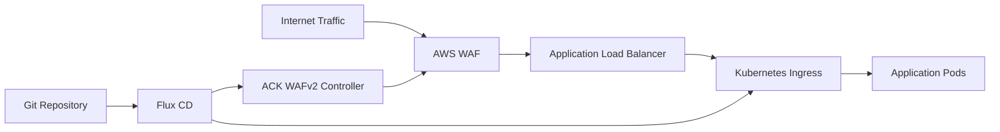

# How to Configure Flux CD with AWS WAF

Author: [nawazdhandala](https://github.com/nawazdhandala)

Tags: flux cd, aws waf, web application firewall, alb, security, kubernetes, gitops

Description: Deploy and manage AWS WAF rules and Web ACLs through Flux CD for GitOps-driven web application security on Kubernetes.

---

## Introduction

AWS WAF (Web Application Firewall) protects your web applications from common exploits and bots. By managing WAF configurations through Flux CD, you can version-control your security rules, review changes through pull requests, and automatically apply WAF policies across all your environments.

This guide covers deploying WAF Web ACLs, associating them with Application Load Balancers managed by Kubernetes Ingress, and managing rule groups through GitOps.

## Prerequisites

Before starting, ensure you have:

- An Amazon EKS cluster running Kubernetes 1.25 or later
- Flux CD installed and bootstrapped
- AWS Load Balancer Controller deployed (see the ALB controller guide)
- AWS CLI configured with appropriate permissions
- kubectl access to the cluster

## Architecture Overview



## Step 1: Create a WAF Web ACL via AWS CLI

First, create a WAF Web ACL that will protect your applications.

```bash
# Create a Web ACL with managed rule groups
aws wafv2 create-web-acl \
  --name "flux-managed-web-acl" \
  --scope REGIONAL \
  --default-action Allow={} \
  --region us-east-1 \
  --visibility-config \
    SampledRequestsEnabled=true,CloudWatchMetricsEnabled=true,MetricName=FluxManagedWebACL \
  --rules file://waf-rules.json
```

## Step 2: Define WAF Rules

Create the rules file with AWS managed rule groups and custom rules.

```json
[
  {
    "Name": "AWS-AWSManagedRulesCommonRuleSet",
    "Priority": 1,
    "Statement": {
      "ManagedRuleGroupStatement": {
        "VendorName": "AWS",
        "Name": "AWSManagedRulesCommonRuleSet",
        "ExcludedRules": []
      }
    },
    "OverrideAction": { "None": {} },
    "VisibilityConfig": {
      "SampledRequestsEnabled": true,
      "CloudWatchMetricsEnabled": true,
      "MetricName": "AWSCommonRules"
    }
  },
  {
    "Name": "AWS-AWSManagedRulesKnownBadInputsRuleSet",
    "Priority": 2,
    "Statement": {
      "ManagedRuleGroupStatement": {
        "VendorName": "AWS",
        "Name": "AWSManagedRulesKnownBadInputsRuleSet"
      }
    },
    "OverrideAction": { "None": {} },
    "VisibilityConfig": {
      "SampledRequestsEnabled": true,
      "CloudWatchMetricsEnabled": true,
      "MetricName": "AWSKnownBadInputs"
    }
  },
  {
    "Name": "AWS-AWSManagedRulesSQLiRuleSet",
    "Priority": 3,
    "Statement": {
      "ManagedRuleGroupStatement": {
        "VendorName": "AWS",
        "Name": "AWSManagedRulesSQLiRuleSet"
      }
    },
    "OverrideAction": { "None": {} },
    "VisibilityConfig": {
      "SampledRequestsEnabled": true,
      "CloudWatchMetricsEnabled": true,
      "MetricName": "AWSSQLiRules"
    }
  },
  {
    "Name": "RateLimitRule",
    "Priority": 4,
    "Statement": {
      "RateBasedStatement": {
        "Limit": 2000,
        "AggregateKeyType": "IP"
      }
    },
    "Action": { "Block": {} },
    "VisibilityConfig": {
      "SampledRequestsEnabled": true,
      "CloudWatchMetricsEnabled": true,
      "MetricName": "RateLimitRule"
    }
  }
]
```

## Step 3: Manage WAF with ACK WAFv2 Controller

Deploy the ACK WAFv2 controller to manage WAF resources as Kubernetes custom resources.

```bash
# Create IAM role for WAFv2 controller
ACCOUNT_ID=$(aws sts get-caller-identity --query Account --output text)
OIDC_PROVIDER=$(aws eks describe-cluster \
  --name my-cluster \
  --query "cluster.identity.oidc.issuer" \
  --output text | sed 's|https://||')

cat > waf-trust-policy.json <<EOF
{
  "Version": "2012-10-17",
  "Statement": [
    {
      "Effect": "Allow",
      "Principal": {
        "Federated": "arn:aws:iam::${ACCOUNT_ID}:oidc-provider/${OIDC_PROVIDER}"
      },
      "Action": "sts:AssumeRoleWithWebIdentity",
      "Condition": {
        "StringEquals": {
          "${OIDC_PROVIDER}:sub": "system:serviceaccount:ack-system:ack-wafv2-controller",
          "${OIDC_PROVIDER}:aud": "sts.amazonaws.com"
        }
      }
    }
  ]
}
EOF

aws iam create-role \
  --role-name ack-wafv2-controller \
  --assume-role-policy-document file://waf-trust-policy.json

aws iam attach-role-policy \
  --role-name ack-wafv2-controller \
  --policy-arn arn:aws:iam::aws:policy/AWSWAFFullAccess
```

```yaml
# infrastructure/waf/ack-wafv2-controller.yaml
apiVersion: helm.toolkit.fluxcd.io/v2
kind: HelmRelease
metadata:
  name: ack-wafv2-controller
  namespace: ack-system
spec:
  interval: 15m
  chart:
    spec:
      chart: wafv2-chart
      version: "1.0.x"
      sourceRef:
        kind: HelmRepository
        name: ack-charts
        namespace: flux-system
  install:
    createNamespace: true
    remediation:
      retries: 3
  values:
    aws:
      region: us-east-1
    serviceAccount:
      annotations:
        eks.amazonaws.com/role-arn: arn:aws:iam::123456789012:role/ack-wafv2-controller
```

## Step 4: Define WAF Web ACL as Kubernetes Resource

With the ACK controller running, define your WAF configuration as Kubernetes manifests.

```yaml
# infrastructure/waf/ip-set.yaml
# Define an IP set for whitelisting
apiVersion: wafv2.services.k8s.aws/v1alpha1
kind: IPSet
metadata:
  name: trusted-ips
  namespace: default
spec:
  name: trusted-ips
  scope: REGIONAL
  ipAddressVersion: IPV4
  addresses:
    - "10.0.0.0/8"
    - "172.16.0.0/12"
    - "192.168.0.0/16"
  description: "Trusted internal IP ranges"
  tags:
    - key: ManagedBy
      value: flux-cd
```

```yaml
# infrastructure/waf/regex-pattern-set.yaml
# Define regex patterns for matching
apiVersion: wafv2.services.k8s.aws/v1alpha1
kind: RegexPatternSet
metadata:
  name: blocked-user-agents
  namespace: default
spec:
  name: blocked-user-agents
  scope: REGIONAL
  regularExpressionList:
    - regexString: ".*BadBot.*"
    - regexString: ".*Scrapy.*"
    - regexString: ".*curl/.*"
  description: "User agents to block"
  tags:
    - key: ManagedBy
      value: flux-cd
```

## Step 5: Create the Web ACL as a Kubernetes Resource

```yaml
# infrastructure/waf/web-acl.yaml
apiVersion: wafv2.services.k8s.aws/v1alpha1
kind: WebACL
metadata:
  name: app-web-acl
  namespace: default
spec:
  name: flux-managed-app-web-acl
  scope: REGIONAL
  defaultAction:
    allow: {}
  visibilityConfig:
    sampledRequestsEnabled: true
    cloudWatchMetricsEnabled: true
    metricName: FluxManagedAppWebACL
  rules:
    # AWS Managed Common Rule Set
    - name: AWSCommonRules
      priority: 1
      statement:
        managedRuleGroupStatement:
          vendorName: AWS
          name: AWSManagedRulesCommonRuleSet
      overrideAction:
        none: {}
      visibilityConfig:
        sampledRequestsEnabled: true
        cloudWatchMetricsEnabled: true
        metricName: AWSCommonRules
    # SQL Injection Protection
    - name: SQLInjectionProtection
      priority: 2
      statement:
        managedRuleGroupStatement:
          vendorName: AWS
          name: AWSManagedRulesSQLiRuleSet
      overrideAction:
        none: {}
      visibilityConfig:
        sampledRequestsEnabled: true
        cloudWatchMetricsEnabled: true
        metricName: SQLInjectionProtection
    # Rate limiting per IP
    - name: RateLimit
      priority: 3
      statement:
        rateBasedStatement:
          limit: 2000
          aggregateKeyType: IP
      action:
        block: {}
      visibilityConfig:
        sampledRequestsEnabled: true
        cloudWatchMetricsEnabled: true
        metricName: RateLimitRule
    # Geo-blocking rule
    - name: GeoBlock
      priority: 4
      statement:
        geoMatchStatement:
          countryCodes:
            - CN
            - RU
      action:
        block:
          customResponse:
            responseCode: 403
      visibilityConfig:
        sampledRequestsEnabled: true
        cloudWatchMetricsEnabled: true
        metricName: GeoBlockRule
  tags:
    - key: Environment
      value: production
    - key: ManagedBy
      value: flux-cd
```

## Step 6: Associate WAF with ALB via Ingress Annotations

Use the AWS Load Balancer Controller Ingress annotations to attach the WAF ACL to your ALB.

```yaml
# apps/ingress-with-waf.yaml
apiVersion: networking.k8s.io/v1
kind: Ingress
metadata:
  name: app-ingress-waf
  namespace: default
  annotations:
    kubernetes.io/ingress.class: alb
    alb.ingress.kubernetes.io/scheme: internet-facing
    alb.ingress.kubernetes.io/target-type: ip
    # Associate the WAF Web ACL with this ALB
    alb.ingress.kubernetes.io/wafv2-acl-arn: arn:aws:wafv2:us-east-1:123456789012:regional/webacl/flux-managed-app-web-acl/abc123
    # Enable access logging
    alb.ingress.kubernetes.io/load-balancer-attributes: >-
      access_logs.s3.enabled=true,
      access_logs.s3.bucket=my-alb-logs,
      access_logs.s3.prefix=waf-protected-alb
    # SSL configuration
    alb.ingress.kubernetes.io/listen-ports: '[{"HTTPS":443}]'
    alb.ingress.kubernetes.io/certificate-arn: arn:aws:acm:us-east-1:123456789012:certificate/abc-123
spec:
  ingressClassName: alb
  rules:
    - host: app.example.com
      http:
        paths:
          - path: /
            pathType: Prefix
            backend:
              service:
                name: my-app-service
                port:
                  number: 80
```

## Step 7: Configure WAF Logging

Enable WAF logging to S3 for audit and analysis.

```bash
# Create S3 bucket for WAF logs (must start with aws-waf-logs-)
aws s3api create-bucket \
  --bucket aws-waf-logs-my-cluster \
  --region us-east-1

# Enable WAF logging
WAF_ACL_ARN=$(aws wafv2 list-web-acls \
  --scope REGIONAL \
  --region us-east-1 \
  --query "WebACLs[?Name=='flux-managed-app-web-acl'].ARN" \
  --output text)

aws wafv2 put-logging-configuration \
  --region us-east-1 \
  --logging-configuration \
    ResourceArn="${WAF_ACL_ARN}",LogDestinationConfigs="arn:aws:s3:::aws-waf-logs-my-cluster"
```

## Step 8: Create Environment-Specific WAF Rules

Use Flux Kustomize overlays to customize WAF rules per environment.

```yaml
# infrastructure/waf/base/kustomization.yaml
apiVersion: kustomize.config.k8s.io/v1beta1
kind: Kustomization
resources:
  - web-acl.yaml
  - ip-set.yaml
  - regex-pattern-set.yaml
```

```yaml
# infrastructure/waf/overlays/staging/kustomization.yaml
# Staging WAF: count mode instead of block for testing
apiVersion: kustomize.config.k8s.io/v1beta1
kind: Kustomization
resources:
  - ../../base
patches:
  - target:
      kind: WebACL
      name: app-web-acl
    patch: |
      - op: replace
        path: /spec/name
        value: staging-app-web-acl
      - op: replace
        path: /spec/rules/2/action
        value:
          count: {}
      - op: replace
        path: /spec/rules/3/action
        value:
          count: {}
```

```yaml
# infrastructure/waf/overlays/production/kustomization.yaml
# Production WAF: strict blocking
apiVersion: kustomize.config.k8s.io/v1beta1
kind: Kustomization
resources:
  - ../../base
patches:
  - target:
      kind: WebACL
      name: app-web-acl
    patch: |
      - op: replace
        path: /spec/name
        value: production-app-web-acl
      - op: replace
        path: /spec/rules/2/statement/rateBasedStatement/limit
        value: 1000
```

## Step 9: Deploy WAF Configuration via Flux Kustomization

```yaml
# clusters/my-cluster/waf.yaml
apiVersion: kustomize.toolkit.fluxcd.io/v1
kind: Kustomization
metadata:
  name: waf-rules
  namespace: flux-system
spec:
  interval: 10m
  sourceRef:
    kind: GitRepository
    name: fleet-infra
  path: ./infrastructure/waf/overlays/production
  prune: true
  wait: true
  timeout: 5m
  # Depend on ACK controller being ready
  dependsOn:
    - name: ack-controllers
```

## Step 10: Monitor WAF Metrics

```bash
# Check WAF metrics in CloudWatch
aws cloudwatch get-metric-statistics \
  --namespace AWS/WAFV2 \
  --metric-name BlockedRequests \
  --dimensions Name=WebACL,Value=flux-managed-app-web-acl Name=Region,Value=us-east-1 Name=Rule,Value=ALL \
  --start-time "$(date -u -v-1H +%Y-%m-%dT%H:%M:%S)" \
  --end-time "$(date -u +%Y-%m-%dT%H:%M:%S)" \
  --period 300 \
  --statistics Sum

# Check sampled requests
aws wafv2 get-sampled-requests \
  --web-acl-arn "$WAF_ACL_ARN" \
  --rule-metric-name RateLimitRule \
  --scope REGIONAL \
  --time-window StartTime="$(date -u -v-1H +%Y-%m-%dT%H:%M:%S)",EndTime="$(date -u +%Y-%m-%dT%H:%M:%S)" \
  --max-items 10

# Verify WAF association with ALB
aws wafv2 get-web-acl-for-resource \
  --resource-arn arn:aws:elasticloadbalancing:us-east-1:123456789012:loadbalancer/app/my-alb/abc123
```

## Troubleshooting

```bash
# Issue: WAF not blocking traffic
# Check that the Web ACL is associated with the ALB
kubectl describe ingress app-ingress-waf -n default | grep wafv2-acl-arn

# Issue: Legitimate traffic being blocked
# Check WAF sampled requests to identify false positives
# Then add exclusion rules in the Web ACL

# Issue: ACK controller not syncing WAF resources
kubectl logs -n ack-system -l app.kubernetes.io/name=ack-wafv2-controller --tail=50

# Issue: Rate limiting too aggressive
# Adjust the limit in the Web ACL rule and commit to Git
# Flux will reconcile the change automatically
```

## Conclusion

Managing AWS WAF through Flux CD brings security configuration under version control and enables consistent rule enforcement across environments. By using ACK or Ingress annotations, you can define WAF Web ACLs, IP sets, and rule groups as Kubernetes resources that Flux reconciles automatically. The environment-specific overlays allow you to test rules in count mode on staging before enforcing them in production, reducing the risk of blocking legitimate traffic.
