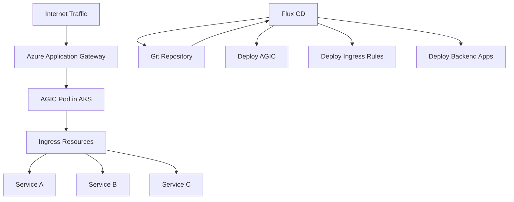

# How to Configure Flux CD with Azure Application Gateway Ingress

Author: [nawazdhandala](https://github.com/nawazdhandala)

Tags: Flux CD, Azure, Application Gateway, Ingress, AGIC, Kubernetes, GitOps, WAF, Load Balancing

Description: A hands-on guide to deploying and managing Azure Application Gateway Ingress Controller (AGIC) with Flux CD for GitOps-driven ingress management on AKS.

---

## Introduction

Azure Application Gateway Ingress Controller (AGIC) is a Kubernetes ingress controller that integrates natively with Azure Application Gateway. It provides Layer 7 load balancing, SSL termination, WAF protection, and URL-based routing for your AKS workloads. Managing AGIC through Flux CD gives you a GitOps-driven approach to ingress configuration, making it version-controlled and auditable.

This guide covers deploying AGIC via Flux CD, configuring ingress annotations, setting up backend health probes, and managing WAF policies through GitOps.

## Prerequisites

- An AKS cluster with Flux CD bootstrapped
- Azure CLI and Flux CLI installed
- An Azure Application Gateway instance (or you can create one as part of this guide)
- kubectl configured for your cluster

## Architecture Overview



## Step 1: Create Azure Application Gateway

Set up the Application Gateway that AGIC will manage.

```bash
# Create a virtual network for the Application Gateway
az network vnet create \
  --resource-group rg-flux-demo \
  --name vnet-agw \
  --address-prefix 10.0.0.0/16 \
  --subnet-name subnet-agw \
  --subnet-prefix 10.0.1.0/24

# Create a public IP for the Application Gateway
az network public-ip create \
  --resource-group rg-flux-demo \
  --name agw-public-ip \
  --allocation-method Static \
  --sku Standard

# Create the Application Gateway
az network application-gateway create \
  --resource-group rg-flux-demo \
  --name flux-app-gateway \
  --location eastus \
  --sku Standard_v2 \
  --public-ip-address agw-public-ip \
  --vnet-name vnet-agw \
  --subnet subnet-agw \
  --capacity 2 \
  --priority 100

# Enable AGIC addon on AKS
az aks enable-addons \
  --resource-group rg-flux-demo \
  --name aks-flux-cluster \
  --addons ingress-appgw \
  --appgw-id $(az network application-gateway show \
    --resource-group rg-flux-demo \
    --name flux-app-gateway \
    --query id -o tsv)
```

## Step 2: Deploy AGIC via Flux Using Helm

If you prefer to manage AGIC through Flux instead of the AKS addon, use a Helm release.

```yaml
# helm-repo-agic.yaml
# Adds the AGIC Helm chart repository
apiVersion: source.toolkit.fluxcd.io/v1
kind: HelmRepository
metadata:
  name: application-gateway-kubernetes-ingress
  namespace: flux-system
spec:
  interval: 1h
  url: https://appgwingress.blob.core.windows.net/ingress-azure-helm-package/
---
# helm-release-agic.yaml
# Deploys AGIC via Helm managed by Flux
apiVersion: helm.toolkit.fluxcd.io/v2
kind: HelmRelease
metadata:
  name: ingress-azure
  namespace: flux-system
spec:
  interval: 30m
  chart:
    spec:
      chart: ingress-azure
      version: "1.7.x"
      sourceRef:
        kind: HelmRepository
        name: application-gateway-kubernetes-ingress
  values:
    # Verbosity level for AGIC logs (1-5)
    verbosityLevel: 3
    appgw:
      # Application Gateway subscription ID
      subscriptionId: "<subscription-id>"
      # Resource group containing the Application Gateway
      resourceGroup: "rg-flux-demo"
      # Application Gateway name
      name: "flux-app-gateway"
      # Enable shared mode if multiple clusters use the same gateway
      shared: false
    armAuth:
      # Use AAD Pod Identity or Workload Identity
      type: workloadIdentity
      identityClientID: "<managed-identity-client-id>"
    rbac:
      enabled: true
```

## Step 3: Deploy Backend Applications

Deploy sample applications that AGIC will route traffic to.

```yaml
# app-frontend.yaml
# Frontend application deployment and service
apiVersion: apps/v1
kind: Deployment
metadata:
  name: frontend
  namespace: production
spec:
  replicas: 3
  selector:
    matchLabels:
      app: frontend
  template:
    metadata:
      labels:
        app: frontend
    spec:
      containers:
        - name: frontend
          image: fluxacrregistry.azurecr.io/frontend:v1.0
          ports:
            - containerPort: 80
          # Readiness probe used by AGIC for backend health
          readinessProbe:
            httpGet:
              path: /healthz
              port: 80
            initialDelaySeconds: 5
            periodSeconds: 10
          # Liveness probe for container health
          livenessProbe:
            httpGet:
              path: /healthz
              port: 80
            initialDelaySeconds: 15
            periodSeconds: 20
          resources:
            requests:
              cpu: 100m
              memory: 128Mi
---
apiVersion: v1
kind: Service
metadata:
  name: frontend
  namespace: production
spec:
  selector:
    app: frontend
  ports:
    - port: 80
      targetPort: 80
---
# app-api.yaml
# API backend deployment and service
apiVersion: apps/v1
kind: Deployment
metadata:
  name: api-backend
  namespace: production
spec:
  replicas: 2
  selector:
    matchLabels:
      app: api-backend
  template:
    metadata:
      labels:
        app: api-backend
    spec:
      containers:
        - name: api
          image: fluxacrregistry.azurecr.io/api:v1.0
          ports:
            - containerPort: 8080
          readinessProbe:
            httpGet:
              path: /api/health
              port: 8080
            initialDelaySeconds: 5
            periodSeconds: 10
          resources:
            requests:
              cpu: 200m
              memory: 256Mi
---
apiVersion: v1
kind: Service
metadata:
  name: api-backend
  namespace: production
spec:
  selector:
    app: api-backend
  ports:
    - port: 80
      targetPort: 8080
```

## Step 4: Configure Ingress Resources with AGIC Annotations

Create Ingress resources with AGIC-specific annotations for fine-grained control.

```yaml
# ingress-main.yaml
# Main ingress resource with URL-based routing via AGIC
apiVersion: networking.k8s.io/v1
kind: Ingress
metadata:
  name: main-ingress
  namespace: production
  annotations:
    # Use Application Gateway ingress class
    kubernetes.io/ingress.class: azure/application-gateway
    # Enable SSL redirect (HTTP to HTTPS)
    appgw.ingress.kubernetes.io/ssl-redirect: "true"
    # Set connection draining timeout (seconds)
    appgw.ingress.kubernetes.io/connection-draining: "true"
    appgw.ingress.kubernetes.io/connection-draining-timeout: "30"
    # Configure request timeout (seconds)
    appgw.ingress.kubernetes.io/request-timeout: "60"
    # Enable cookie-based affinity for session persistence
    appgw.ingress.kubernetes.io/cookie-based-affinity: "true"
    # Set the WAF policy to use
    appgw.ingress.kubernetes.io/waf-policy-for-path: "/subscriptions/<sub-id>/resourceGroups/rg-flux-demo/providers/Microsoft.Network/applicationGatewayWebApplicationFirewallPolicies/agw-waf-policy"
spec:
  tls:
    - hosts:
        - app.example.com
      secretName: app-tls-secret
  rules:
    # Route traffic based on hostname and path
    - host: app.example.com
      http:
        paths:
          # Frontend routes
          - path: /
            pathType: Prefix
            backend:
              service:
                name: frontend
                port:
                  number: 80
          # API routes
          - path: /api
            pathType: Prefix
            backend:
              service:
                name: api-backend
                port:
                  number: 80
```

## Step 5: Configure Backend Health Probes

Customize health probe settings for AGIC backends.

```yaml
# ingress-custom-health.yaml
# Ingress with custom health probe annotations
apiVersion: networking.k8s.io/v1
kind: Ingress
metadata:
  name: api-ingress
  namespace: production
  annotations:
    kubernetes.io/ingress.class: azure/application-gateway
    # Custom health probe configuration
    appgw.ingress.kubernetes.io/health-probe-hostname: "app.example.com"
    appgw.ingress.kubernetes.io/health-probe-path: "/api/health"
    appgw.ingress.kubernetes.io/health-probe-port: "8080"
    appgw.ingress.kubernetes.io/health-probe-interval: "30"
    appgw.ingress.kubernetes.io/health-probe-timeout: "30"
    appgw.ingress.kubernetes.io/health-probe-unhealthy-threshold: "3"
    # Override backend protocol to HTTPS
    appgw.ingress.kubernetes.io/backend-protocol: "https"
    # Set backend hostname override
    appgw.ingress.kubernetes.io/backend-hostname: "api-internal.example.com"
spec:
  rules:
    - host: api.example.com
      http:
        paths:
          - path: /
            pathType: Prefix
            backend:
              service:
                name: api-backend
                port:
                  number: 80
```

## Step 6: Configure SSL/TLS Certificates via Flux

Manage TLS certificates through Flux and cert-manager.

```yaml
# cert-manager-source.yaml
# Helm repository for cert-manager
apiVersion: source.toolkit.fluxcd.io/v1
kind: HelmRepository
metadata:
  name: jetstack
  namespace: flux-system
spec:
  interval: 1h
  url: https://charts.jetstack.io
---
# cert-manager-release.yaml
# Deploy cert-manager via Flux
apiVersion: helm.toolkit.fluxcd.io/v2
kind: HelmRelease
metadata:
  name: cert-manager
  namespace: flux-system
spec:
  interval: 30m
  chart:
    spec:
      chart: cert-manager
      version: "1.x"
      sourceRef:
        kind: HelmRepository
        name: jetstack
  values:
    installCRDs: true
---
# cluster-issuer.yaml
# Let's Encrypt issuer for automatic certificate provisioning
apiVersion: cert-manager.io/v1
kind: ClusterIssuer
metadata:
  name: letsencrypt-prod
spec:
  acme:
    server: https://acme-v02.api.letsencrypt.org/directory
    email: admin@example.com
    privateKeySecretRef:
      name: letsencrypt-prod-key
    solvers:
      - http01:
          ingress:
            class: azure/application-gateway
---
# certificate.yaml
# TLS certificate for the application domain
apiVersion: cert-manager.io/v1
kind: Certificate
metadata:
  name: app-tls
  namespace: production
spec:
  secretName: app-tls-secret
  issuerRef:
    name: letsencrypt-prod
    kind: ClusterIssuer
  dnsNames:
    - app.example.com
    - api.example.com
```

## Step 7: Set Up Flux Kustomization for AGIC Resources

Organize all AGIC-related resources under a Flux Kustomization with proper dependencies.

```yaml
# kustomization-agic.yaml
# Flux Kustomization for AGIC deployment
apiVersion: kustomize.toolkit.fluxcd.io/v1
kind: Kustomization
metadata:
  name: agic-infrastructure
  namespace: flux-system
spec:
  interval: 10m
  sourceRef:
    kind: GitRepository
    name: fleet-infra
  path: ./infrastructure/agic
  prune: true
  wait: true
  timeout: 10m
---
# kustomization-ingress.yaml
# Flux Kustomization for ingress resources (depends on AGIC)
apiVersion: kustomize.toolkit.fluxcd.io/v1
kind: Kustomization
metadata:
  name: ingress-rules
  namespace: flux-system
spec:
  interval: 10m
  sourceRef:
    kind: GitRepository
    name: fleet-infra
  path: ./infrastructure/ingress
  prune: true
  wait: true
  dependsOn:
    - name: agic-infrastructure
    - name: backend-services
```

## Step 8: Configure WAF Policies

Create a WAF policy for the Application Gateway.

```bash
# Create a WAF policy
az network application-gateway waf-policy create \
  --resource-group rg-flux-demo \
  --name agw-waf-policy \
  --type OWASP \
  --version 3.2

# Add a custom WAF rule for rate limiting
az network application-gateway waf-policy custom-rule create \
  --resource-group rg-flux-demo \
  --policy-name agw-waf-policy \
  --name RateLimitAPI \
  --priority 10 \
  --rule-type RateLimitRule \
  --action Block \
  --rate-limit-duration FiveMins \
  --rate-limit-threshold 500

# Add match condition for the rate limit rule
az network application-gateway waf-policy custom-rule match-condition add \
  --resource-group rg-flux-demo \
  --policy-name agw-waf-policy \
  --name RateLimitAPI \
  --match-variables RequestUri \
  --operator Contains \
  --values "/api/"
```

## Step 9: Multi-Site Ingress Configuration

Configure multiple sites on the same Application Gateway.

```yaml
# ingress-multi-site.yaml
# Multi-site ingress routing different domains to different backends
apiVersion: networking.k8s.io/v1
kind: Ingress
metadata:
  name: multi-site-ingress
  namespace: production
  annotations:
    kubernetes.io/ingress.class: azure/application-gateway
    appgw.ingress.kubernetes.io/ssl-redirect: "true"
    # Use the same Application Gateway for multiple hostnames
    appgw.ingress.kubernetes.io/use-private-ip: "false"
spec:
  tls:
    - hosts:
        - site-a.example.com
      secretName: site-a-tls
    - hosts:
        - site-b.example.com
      secretName: site-b-tls
  rules:
    - host: site-a.example.com
      http:
        paths:
          - path: /
            pathType: Prefix
            backend:
              service:
                name: site-a-service
                port:
                  number: 80
    - host: site-b.example.com
      http:
        paths:
          - path: /
            pathType: Prefix
            backend:
              service:
                name: site-b-service
                port:
                  number: 80
```

## Troubleshooting

### AGIC Not Updating Application Gateway

```bash
# Check AGIC pod logs
kubectl logs -n kube-system -l app=ingress-azure

# Verify AGIC has permission to update the Application Gateway
az role assignment list \
  --scope "/subscriptions/<sub-id>/resourceGroups/rg-flux-demo/providers/Microsoft.Network/applicationGateways/flux-app-gateway" \
  --query "[].{principal:principalName, role:roleDefinitionName}"

# Check Flux kustomization status
flux get kustomization agic-infrastructure
```

### Backend Health Probe Failures

```bash
# Check Application Gateway backend health
az network application-gateway show-backend-health \
  --resource-group rg-flux-demo \
  --name flux-app-gateway

# Verify the health probe endpoint is accessible from within the cluster
kubectl exec -it deploy/frontend -n production -- curl localhost:80/healthz

# Check service endpoints
kubectl get endpoints -n production
```

### 502 Bad Gateway Errors

```bash
# Verify backend pods are running
kubectl get pods -n production -l app=frontend

# Check if the backend service port matches the container port
kubectl describe svc frontend -n production

# Verify the ingress configuration
kubectl get ingress -n production -o yaml
```

## Summary

In this guide, you configured Azure Application Gateway Ingress Controller (AGIC) with Flux CD for GitOps-driven ingress management. You deployed AGIC via Helm managed by Flux, created ingress resources with AGIC-specific annotations for health probes, SSL redirection, and session affinity, set up automated TLS certificate management with cert-manager, and configured WAF policies for security. This approach ensures all ingress configurations are version-controlled and automatically reconciled by Flux CD.
