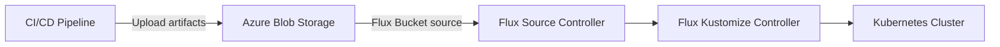

# How to Configure Flux CD with Azure Blob Storage Bucket Source

Author: [nawazdhandala](https://github.com/nawazdhandala)

Tags: flux-cd, Azure, blob-storage, Bucket, GitOps, Kubernetes, managed-identity, sas-token

Description: Learn how to use Azure Blob Storage as a Flux CD Bucket source for delivering Kubernetes manifests, with managed identity and SAS token authentication options.

---

## Introduction

While Git repositories are the most common source for Flux CD, there are scenarios where storing Kubernetes manifests in object storage makes more sense. Azure Blob Storage can serve as a Flux CD Bucket source, which is particularly useful for CI/CD pipelines that produce deployment artifacts, air-gapped environments, or when you want to decouple your build process from your Git workflow.

Flux CD's Bucket source controller polls Azure Blob Storage containers for changes and downloads artifacts for reconciliation. This guide covers setting up Azure Blob Storage as a source with both managed identity and SAS token authentication.

## Prerequisites

- An AKS cluster with Flux CD installed
- Azure CLI (v2.50 or later)
- Flux CLI (v2.2 or later)
- An Azure subscription with permissions to create storage accounts

## Architecture



## Step 1: Create an Azure Storage Account and Container

```bash
# Set variables
export RESOURCE_GROUP="rg-fluxcd-demo"
export LOCATION="eastus"
export STORAGE_ACCOUNT="stfluxcdbucket"
export CONTAINER_NAME="flux-manifests"

# Create a storage account
az storage account create \
  --resource-group $RESOURCE_GROUP \
  --name $STORAGE_ACCOUNT \
  --location $LOCATION \
  --sku Standard_LRS \
  --kind StorageV2 \
  --min-tls-version TLS1_2 \
  --allow-blob-public-access false

# Create a blob container for Flux manifests
az storage container create \
  --account-name $STORAGE_ACCOUNT \
  --name $CONTAINER_NAME \
  --auth-mode login
```

## Step 2: Upload Sample Manifests

Create and upload Kubernetes manifests to the blob container to test the integration.

```bash
# Create a temporary directory with sample manifests
mkdir -p /tmp/flux-manifests

# Create a sample namespace manifest
cat > /tmp/flux-manifests/namespace.yaml <<EOF
apiVersion: v1
kind: Namespace
metadata:
  name: demo-app
  labels:
    managed-by: flux-cd
EOF

# Create a sample deployment
cat > /tmp/flux-manifests/deployment.yaml <<EOF
apiVersion: apps/v1
kind: Deployment
metadata:
  name: nginx-demo
  namespace: demo-app
spec:
  replicas: 2
  selector:
    matchLabels:
      app: nginx-demo
  template:
    metadata:
      labels:
        app: nginx-demo
    spec:
      containers:
        - name: nginx
          image: nginx:1.25
          ports:
            - containerPort: 80
          resources:
            requests:
              cpu: 100m
              memory: 128Mi
            limits:
              cpu: 250m
              memory: 256Mi
EOF

# Create a sample service
cat > /tmp/flux-manifests/service.yaml <<EOF
apiVersion: v1
kind: Service
metadata:
  name: nginx-demo
  namespace: demo-app
spec:
  selector:
    app: nginx-demo
  ports:
    - port: 80
      targetPort: 80
  type: ClusterIP
EOF

# Create a kustomization.yaml
cat > /tmp/flux-manifests/kustomization.yaml <<EOF
apiVersion: kustomize.config.k8s.io/v1beta1
kind: Kustomization
resources:
  - namespace.yaml
  - deployment.yaml
  - service.yaml
EOF

# Upload all manifests to the blob container
az storage blob upload-batch \
  --account-name $STORAGE_ACCOUNT \
  --destination $CONTAINER_NAME \
  --source /tmp/flux-manifests \
  --auth-mode login \
  --overwrite
```

## Method 1: Managed Identity Authentication (Recommended)

### Step 1: Create and Configure Managed Identity

```bash
# Set variables
export CLUSTER_NAME="aks-fluxcd-demo"
export IDENTITY_NAME="id-flux-storage"

# Create a user-assigned managed identity
az identity create \
  --resource-group $RESOURCE_GROUP \
  --name $IDENTITY_NAME \
  --location $LOCATION

# Get identity details
export IDENTITY_CLIENT_ID=$(az identity show \
  --resource-group $RESOURCE_GROUP \
  --name $IDENTITY_NAME \
  --query "clientId" \
  --output tsv)

export IDENTITY_PRINCIPAL_ID=$(az identity show \
  --resource-group $RESOURCE_GROUP \
  --name $IDENTITY_NAME \
  --query "principalId" \
  --output tsv)

# Get the storage account resource ID
export STORAGE_ID=$(az storage account show \
  --resource-group $RESOURCE_GROUP \
  --name $STORAGE_ACCOUNT \
  --query "id" \
  --output tsv)

# Grant Storage Blob Data Reader role to the identity
az role assignment create \
  --assignee $IDENTITY_PRINCIPAL_ID \
  --role "Storage Blob Data Reader" \
  --scope $STORAGE_ID
```

### Step 2: Set Up Workload Identity Federation

```bash
# Get the OIDC issuer URL
export OIDC_ISSUER=$(az aks show \
  --resource-group $RESOURCE_GROUP \
  --name $CLUSTER_NAME \
  --query "oidcIssuerProfile.issuerUrl" \
  --output tsv)

# Create federated credential for the source-controller
az identity federated-credential create \
  --name "flux-source-controller" \
  --identity-name $IDENTITY_NAME \
  --resource-group $RESOURCE_GROUP \
  --issuer $OIDC_ISSUER \
  --subject "system:serviceaccount:flux-system:source-controller" \
  --audiences "api://AzureADTokenExchange"
```

### Step 3: Patch the Source Controller Service Account

```yaml
# File: clusters/my-cluster/flux-system/patches/storage-identity.yaml
apiVersion: v1
kind: ServiceAccount
metadata:
  name: source-controller
  namespace: flux-system
  annotations:
    # Link to the managed identity with Storage Blob Data Reader access
    azure.workload.identity/client-id: "<IDENTITY_CLIENT_ID>"
  labels:
    azure.workload.identity/use: "true"
```

### Step 4: Create the Bucket Source with Azure Provider

```yaml
# File: clusters/my-cluster/sources/azure-blob-bucket.yaml
apiVersion: source.toolkit.fluxcd.io/v1
kind: Bucket
metadata:
  name: azure-manifests
  namespace: flux-system
spec:
  interval: 5m
  # Use the 'azure' provider for managed identity authentication
  provider: azure
  # The bucket name corresponds to the blob container name
  bucketName: flux-manifests
  # The endpoint is the blob service URL for the storage account
  endpoint: "https://stfluxcdbucket.blob.core.windows.net"
  # Timeout for downloading artifacts
  timeout: 60s
```

## Method 2: SAS Token Authentication

Shared Access Signature (SAS) tokens provide time-limited access to blob storage without requiring managed identity.

### Step 1: Generate a SAS Token

```bash
# Get the storage account key
export STORAGE_KEY=$(az storage account keys list \
  --resource-group $RESOURCE_GROUP \
  --account-name $STORAGE_ACCOUNT \
  --query "[0].value" \
  --output tsv)

# Generate a SAS token valid for 1 year with read and list permissions
export SAS_TOKEN=$(az storage container generate-sas \
  --account-name $STORAGE_ACCOUNT \
  --account-key $STORAGE_KEY \
  --name $CONTAINER_NAME \
  --permissions rl \
  --expiry $(date -u -v+1y '+%Y-%m-%dT%H:%MZ') \
  --https-only \
  --output tsv)

echo "SAS Token generated (keep this secure)"
```

### Step 2: Create a Kubernetes Secret with the SAS Token

```bash
# Create a secret containing the SAS token
kubectl create secret generic azure-blob-sas \
  --namespace flux-system \
  --from-literal=sasToken="?${SAS_TOKEN}"
```

### Step 3: Create the Bucket Source with SAS Authentication

```yaml
# File: clusters/my-cluster/sources/azure-blob-sas.yaml
apiVersion: source.toolkit.fluxcd.io/v1
kind: Bucket
metadata:
  name: azure-manifests-sas
  namespace: flux-system
spec:
  interval: 5m
  # Use 'generic' provider when not using managed identity
  provider: generic
  bucketName: flux-manifests
  endpoint: "https://stfluxcdbucket.blob.core.windows.net"
  # Reference the secret containing the SAS token
  secretRef:
    name: azure-blob-sas
  timeout: 60s
```

## Method 3: Account Key Authentication

For development environments, you can use storage account keys directly.

```bash
# Create a secret with the storage account key
kubectl create secret generic azure-blob-key \
  --namespace flux-system \
  --from-literal=accountKey="${STORAGE_KEY}"
```

```yaml
# File: clusters/my-cluster/sources/azure-blob-key.yaml
apiVersion: source.toolkit.fluxcd.io/v1
kind: Bucket
metadata:
  name: azure-manifests-key
  namespace: flux-system
spec:
  interval: 5m
  provider: generic
  bucketName: flux-manifests
  endpoint: "https://stfluxcdbucket.blob.core.windows.net"
  secretRef:
    # Storage account key secret (not recommended for production)
    name: azure-blob-key
  timeout: 60s
```

## Creating a Kustomization from the Bucket Source

```yaml
# File: clusters/my-cluster/apps/bucket-app.yaml
apiVersion: kustomize.toolkit.fluxcd.io/v1
kind: Kustomization
metadata:
  name: demo-app
  namespace: flux-system
spec:
  interval: 10m
  sourceRef:
    # Reference the Bucket source instead of a GitRepository
    kind: Bucket
    name: azure-manifests
  path: ./
  prune: true
  targetNamespace: demo-app
  wait: true
  timeout: 5m
```

## CI/CD Integration

Automate artifact uploads from your CI/CD pipeline to Azure Blob Storage.

```yaml
# File: azure-pipelines/upload-manifests.yaml
trigger:
  branches:
    include:
      - main
  paths:
    include:
      - manifests/**

pool:
  vmImage: "ubuntu-latest"

steps:
  - task: AzureCLI@2
    displayName: "Upload manifests to Blob Storage"
    inputs:
      azureSubscription: "my-azure-service-connection"
      scriptType: bash
      scriptLocation: inlineScript
      inlineScript: |
        # Upload updated manifests to the blob container
        az storage blob upload-batch \
          --account-name stfluxcdbucket \
          --destination flux-manifests \
          --source manifests/ \
          --auth-mode login \
          --overwrite

        echo "Manifests uploaded. Flux will pick up changes within the poll interval."
```

## Verifying the Setup

```bash
# Check the Bucket source status
flux get sources bucket

# Force reconciliation
flux reconcile source bucket azure-manifests

# Check the Kustomization that references the Bucket
flux get kustomizations

# Verify resources were created
kubectl get all -n demo-app
```

## Troubleshooting

### Bucket Source Shows Not Ready

```bash
# Check source-controller logs for errors
kubectl logs -n flux-system deployment/source-controller \
  --tail=100 | grep -i "bucket\|blob\|storage"

# Describe the Bucket resource for status conditions
kubectl describe bucket azure-manifests -n flux-system
```

### SAS Token Expired

Regenerate the SAS token and update the Kubernetes secret:

```bash
# Generate a new SAS token
export NEW_SAS_TOKEN=$(az storage container generate-sas \
  --account-name $STORAGE_ACCOUNT \
  --account-key $STORAGE_KEY \
  --name $CONTAINER_NAME \
  --permissions rl \
  --expiry $(date -u -v+1y '+%Y-%m-%dT%H:%MZ') \
  --https-only \
  --output tsv)

# Update the secret
kubectl create secret generic azure-blob-sas \
  --namespace flux-system \
  --from-literal=sasToken="?${NEW_SAS_TOKEN}" \
  --dry-run=client -o yaml | kubectl apply -f -
```

### Network Access Issues

If your storage account has a firewall, ensure the AKS cluster's outbound IP is allowed:

```bash
# Get the AKS cluster outbound IP
export AKS_OUTBOUND_IP=$(az aks show \
  --resource-group $RESOURCE_GROUP \
  --name $CLUSTER_NAME \
  --query "networkProfile.loadBalancerProfile.effectiveOutboundIPs[0].id" \
  --output tsv | xargs az network public-ip show --ids --query "ipAddress" --output tsv)

# Add the IP to the storage account firewall
az storage account network-rule add \
  --resource-group $RESOURCE_GROUP \
  --account-name $STORAGE_ACCOUNT \
  --ip-address $AKS_OUTBOUND_IP
```

## Conclusion

Azure Blob Storage provides a flexible alternative to Git repositories as a source for Flux CD. Managed identity authentication offers the most secure setup for production environments, while SAS tokens provide a convenient option when workload identity is not available. This pattern is especially valuable for CI/CD pipelines that build and package Kubernetes manifests as deployment artifacts, decoupling the build and deploy stages of your workflow.
