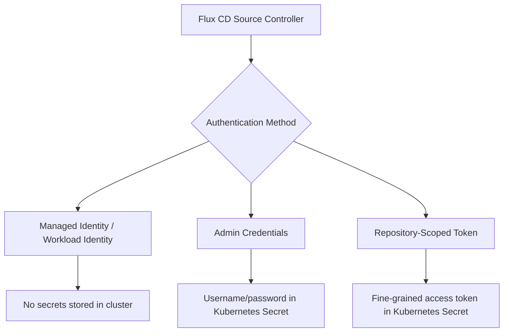

# How to Configure Flux CD with Azure Container Registry

Author: [nawazdhandala](https://github.com/nawazdhandala)

Tags: flux-cd, Azure, ACR, container-registry, GitOps, Kubernetes, OCI

Description: Learn how to integrate Flux CD with Azure Container Registry using managed identity, token-based authentication, and OCI artifact support.

---

## Introduction

Azure Container Registry (ACR) is a managed container registry service that stores and manages container images and OCI artifacts. Flux CD can pull Kubernetes manifests, Helm charts, and Kustomize overlays stored as OCI artifacts in ACR, enabling a fully GitOps-driven workflow.

This guide covers three authentication methods for connecting Flux CD to ACR: managed identity, admin credentials, and repository-scoped tokens. Each method has different security trade-offs, and we will help you choose the right one for your environment.

## Prerequisites

- An AKS cluster with Flux CD installed
- Azure CLI (v2.50 or later)
- Flux CLI (v2.2 or later)
- An Azure Container Registry (Standard or Premium tier)

## Authentication Methods Overview



## Method 1: Managed Identity Authentication (Recommended)

This is the most secure approach as it requires no stored credentials in the cluster.

### Step 1: Enable Workload Identity on AKS

```bash
# Set variables
export RESOURCE_GROUP="rg-fluxcd-demo"
export CLUSTER_NAME="aks-fluxcd-demo"
export ACR_NAME="acrfluxcddemo"
export IDENTITY_NAME="id-flux-acr"

# Enable OIDC issuer and workload identity on the cluster
az aks update \
  --resource-group $RESOURCE_GROUP \
  --name $CLUSTER_NAME \
  --enable-oidc-issuer \
  --enable-workload-identity

# Get the OIDC issuer URL
export OIDC_ISSUER=$(az aks show \
  --resource-group $RESOURCE_GROUP \
  --name $CLUSTER_NAME \
  --query "oidcIssuerProfile.issuerUrl" \
  --output tsv)
```

### Step 2: Create and Configure the Managed Identity

```bash
# Create a user-assigned managed identity
az identity create \
  --resource-group $RESOURCE_GROUP \
  --name $IDENTITY_NAME

# Get the identity client ID
export IDENTITY_CLIENT_ID=$(az identity show \
  --resource-group $RESOURCE_GROUP \
  --name $IDENTITY_NAME \
  --query "clientId" \
  --output tsv)

# Get the ACR resource ID
export ACR_ID=$(az acr show \
  --name $ACR_NAME \
  --query "id" \
  --output tsv)

# Grant AcrPull role to the managed identity
az role assignment create \
  --assignee $IDENTITY_CLIENT_ID \
  --role "AcrPull" \
  --scope $ACR_ID

# Create federated credential for Flux source-controller
az identity federated-credential create \
  --name "flux-source-controller-fed" \
  --identity-name $IDENTITY_NAME \
  --resource-group $RESOURCE_GROUP \
  --issuer $OIDC_ISSUER \
  --subject "system:serviceaccount:flux-system:source-controller" \
  --audiences "api://AzureADTokenExchange"
```

### Step 3: Annotate the Flux Service Account

```yaml
# File: flux-system/patches/sa-workload-identity.yaml
apiVersion: v1
kind: ServiceAccount
metadata:
  name: source-controller
  namespace: flux-system
  annotations:
    # Link the Kubernetes SA to the Azure managed identity
    azure.workload.identity/client-id: "<IDENTITY_CLIENT_ID>"
  labels:
    # Enable workload identity injection
    azure.workload.identity/use: "true"
```

### Step 4: Create an OCI Repository Source with Azure Provider

```yaml
# File: sources/acr-managed-identity.yaml
apiVersion: source.toolkit.fluxcd.io/v1
kind: OCIRepository
metadata:
  name: app-charts
  namespace: flux-system
spec:
  interval: 10m
  url: oci://acrfluxcddemo.azurecr.io/helm-charts/my-app
  ref:
    # Pin to a specific semver range for stability
    semver: ">=1.0.0"
  # Setting provider to 'azure' enables automatic managed identity auth
  provider: azure
```

## Method 2: Token-Based Authentication

Repository-scoped tokens provide fine-grained access control to specific repositories within ACR. This is the recommended approach when managed identity is not available.

### Step 1: Create a Scope Map and Token

```bash
# Create a scope map that grants pull access to specific repositories
az acr scope-map create \
  --name "flux-pull-scope" \
  --registry $ACR_NAME \
  --repository manifests/app content/read \
  --repository helm-charts/my-app content/read \
  --description "Read-only access for Flux CD"

# Create a token using the scope map
az acr token create \
  --name "flux-pull-token" \
  --registry $ACR_NAME \
  --scope-map "flux-pull-scope" \
  --status enabled
```

### Step 2: Generate Token Password

```bash
# Generate a password for the token
export TOKEN_PASSWORD=$(az acr token credential generate \
  --name "flux-pull-token" \
  --registry $ACR_NAME \
  --password1 \
  --query "passwords[0].value" \
  --output tsv)

echo "Token password generated successfully"
```

### Step 3: Create a Kubernetes Secret

```bash
# Create a docker-registry secret with the token credentials
kubectl create secret docker-registry acr-token-secret \
  --namespace flux-system \
  --docker-server="${ACR_NAME}.azurecr.io" \
  --docker-username="flux-pull-token" \
  --docker-password="${TOKEN_PASSWORD}"
```

### Step 4: Reference the Secret in the OCI Source

```yaml
# File: sources/acr-token-auth.yaml
apiVersion: source.toolkit.fluxcd.io/v1
kind: OCIRepository
metadata:
  name: app-manifests
  namespace: flux-system
spec:
  interval: 10m
  url: oci://acrfluxcddemo.azurecr.io/manifests/app
  ref:
    tag: latest
  secretRef:
    # Reference the token-based secret for authentication
    name: acr-token-secret
```

## Method 3: Admin Credentials (Not Recommended for Production)

Admin credentials provide full access to ACR and should only be used for development or testing.

### Step 1: Enable Admin User on ACR

```bash
# Enable admin user on ACR (not recommended for production)
az acr update \
  --name $ACR_NAME \
  --admin-enabled true

# Retrieve admin credentials
export ACR_USERNAME=$(az acr credential show \
  --name $ACR_NAME \
  --query "username" \
  --output tsv)

export ACR_PASSWORD=$(az acr credential show \
  --name $ACR_NAME \
  --query "passwords[0].value" \
  --output tsv)
```

### Step 2: Create Kubernetes Secret and Source

```bash
# Create the secret with admin credentials
kubectl create secret docker-registry acr-admin-secret \
  --namespace flux-system \
  --docker-server="${ACR_NAME}.azurecr.io" \
  --docker-username="${ACR_USERNAME}" \
  --docker-password="${ACR_PASSWORD}"
```

```yaml
# File: sources/acr-admin-auth.yaml
apiVersion: source.toolkit.fluxcd.io/v1
kind: OCIRepository
metadata:
  name: app-manifests-dev
  namespace: flux-system
spec:
  interval: 5m
  url: oci://acrfluxcddemo.azurecr.io/manifests/app
  ref:
    tag: dev-latest
  secretRef:
    # Reference the admin secret (dev/test only)
    name: acr-admin-secret
```

## Pushing OCI Artifacts to ACR

To push Kubernetes manifests or Helm charts to ACR as OCI artifacts, use the Flux CLI.

```bash
# Push a local directory of Kubernetes manifests to ACR
flux push artifact oci://acrfluxcddemo.azurecr.io/manifests/app:v1.0.0 \
  --path=./manifests \
  --source="$(git config --get remote.origin.url)" \
  --revision="$(git branch --show-current)@sha1:$(git rev-parse HEAD)"

# Tag the artifact with 'latest' for convenience
flux tag artifact oci://acrfluxcddemo.azurecr.io/manifests/app:v1.0.0 \
  --tag latest
```

## Using ACR with Flux HelmRepository

Flux can also pull Helm charts stored in ACR using the HelmRepository resource.

```yaml
# File: sources/acr-helm-repo.yaml
apiVersion: source.toolkit.fluxcd.io/v1
kind: HelmRepository
metadata:
  name: acr-helm-charts
  namespace: flux-system
spec:
  type: oci
  interval: 10m
  url: oci://acrfluxcddemo.azurecr.io/helm-charts
  # Use managed identity for authentication
  provider: azure
```

```yaml
# File: releases/my-app-release.yaml
apiVersion: helm.toolkit.fluxcd.io/v2
kind: HelmRelease
metadata:
  name: my-app
  namespace: default
spec:
  interval: 10m
  chart:
    spec:
      chart: my-app
      version: "1.x"
      sourceRef:
        kind: HelmRepository
        name: acr-helm-charts
        namespace: flux-system
  values:
    replicaCount: 3
    image:
      repository: acrfluxcddemo.azurecr.io/my-app
      tag: latest
```

## Verifying the Configuration

```bash
# Check that the OCI source is reconciling
flux get sources oci

# Check Helm repository status
flux get sources helm

# View source-controller logs for any authentication errors
kubectl logs -n flux-system deployment/source-controller \
  --tail=100 | grep -i "acr\|auth\|error"

# List artifacts in ACR to confirm they exist
az acr repository list --name $ACR_NAME --output table
```

## Troubleshooting

### 401 Unauthorized Errors

Verify that the managed identity has the correct role assignment:

```bash
az role assignment list \
  --assignee $IDENTITY_CLIENT_ID \
  --scope $ACR_ID \
  --output table
```

### Token Expiration

Repository-scoped tokens do not expire by default, but passwords can be regenerated:

```bash
# Regenerate the token password if needed
az acr token credential generate \
  --name "flux-pull-token" \
  --registry $ACR_NAME \
  --password1
```

### OCI Artifact Not Found

Ensure the artifact path and tag match exactly:

```bash
# List tags for a specific repository
az acr repository show-tags \
  --name $ACR_NAME \
  --repository manifests/app \
  --output table
```

## Conclusion

Integrating Flux CD with Azure Container Registry provides a secure and efficient way to deliver Kubernetes manifests and Helm charts through a GitOps workflow. Managed identity authentication is the recommended approach for production environments, while repository-scoped tokens offer a flexible alternative when workload identity is not available. Avoid using admin credentials outside of development scenarios.
