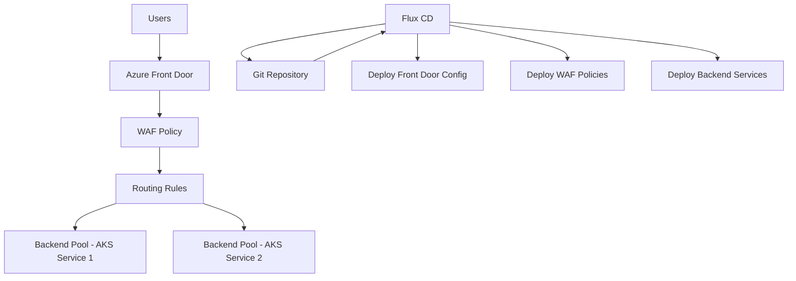

# How to Configure Flux CD with Azure Front Door

Author: [nawazdhandala](https://github.com/nawazdhandala)

Tags: Flux CD, Azure, Front Door, WAF, CDN, Kubernetes, GitOps, Routing, Load Balancing

Description: A practical guide to deploying and managing Azure Front Door configurations through Flux CD with GitOps, including routing rules, WAF policies, and SSL termination.

---

## Introduction

Azure Front Door is a global, scalable entry point for web applications, providing load balancing, SSL offloading, WAF protection, and intelligent routing. Managing Azure Front Door configurations through Flux CD and GitOps ensures that your networking and security policies are version-controlled, auditable, and consistently deployed.

This guide walks you through deploying Azure Front Door resources via Flux CD on AKS, including routing rules, WAF policies, and integration with backend Kubernetes services.

## Prerequisites

- An AKS cluster with Flux CD installed
- Azure CLI installed and configured
- A registered domain name
- Helm CLI installed
- Flux CLI v2.0 or later

## Architecture Overview



## Step 1: Set Up Azure Front Door Prerequisites

Create the necessary Azure resources before configuring Flux.

```bash
# Create a resource group for Front Door
az group create \
  --name rg-frontdoor \
  --location global

# Create an Azure Front Door profile
az afd profile create \
  --resource-group rg-frontdoor \
  --profile-name flux-frontdoor \
  --sku Standard_AzureFrontDoor
```

## Step 2: Configure Flux Helm Source for Azure Resources

Set up a Flux HelmRepository to manage Azure-related Helm charts.

```yaml
# helm-repo-azure.yaml
# Adds the Azure Helm chart repository as a Flux source
apiVersion: source.toolkit.fluxcd.io/v1
kind: HelmRepository
metadata:
  name: azure-workload-identity
  namespace: flux-system
spec:
  interval: 1h
  url: https://azure.github.io/azure-workload-identity/charts
---
# helm-repo-ingress-nginx.yaml
# Adds the ingress-nginx repository for backend service exposure
apiVersion: source.toolkit.fluxcd.io/v1
kind: HelmRepository
metadata:
  name: ingress-nginx
  namespace: flux-system
spec:
  interval: 1h
  url: https://kubernetes.github.io/ingress-nginx
```

## Step 3: Deploy Backend Services via Flux

Deploy the backend services that Azure Front Door will route to.

```yaml
# backend-app-deployment.yaml
# Deploys the backend application that Front Door routes traffic to
apiVersion: apps/v1
kind: Deployment
metadata:
  name: web-app
  namespace: production
  labels:
    app: web-app
spec:
  replicas: 3
  selector:
    matchLabels:
      app: web-app
  template:
    metadata:
      labels:
        app: web-app
    spec:
      containers:
        - name: web-app
          image: fluxacrregistry.azurecr.io/web-app:latest
          ports:
            - containerPort: 8080
          # Health check endpoint for Front Door probes
          readinessProbe:
            httpGet:
              path: /health
              port: 8080
            initialDelaySeconds: 5
            periodSeconds: 10
          resources:
            requests:
              cpu: 100m
              memory: 128Mi
            limits:
              cpu: 500m
              memory: 256Mi
---
# backend-app-service.yaml
# Exposes the backend app as a LoadBalancer service for Front Door
apiVersion: v1
kind: Service
metadata:
  name: web-app
  namespace: production
  annotations:
    # Use an internal load balancer for Front Door backends
    service.beta.kubernetes.io/azure-load-balancer-internal: "true"
spec:
  type: LoadBalancer
  selector:
    app: web-app
  ports:
    - port: 80
      targetPort: 8080
      protocol: TCP
```

## Step 4: Deploy Azure Front Door Configuration via Flux

Use Flux to manage the Front Door configuration through Kubernetes custom resources with the Azure Service Operator.

```yaml
# azure-service-operator-source.yaml
# Helm source for Azure Service Operator
apiVersion: source.toolkit.fluxcd.io/v1
kind: HelmRepository
metadata:
  name: aso
  namespace: flux-system
spec:
  interval: 1h
  url: https://raw.githubusercontent.com/Azure/azure-service-operator/main/v2/charts
---
# azure-service-operator-release.yaml
# Installs Azure Service Operator for managing Azure resources via K8s
apiVersion: helm.toolkit.fluxcd.io/v2
kind: HelmRelease
metadata:
  name: azure-service-operator
  namespace: flux-system
spec:
  interval: 30m
  chart:
    spec:
      chart: azure-service-operator
      version: "2.x"
      sourceRef:
        kind: HelmRepository
        name: aso
  values:
    azureSubscriptionID: "<subscription-id>"
    azureTenantID: "<tenant-id>"
    azureClientID: "<client-id>"
    installCRDs: true
```

## Step 5: Define Front Door Routing Rules

Create Azure Front Door routing configuration managed by Flux.

```yaml
# frontdoor-endpoint.yaml
# Defines the Azure Front Door endpoint
apiVersion: cdn.azure.com/v1api20230501
kind: AfdEndpoint
metadata:
  name: flux-app-endpoint
  namespace: production
spec:
  owner:
    name: flux-frontdoor
  location: global
  enabledState: Enabled
---
# frontdoor-origin-group.yaml
# Defines the origin group (backend pool) for load balancing
apiVersion: cdn.azure.com/v1api20230501
kind: AfdOriginGroup
metadata:
  name: aks-backend-group
  namespace: production
spec:
  owner:
    name: flux-frontdoor
  loadBalancingSettings:
    # Number of samples for latency measurement
    sampleSize: 4
    # Number of successful samples required
    successfulSamplesRequired: 3
    # Sensitivity to latency differences (in ms)
    additionalLatencyInMilliseconds: 50
  healthProbeSettings:
    # Health check path on the backend
    probePath: /health
    probeRequestType: GET
    probeProtocol: Https
    # Probe interval in seconds
    probeIntervalInSeconds: 30
```

```yaml
# frontdoor-origin.yaml
# Defines the AKS backend as an origin for Front Door
apiVersion: cdn.azure.com/v1api20230501
kind: AfdOrigin
metadata:
  name: aks-origin-primary
  namespace: production
spec:
  owner:
    name: aks-backend-group
  hostName: "aks-internal-lb.eastus.cloudapp.azure.com"
  httpPort: 80
  httpsPort: 443
  originHostHeader: "app.example.com"
  priority: 1
  weight: 1000
  enabledState: Enabled
---
# frontdoor-route.yaml
# Defines routing rules for the Front Door endpoint
apiVersion: cdn.azure.com/v1api20230501
kind: AfdRoute
metadata:
  name: default-route
  namespace: production
spec:
  owner:
    name: flux-app-endpoint
  originGroup:
    name: aks-backend-group
  patternsToMatch:
    - "/*"
  supportedProtocols:
    - Http
    - Https
  httpsRedirect: Enabled
  forwardingProtocol: HttpsOnly
  linkToDefaultDomain: Enabled
  enabledState: Enabled
```

## Step 6: Configure WAF Policies via Flux

Deploy WAF policies to protect your application through GitOps.

```yaml
# waf-policy.yaml
# Defines a WAF policy for Azure Front Door managed via GitOps
apiVersion: cdn.azure.com/v1api20230501
kind: WebApplicationFirewallPolicy
metadata:
  name: flux-waf-policy
  namespace: production
spec:
  location: global
  policySettings:
    # Block malicious requests
    enabledState: Enabled
    mode: Prevention
    requestBodyCheck: Enabled
    # Max request body size in KB
    requestBodyInspectLimitInKB: 128
  managedRules:
    managedRuleSets:
      # Enable the default managed rule set
      - ruleSetType: Microsoft_DefaultRuleSet
        ruleSetVersion: "2.1"
        ruleSetAction: Block
      # Enable bot protection rules
      - ruleSetType: Microsoft_BotManagerRuleSet
        ruleSetVersion: "1.0"
        ruleSetAction: Block
  customRules:
    rules:
      # Rate limiting rule: block IPs with more than 100 requests per minute
      - name: RateLimitRule
        priority: 1
        enabledState: Enabled
        ruleType: RateLimitRule
        rateLimitDurationInMinutes: 1
        rateLimitThreshold: 100
        matchConditions:
          - matchVariable: RequestUri
            operator: Contains
            matchValue:
              - "/api/"
        action: Block
      # Geo-blocking rule: restrict access by country
      - name: GeoBlockRule
        priority: 2
        enabledState: Enabled
        ruleType: MatchRule
        matchConditions:
          - matchVariable: RemoteAddr
            operator: GeoMatch
            matchValue:
              - "XX"
        action: Block
```

## Step 7: Configure Custom Domains and SSL

Manage custom domains and SSL certificates through Flux.

```yaml
# custom-domain.yaml
# Adds a custom domain to the Front Door endpoint
apiVersion: cdn.azure.com/v1api20230501
kind: AfdCustomDomain
metadata:
  name: app-custom-domain
  namespace: production
spec:
  owner:
    name: flux-frontdoor
  hostName: "app.example.com"
  tlsSettings:
    # Use Azure Front Door managed certificate
    certificateType: ManagedCertificate
    minimumTlsVersion: TLS12
```

## Step 8: Set Up Flux Kustomization for Front Door Resources

Organize all Front Door resources under a Flux Kustomization.

```yaml
# kustomization-frontdoor.yaml
# Flux Kustomization that manages all Front Door resources
apiVersion: kustomize.toolkit.fluxcd.io/v1
kind: Kustomization
metadata:
  name: azure-front-door
  namespace: flux-system
spec:
  interval: 10m
  sourceRef:
    kind: GitRepository
    name: fleet-infra
  path: ./infrastructure/front-door
  prune: true
  wait: true
  timeout: 10m
  # Deploy Front Door config after the backend services are ready
  dependsOn:
    - name: backend-services
  healthChecks:
    - apiVersion: apps/v1
      kind: Deployment
      name: web-app
      namespace: production
```

## Step 9: Monitor Front Door with Flux Notifications

Set up alerts for Front Door configuration changes.

```yaml
# alert-frontdoor.yaml
# Sends notifications when Front Door resources are updated by Flux
apiVersion: notification.toolkit.fluxcd.io/v1
kind: Alert
metadata:
  name: frontdoor-alerts
  namespace: flux-system
spec:
  providerRef:
    name: teams-provider
  eventSeverity: info
  eventSources:
    - kind: Kustomization
      name: azure-front-door
    - kind: HelmRelease
      name: azure-service-operator
  summary: "Azure Front Door configuration update"
---
# teams-provider.yaml
# Microsoft Teams notification provider
apiVersion: notification.toolkit.fluxcd.io/v1
kind: Provider
metadata:
  name: teams-provider
  namespace: flux-system
spec:
  type: msteams
  address: https://outlook.office.com/webhook/your-webhook-url
```

## Troubleshooting

### Front Door Not Routing Traffic

```bash
# Check the Azure Service Operator status
kubectl get afdendpoints,afdorigingroups,afdorigins,afdroutes -n production

# Verify the Flux kustomization status
flux get kustomization azure-front-door

# Check ASO controller logs
kubectl logs -n flux-system deploy/azure-service-operator-controller-manager
```

### WAF Blocking Legitimate Requests

```bash
# Check Front Door WAF logs in Azure
az monitor diagnostic-settings create \
  --resource "/subscriptions/<sub>/resourceGroups/rg-frontdoor/providers/Microsoft.Cdn/profiles/flux-frontdoor" \
  --name "waf-diagnostics" \
  --logs '[{"category": "FrontDoorWebApplicationFirewallLog", "enabled": true}]' \
  --workspace "<log-analytics-workspace-id>"
```

### SSL Certificate Issues

```bash
# Check custom domain status
kubectl get afdcustomdomains -n production -o yaml

# Verify DNS CNAME record
nslookup app.example.com

# Check TLS settings
az afd custom-domain show \
  --resource-group rg-frontdoor \
  --profile-name flux-frontdoor \
  --custom-domain-name app-custom-domain
```

## Summary

In this guide, you configured Azure Front Door deployment and management through Flux CD and GitOps. You set up backend services on AKS exposed via internal load balancers, deployed Front Door routing rules and origin groups using Azure Service Operator, configured WAF policies for security, and managed custom domains with SSL certificates. All configurations are version-controlled in Git and automatically reconciled by Flux CD, ensuring consistent and auditable infrastructure management.
