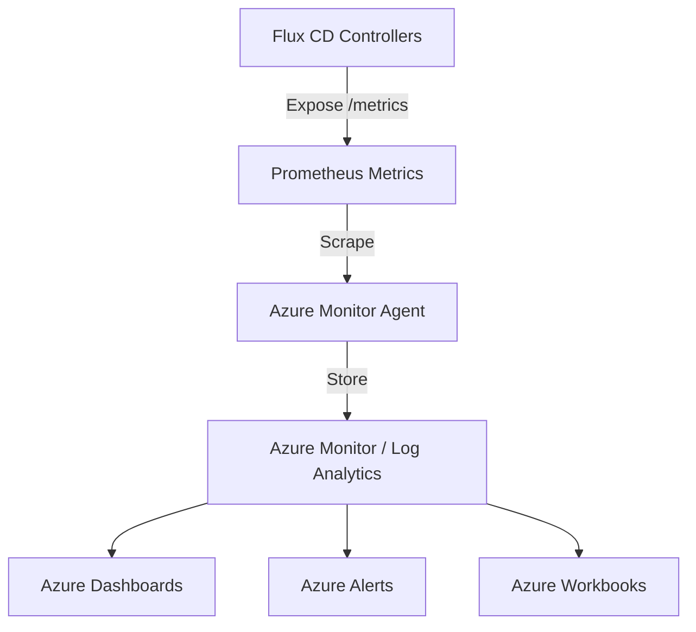

# How to Configure Flux CD with Azure Monitor for Monitoring

Author: [nawazdhandala](https://github.com/nawazdhandala)

Tags: flux-cd, Azure, azure-monitor, container-insights, Monitoring, Kubernetes, Prometheus, Grafana

Description: Learn how to monitor Flux CD deployments using Azure Monitor Container Insights, custom metrics, and alerting for GitOps reconciliation health.

---

## Introduction

Monitoring your GitOps pipeline is essential for maintaining reliable Kubernetes deployments. Azure Monitor with Container Insights provides a comprehensive monitoring solution for AKS clusters, and when combined with Flux CD metrics, you get full visibility into your reconciliation health, deployment success rates, and drift detection.

This guide covers enabling Azure Monitor for your AKS cluster, collecting Flux CD Prometheus metrics, creating custom dashboards, and setting up alerts for GitOps failures.

## Prerequisites

- An AKS cluster with Flux CD installed
- Azure CLI (v2.50 or later)
- Flux CLI (v2.2 or later)
- An Azure Log Analytics workspace

## Architecture



## Step 1: Enable Container Insights on AKS

```bash
# Set variables
export RESOURCE_GROUP="rg-fluxcd-demo"
export CLUSTER_NAME="aks-fluxcd-demo"
export LOCATION="eastus"
export WORKSPACE_NAME="law-fluxcd-monitoring"

# Create a Log Analytics workspace
az monitor log-analytics workspace create \
  --resource-group $RESOURCE_GROUP \
  --workspace-name $WORKSPACE_NAME \
  --location $LOCATION

# Get the workspace resource ID
export WORKSPACE_ID=$(az monitor log-analytics workspace show \
  --resource-group $RESOURCE_GROUP \
  --workspace-name $WORKSPACE_NAME \
  --query "id" \
  --output tsv)

# Enable Container Insights on the AKS cluster
az aks enable-addons \
  --resource-group $RESOURCE_GROUP \
  --name $CLUSTER_NAME \
  --addons monitoring \
  --workspace-resource-id $WORKSPACE_ID
```

## Step 2: Enable Managed Prometheus (Azure Monitor Workspace)

Azure Monitor managed Prometheus can scrape Flux CD controller metrics natively.

```bash
# Create an Azure Monitor workspace for Prometheus
export MONITOR_WORKSPACE="amw-fluxcd"

az monitor account create \
  --resource-group $RESOURCE_GROUP \
  --name $MONITOR_WORKSPACE \
  --location $LOCATION

# Get the workspace resource ID
export MONITOR_WORKSPACE_ID=$(az monitor account show \
  --resource-group $RESOURCE_GROUP \
  --name $MONITOR_WORKSPACE \
  --query "id" \
  --output tsv)

# Enable Prometheus metrics collection on AKS
az aks update \
  --resource-group $RESOURCE_GROUP \
  --name $CLUSTER_NAME \
  --enable-azure-monitor-metrics \
  --azure-monitor-workspace-resource-id $MONITOR_WORKSPACE_ID
```

## Step 3: Configure Prometheus Scraping for Flux CD

Create a ConfigMap to tell Azure Monitor to scrape Flux CD controller metrics.

```yaml
# File: monitoring/ama-metrics-config.yaml
apiVersion: v1
kind: ConfigMap
metadata:
  name: ama-metrics-prometheus-config
  namespace: kube-system
data:
  prometheus-config: |
    global:
      scrape_interval: 30s
      evaluation_interval: 30s

    scrape_configs:
      # Scrape Flux source-controller metrics
      - job_name: "flux-source-controller"
        kubernetes_sd_configs:
          - role: pod
            namespaces:
              names:
                - flux-system
        relabel_configs:
          - source_labels: [__meta_kubernetes_pod_label_app]
            regex: source-controller
            action: keep
          - source_labels: [__meta_kubernetes_pod_annotation_prometheus_io_port]
            action: replace
            target_label: __address__
            regex: (.+)
            replacement: ${1}:8080

      # Scrape Flux kustomize-controller metrics
      - job_name: "flux-kustomize-controller"
        kubernetes_sd_configs:
          - role: pod
            namespaces:
              names:
                - flux-system
        relabel_configs:
          - source_labels: [__meta_kubernetes_pod_label_app]
            regex: kustomize-controller
            action: keep

      # Scrape Flux helm-controller metrics
      - job_name: "flux-helm-controller"
        kubernetes_sd_configs:
          - role: pod
            namespaces:
              names:
                - flux-system
        relabel_configs:
          - source_labels: [__meta_kubernetes_pod_label_app]
            regex: helm-controller
            action: keep

      # Scrape Flux notification-controller metrics
      - job_name: "flux-notification-controller"
        kubernetes_sd_configs:
          - role: pod
            namespaces:
              names:
                - flux-system
        relabel_configs:
          - source_labels: [__meta_kubernetes_pod_label_app]
            regex: notification-controller
            action: keep
```

Apply the configuration:

```bash
kubectl apply -f monitoring/ama-metrics-config.yaml
```

## Step 4: Create Pod Monitor Resources

An alternative approach using PodMonitor custom resources if you have the Prometheus Operator installed:

```yaml
# File: monitoring/flux-pod-monitors.yaml
apiVersion: monitoring.coreos.com/v1
kind: PodMonitor
metadata:
  name: flux-system
  namespace: flux-system
  labels:
    app.kubernetes.io/part-of: flux
spec:
  # Target all Flux controller pods
  namespaceSelector:
    matchNames:
      - flux-system
  selector:
    matchExpressions:
      - key: app
        operator: In
        values:
          - source-controller
          - kustomize-controller
          - helm-controller
          - notification-controller
  podMetricsEndpoints:
    - port: http-prom
      # Scrape metrics every 30 seconds
      interval: 30s
      path: /metrics
```

## Step 5: Key Flux CD Metrics to Monitor

Flux CD exposes several important Prometheus metrics:

```text
# Reconciliation metrics
gotk_reconcile_condition       # Current condition of reconciliation (Ready/True/False)
gotk_reconcile_duration_seconds # Time taken for reconciliation

# Source metrics
gotk_suspend_status            # Whether a resource is suspended
controller_runtime_reconcile_total      # Total number of reconciliations
controller_runtime_reconcile_errors_total # Total reconciliation errors

# Resource-specific metrics
source_controller_artifact_size_bytes   # Size of downloaded artifacts
source_controller_artifact_in_storage   # Number of artifacts in storage
```

## Step 6: Create Azure Monitor Alerts

Set up alerts to be notified when Flux CD reconciliation fails.

```bash
# Create an action group for notifications
az monitor action-group create \
  --resource-group $RESOURCE_GROUP \
  --name "flux-alerts-team" \
  --short-name "FluxAlerts" \
  --email-receiver name="DevOps Team" email-address="devops@example.com"

# Get the action group ID
export ACTION_GROUP_ID=$(az monitor action-group show \
  --resource-group $RESOURCE_GROUP \
  --name "flux-alerts-team" \
  --query "id" \
  --output tsv)
```

### Create a Log-Based Alert for Flux Errors

```bash
# Create a scheduled query rule for Flux reconciliation failures
az monitor scheduled-query create \
  --resource-group $RESOURCE_GROUP \
  --name "flux-reconciliation-failures" \
  --display-name "Flux CD Reconciliation Failures" \
  --scopes $WORKSPACE_ID \
  --condition "count 'FluxErrors' > 0" \
  --condition-query FluxErrors="KubePodInventory | where Namespace == 'flux-system' | where ContainerStatusReason == 'Error' or ContainerStatusReason == 'CrashLoopBackOff' | summarize count() by Name, ContainerStatusReason" \
  --evaluation-frequency 5m \
  --window-size 15m \
  --severity 2 \
  --action-groups $ACTION_GROUP_ID
```

### Create Prometheus-Based Alert Rules

```yaml
# File: monitoring/flux-alert-rules.yaml
apiVersion: monitoring.coreos.com/v1
kind: PrometheusRule
metadata:
  name: flux-alerts
  namespace: flux-system
spec:
  groups:
    - name: flux-cd-alerts
      rules:
        # Alert when a Kustomization fails to reconcile
        - alert: FluxKustomizationNotReady
          expr: |
            gotk_reconcile_condition{type="Ready", status="False", kind="Kustomization"} == 1
          for: 15m
          labels:
            severity: critical
          annotations:
            summary: "Flux Kustomization {{ $labels.name }} is not ready"
            description: "Kustomization {{ $labels.name }} in namespace {{ $labels.namespace }} has been failing for more than 15 minutes."

        # Alert when a GitRepository source fails
        - alert: FluxGitRepositoryNotReady
          expr: |
            gotk_reconcile_condition{type="Ready", status="False", kind="GitRepository"} == 1
          for: 10m
          labels:
            severity: warning
          annotations:
            summary: "Flux GitRepository {{ $labels.name }} is not ready"
            description: "GitRepository {{ $labels.name }} has been unreachable for more than 10 minutes."

        # Alert when reconciliation is taking too long
        - alert: FluxReconciliationSlow
          expr: |
            histogram_quantile(0.99, sum(rate(gotk_reconcile_duration_seconds_bucket[5m])) by (le, kind)) > 300
          for: 10m
          labels:
            severity: warning
          annotations:
            summary: "Flux {{ $labels.kind }} reconciliation is slow"
            description: "The 99th percentile reconciliation time for {{ $labels.kind }} resources exceeds 5 minutes."

        # Alert on high error rate
        - alert: FluxHighReconcileErrorRate
          expr: |
            sum(rate(controller_runtime_reconcile_errors_total{namespace="flux-system"}[5m])) by (controller)
            /
            sum(rate(controller_runtime_reconcile_total{namespace="flux-system"}[5m])) by (controller)
            > 0.1
          for: 10m
          labels:
            severity: critical
          annotations:
            summary: "Flux controller {{ $labels.controller }} has high error rate"
            description: "More than 10% of reconciliations are failing for {{ $labels.controller }}."
```

## Step 7: Create an Azure Monitor Workbook

Use a Log Analytics query to create a custom dashboard for Flux CD health.

```kusto
// KQL query for Flux CD pod health in Azure Monitor
KubePodInventory
| where Namespace == "flux-system"
| where TimeGenerated > ago(1h)
| summarize
    ReadyCount = countif(PodStatus == "Running"),
    NotReadyCount = countif(PodStatus != "Running")
    by Name, PodStatus, bin(TimeGenerated, 5m)
| order by TimeGenerated desc
```

```kusto
// KQL query for Flux CD container logs with errors
ContainerLog
| where LogEntry contains "error" or LogEntry contains "failed"
| where Namespace_s == "flux-system"
| where TimeGenerated > ago(1h)
| project TimeGenerated, ContainerName_s, LogEntry
| order by TimeGenerated desc
| take 100
```

```kusto
// KQL query for Flux CD reconciliation events
KubeEvents
| where Namespace == "flux-system"
| where TimeGenerated > ago(24h)
| where Reason in ("ReconciliationSucceeded", "ReconciliationFailed", "Progressing")
| summarize count() by Reason, ObjectKind, Name, bin(TimeGenerated, 1h)
| order by TimeGenerated desc
```

## Step 8: Set Up Grafana Dashboard (Optional)

If you are using Azure Managed Grafana, you can create dashboards using Flux CD metrics.

```bash
# Create an Azure Managed Grafana instance
az grafana create \
  --resource-group $RESOURCE_GROUP \
  --name "grafana-fluxcd" \
  --location $LOCATION

# Link it to the Azure Monitor workspace
az grafana data-source create \
  --resource-group $RESOURCE_GROUP \
  --name "grafana-fluxcd" \
  --definition '{
    "name": "Azure Monitor Prometheus",
    "type": "prometheus",
    "url": "https://amw-fluxcd-xxxx.prometheus.monitor.azure.com",
    "access": "proxy",
    "jsonData": {
      "azureCredentials": {
        "authType": "msi"
      }
    }
  }'
```

## Step 9: Export Flux CD Events to Azure Monitor

Configure Flux notification controller to forward events:

```yaml
# File: monitoring/flux-event-forwarder.yaml
apiVersion: notification.toolkit.fluxcd.io/v1beta3
kind: Provider
metadata:
  name: azure-event-hub
  namespace: flux-system
spec:
  type: azureeventhub
  address: "https://<event-hub-namespace>.servicebus.windows.net/<event-hub-name>"
  secretRef:
    name: azure-event-hub-credentials
---
apiVersion: notification.toolkit.fluxcd.io/v1beta3
kind: Alert
metadata:
  name: all-events
  namespace: flux-system
spec:
  providerRef:
    name: azure-event-hub
  eventSeverity: info
  eventSources:
    # Capture events from all Flux resource types
    - kind: GitRepository
      name: "*"
    - kind: Kustomization
      name: "*"
    - kind: HelmRelease
      name: "*"
    - kind: HelmRepository
      name: "*"
```

## Step 10: Verify Monitoring is Working

```bash
# Check that the Azure Monitor agent is running
kubectl get pods -n kube-system | grep ama-

# Verify metrics are being collected
kubectl port-forward -n flux-system \
  deployment/source-controller 8080:8080 &

# Query the metrics endpoint
curl -s http://localhost:8080/metrics | grep gotk_

# Check Log Analytics for Flux data
az monitor log-analytics query \
  --workspace $WORKSPACE_ID \
  --analytics-query "KubePodInventory | where Namespace == 'flux-system' | take 10" \
  --output table
```

## Troubleshooting

### No Metrics Appearing

Verify the scraping configuration is applied:

```bash
# Check the ConfigMap is present
kubectl get configmap ama-metrics-prometheus-config -n kube-system

# Restart the Azure Monitor agent to pick up changes
kubectl rollout restart daemonset ama-metrics-node -n kube-system
```

### Alert Not Firing

```bash
# Test the alert query manually
az monitor log-analytics query \
  --workspace $WORKSPACE_ID \
  --analytics-query "KubePodInventory | where Namespace == 'flux-system' | where PodStatus != 'Running'" \
  --output table
```

### Container Insights Not Showing Data

```bash
# Verify the monitoring addon is enabled
az aks show \
  --resource-group $RESOURCE_GROUP \
  --name $CLUSTER_NAME \
  --query "addonProfiles.omsagent.enabled"
```

## Conclusion

Monitoring Flux CD with Azure Monitor provides end-to-end visibility into your GitOps pipeline. By combining Container Insights, managed Prometheus metrics, and custom alert rules, you can proactively detect reconciliation failures, track deployment health, and ensure your clusters remain in their desired state. The integration with Azure alerting and dashboards makes this a natural fit for teams already using the Azure ecosystem for their infrastructure management.
