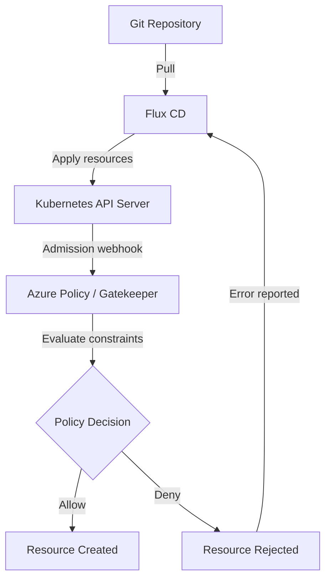

# How to Configure Flux CD with Azure Policy for Kubernetes

Author: [nawazdhandala](https://github.com/nawazdhandala)

Tags: flux-cd, Azure, azure-policy, Gatekeeper, Kubernetes, Compliance, OPA, GitOps

Description: Learn how to integrate Azure Policy for Kubernetes with Flux CD to enforce compliance, use Gatekeeper constraints, and ensure GitOps deployments meet organizational standards.

---

## Introduction

Azure Policy for Kubernetes extends Azure Policy to your AKS clusters, enforcing compliance rules on resources deployed by Flux CD. Under the hood, Azure Policy uses Open Policy Agent (OPA) Gatekeeper to evaluate and enforce policies as admission webhooks. This means every resource that Flux CD applies to the cluster goes through policy validation before being admitted.

This guide covers enabling the Azure Policy add-on, deploying Gatekeeper constraints through GitOps, and creating custom policies to ensure Flux CD deployments comply with organizational standards.

## Prerequisites

- An AKS cluster with Flux CD installed
- Azure CLI (v2.50 or later)
- Flux CLI (v2.2 or later)
- Azure subscription with permissions to assign policies

## Architecture



## Step 1: Enable Azure Policy Add-on on AKS

```bash
# Set variables
export RESOURCE_GROUP="rg-fluxcd-demo"
export CLUSTER_NAME="aks-fluxcd-demo"

# Register the Azure Policy provider (if not already registered)
az provider register --namespace Microsoft.PolicyInsights

# Enable the Azure Policy add-on on the AKS cluster
az aks enable-addons \
  --resource-group $RESOURCE_GROUP \
  --name $CLUSTER_NAME \
  --addons azure-policy

# Verify the add-on is enabled
az aks show \
  --resource-group $RESOURCE_GROUP \
  --name $CLUSTER_NAME \
  --query "addonProfiles.azurepolicy.enabled"
```

### Verify Gatekeeper Components

```bash
# Check that Gatekeeper pods are running
kubectl get pods -n gatekeeper-system

# Check that the Azure Policy pods are running
kubectl get pods -n kube-system -l app=azure-policy

# Verify constraint templates are available
kubectl get constrainttemplates
```

## Step 2: Assign Built-in Azure Policies for Kubernetes

Azure provides many built-in policies for Kubernetes. Here are essential ones for Flux CD environments.

```bash
# Get the AKS cluster resource ID
export CLUSTER_ID=$(az aks show \
  --resource-group $RESOURCE_GROUP \
  --name $CLUSTER_NAME \
  --query "id" \
  --output tsv)

# Policy: Kubernetes cluster containers should only use allowed images
az policy assignment create \
  --name "allowed-images" \
  --display-name "Only allow images from approved registries" \
  --policy "febd0533-8e55-448f-b837-bd0e06f16469" \
  --scope $CLUSTER_ID \
  --params '{
    "allowedContainerImagesRegex": "^(acrfluxcddemo\\.azurecr\\.io|mcr\\.microsoft\\.com|docker\\.io\\/library)\\/.+$",
    "effect": "deny"
  }'

# Policy: Kubernetes cluster pods should only use approved host network and port range
az policy assignment create \
  --name "no-host-network" \
  --display-name "Deny host network access" \
  --policy "82985f06-dc18-4a48-bc1c-b9f4f0098cfe" \
  --scope $CLUSTER_ID \
  --params '{
    "allowHostNetwork": false,
    "effect": "deny"
  }'

# Policy: Kubernetes cluster should not allow privileged containers
az policy assignment create \
  --name "no-privileged" \
  --display-name "Deny privileged containers" \
  --policy "95edb821-ddaf-4404-9732-666045e056b4" \
  --scope $CLUSTER_ID \
  --params '{
    "effect": "deny"
  }'

# Policy: Kubernetes clusters should not allow container privilege escalation
az policy assignment create \
  --name "no-privilege-escalation" \
  --display-name "Deny privilege escalation" \
  --policy "1c6e92c9-99f0-4e55-9cf2-0c234dc48f99" \
  --scope $CLUSTER_ID \
  --params '{
    "effect": "deny"
  }'
```

## Step 3: Deploy Gatekeeper Constraints via Flux CD

Manage Gatekeeper constraints through GitOps so they are version-controlled and auditable.

### Create a Constraint Template

```yaml
# File: clusters/my-cluster/policies/templates/required-labels.yaml
apiVersion: templates.gatekeeper.sh/v1
kind: ConstraintTemplate
metadata:
  name: k8srequiredlabels
spec:
  crd:
    spec:
      names:
        kind: K8sRequiredLabels
      validation:
        openAPIV3Schema:
          type: object
          properties:
            labels:
              type: array
              description: "List of required labels"
              items:
                type: object
                properties:
                  key:
                    type: string
                    description: "The label key"
                  allowedRegex:
                    type: string
                    description: "Regex for allowed values (optional)"
  targets:
    - target: admission.k8s.gatekeeper.sh
      rego: |
        package k8srequiredlabels

        # Check that all required labels are present
        violation[{"msg": msg}] {
          provided := {label | input.review.object.metadata.labels[label]}
          required := {label | label := input.parameters.labels[_].key}
          missing := required - provided
          count(missing) > 0
          msg := sprintf("Missing required labels: %v", [missing])
        }

        # Check that label values match allowed regex (if specified)
        violation[{"msg": msg}] {
          label := input.parameters.labels[_]
          label.allowedRegex != ""
          value := input.review.object.metadata.labels[label.key]
          not re_match(label.allowedRegex, value)
          msg := sprintf("Label '%v' value '%v' does not match regex '%v'", [label.key, value, label.allowedRegex])
        }
```

### Create a Constraint

```yaml
# File: clusters/my-cluster/policies/constraints/require-app-labels.yaml
apiVersion: constraints.gatekeeper.sh/v1beta1
kind: K8sRequiredLabels
metadata:
  name: require-app-labels
spec:
  # Only apply to these resource types
  match:
    kinds:
      - apiGroups: ["apps"]
        kinds: ["Deployment", "StatefulSet", "DaemonSet"]
    # Exclude system namespaces from enforcement
    excludedNamespaces:
      - kube-system
      - flux-system
      - gatekeeper-system
  parameters:
    labels:
      - key: "app.kubernetes.io/name"
      - key: "app.kubernetes.io/version"
      - key: "app.kubernetes.io/managed-by"
        allowedRegex: "^(flux|helm|kustomize)$"
```

### Resource Limits Constraint Template

```yaml
# File: clusters/my-cluster/policies/templates/container-limits.yaml
apiVersion: templates.gatekeeper.sh/v1
kind: ConstraintTemplate
metadata:
  name: k8scontainerlimits
spec:
  crd:
    spec:
      names:
        kind: K8sContainerLimits
      validation:
        openAPIV3Schema:
          type: object
          properties:
            cpu:
              type: string
              description: "Maximum CPU limit"
            memory:
              type: string
              description: "Maximum memory limit"
  targets:
    - target: admission.k8s.gatekeeper.sh
      rego: |
        package k8scontainerlimits

        # Ensure all containers have resource limits set
        violation[{"msg": msg}] {
          container := input.review.object.spec.template.spec.containers[_]
          not container.resources.limits
          msg := sprintf("Container '%v' has no resource limits", [container.name])
        }

        # Ensure all containers have resource requests set
        violation[{"msg": msg}] {
          container := input.review.object.spec.template.spec.containers[_]
          not container.resources.requests
          msg := sprintf("Container '%v' has no resource requests", [container.name])
        }
```

```yaml
# File: clusters/my-cluster/policies/constraints/enforce-container-limits.yaml
apiVersion: constraints.gatekeeper.sh/v1beta1
kind: K8sContainerLimits
metadata:
  name: enforce-container-limits
spec:
  match:
    kinds:
      - apiGroups: ["apps"]
        kinds: ["Deployment", "StatefulSet"]
    excludedNamespaces:
      - kube-system
      - flux-system
      - gatekeeper-system
  parameters:
    cpu: "2"
    memory: "4Gi"
```

## Step 4: Organize Policies in the GitOps Repository

```yaml
# File: clusters/my-cluster/policies/kustomization.yaml
apiVersion: kustomize.config.k8s.io/v1beta1
kind: Kustomization
resources:
  # Constraint templates must be applied before constraints
  - templates/required-labels.yaml
  - templates/container-limits.yaml
  # Constraints reference the templates
  - constraints/require-app-labels.yaml
  - constraints/enforce-container-limits.yaml
```

Create a Flux Kustomization to manage the policies:

```yaml
# File: clusters/my-cluster/policies-kustomization.yaml
apiVersion: kustomize.toolkit.fluxcd.io/v1
kind: Kustomization
metadata:
  name: cluster-policies
  namespace: flux-system
spec:
  interval: 10m
  sourceRef:
    kind: GitRepository
    name: flux-system
  path: ./clusters/my-cluster/policies
  prune: true
  # Apply policies before applications
  healthChecks:
    - apiVersion: templates.gatekeeper.sh/v1
      kind: ConstraintTemplate
      name: k8srequiredlabels
    - apiVersion: templates.gatekeeper.sh/v1
      kind: ConstraintTemplate
      name: k8scontainerlimits
```

## Step 5: Handle Policy Violations in Flux CD

When Flux tries to apply a resource that violates a policy, the Gatekeeper admission webhook rejects it. Flux reports the violation in the Kustomization status.

```bash
# Check for policy violations in Flux Kustomizations
flux get kustomizations

# Get detailed error messages
kubectl describe kustomization apps -n flux-system

# View Gatekeeper audit results
kubectl get k8srequiredlabels require-app-labels -o yaml

# List all constraint violations
kubectl get constraints -o json | jq '.items[].status.violations'
```

### Example: Fixing a Policy Violation

If a deployment fails due to missing labels, update the manifest in Git:

```yaml
# Before (will be rejected)
apiVersion: apps/v1
kind: Deployment
metadata:
  name: my-app
  namespace: default
spec:
  replicas: 2
  selector:
    matchLabels:
      app: my-app
  template:
    metadata:
      labels:
        app: my-app
    spec:
      containers:
        - name: my-app
          image: acrfluxcddemo.azurecr.io/my-app:v1.0
---
# After (will be accepted)
apiVersion: apps/v1
kind: Deployment
metadata:
  name: my-app
  namespace: default
  labels:
    app.kubernetes.io/name: my-app
    app.kubernetes.io/version: "1.0"
    app.kubernetes.io/managed-by: flux
spec:
  replicas: 2
  selector:
    matchLabels:
      app: my-app
  template:
    metadata:
      labels:
        app: my-app
        app.kubernetes.io/name: my-app
        app.kubernetes.io/version: "1.0"
        app.kubernetes.io/managed-by: flux
    spec:
      containers:
        - name: my-app
          image: acrfluxcddemo.azurecr.io/my-app:v1.0
          resources:
            requests:
              cpu: 100m
              memory: 128Mi
            limits:
              cpu: 500m
              memory: 256Mi
```

## Step 6: Use Azure Policy in Audit Mode

Start with audit mode to understand the impact before enforcing:

```bash
# Assign a policy in audit mode (does not block resources)
az policy assignment create \
  --name "audit-resource-limits" \
  --display-name "Audit containers without resource limits" \
  --policy "e345eecc-fa47-480f-9e88-67dcc122b164" \
  --scope $CLUSTER_ID \
  --params '{
    "effect": "audit"
  }'

# Check compliance results
az policy state list \
  --resource $CLUSTER_ID \
  --policy-assignment "audit-resource-limits" \
  --query "[].{Resource:resourceId, Compliance:complianceState}" \
  --output table
```

## Step 7: Monitor Policy Compliance

```bash
# Get overall compliance summary for the cluster
az policy state summarize \
  --resource $CLUSTER_ID \
  --output table

# List non-compliant resources
az policy state list \
  --resource $CLUSTER_ID \
  --filter "complianceState eq 'NonCompliant'" \
  --query "[].{Policy:policyAssignmentName, Resource:resourceId}" \
  --output table

# Check Gatekeeper audit logs
kubectl logs -n gatekeeper-system deployment/gatekeeper-audit \
  --tail=50
```

## Step 8: Enforce GitOps Configuration with Azure Policy

Azure Policy can also ensure that all AKS clusters have Flux CD configured:

```bash
# Policy: Kubernetes clusters should have the Flux extension installed
az policy assignment create \
  --name "require-flux-extension" \
  --display-name "Require Flux CD GitOps extension" \
  --policy "6b2122c1-8120-8a5d-7b9c-abfc13108f3a" \
  --scope "/subscriptions/<subscription-id>/resourceGroups/${RESOURCE_GROUP}" \
  --params '{
    "effect": "audit"
  }'
```

## Troubleshooting

### Constraint Not Being Enforced

```bash
# Verify the constraint template is installed
kubectl get constrainttemplates

# Check if the constraint is active
kubectl get constraints

# Ensure Gatekeeper webhook is running
kubectl get validatingwebhookconfigurations | grep gatekeeper
```

### Flux Kustomization Stuck Due to Policy

```bash
# Check the Kustomization events
kubectl events -n flux-system --for kustomization/apps

# Temporarily set a constraint to dryrun mode
kubectl patch k8srequiredlabels require-app-labels \
  --type merge \
  --patch '{"spec":{"enforcementAction":"dryrun"}}'
```

### Azure Policy Sync Delay

Azure Policy can take 15-30 minutes to sync new assignments to the cluster:

```bash
# Force a policy sync
az policy state trigger-scan \
  --resource-group $RESOURCE_GROUP
```

## Conclusion

Combining Azure Policy with Flux CD creates a powerful compliance-as-code framework for Kubernetes. By managing Gatekeeper constraints through GitOps, you ensure that policy enforcement is version-controlled, auditable, and consistently applied across all clusters. Starting with audit mode allows you to assess the impact before switching to enforcement, preventing disruption to existing workloads. This approach gives platform teams the controls they need while maintaining the speed and automation of GitOps deployments.
