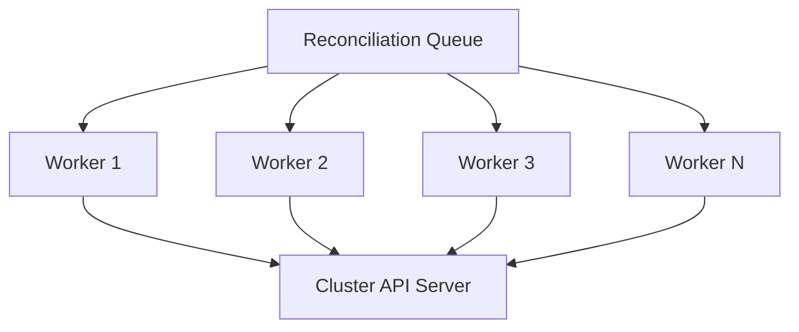

# How to Configure Flux CD Controller Concurrency

Author: [nawazdhandala](https://github.com/nawazdhandala)

Tags: flux cd, kubernetes, gitops, concurrency, performance tuning, controller configuration

Description: A practical guide to configuring and tuning concurrency settings across Flux CD controllers to balance throughput, resource usage, and reconciliation speed.

---

Concurrency in Flux CD determines how many resources a controller can reconcile simultaneously. Proper concurrency tuning is critical for balancing deployment speed against resource consumption. This guide covers how to configure concurrency for every Flux CD controller with practical examples and trade-off analysis.

## How Concurrency Works in Flux CD

Each Flux CD controller uses a work queue with configurable concurrency. The `--concurrent` flag sets the number of workers that process reconciliation requests in parallel. The default value is typically 4 for most controllers.



Higher concurrency means more resources are reconciled in parallel, but it also increases CPU, memory, and API server load.

## Default Concurrency Values

Each Flux CD controller has its own default concurrency:

| Controller | Default Concurrent | Primary Workload |
|---|---|---|
| source-controller | 4 | Git/Helm/OCI fetches |
| kustomize-controller | 4 | Manifest rendering and apply |
| helm-controller | 4 | Helm release management |
| notification-controller | 4 | Event dispatch |
| image-reflector-controller | 4 | Registry scanning |
| image-automation-controller | 4 | Git commits |

## Configuring Source Controller Concurrency

The source-controller handles fetching from Git, Helm, and OCI repositories. Increase concurrency when you have many sources to fetch.

```yaml
# source-controller-concurrency-patch.yaml
# Tune source-controller for a cluster with 50+ GitRepositories
apiVersion: apps/v1
kind: Deployment
metadata:
  name: source-controller
  namespace: flux-system
spec:
  template:
    spec:
      containers:
        - name: manager
          args:
            - --storage-path=/data
            - --storage-adv-addr=source-controller.$(RUNTIME_NAMESPACE).svc.cluster.local.
            # Increase concurrent source fetches
            # Each worker handles one source fetch at a time
            - --concurrent=8
            # Also increase event queue burst to handle more events
            - --kube-api-qps=50
            - --kube-api-burst=100
          resources:
            requests:
              # Scale resources proportionally with concurrency
              cpu: "200m"
              memory: "512Mi"
            limits:
              cpu: "1000m"
              memory: "1Gi"
```

## Configuring Kustomize Controller Concurrency

The kustomize-controller renders and applies manifests. It is typically the most resource-intensive controller.

```yaml
# kustomize-controller-concurrency-patch.yaml
# High-concurrency config for clusters with many Kustomizations
apiVersion: apps/v1
kind: Deployment
metadata:
  name: kustomize-controller
  namespace: flux-system
spec:
  template:
    spec:
      containers:
        - name: manager
          args:
            # Increase concurrent reconciliations
            - --concurrent=10
            # Reduce dependency requeue time for faster cascading updates
            - --requeue-dependency=5s
            # Increase API server QPS to match higher concurrency
            - --kube-api-qps=100
            - --kube-api-burst=200
          resources:
            requests:
              # High concurrency requires more CPU for parallel rendering
              cpu: "500m"
              memory: "1Gi"
            limits:
              cpu: "2000m"
              memory: "2Gi"
```

## Configuring Helm Controller Concurrency

The helm-controller manages Helm releases. Each concurrent worker renders a chart template and applies it.

```yaml
# helm-controller-concurrency-patch.yaml
# Tuned for clusters with 100+ HelmReleases
apiVersion: apps/v1
kind: Deployment
metadata:
  name: helm-controller
  namespace: flux-system
spec:
  template:
    spec:
      containers:
        - name: manager
          args:
            # Increase concurrent Helm release reconciliations
            - --concurrent=8
            # Increase API server QPS for parallel applies
            - --kube-api-qps=80
            - --kube-api-burst=160
          resources:
            requests:
              cpu: "200m"
              memory: "512Mi"
            limits:
              # Helm rendering can be CPU and memory intensive
              cpu: "1500m"
              memory: "1.5Gi"
```

## Configuring Image Reflector Concurrency

The image-reflector-controller scans container registries. Higher concurrency helps when scanning many images.

```yaml
# image-reflector-concurrency-patch.yaml
# Tuned for scanning 200+ container images
apiVersion: apps/v1
kind: Deployment
metadata:
  name: image-reflector-controller
  namespace: flux-system
spec:
  template:
    spec:
      containers:
        - name: manager
          args:
            # More concurrent registry scans
            - --concurrent=10
            # Increase API QPS for writing ImagePolicy statuses
            - --kube-api-qps=50
            - --kube-api-burst=100
          resources:
            requests:
              cpu: "100m"
              memory: "256Mi"
            limits:
              cpu: "500m"
              memory: "512Mi"
```

## Applying All Concurrency Patches via Kustomization

Combine all patches into a single Kustomization overlay.

```yaml
# kustomization.yaml
# Central overlay for all concurrency tuning patches
apiVersion: kustomize.config.k8s.io/v1beta1
kind: Kustomization
resources:
  - gotk-components.yaml
  - gotk-sync.yaml
patches:
  # Source controller concurrency
  - path: patches/source-controller-concurrency.yaml
    target:
      kind: Deployment
      name: source-controller
  # Kustomize controller concurrency
  - path: patches/kustomize-controller-concurrency.yaml
    target:
      kind: Deployment
      name: kustomize-controller
  # Helm controller concurrency
  - path: patches/helm-controller-concurrency.yaml
    target:
      kind: Deployment
      name: helm-controller
  # Image reflector concurrency
  - path: patches/image-reflector-concurrency.yaml
    target:
      kind: Deployment
      name: image-reflector-controller
```

## Tuning API Server QPS and Burst

When you increase concurrency, you must also increase the Kubernetes API server QPS and burst limits. Otherwise, controllers will be throttled by the API client rate limiter.

```yaml
# api-rate-limiting-patch.yaml
# Increase API client rate limits to match higher concurrency
apiVersion: apps/v1
kind: Deployment
metadata:
  name: kustomize-controller
  namespace: flux-system
spec:
  template:
    spec:
      containers:
        - name: manager
          args:
            - --concurrent=10
            # QPS should be roughly concurrent * 10
            # Each reconciliation may make 10+ API calls
            - --kube-api-qps=100
            # Burst should be 2x QPS to handle spikes
            - --kube-api-burst=200
```

The relationship between concurrency and API QPS:

| Concurrent Workers | Recommended QPS | Recommended Burst |
|---|---|---|
| 2 | 20 | 40 |
| 4 (default) | 40 | 80 |
| 8 | 80 | 160 |
| 16 | 160 | 320 |

## Concurrency Sizing Guidelines

Choose concurrency based on your cluster size and resource count.

```yaml
# Small cluster: < 50 resources managed by Flux
# Use default concurrency (4) or lower
# Priorities: low resource usage
#
# source-controller: --concurrent=2
# kustomize-controller: --concurrent=4
# helm-controller: --concurrent=2

# Medium cluster: 50-200 resources managed by Flux
# Moderate concurrency with proportional resources
#
# source-controller: --concurrent=4
# kustomize-controller: --concurrent=8
# helm-controller: --concurrent=4

# Large cluster: 200+ resources managed by Flux
# High concurrency with generous resource limits
# Consider sharding for very large clusters
#
# source-controller: --concurrent=8
# kustomize-controller: --concurrent=16
# helm-controller: --concurrent=8
```

## Monitoring Concurrency Effectiveness

Use Prometheus metrics to determine if your concurrency settings are optimal.

```yaml
# PrometheusRule for concurrency monitoring
apiVersion: monitoring.coreos.com/v1
kind: PrometheusRule
metadata:
  name: flux-concurrency-alerts
  namespace: flux-system
spec:
  groups:
    - name: flux-concurrency
      rules:
        # Alert when reconciliation queue is backing up
        # This indicates concurrency is too low
        - alert: FluxReconciliationQueueBacklog
          expr: |
            workqueue_depth{
              namespace="flux-system"
            } > 10
          for: 5m
          labels:
            severity: warning
          annotations:
            summary: "Flux {{ $labels.name }} queue depth is {{ $value }}"
            description: "Consider increasing --concurrent for this controller."

        # Alert when reconciliation latency is high
        - alert: FluxReconciliationSlow
          expr: |
            histogram_quantile(0.95,
              rate(workqueue_queue_duration_seconds_bucket{
                namespace="flux-system"
              }[5m])
            ) > 30
          for: 5m
          labels:
            severity: warning
          annotations:
            summary: "Flux {{ $labels.name }} queue wait time is {{ $value }}s"
            description: "Resources are waiting too long; increase concurrency."
```

Useful PromQL queries for evaluating concurrency:

```promql
# Queue depth - if consistently > 0, increase concurrency
workqueue_depth{namespace="flux-system"}

# Queue latency - time items wait in queue before being processed
histogram_quantile(0.95,
  rate(workqueue_queue_duration_seconds_bucket{namespace="flux-system"}[5m])
)

# Active workers - should be close to --concurrent value
workqueue_unfinished_work_seconds{namespace="flux-system"}
```

## Summary

Key guidelines for configuring Flux CD controller concurrency:

1. Start with default concurrency (4) and increase based on observed queue depth
2. Scale API QPS and burst proportionally with concurrency (QPS = concurrent x 10)
3. Increase CPU and memory limits when raising concurrency
4. Use Prometheus metrics to identify when concurrency is too low (queue backlog) or too high (resource exhaustion)
5. Different controllers have different resource profiles; tune each independently
6. For very large clusters (500+ resources), consider controller sharding instead of high concurrency
7. Always test concurrency changes in staging before applying to production

The goal is to find the sweet spot where queue depth stays near zero without excessive resource consumption.
