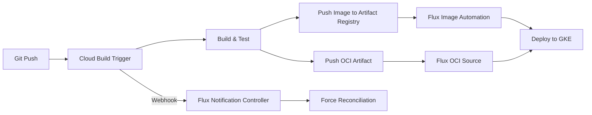

# How to Configure Flux CD with Google Cloud Build Triggers

Author: [nawazdhandala](https://github.com/nawazdhandala)

Tags: flux cd, google cloud build, gcp, ci/cd, gitops, oci, webhooks, kubernetes

Description: A practical guide to integrating Google Cloud Build with Flux CD using OCI artifacts, webhook receivers, and automated image updates.

---

## Introduction

Google Cloud Build provides a serverless CI/CD platform for building, testing, and packaging your applications. By integrating Cloud Build with Flux CD, you create a complete pipeline where Cloud Build handles the build phase and Flux CD handles the deployment phase through GitOps.

This guide covers three integration patterns: pushing OCI artifacts from Cloud Build to Artifact Registry for Flux consumption, triggering Flux reconciliation via webhook receivers, and automating image updates.

## Prerequisites

- A GKE cluster with Flux CD v2.x installed
- Google Cloud Build API enabled
- Google Artifact Registry repository created
- `gcloud` CLI configured with appropriate permissions
- A GitHub repository connected to both Cloud Build and Flux

## Architecture Overview



## Step 1: Set Up Artifact Registry

Create repositories for both container images and OCI artifacts.

```bash
# Create a Docker repository for container images
gcloud artifacts repositories create app-images \
  --repository-format=docker \
  --location=us-central1 \
  --description="Application container images"

# Create a repository for OCI manifests (Flux kustomization bundles)
gcloud artifacts repositories create flux-manifests \
  --repository-format=docker \
  --location=us-central1 \
  --description="Flux OCI manifest bundles"
```

## Step 2: Create a Cloud Build Configuration

Create a `cloudbuild.yaml` that builds your application and pushes artifacts for Flux.

```yaml
# cloudbuild.yaml
# This build config does three things:
# 1. Builds the application container image
# 2. Pushes it to Artifact Registry with a semver tag
# 3. Packages and pushes Kubernetes manifests as an OCI artifact
steps:
  # Step 1: Build the container image
  - name: "gcr.io/cloud-builders/docker"
    id: "build-image"
    args:
      - "build"
      - "-t"
      - "us-central1-docker.pkg.dev/$PROJECT_ID/app-images/my-app:${TAG_NAME}"
      - "-t"
      - "us-central1-docker.pkg.dev/$PROJECT_ID/app-images/my-app:latest"
      - "."

  # Step 2: Push the container image
  - name: "gcr.io/cloud-builders/docker"
    id: "push-image"
    args:
      - "push"
      - "--all-tags"
      - "us-central1-docker.pkg.dev/$PROJECT_ID/app-images/my-app"
    waitFor: ["build-image"]

  # Step 3: Install Flux CLI for OCI push
  - name: "gcr.io/cloud-builders/curl"
    id: "install-flux"
    entrypoint: "bash"
    args:
      - "-c"
      - |
        curl -s https://fluxcd.io/install.sh | bash
        cp /usr/local/bin/flux /workspace/flux
    waitFor: ["-"]

  # Step 4: Package Kubernetes manifests as OCI artifact
  - name: "gcr.io/cloud-builders/gcloud"
    id: "push-manifests"
    entrypoint: "bash"
    args:
      - "-c"
      - |
        # Authenticate to Artifact Registry
        gcloud auth print-access-token | \
          /workspace/flux oci login \
          us-central1-docker.pkg.dev \
          --username=oauth2accesstoken \
          --password-stdin

        # Push the Kubernetes manifests as an OCI artifact
        /workspace/flux push artifact \
          oci://us-central1-docker.pkg.dev/$PROJECT_ID/flux-manifests/my-app:${TAG_NAME} \
          --path=./deploy/manifests \
          --source="$(git config --get remote.origin.url)" \
          --revision="${TAG_NAME}@sha1:${COMMIT_SHA}"
    waitFor: ["install-flux"]

  # Step 5: Tag the OCI artifact as latest
  - name: "gcr.io/cloud-builders/gcloud"
    id: "tag-manifests"
    entrypoint: "bash"
    args:
      - "-c"
      - |
        gcloud auth print-access-token | \
          /workspace/flux oci login \
          us-central1-docker.pkg.dev \
          --username=oauth2accesstoken \
          --password-stdin

        /workspace/flux tag artifact \
          oci://us-central1-docker.pkg.dev/$PROJECT_ID/flux-manifests/my-app:${TAG_NAME} \
          --tag=latest
    waitFor: ["push-manifests"]

# Container images to push to Artifact Registry
images:
  - "us-central1-docker.pkg.dev/$PROJECT_ID/app-images/my-app:${TAG_NAME}"
  - "us-central1-docker.pkg.dev/$PROJECT_ID/app-images/my-app:latest"

options:
  logging: CLOUD_LOGGING_ONLY
```

## Step 3: Create a Cloud Build Trigger

```bash
# Create a trigger that fires on Git tags matching semver pattern
gcloud builds triggers create github \
  --name="my-app-release" \
  --repo-name="my-app" \
  --repo-owner="${GITHUB_USER}" \
  --tag-pattern="v[0-9]+\.[0-9]+\.[0-9]+" \
  --build-config="cloudbuild.yaml" \
  --description="Build and push app on version tags"
```

## Step 4: Configure Flux OCI Source

Set up Flux to pull manifests from the OCI artifact pushed by Cloud Build.

```yaml
# clusters/my-cluster/my-app-source.yaml
# Pull Kubernetes manifests from the OCI artifact in Artifact Registry
apiVersion: source.toolkit.fluxcd.io/v1beta2
kind: OCIRepository
metadata:
  name: my-app-manifests
  namespace: flux-system
spec:
  interval: 5m
  url: oci://us-central1-docker.pkg.dev/my-project-id/flux-manifests/my-app
  ref:
    # Track the latest tag
    tag: latest
  # Use GKE Workload Identity for authentication
  provider: gcp
```

Create the Kustomization that deploys from the OCI source.

```yaml
# clusters/my-cluster/my-app-deploy.yaml
apiVersion: kustomize.toolkit.fluxcd.io/v1
kind: Kustomization
metadata:
  name: my-app
  namespace: flux-system
spec:
  interval: 10m
  # Reference the OCI source instead of a GitRepository
  sourceRef:
    kind: OCIRepository
    name: my-app-manifests
  path: ./
  prune: true
  wait: true
  timeout: 5m
  targetNamespace: my-app
```

## Step 5: Set Up Webhook Receiver for Immediate Reconciliation

Instead of waiting for the next poll interval, configure a webhook receiver to trigger Flux reconciliation immediately after a Cloud Build completes.

```yaml
# infrastructure/webhooks/flux-receiver.yaml
# Create a secret for webhook authentication
apiVersion: v1
kind: Secret
metadata:
  name: cloud-build-webhook-token
  namespace: flux-system
type: Opaque
stringData:
  # Generate a strong random token
  token: "your-secure-webhook-token-here"
---
# Configure the Flux webhook receiver
apiVersion: notification.toolkit.fluxcd.io/v1
kind: Receiver
metadata:
  name: cloud-build-receiver
  namespace: flux-system
spec:
  type: generic
  # Reference the webhook secret
  secretRef:
    name: cloud-build-webhook-token
  # Resources to reconcile when the webhook fires
  resources:
    - kind: OCIRepository
      name: my-app-manifests
      namespace: flux-system
    - kind: Kustomization
      name: my-app
      namespace: flux-system
```

Apply and get the webhook URL.

```bash
# Apply the receiver
kubectl apply -f infrastructure/webhooks/flux-receiver.yaml

# Get the webhook URL
kubectl get receiver cloud-build-receiver -n flux-system \
  -o jsonpath='{.status.webhookPath}'

# The full URL will be:
# http://<notification-controller-address>/<webhook-path>
```

## Step 6: Add Webhook Call to Cloud Build

Add a final step to your `cloudbuild.yaml` that triggers the Flux webhook.

```yaml
  # Step 6: Trigger Flux reconciliation via webhook
  - name: "gcr.io/cloud-builders/curl"
    id: "trigger-flux"
    entrypoint: "bash"
    args:
      - "-c"
      - |
        # Call the Flux webhook receiver to trigger immediate reconciliation
        # The webhook URL is exposed via a LoadBalancer or Ingress
        curl -s -X POST \
          -H "Content-Type: application/json" \
          -d '{"source": "cloud-build", "tag": "${TAG_NAME}"}' \
          "https://flux-webhook.example.com/<webhook-path>"
    waitFor: ["tag-manifests"]
```

## Step 7: Configure Flux Image Automation

For container image updates, set up Flux image automation to watch Artifact Registry.

```yaml
# infrastructure/image-automation/image-repo.yaml
apiVersion: image.toolkit.fluxcd.io/v1beta2
kind: ImageRepository
metadata:
  name: my-app
  namespace: flux-system
spec:
  image: us-central1-docker.pkg.dev/my-project-id/app-images/my-app
  interval: 5m
  # Use GCP Workload Identity for Artifact Registry auth
  provider: gcp
---
# infrastructure/image-automation/image-policy.yaml
apiVersion: image.toolkit.fluxcd.io/v1beta2
kind: ImagePolicy
metadata:
  name: my-app
  namespace: flux-system
spec:
  imageRepositoryRef:
    name: my-app
  policy:
    semver:
      # Accept any stable semver version
      range: ">=1.0.0"
---
# infrastructure/image-automation/image-update.yaml
apiVersion: image.toolkit.fluxcd.io/v1beta2
kind: ImageUpdateAutomation
metadata:
  name: my-app
  namespace: flux-system
spec:
  interval: 5m
  sourceRef:
    kind: GitRepository
    name: flux-system
  git:
    checkout:
      ref:
        branch: main
    commit:
      author:
        name: fluxcdbot
        email: fluxcdbot@example.com
      messageTemplate: "chore: update my-app to {{range .Changed.Changes}}{{.NewValue}}{{end}}"
    push:
      branch: main
  update:
    path: ./apps/my-app
    strategy: Setters
```

## Step 8: Set Up Cloud Build Notifications to Flux

Configure Flux to send alerts about deployment status back to your team.

```yaml
# infrastructure/notifications/flux-alerts.yaml
apiVersion: notification.toolkit.fluxcd.io/v1beta3
kind: Provider
metadata:
  name: google-chat
  namespace: flux-system
spec:
  type: googlechat
  address: "https://chat.googleapis.com/v1/spaces/SPACE_ID/messages?key=KEY&token=TOKEN"
---
apiVersion: notification.toolkit.fluxcd.io/v1beta3
kind: Alert
metadata:
  name: deployment-alerts
  namespace: flux-system
spec:
  providerRef:
    name: google-chat
  eventSeverity: info
  eventSources:
    - kind: Kustomization
      name: my-app
    - kind: OCIRepository
      name: my-app-manifests
  inclusionList:
    - ".*succeeded.*"
    - ".*failed.*"
```

## Step 9: Grant Cloud Build Permissions

Ensure Cloud Build has the necessary permissions to push to Artifact Registry.

```bash
# Get the Cloud Build service account
export CB_SA=$(gcloud projects describe $PROJECT_ID \
  --format='value(projectNumber)')@cloudbuild.gserviceaccount.com

# Grant Artifact Registry writer role
gcloud artifacts repositories add-iam-policy-binding app-images \
  --location=us-central1 \
  --member="serviceAccount:${CB_SA}" \
  --role="roles/artifactregistry.writer"

gcloud artifacts repositories add-iam-policy-binding flux-manifests \
  --location=us-central1 \
  --member="serviceAccount:${CB_SA}" \
  --role="roles/artifactregistry.writer"
```

## Step 10: Verify the End-to-End Pipeline

Test the complete pipeline from code push to deployment.

```bash
# Create and push a version tag to trigger Cloud Build
git tag v1.0.0
git push origin v1.0.0

# Monitor the Cloud Build progress
gcloud builds list --limit=1

# Watch Flux reconciliation
flux get ocirepositories -w

# Check the deployed application
kubectl get pods -n my-app
kubectl get deployment -n my-app -o wide
```

## Troubleshooting

### OCI Pull Failures

```bash
# Verify Flux can authenticate to Artifact Registry
flux logs --kind=OCIRepository --name=my-app-manifests

# Test OCI pull manually
flux pull artifact \
  oci://us-central1-docker.pkg.dev/my-project-id/flux-manifests/my-app:latest \
  --output=/tmp/manifests
```

### Webhook Not Triggering Reconciliation

```bash
# Check receiver status
kubectl get receiver -n flux-system

# View notification controller logs
kubectl logs -n flux-system deploy/notification-controller --tail=50

# Verify the webhook endpoint is reachable
kubectl get svc -n flux-system notification-controller
```

## Summary

You have configured a complete CI/CD pipeline using Google Cloud Build and Flux CD. Cloud Build triggers on Git tags, builds container images, pushes them to Artifact Registry, packages Kubernetes manifests as OCI artifacts, and notifies Flux via webhooks for immediate reconciliation. This separation of concerns keeps your build pipeline in Cloud Build and your deployment pipeline in Flux CD, providing a clean GitOps workflow with full audit trails on both sides.
