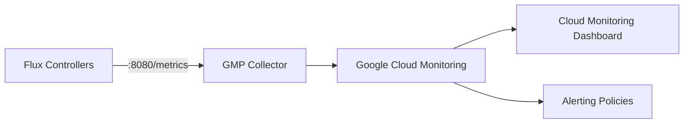

# How to Configure Flux CD with Google Cloud Monitoring

Author: [nawazdhandala](https://github.com/nawazdhandala)

Tags: flux cd, google cloud monitoring, gcp, prometheus, kubernetes, gitops, observability

Description: A practical guide to integrating Flux CD metrics with Google Cloud Monitoring using the Prometheus-to-GCM pipeline on GKE.

---

## Introduction

Flux CD generates a wealth of metrics about your GitOps reconciliation processes. By forwarding these metrics to Google Cloud Monitoring (formerly Stackdriver), you gain centralized observability across all your GKE clusters without maintaining a separate Prometheus stack long-term.

This guide walks you through setting up the Prometheus-to-Google Cloud Monitoring pipeline, configuring Flux CD to expose its metrics, and building dashboards in Cloud Monitoring.

## Prerequisites

Before you begin, ensure you have:

- A GKE cluster running Kubernetes 1.27 or later
- Flux CD v2.x installed on the cluster
- The `gcloud` CLI configured with appropriate permissions
- A Google Cloud project with the Cloud Monitoring API enabled

## Understanding the Architecture

Flux CD controllers expose Prometheus-format metrics on port 8080 by default. Google Cloud Managed Service for Prometheus (GMP) collects these metrics and forwards them to Cloud Monitoring.



## Step 1: Enable Google Managed Prometheus on GKE

GKE clusters created after GKE version 1.27 have managed collection enabled by default. Verify or enable it with the following command.

```bash
# Check if managed collection is enabled
gcloud container clusters describe my-cluster \
  --zone us-central1-a \
  --format="value(monitoringConfig.managedPrometheusConfig.enabled)"

# Enable managed collection if not already active
gcloud container clusters update my-cluster \
  --zone us-central1-a \
  --enable-managed-prometheus
```

## Step 2: Create a PodMonitoring Resource for Flux Controllers

Google Managed Prometheus uses `PodMonitoring` custom resources to define scrape targets. Create a manifest that targets all Flux controllers in the `flux-system` namespace.

```yaml
# flux-pod-monitoring.yaml
# This PodMonitoring resource tells GMP to scrape metrics
# from all Flux CD controllers in the flux-system namespace.
apiVersion: monitoring.googleapis.com/v1
kind: PodMonitoring
metadata:
  name: flux-controllers
  namespace: flux-system
  labels:
    app.kubernetes.io/part-of: flux
spec:
  # Select all pods with the app.kubernetes.io/part-of=flux label
  selector:
    matchLabels:
      app.kubernetes.io/part-of: flux
  endpoints:
    - port: http-prom
      # Scrape every 30 seconds for a good balance
      # between granularity and cost
      interval: 30s
      path: /metrics
```

Apply this resource to your cluster.

```bash
kubectl apply -f flux-pod-monitoring.yaml
```

## Step 3: Create Individual PodMonitoring for Each Controller

For more granular control, create separate PodMonitoring resources for each Flux controller.

```yaml
# source-controller-monitoring.yaml
apiVersion: monitoring.googleapis.com/v1
kind: PodMonitoring
metadata:
  name: source-controller
  namespace: flux-system
spec:
  selector:
    matchLabels:
      app: source-controller
  endpoints:
    - port: http-prom
      interval: 30s
      path: /metrics
      # Filter to only the metrics you care about
      # to reduce Cloud Monitoring costs
      metricRelabeling:
        - sourceLabels: [__name__]
          regex: "gotk_.*|controller_runtime_.*"
          action: keep
---
# kustomize-controller-monitoring.yaml
apiVersion: monitoring.googleapis.com/v1
kind: PodMonitoring
metadata:
  name: kustomize-controller
  namespace: flux-system
spec:
  selector:
    matchLabels:
      app: kustomize-controller
  endpoints:
    - port: http-prom
      interval: 30s
      path: /metrics
      metricRelabeling:
        - sourceLabels: [__name__]
          regex: "gotk_.*|controller_runtime_.*"
          action: keep
---
# helm-controller-monitoring.yaml
apiVersion: monitoring.googleapis.com/v1
kind: PodMonitoring
metadata:
  name: helm-controller
  namespace: flux-system
spec:
  selector:
    matchLabels:
      app: helm-controller
  endpoints:
    - port: http-prom
      interval: 30s
      path: /metrics
      metricRelabeling:
        - sourceLabels: [__name__]
          regex: "gotk_.*|controller_runtime_.*"
          action: keep
```

## Step 4: Manage Monitoring Resources with Flux

Instead of applying these resources manually, add them to your Flux Git repository so they are managed via GitOps.

```yaml
# clusters/my-cluster/monitoring/kustomization.yaml
apiVersion: kustomize.toolkit.fluxcd.io/v1
kind: Kustomization
metadata:
  name: flux-monitoring
  namespace: flux-system
spec:
  interval: 10m
  # Path to the monitoring manifests in your repo
  path: ./infrastructure/monitoring/flux
  prune: true
  sourceRef:
    kind: GitRepository
    name: flux-system
  timeout: 5m
```

## Step 5: Verify Metrics Are Flowing

After applying the PodMonitoring resources, verify that metrics are being collected.

```bash
# Check that PodMonitoring resources are created
kubectl get podmonitoring -n flux-system

# Verify the GMP collector pods are running
kubectl get pods -n gmp-system

# Check GMP collector logs for scrape activity
kubectl logs -n gmp-system -l app.kubernetes.io/name=collector \
  --tail=50 | grep flux-system
```

You can also verify from the Cloud Monitoring side.

```bash
# Query metrics using gcloud
gcloud monitoring metrics list \
  --filter='metric.type=starts_with("prometheus.googleapis.com/gotk_")'
```

## Step 6: Key Flux CD Metrics to Monitor

Here are the most important Flux CD metrics to track in Cloud Monitoring.

| Metric Name | Description | Use Case |
|---|---|---|
| `gotk_reconcile_condition` | Current condition of reconciliation | Track health status |
| `gotk_reconcile_duration_seconds` | Time taken to reconcile | Performance monitoring |
| `gotk_suspend_status` | Whether a resource is suspended | Detect paused deployments |
| `controller_runtime_reconcile_total` | Total reconciliation attempts | Throughput tracking |
| `controller_runtime_reconcile_errors_total` | Failed reconciliations | Error detection |

## Step 7: Create a Cloud Monitoring Dashboard

Use the `gcloud` CLI or Terraform to create a monitoring dashboard for Flux CD.

```json
{
  "displayName": "Flux CD GitOps Dashboard",
  "mosaicLayout": {
    "tiles": [
      {
        "width": 6,
        "height": 4,
        "widget": {
          "title": "Reconciliation Status",
          "xyChart": {
            "dataSets": [
              {
                "timeSeriesQuery": {
                  "prometheusQuery": "sum by (kind, name) (gotk_reconcile_condition{type=\"Ready\", status=\"True\"})"
                },
                "plotType": "LINE"
              }
            ]
          }
        }
      },
      {
        "xPos": 6,
        "width": 6,
        "height": 4,
        "widget": {
          "title": "Reconciliation Duration (p99)",
          "xyChart": {
            "dataSets": [
              {
                "timeSeriesQuery": {
                  "prometheusQuery": "histogram_quantile(0.99, sum by (le, kind) (rate(gotk_reconcile_duration_seconds_bucket[5m])))"
                },
                "plotType": "LINE"
              }
            ]
          }
        }
      }
    ]
  }
}
```

Save this as `flux-dashboard.json` and create it.

```bash
# Create the dashboard in Cloud Monitoring
gcloud monitoring dashboards create \
  --config-from-file=flux-dashboard.json
```

## Step 8: Configure Alerting Policies

Set up alerts for critical Flux CD events.

```yaml
# alert-policy.yaml
# This policy alerts when Flux reconciliation fails
# for more than 5 minutes
combiner: OR
conditions:
  - displayName: "Flux Reconciliation Failure"
    conditionPrometheusQueryLanguage:
      query: >
        sum by (kind, name, namespace) (
          gotk_reconcile_condition{
            type="Ready",
            status="False"
          }
        ) > 0
      duration: 300s
      evaluationInterval: 60s
      alertRule: "FluxReconciliationFailure"
displayName: "Flux CD Reconciliation Failures"
notificationChannels:
  - projects/my-project/notificationChannels/CHANNEL_ID
```

Create the alert policy.

```bash
# Create alerting policy
gcloud alpha monitoring policies create \
  --policy-from-file=alert-policy.yaml
```

## Step 9: Set Up Log-Based Metrics

Complement Prometheus metrics with log-based metrics from Flux CD controller logs.

```bash
# Create a log-based metric for Flux reconciliation errors
gcloud logging metrics create flux_reconcile_errors \
  --description="Count of Flux CD reconciliation errors" \
  --log-filter='resource.type="k8s_container"
    resource.labels.namespace_name="flux-system"
    severity>=ERROR
    jsonPayload.msg=~"reconciliation failed"'
```

## Step 10: Multi-Cluster Monitoring

For organizations running Flux across multiple GKE clusters, use Cloud Monitoring's cross-project capabilities.

```yaml
# cluster-pod-monitoring.yaml
# Deploy this PodMonitoring to each cluster
# Metrics are automatically labeled with the cluster name
apiVersion: monitoring.googleapis.com/v1
kind: ClusterPodMonitoring
metadata:
  name: flux-controllers-cluster
  labels:
    app.kubernetes.io/part-of: flux-monitoring
spec:
  selector:
    matchLabels:
      app.kubernetes.io/part-of: flux
  endpoints:
    - port: http-prom
      interval: 30s
      path: /metrics
  # Target only the flux-system namespace
  targetLabels:
    metadata:
      - pod
      - container
      - node
```

## Troubleshooting

### Metrics Not Appearing in Cloud Monitoring

```bash
# Verify the Flux controller pods have the expected labels
kubectl get pods -n flux-system --show-labels

# Check that the metrics endpoint is accessible
kubectl port-forward -n flux-system \
  deploy/source-controller 8080:8080 &
curl -s http://localhost:8080/metrics | head -20

# Verify GMP collector status
kubectl get pods -n gmp-system
kubectl logs -n gmp-system -l app.kubernetes.io/name=collector \
  --tail=100
```

### High Cardinality Warnings

If you receive high cardinality warnings, use metric relabeling to reduce the number of unique time series.

```yaml
# Add to your PodMonitoring endpoints
metricRelabeling:
  - sourceLabels: [__name__]
    # Only keep Flux-specific and controller runtime metrics
    regex: "gotk_.*|controller_runtime_reconcile_.*"
    action: keep
  - sourceLabels: [revision]
    # Drop the revision label to reduce cardinality
    action: labeldrop
```

## Summary

You have configured Flux CD with Google Cloud Monitoring by setting up GMP PodMonitoring resources, creating dashboards, and establishing alerting policies. This setup provides centralized observability for your GitOps workflows without the overhead of managing a dedicated Prometheus server. The metrics flow automatically from Flux controllers through GMP to Cloud Monitoring, where you can visualize and alert on them alongside your other GCP metrics.
