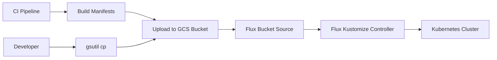

# How to Configure Flux CD with Google Cloud Storage Bucket Source

Author: [nawazdhandala](https://github.com/nawazdhandala)

Tags: flux cd, google cloud, cloud storage, gcs, bucket, gitops, kubernetes, workload identity, hmac

Description: A practical guide to configuring Flux CD to use Google Cloud Storage buckets as a source for Kubernetes manifests, including HMAC key authentication and Workload Identity.

---

## Introduction

Flux CD supports Google Cloud Storage (GCS) buckets as a source for Kubernetes manifests and configurations. This is useful in scenarios where you want to distribute pre-built manifests, share configurations across multiple clusters, or use a CI pipeline that publishes artifacts to GCS rather than pushing to a Git repository.

This guide covers configuring the Flux Bucket source for Google Cloud Storage, including authentication with HMAC keys and Workload Identity, and setting up automated deployments from GCS bucket contents.

## Prerequisites

- A GKE cluster with Flux CD installed
- gcloud CLI installed and configured
- kubectl and Flux CLI installed
- A Google Cloud project with Cloud Storage API enabled

## Architecture Overview



## Step 1: Create a Google Cloud Storage Bucket

Create a GCS bucket to store Kubernetes manifests.

```bash
# Set environment variables
export PROJECT_ID=$(gcloud config get-value project)
export BUCKET_NAME="${PROJECT_ID}-flux-manifests"
export REGION="us-central1"

# Create the GCS bucket
gcloud storage buckets create "gs://${BUCKET_NAME}" \
  --location=$REGION \
  --uniform-bucket-level-access \
  --public-access-prevention

# Enable versioning for audit trail
gcloud storage buckets update "gs://${BUCKET_NAME}" \
  --versioning

# Set a lifecycle rule to clean up old versions after 30 days
cat > lifecycle.json << 'EOF'
{
  "rule": [
    {
      "action": {"type": "Delete"},
      "condition": {
        "numNewerVersions": 5,
        "isLive": false
      }
    }
  ]
}
EOF

gcloud storage buckets update "gs://${BUCKET_NAME}" \
  --lifecycle-file=lifecycle.json

rm lifecycle.json
```

## Step 2: Upload Kubernetes Manifests to the Bucket

Prepare and upload Kubernetes manifests to the GCS bucket.

```bash
# Create a directory with Kubernetes manifests
mkdir -p manifests/production

# Create a sample deployment manifest
cat > manifests/production/deployment.yaml << 'EOF'
apiVersion: apps/v1
kind: Deployment
metadata:
  name: web-app
  namespace: production
  labels:
    app: web-app
spec:
  replicas: 3
  selector:
    matchLabels:
      app: web-app
  template:
    metadata:
      labels:
        app: web-app
    spec:
      containers:
        - name: web-app
          image: us-central1-docker.pkg.dev/PROJECT_ID/docker-images/web-app:v1.0.0
          ports:
            - containerPort: 8080
          resources:
            requests:
              cpu: 100m
              memory: 128Mi
            limits:
              cpu: 500m
              memory: 256Mi
EOF

# Create a service manifest
cat > manifests/production/service.yaml << 'EOF'
apiVersion: v1
kind: Service
metadata:
  name: web-app
  namespace: production
spec:
  selector:
    app: web-app
  ports:
    - port: 80
      targetPort: 8080
  type: ClusterIP
EOF

# Create a kustomization.yaml for the manifests
cat > manifests/production/kustomization.yaml << 'EOF'
apiVersion: kustomize.config.k8s.io/v1beta1
kind: Kustomization
resources:
  - deployment.yaml
  - service.yaml
namespace: production
EOF

# Upload manifests to the GCS bucket
gcloud storage cp -r manifests/production/* "gs://${BUCKET_NAME}/production/"

# Verify the upload
gcloud storage ls "gs://${BUCKET_NAME}/production/"
```

## Step 3: Configure Workload Identity for GCS Access

Set up Workload Identity to allow the Flux source-controller to read from the GCS bucket.

```bash
# Create a Google Service Account for Flux
gcloud iam service-accounts create flux-gcs-reader \
  --display-name "Flux GCS Bucket Reader"

# Grant Storage Object Viewer role on the bucket
gcloud storage buckets add-iam-policy-binding "gs://${BUCKET_NAME}" \
  --member="serviceAccount:flux-gcs-reader@${PROJECT_ID}.iam.gserviceaccount.com" \
  --role="roles/storage.objectViewer"

# Create the Workload Identity binding
gcloud iam service-accounts add-iam-policy-binding \
  flux-gcs-reader@${PROJECT_ID}.iam.gserviceaccount.com \
  --member="serviceAccount:${PROJECT_ID}.svc.id.goog[flux-system/source-controller]" \
  --role="roles/iam.workloadIdentityUser"

# Annotate the Flux source-controller service account
kubectl annotate serviceaccount source-controller \
  --namespace flux-system \
  --overwrite \
  iam.gke.io/gcp-service-account=flux-gcs-reader@${PROJECT_ID}.iam.gserviceaccount.com

# Restart the source-controller to pick up the identity
kubectl rollout restart deployment/source-controller -n flux-system
```

## Step 4: Configure Flux Bucket Source with Workload Identity

Create a Flux Bucket resource that reads from the GCS bucket using Workload Identity.

```yaml
# bucket-source-gcs.yaml
# Configures Flux to read manifests from a GCS bucket
apiVersion: source.toolkit.fluxcd.io/v1beta2
kind: Bucket
metadata:
  name: gcs-manifests
  namespace: flux-system
spec:
  interval: 5m
  # Use the GCP provider for Workload Identity authentication
  provider: gcp
  # The GCS bucket name
  bucketName: PROJECT_ID-flux-manifests
  # GCS endpoint
  endpoint: storage.googleapis.com
  # Region is not required for GCS but can be specified
  region: us-central1
  # Optional: only sync files matching this prefix
  prefix: production/
```

## Step 5: Configure Flux Bucket Source with HMAC Keys

Alternatively, use HMAC keys for S3-compatible access to GCS.

```bash
# Create an HMAC key for the service account
HMAC_KEY=$(gcloud storage hmac create \
  flux-gcs-reader@${PROJECT_ID}.iam.gserviceaccount.com \
  --format='json')

# Extract the access ID and secret
ACCESS_ID=$(echo $HMAC_KEY | jq -r '.metadata.accessId')
SECRET_KEY=$(echo $HMAC_KEY | jq -r '.secret')

# Create a Kubernetes secret with the HMAC credentials
kubectl create secret generic gcs-hmac-credentials \
  --namespace flux-system \
  --from-literal=accesskey="$ACCESS_ID" \
  --from-literal=secretkey="$SECRET_KEY"

# Verify the HMAC key was created
gcloud storage hmac list \
  --service-account=flux-gcs-reader@${PROJECT_ID}.iam.gserviceaccount.com
```

```yaml
# bucket-source-hmac.yaml
# Uses HMAC keys for S3-compatible authentication to GCS
apiVersion: source.toolkit.fluxcd.io/v1beta2
kind: Bucket
metadata:
  name: gcs-manifests-hmac
  namespace: flux-system
spec:
  interval: 5m
  # Use the generic provider for HMAC/S3-compatible access
  provider: generic
  bucketName: PROJECT_ID-flux-manifests
  # GCS S3-compatible endpoint
  endpoint: storage.googleapis.com
  region: us-central1
  # Reference the HMAC credentials secret
  secretRef:
    name: gcs-hmac-credentials
  prefix: production/
```

## Step 6: Deploy from the Bucket Source

Create a Flux Kustomization that applies manifests from the bucket source.

```yaml
# kustomization-from-bucket.yaml
# Applies Kubernetes manifests from the GCS bucket
apiVersion: kustomize.toolkit.fluxcd.io/v1
kind: Kustomization
metadata:
  name: production-app
  namespace: flux-system
spec:
  interval: 10m
  sourceRef:
    kind: Bucket
    name: gcs-manifests
  path: ./
  prune: true
  wait: true
  timeout: 5m
  targetNamespace: production
  healthChecks:
    - apiVersion: apps/v1
      kind: Deployment
      name: web-app
      namespace: production
```

## Step 7: Set Up a CI Pipeline to Publish to GCS

Create a CI pipeline that builds manifests and uploads them to the GCS bucket.

```yaml
# cloudbuild.yaml
# Google Cloud Build pipeline that publishes manifests to GCS
steps:
  # Step 1: Run tests
  - name: 'gcr.io/cloud-builders/gcloud'
    entrypoint: 'bash'
    args:
      - '-c'
      - |
        echo "Running validation tests..."
        # Add your validation logic here

  # Step 2: Build Kustomize output
  - name: 'gcr.io/cloud-builders/kubectl'
    entrypoint: 'bash'
    args:
      - '-c'
      - |
        # Install kustomize
        curl -s "https://raw.githubusercontent.com/kubernetes-sigs/kustomize/master/hack/install_kustomize.sh" | bash
        mv kustomize /usr/local/bin/
        # Build the kustomize output
        kustomize build overlays/production > /workspace/production-manifests.yaml

  # Step 3: Upload to GCS bucket
  - name: 'gcr.io/cloud-builders/gsutil'
    args:
      - 'cp'
      - '-r'
      - 'manifests/production/*'
      - 'gs://${_BUCKET_NAME}/production/'

  # Step 4: Upload the built manifest
  - name: 'gcr.io/cloud-builders/gsutil'
    args:
      - 'cp'
      - '/workspace/production-manifests.yaml'
      - 'gs://${_BUCKET_NAME}/production/manifests.yaml'

substitutions:
  _BUCKET_NAME: 'PROJECT_ID-flux-manifests'

options:
  logging: CLOUD_LOGGING_ONLY
```

## Step 8: Configure Environment-Specific Buckets

Set up different bucket prefixes or buckets for different environments.

```yaml
# bucket-source-staging.yaml
# Staging environment bucket source
apiVersion: source.toolkit.fluxcd.io/v1beta2
kind: Bucket
metadata:
  name: gcs-staging
  namespace: flux-system
spec:
  interval: 2m
  provider: gcp
  bucketName: PROJECT_ID-flux-manifests
  endpoint: storage.googleapis.com
  # Only sync staging manifests
  prefix: staging/
---
# bucket-source-production.yaml
# Production environment bucket source
apiVersion: source.toolkit.fluxcd.io/v1beta2
kind: Bucket
metadata:
  name: gcs-production
  namespace: flux-system
spec:
  interval: 5m
  provider: gcp
  bucketName: PROJECT_ID-flux-manifests
  endpoint: storage.googleapis.com
  # Only sync production manifests
  prefix: production/
---
# kustomization-staging.yaml
apiVersion: kustomize.toolkit.fluxcd.io/v1
kind: Kustomization
metadata:
  name: staging-app
  namespace: flux-system
spec:
  interval: 5m
  sourceRef:
    kind: Bucket
    name: gcs-staging
  path: ./
  prune: true
  targetNamespace: staging
---
# kustomization-production.yaml
apiVersion: kustomize.toolkit.fluxcd.io/v1
kind: Kustomization
metadata:
  name: production-app
  namespace: flux-system
spec:
  interval: 10m
  sourceRef:
    kind: Bucket
    name: gcs-production
  path: ./
  prune: true
  targetNamespace: production
```

## Step 9: Configure Bucket Notifications for Faster Sync

Set up GCS bucket notifications to trigger Flux reconciliation when objects are updated.

```bash
# Create a Pub/Sub topic for bucket notifications
gcloud pubsub topics create gcs-flux-notifications

# Create a bucket notification
gcloud storage buckets notifications create \
  "gs://${BUCKET_NAME}" \
  --topic=gcs-flux-notifications \
  --event-types=OBJECT_FINALIZE

# Verify notifications are configured
gcloud storage buckets notifications list "gs://${BUCKET_NAME}"
```

```yaml
# receiver-gcs.yaml
# Webhook receiver for GCS notifications
apiVersion: notification.toolkit.fluxcd.io/v1
kind: Receiver
metadata:
  name: gcs-receiver
  namespace: flux-system
spec:
  type: generic
  secretRef:
    name: gcs-webhook-token
  resources:
    - kind: Bucket
      name: gcs-manifests
      apiVersion: source.toolkit.fluxcd.io/v1beta2
```

```bash
# Create the webhook secret
WEBHOOK_TOKEN=$(openssl rand -hex 32)
kubectl create secret generic gcs-webhook-token \
  --namespace flux-system \
  --from-literal=token="$WEBHOOK_TOKEN"

# Get the receiver webhook URL
kubectl get receiver gcs-receiver -n flux-system -o jsonpath='{.status.webhookPath}'
```

## Step 10: Set Up Bucket Access Logging and Monitoring

Configure monitoring for bucket access and Flux sync status.

```bash
# Enable access logging for the bucket
gcloud storage buckets update "gs://${BUCKET_NAME}" \
  --log-bucket="${PROJECT_ID}-access-logs" \
  --log-object-prefix="flux-manifests/"

# Create an alert policy for Flux bucket sync failures
gcloud alpha monitoring policies create \
  --display-name="Flux Bucket Sync Failure" \
  --condition-display-name="Bucket source not ready" \
  --condition-filter='resource.type="k8s_container" AND resource.labels.container_name="manager" AND textPayload:"Bucket/gcs-manifests" AND textPayload:"error"' \
  --notification-channels="<channel-id>" \
  --combiner=OR
```

```yaml
# alert-bucket-sync.yaml
# Flux notification for bucket sync events
apiVersion: notification.toolkit.fluxcd.io/v1beta3
kind: Alert
metadata:
  name: bucket-sync-alert
  namespace: flux-system
spec:
  providerRef:
    name: slack-provider
  eventSeverity: error
  eventSources:
    - kind: Bucket
      name: gcs-manifests
    - kind: Kustomization
      name: production-app
  summary: "GCS bucket sync issue detected"
```

## Troubleshooting

### Bucket Source Not Syncing

```bash
# Check the Bucket source status
flux get sources bucket -A

# Force a reconciliation
flux reconcile source bucket gcs-manifests

# Check source-controller logs
kubectl logs -n flux-system deploy/source-controller | grep -i "bucket\|gcs\|storage"
```

### Authentication Failures

```bash
# Verify Workload Identity annotation
kubectl get sa source-controller -n flux-system -o yaml | grep gcp-service-account

# Test GCS access from a debug pod
kubectl run gcs-test --rm -it \
  --image=google/cloud-sdk:slim \
  --namespace=flux-system \
  --serviceaccount=source-controller \
  -- gcloud storage ls "gs://${BUCKET_NAME}/"

# Check HMAC key status
gcloud storage hmac list \
  --service-account=flux-gcs-reader@${PROJECT_ID}.iam.gserviceaccount.com
```

### HMAC Key Issues

```bash
# List HMAC keys and check their state
gcloud storage hmac list --format='table(accessId, state, serviceAccountEmail)'

# Deactivate and create a new HMAC key if needed
gcloud storage hmac update <ACCESS_ID> --deactivate
gcloud storage hmac delete <ACCESS_ID>

# Create a new HMAC key
NEW_HMAC=$(gcloud storage hmac create \
  flux-gcs-reader@${PROJECT_ID}.iam.gserviceaccount.com \
  --format='json')

# Update the Kubernetes secret
kubectl create secret generic gcs-hmac-credentials \
  --namespace flux-system \
  --from-literal=accesskey="$(echo $NEW_HMAC | jq -r '.metadata.accessId')" \
  --from-literal=secretkey="$(echo $NEW_HMAC | jq -r '.secret')" \
  --dry-run=client -o yaml | kubectl apply -f -
```

### Manifests Not Being Applied

```bash
# Check the Kustomization status
flux get kustomization production-app

# Verify the bucket contents
gcloud storage ls "gs://${BUCKET_NAME}/production/"

# Check if the path in the Kustomization matches the bucket structure
gcloud storage cat "gs://${BUCKET_NAME}/production/kustomization.yaml"
```

## Summary

In this guide, you configured Flux CD to use Google Cloud Storage buckets as a source for Kubernetes manifests. You created a GCS bucket with versioning and lifecycle policies, set up both Workload Identity and HMAC key authentication methods, configured Flux Bucket sources for different environments, created a CI pipeline that publishes manifests to GCS, and set up bucket notifications for faster reconciliation. This approach is particularly useful when you want to separate the manifest build process from the GitOps delivery pipeline, or when distributing pre-built configurations across multiple clusters.
