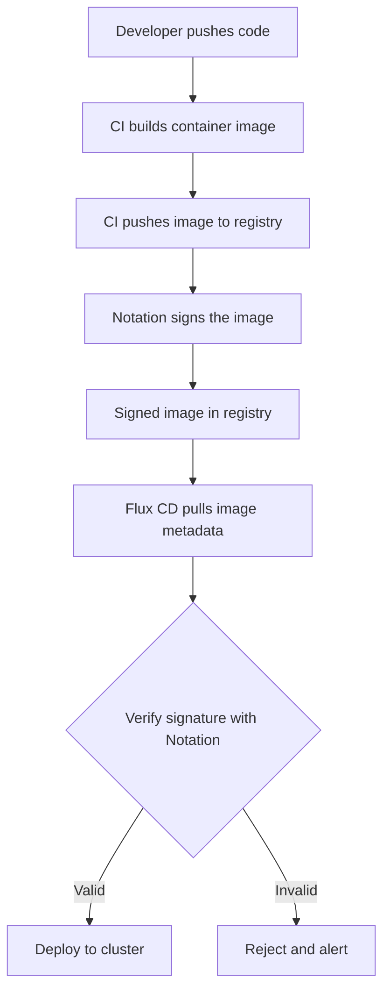

# How to Configure Flux CD with Notation for Image Signing

Author: [nawazdhandala](https://github.com/nawazdhandala)

Tags: Flux CD, Notation, Image Signing, Supply Chain Security, Kubernetes, GitOps, Container Security

Description: Learn how to configure Flux CD with Notation for container image signing and verification to secure your software supply chain in a GitOps workflow.

---

## Introduction

Container image signing is a critical component of software supply chain security. Notation is an open-source project from the CNCF that provides a standards-based solution for signing and verifying container images and other OCI artifacts. When combined with Flux CD, you can enforce that only signed and verified images are deployed to your Kubernetes clusters.

This guide walks through setting up Notation with Flux CD to create a secure, end-to-end GitOps pipeline with image verification.

## Prerequisites

- A Kubernetes cluster (v1.28 or later)
- Flux CD v2.4 or later installed
- notation CLI installed locally
- An OCI-compliant container registry (e.g., Azure Container Registry, AWS ECR, or Harbor)
- Access to a key management system or local keys for signing

## Understanding the Image Signing Workflow



## Setting Up Notation Locally

First, install the Notation CLI and generate signing keys:

```bash
# Install notation CLI (macOS)
brew install notation

# Verify installation
notation version

# Generate a test signing key pair
# This creates a self-signed certificate for development
notation cert generate-test --default "flux-signing-key"

# List available keys
notation key ls

# List available certificates
notation cert ls
```

## Configuring a Key Management Solution

For production environments, use a proper key management solution. Here is an example with Azure Key Vault:

```bash
# Install the Azure Key Vault plugin for Notation
notation plugin install azure-kv \
  --url https://github.com/Azure/notation-azure-kv/releases/download/v1.2.0/notation-azure-kv_1.2.0_linux_amd64.tar.gz

# Add the signing key from Azure Key Vault
notation key add "production-key" \
  --id "https://my-vault.vault.azure.net/keys/image-signing/abc123" \
  --plugin azure-kv
```

## Signing Container Images with Notation

Sign your container images as part of your CI pipeline:

```yaml
# .github/workflows/build-and-sign.yaml
# GitHub Actions workflow for building and signing images
name: Build and Sign
on:
  push:
    branches: [main]
jobs:
  build:
    runs-on: ubuntu-latest
    steps:
      - uses: actions/checkout@v4

      - name: Build and push image
        run: |
          # Build the container image
          docker build -t myregistry.azurecr.io/myapp:${{ github.sha }} .
          # Push to registry
          docker push myregistry.azurecr.io/myapp:${{ github.sha }}

      - name: Sign image with Notation
        run: |
          # Install notation
          curl -Lo notation.tar.gz \
            https://github.com/notaryproject/notation/releases/download/v1.2.0/notation_1.2.0_linux_amd64.tar.gz
          tar xzf notation.tar.gz -C /usr/local/bin notation

          # Sign the image using the configured key
          notation sign \
            --key "production-key" \
            myregistry.azurecr.io/myapp:${{ github.sha }}

      - name: Verify the signature
        run: |
          # Verify the signature was applied correctly
          notation verify \
            myregistry.azurecr.io/myapp:${{ github.sha }}
```

## Configuring Flux CD for Image Verification

### Step 1: Create a Verification Policy

Define a verification policy that tells Flux which images to verify and which keys to trust:

```yaml
# clusters/my-cluster/image-verification/notation-policy.yaml
apiVersion: image.toolkit.fluxcd.io/v1
kind: ImagePolicy
metadata:
  name: notation-verification
  namespace: flux-system
spec:
  imageRepositoryRef:
    name: myapp-repo
  # Verification configuration
  verification:
    provider: notation
    # Reference to the trust policy
    secretRef:
      name: notation-trust-policy
```

### Step 2: Create the Trust Policy Secret

The trust policy defines which certificates to trust for signature verification:

```yaml
# clusters/my-cluster/image-verification/trust-policy-secret.yaml
apiVersion: v1
kind: Secret
metadata:
  name: notation-trust-policy
  namespace: flux-system
type: Opaque
stringData:
  # Notation trust policy configuration
  trustpolicy.json: |
    {
      "version": "1.0",
      "trustPolicies": [
        {
          "name": "production-images",
          "registryScopes": [
            "myregistry.azurecr.io/myapp"
          ],
          "signatureVerification": {
            "level": "strict"
          },
          "trustStores": [
            "ca:production-certs"
          ],
          "trustedIdentities": [
            "x509.subject: C=US, ST=WA, O=MyOrg, CN=image-signing"
          ]
        }
      ]
    }
```

### Step 3: Store the Verification Certificate

Create a secret containing the public certificate used for verification:

```yaml
# clusters/my-cluster/image-verification/verification-cert.yaml
apiVersion: v1
kind: Secret
metadata:
  name: notation-verification-cert
  namespace: flux-system
type: Opaque
data:
  # Base64-encoded public certificate
  # Generate with: cat cert.pem | base64 -w0
  ca.crt: LS0tLS1CRUdJTi... # Your base64-encoded certificate
```

## Configuring the Image Repository

Set up the ImageRepository to scan for new tags and verify signatures:

```yaml
# clusters/my-cluster/image-verification/image-repo.yaml
apiVersion: image.toolkit.fluxcd.io/v1
kind: ImageRepository
metadata:
  name: myapp-repo
  namespace: flux-system
spec:
  # Container registry URL
  image: myregistry.azurecr.io/myapp
  # How often to scan for new images
  interval: 5m
  # Registry authentication
  secretRef:
    name: registry-credentials
  # Enable Notation verification
  verify:
    provider: notation
    # Reference to the trust policy secret
    secretRef:
      name: notation-trust-policy
    # Reference to the verification certificate
    certRef:
      name: notation-verification-cert
```

## Setting Up Image Update Automation

Configure Flux to automatically update image tags, but only for verified images:

```yaml
# clusters/my-cluster/image-verification/image-policy.yaml
apiVersion: image.toolkit.fluxcd.io/v1
kind: ImagePolicy
metadata:
  name: myapp-policy
  namespace: flux-system
spec:
  imageRepositoryRef:
    name: myapp-repo
  # Select the latest verified image
  policy:
    semver:
      range: ">=1.0.0"
  # Only allow verified images
  filterTags:
    pattern: '^(?P<version>[0-9]+\.[0-9]+\.[0-9]+)$'
    extract: '$version'
---
# clusters/my-cluster/image-verification/image-update.yaml
apiVersion: image.toolkit.fluxcd.io/v1
kind: ImageUpdateAutomation
metadata:
  name: myapp-update
  namespace: flux-system
spec:
  interval: 5m
  sourceRef:
    kind: GitRepository
    name: flux-system
  git:
    checkout:
      ref:
        branch: main
    commit:
      author:
        name: fluxcdbot
        email: fluxcdbot@users.noreply.github.com
      messageTemplate: |
        chore: update {{ .AutomatedResource.Kind }}/{{ .AutomatedResource.Name }}
        Image: {{ range .Updated.Images }}{{println .}}{{ end }}
        Signature: verified with Notation
    push:
      branch: main
  update:
    path: ./clusters/my-cluster
    strategy: Setters
```

## Configuring Multiple Registries

For organizations with multiple registries, configure verification per registry:

```yaml
# clusters/my-cluster/image-verification/multi-registry-policy.yaml
apiVersion: v1
kind: Secret
metadata:
  name: notation-multi-registry-policy
  namespace: flux-system
type: Opaque
stringData:
  trustpolicy.json: |
    {
      "version": "1.0",
      "trustPolicies": [
        {
          "name": "production-acr",
          "registryScopes": [
            "prodregistry.azurecr.io/*"
          ],
          "signatureVerification": {
            "level": "strict"
          },
          "trustStores": [
            "ca:azure-production"
          ],
          "trustedIdentities": [
            "x509.subject: C=US, ST=WA, O=MyOrg, OU=Production"
          ]
        },
        {
          "name": "staging-ecr",
          "registryScopes": [
            "123456789.dkr.ecr.us-east-1.amazonaws.com/*"
          ],
          "signatureVerification": {
            "level": "permissive"
          },
          "trustStores": [
            "ca:aws-staging"
          ],
          "trustedIdentities": [
            "x509.subject: C=US, ST=WA, O=MyOrg, OU=Staging"
          ]
        },
        {
          "name": "third-party",
          "registryScopes": [
            "ghcr.io/trusted-vendor/*"
          ],
          "signatureVerification": {
            "level": "strict"
          },
          "trustStores": [
            "ca:vendor-certs"
          ],
          "trustedIdentities": [
            "x509.subject: C=US, O=TrustedVendor"
          ]
        }
      ]
    }
```

## Setting Up Alerts for Verification Failures

Get notified when image verification fails:

```yaml
# clusters/my-cluster/notifications/verification-alerts.yaml
apiVersion: notification.toolkit.fluxcd.io/v1
kind: Alert
metadata:
  name: image-verification-alert
  namespace: flux-system
spec:
  # Alert on errors only
  eventSeverity: error
  eventSources:
    - kind: ImageRepository
      name: "*"
      namespace: flux-system
  # Include verification-related events
  eventMetadata:
    reason: "VerificationFailed"
  providerRef:
    name: slack-security
---
apiVersion: notification.toolkit.fluxcd.io/v1
kind: Provider
metadata:
  name: slack-security
  namespace: flux-system
spec:
  type: slack
  channel: security-alerts
  secretRef:
    name: slack-security-webhook
```

## Verifying the Setup

Test the complete signing and verification workflow:

```bash
# Build and push a test image
docker build -t myregistry.azurecr.io/myapp:v1.0.0-test .
docker push myregistry.azurecr.io/myapp:v1.0.0-test

# Sign the image
notation sign --key "production-key" \
  myregistry.azurecr.io/myapp:v1.0.0-test

# Verify locally
notation verify myregistry.azurecr.io/myapp:v1.0.0-test

# Check Flux verification status
kubectl get imagerepositories -n flux-system
kubectl describe imagerepository myapp-repo -n flux-system

# Check for verification events
kubectl events -n flux-system --for imagerepository/myapp-repo
```

## Troubleshooting

### Signature Verification Fails

```bash
# Check if the certificate is correctly configured
kubectl get secret notation-verification-cert -n flux-system -o jsonpath='{.data.ca\.crt}' | base64 -d

# Verify the trust policy is valid JSON
kubectl get secret notation-trust-policy -n flux-system -o jsonpath='{.data.trustpolicy\.json}' | jq .

# Check the image repository controller logs
kubectl logs -n flux-system deploy/image-reflector-controller | grep -i notation
```

### Registry Authentication Issues

```bash
# Verify registry credentials
kubectl get secret registry-credentials -n flux-system

# Test registry access
flux reconcile image repository myapp-repo
```

## Best Practices

1. **Use a key management service**: Never store private signing keys in Git or on local machines. Use Azure Key Vault, AWS KMS, or HashiCorp Vault.

2. **Rotate keys regularly**: Set up key rotation policies and update trust policies accordingly.

3. **Use strict verification in production**: Set `signatureVerification.level` to `strict` for production registries.

4. **Sign in CI only**: Ensure signing happens exclusively in your CI pipeline, never manually.

5. **Audit verification events**: Regularly review verification failures to detect potential supply chain attacks.

6. **Test with permissive mode first**: When setting up, use `permissive` mode to identify issues before switching to `strict`.

## Conclusion

Configuring Flux CD with Notation for image signing creates a robust software supply chain security posture. By verifying image signatures before deployment, you ensure that only trusted, tamper-free images reach your Kubernetes clusters. Combined with Flux CD's GitOps model, this provides a fully auditable and secure deployment pipeline from build to production.
