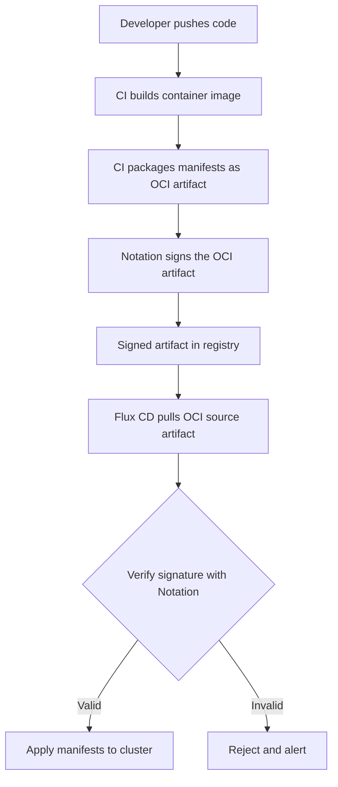

# How to Configure Flux CD with Notation for Image Signing

Author: [nawazdhandala](https://github.com/nawazdhandala)

Tags: Flux CD, Notation, Image Signing, Supply Chain Security, Kubernetes, GitOps, Container Security

Description: Learn how to configure Flux CD with Notation for container image signing and verification to secure your software supply chain in a GitOps workflow.

---

## Introduction

Container image signing is a critical component of software supply chain security. Notation is an open-source project from the CNCF that provides a standards-based solution for signing and verifying container images and other OCI artifacts. When combined with Flux CD's OCI source support, you can enforce that signed and verified OCI artifacts are used as GitOps sources before they are applied to your Kubernetes clusters.

This guide walks through setting up Notation with Flux CD to create a secure GitOps pipeline with OCI artifact verification. Flux verifies signed OCI sources such as manifest bundles and OCI Helm chart artifacts. If you need admission-time enforcement for application container images referenced inside Deployments, pair this with a Kubernetes admission policy engine that supports Notation.

## Prerequisites

- A Kubernetes cluster supported by your Flux version
- Flux CD installed with a `source.toolkit.fluxcd.io/v1` `OCIRepository` API
- notation CLI installed locally
- An OCI-compliant container registry (e.g., Azure Container Registry, AWS ECR, or Harbor)
- Access to a key management system or local keys for signing

## Understanding the OCI Signing Workflow


```mermaid
graph TD
    A[Developer pushes code] --> B[CI builds container image]
    B --> C[CI packages manifests as OCI artifact]
    C --> D[Notation signs the OCI artifact]
    D --> E[Signed artifact in registry]
    E --> F[Flux CD pulls OCI source artifact]
    F --> G{Verify signature with Notation}
    G -->|Valid| H[Apply manifests to cluster]
    G -->|Invalid| I[Reject and alert]
```

## Setting Up Notation Locally

First, install the Notation CLI and generate signing keys:

```bash
# Install notation CLI (macOS)

brew install notation

# Verify installation
notation version

# Generate a test signing key pair
# This creates a self-signed certificate for development
notation cert generate-test --default "flux-signing-key"

# List available keys
notation key ls

# List available certificates
notation cert ls
```

## Configuring a Key Management Solution

For production environments, use a proper key management solution. Here is an example with Azure Key Vault:

```bash
# Install the Azure Key Vault plugin for Notation
notation plugin install \
  --url https://github.com/Azure/notation-azure-kv/releases/download/v1.2.1/notation-azure-kv_1.2.1_linux_amd64.tar.gz \
  --sha256sum 67c5ccaaf28dd44d2b6572684d84e344a02c2258af1d65ead3910b3156d3eaf5

# Add the signing key from Azure Key Vault
notation key add "production-key" \
  --id "https://my-vault.vault.azure.net/keys/image-signing/abc123" \
  --plugin azure-kv
```

## Signing OCI Artifacts with Notation

Sign your OCI artifacts as part of your CI pipeline. The same `notation sign` command can sign container images, but the Flux verification examples below use a signed OCI artifact containing Kubernetes manifests:

```yaml
# .github/workflows/build-and-sign.yaml
# GitHub Actions workflow for building and signing images
name: Build and Sign
on:
  push:
    branches: [main]
jobs:
  build:
    runs-on: ubuntu-latest
    steps:
      - uses: actions/checkout@v4

      - name: Install Flux CLI
        run: curl -s https://fluxcd.io/install.sh | sudo bash

      - name: Build and push image
        run: |
          # Build the application container image
          docker build -t myregistry.azurecr.io/myapp:${{ github.sha }} .
          docker push myregistry.azurecr.io/myapp:${{ github.sha }}

          # Package the Kubernetes manifests as a Flux OCI artifact
          flux push artifact \
            oci://myregistry.azurecr.io/myapp-manifests:${{ github.sha }} \
            --path="./clusters/my-cluster" \
            --source="${{ github.server_url }}/${{ github.repository }}" \
            --revision="${{ github.ref_name }}@sha1:${{ github.sha }}"

      - name: Install and configure Notation
        run: |
          # Install notation
          curl -Lo notation.tar.gz \
            https://github.com/notaryproject/notation/releases/download/v1.3.2/notation_1.3.2_linux_amd64.tar.gz
          sudo tar xzf notation.tar.gz -C /usr/local/bin notation

          # Install the Azure Key Vault plugin
          notation plugin install \
            --url https://github.com/Azure/notation-azure-kv/releases/download/v1.2.1/notation-azure-kv_1.2.1_linux_amd64.tar.gz \
            --sha256sum 67c5ccaaf28dd44d2b6572684d84e344a02c2258af1d65ead3910b3156d3eaf5

          # Register the signing key used by this workflow
          notation key add "production-key" \
            --id "${{ secrets.AZURE_KEY_VAULT_KEY_ID }}" \
            --plugin azure-kv

      - name: Sign artifact with Notation
        run: |
          # Sign the Flux OCI artifact using the configured key
          notation sign \
            --key "production-key" \
            myregistry.azurecr.io/myapp-manifests:${{ github.sha }}

      - name: Verify the signature
        run: |
          # Verify the signature using the trust policy and trust store checked into CI
          notation cert add \
            --type ca \
            --store production-certs \
            .github/notation/truststore/x509/ca/production-certs/ca.crt
          notation policy import .github/notation/trustpolicy.json
          notation verify myregistry.azurecr.io/myapp-manifests:${{ github.sha }}
```

## Configuring Flux CD for OCI Artifact Verification

### Step 1: Create a Verified OCI Repository

Define an `OCIRepository` that tells Flux which OCI artifact to pull and which Notation trust configuration to use:

```yaml
# clusters/my-cluster/image-verification/oci-repository.yaml
apiVersion: source.toolkit.fluxcd.io/v1
kind: OCIRepository
metadata:
  name: myapp-manifests
  namespace: flux-system
spec:
  interval: 5m
  url: oci://myregistry.azurecr.io/myapp-manifests
  ref:
    tag: v1.0.0
  secretRef:
    name: registry-credentials
  verify:
    provider: notation
    secretRef:
      name: notation-config
```

### Step 2: Create the Trust Policy Secret

The trust policy defines which certificates to trust for signature verification. For Flux, the same Secret must contain the `trustpolicy.json` file and one or more CA certificates with a `.pem` or `.crt` key name:

```yaml
# clusters/my-cluster/image-verification/trust-policy-secret.yaml
apiVersion: v1
kind: Secret
metadata:
  name: notation-config
  namespace: flux-system
type: Opaque
stringData:
  production-certs.crt: |
    -----BEGIN CERTIFICATE-----
    # Your PEM-encoded CA certificate
    -----END CERTIFICATE-----
  # Notation trust policy configuration
  trustpolicy.json: |
    {
      "version": "1.0",
      "trustPolicies": [
        {
          "name": "production-images",
          "registryScopes": [
            "myregistry.azurecr.io/myapp-manifests"
          ],
          "signatureVerification": {
            "level": "strict"
          },
          "trustStores": [
            "ca:production-certs"
          ],
          "trustedIdentities": [
            "x509.subject: C=US, ST=WA, O=MyOrg, CN=image-signing"
          ]
        }
      ]
    }
```

### Step 3: Reference the Verified Source

Use the verified OCI source from a Flux `Kustomization`. The kustomize-controller will consume the artifact only after source-controller has fetched and verified it:

```yaml
# clusters/my-cluster/image-verification/kustomization.yaml
apiVersion: kustomize.toolkit.fluxcd.io/v1
kind: Kustomization
metadata:
  name: myapp
  namespace: flux-system
spec:
  interval: 5m
  path: ./
  prune: true
  sourceRef:
    kind: OCIRepository
    name: myapp-manifests
```

## Configuring the OCI Source

Set up the `OCIRepository` to fetch signed GitOps manifests from your registry:

```yaml
# clusters/my-cluster/image-verification/oci-source.yaml
apiVersion: source.toolkit.fluxcd.io/v1
kind: OCIRepository
metadata:
  name: myapp-manifests
  namespace: flux-system
spec:
  # OCI artifact URL
  url: oci://myregistry.azurecr.io/myapp-manifests
  ref:
    semver: ">=1.0.0"
  # How often to check for new artifacts
  interval: 5m
  # Registry authentication
  secretRef:
    name: registry-credentials
  # Enable Notation verification
  verify:
    provider: notation
    secretRef:
      name: notation-config
```

## Setting Up Image Update Automation

Flux image automation can update image tags in manifests, but it does not verify Notation signatures on the workload images it scans. Keep using `ImageRepository`, `ImagePolicy`, and `ImageUpdateAutomation` for tag updates, and use `OCIRepository.spec.verify` for signed OCI GitOps sources:

```yaml
# clusters/my-cluster/image-verification/image-repository.yaml
apiVersion: image.toolkit.fluxcd.io/v1
kind: ImageRepository
metadata:
  name: myapp-repo
  namespace: flux-system
spec:
  image: myregistry.azurecr.io/myapp
  interval: 5m
  secretRef:
    name: registry-credentials
---
# clusters/my-cluster/image-verification/image-policy.yaml
apiVersion: image.toolkit.fluxcd.io/v1
kind: ImagePolicy
metadata:
  name: myapp-policy
  namespace: flux-system
spec:
  imageRepositoryRef:
    name: myapp-repo
  # Select the latest matching image tag
  policy:
    semver:
      range: ">=1.0.0"
  # Restrict the tag format selected by the policy
  filterTags:
    pattern: '^(?P<version>[0-9]+\.[0-9]+\.[0-9]+)$'
    extract: '$version'
---
# clusters/my-cluster/image-verification/image-update.yaml
apiVersion: image.toolkit.fluxcd.io/v1
kind: ImageUpdateAutomation
metadata:
  name: myapp-update
  namespace: flux-system
spec:
  interval: 5m
  sourceRef:
    kind: GitRepository
    name: flux-system
  git:
    checkout:
      ref:
        branch: main
    commit:
      author:
        name: fluxcdbot
        email: fluxcdbot@users.noreply.github.com
      messageTemplate: |
        chore: update {{ .AutomationObject.Namespace }}/{{ .AutomationObject.Name }}
        Changes:
        {{- range $filename, $_ := .Changed.FileChanges }}
        - {{ $filename }}
        {{- end }}
    push:
      branch: main
  update:
    path: ./clusters/my-cluster
    strategy: Setters
```

## Configuring Multiple Registries

For organizations with multiple registries, configure verification per registry:

```yaml
# clusters/my-cluster/image-verification/multi-registry-policy.yaml
apiVersion: v1
kind: Secret
metadata:
  name: notation-multi-registry-policy
  namespace: flux-system
type: Opaque
stringData:
  azure-production.crt: |
    -----BEGIN CERTIFICATE-----
    # Azure production CA certificate
    -----END CERTIFICATE-----
  aws-staging.crt: |
    -----BEGIN CERTIFICATE-----
    # AWS staging CA certificate
    -----END CERTIFICATE-----
  vendor-certs.crt: |
    -----BEGIN CERTIFICATE-----
    # Vendor CA certificate
    -----END CERTIFICATE-----
  trustpolicy.json: |
    {
      "version": "1.0",
      "trustPolicies": [
        {
          "name": "production-acr",
          "registryScopes": [
            "prodregistry.azurecr.io/team-a/myapp"
          ],
          "signatureVerification": {
            "level": "strict"
          },
          "trustStores": [
            "ca:azure-production"
          ],
          "trustedIdentities": [
            "x509.subject: C=US, ST=WA, O=MyOrg, OU=Production"
          ]
        },
        {
          "name": "staging-ecr",
          "registryScopes": [
            "123456789.dkr.ecr.us-east-1.amazonaws.com/myapp"
          ],
          "signatureVerification": {
            "level": "permissive"
          },
          "trustStores": [
            "ca:aws-staging"
          ],
          "trustedIdentities": [
            "x509.subject: C=US, ST=WA, O=MyOrg, OU=Staging"
          ]
        },
        {
          "name": "third-party",
          "registryScopes": [
            "ghcr.io/trusted-vendor/agent"
          ],
          "signatureVerification": {
            "level": "strict"
          },
          "trustStores": [
            "ca:vendor-certs"
          ],
          "trustedIdentities": [
            "x509.subject: C=US, ST=CA, O=TrustedVendor"
          ]
        }
      ]
    }
```

## Setting Up Alerts for Verification Failures

Get notified when OCI artifact verification fails:

```yaml
# clusters/my-cluster/notifications/verification-alerts.yaml
apiVersion: notification.toolkit.fluxcd.io/v1beta3
kind: Alert
metadata:
  name: image-verification-alert
  namespace: flux-system
spec:
  # Alert on errors only
  eventSeverity: error
  eventSources:
    - kind: OCIRepository
      name: "*"
      namespace: flux-system
  # Include verification-related event messages
  inclusionList:
    - ".*failed to verify.*"
  providerRef:
    name: slack-security
---
apiVersion: notification.toolkit.fluxcd.io/v1beta3
kind: Provider
metadata:
  name: slack-security
  namespace: flux-system
spec:
  type: slack
  channel: security-alerts
  secretRef:
    name: slack-security-webhook
```

## Verifying the Setup

Test the complete signing and verification workflow:

```bash
# Package and push a test GitOps artifact
DIGEST_URL=$(flux push artifact \
  oci://myregistry.azurecr.io/myapp-manifests:v1.0.0-test \
  --path="./clusters/my-cluster" \
  --source="$(git config --get remote.origin.url)" \
  --revision="$(git branch --show-current)@sha1:$(git rev-parse HEAD)" \
  --output json | jq -r '.repository + "@" + .digest')

# Sign the artifact by digest
notation sign --key "production-key" "$DIGEST_URL"

# Verify locally
notation verify "$DIGEST_URL"

# Check Flux verification status
kubectl get ocirepositories -n flux-system
kubectl describe ocirepository myapp-manifests -n flux-system

# Check for verification events
kubectl events -n flux-system --for ocirepository/myapp-manifests
```

## Troubleshooting

### Signature Verification Fails

```bash
# Check if the certificate is correctly configured
kubectl get secret notation-config -n flux-system -o jsonpath='{.data.production-certs\.crt}' | base64 -d

# Verify the trust policy is valid JSON
kubectl get secret notation-config -n flux-system -o jsonpath='{.data.trustpolicy\.json}' | base64 -d | jq .

# Check the source controller logs
kubectl logs -n flux-system deploy/source-controller | grep -i notation
```

### Registry Authentication Issues

```bash
# Verify registry credentials
kubectl get secret registry-credentials -n flux-system

# Test registry access
flux reconcile source oci myapp-manifests
```

## Best Practices

1. **Use a key management service**: Never store private signing keys in Git or on local machines. Use Azure Key Vault, AWS KMS, or HashiCorp Vault.

2. **Rotate keys regularly**: Set up key rotation policies and update trust policies accordingly.

3. **Use strict verification in production**: Set `signatureVerification.level` to `strict` for production registries.

4. **Sign in CI only**: Ensure signing happens exclusively in your CI pipeline, never manually.

5. **Audit verification events**: Regularly review verification failures to detect potential supply chain attacks.

6. **Test with permissive mode first**: When setting up, use `permissive` mode to identify issues before switching to `strict`.

## Conclusion

Configuring Flux CD with Notation creates a stronger software supply chain security posture for OCI-based GitOps sources. By verifying signatures before Flux makes an OCI artifact available to the rest of the reconciliation pipeline, you ensure that only trusted, tamper-free manifest bundles or OCI chart artifacts are applied to your Kubernetes clusters. Combined with admission-time controls for workload container images, this provides a more auditable and secure deployment pipeline from build to production.
