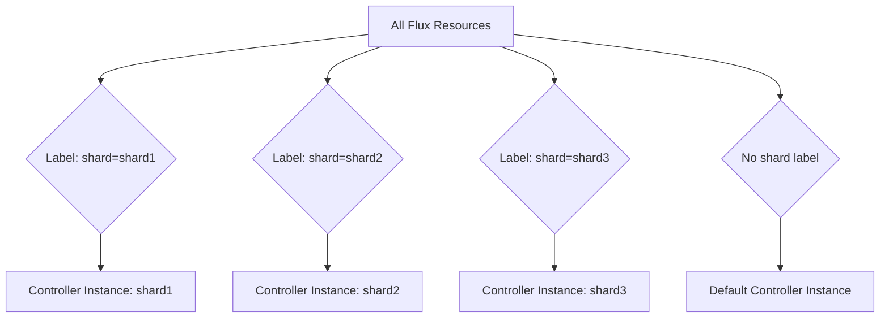

# How to Configure Flux CD Sharding for Multiple Controller Instances

Author: [nawazdhandala](https://github.com/nawazdhandala)

Tags: Flux CD, Kubernetes, GitOps, Sharding, Horizontal Scaling, Controller instances, Multi-Tenant

Description: A practical guide to configuring Flux CD controller sharding to distribute reconciliation workload across multiple instances using label selectors and dedicated deployments.

---

When a single Flux CD controller instance cannot handle the reconciliation load, sharding allows you to run multiple instances of the same controller, each handling a designated subset of resources. This guide explains how to set up, configure, and manage sharded Flux CD controllers.

## When to Use Sharding

Sharding is appropriate when:

- A single controller instance is CPU or memory constrained even with maximum resource limits
- Increasing `--concurrent` no longer improves throughput due to single-process bottlenecks
- You manage hundreds of Kustomizations, HelmReleases, or GitRepositories
- You want workload isolation between tenants or teams

## How Flux CD Sharding Works

Flux CD controllers support the `--watch-label-selector` flag, which limits a controller instance to only reconcile resources matching a specific label. By deploying multiple instances with different label selectors, you distribute the workload.



## Setting Up the Default Controller

First, configure the default controller to only handle resources without a shard label, or resources labeled for the default shard.

```yaml
# default-controller-patch.yaml
# Configure the default kustomize-controller to handle unsharded resources
apiVersion: apps/v1
kind: Deployment
metadata:
  name: kustomize-controller
  namespace: flux-system
spec:
  template:
    spec:
      containers:
        - name: manager
          args:
            # Only reconcile resources labeled for the default shard
            - --watch-label-selector=sharding.fluxcd.io/key=default
            - --concurrent=4
            - --kube-api-qps=50
            - --kube-api-burst=100
          resources:
            requests:
              cpu: "250m"
              memory: "512Mi"
            limits:
              cpu: "1000m"
              memory: "1Gi"
```

## Creating Shard Controller Deployments

Deploy additional controller instances, each with a unique label selector.

```yaml
# shard1-kustomize-controller.yaml
# Dedicated kustomize-controller for shard1
apiVersion: apps/v1
kind: Deployment
metadata:
  name: kustomize-controller-shard1
  namespace: flux-system
  labels:
    app.kubernetes.io/name: kustomize-controller
    app.kubernetes.io/instance: shard1
spec:
  replicas: 1
  selector:
    matchLabels:
      app: kustomize-controller-shard1
  template:
    metadata:
      labels:
        app: kustomize-controller-shard1
    spec:
      serviceAccountName: kustomize-controller
      containers:
        - name: manager
          image: ghcr.io/fluxcd/kustomize-controller:v1.4.0
          args:
            # This instance only watches resources labeled shard1
            - --watch-label-selector=sharding.fluxcd.io/key=shard1
            - --concurrent=8
            - --kube-api-qps=100
            - --kube-api-burst=200
            - --requeue-dependency=5s
            # Each shard needs its own leader election ID
            - --enable-leader-election=true
            - --leader-election-id=kustomize-controller-shard1
          resources:
            requests:
              cpu: "500m"
              memory: "1Gi"
            limits:
              cpu: "2000m"
              memory: "2Gi"
          ports:
            - containerPort: 8080
              name: http-prom
            - containerPort: 9440
              name: healthz
          livenessProbe:
            httpGet:
              path: /healthz
              port: healthz
          readinessProbe:
            httpGet:
              path: /readyz
              port: healthz
          securityContext:
            allowPrivilegeEscalation: false
            readOnlyRootFilesystem: true
            runAsNonRoot: true
            capabilities:
              drop:
                - ALL
            seccompProfile:
              type: RuntimeDefault
```

```yaml
# shard2-kustomize-controller.yaml
# Dedicated kustomize-controller for shard2
apiVersion: apps/v1
kind: Deployment
metadata:
  name: kustomize-controller-shard2
  namespace: flux-system
  labels:
    app.kubernetes.io/name: kustomize-controller
    app.kubernetes.io/instance: shard2
spec:
  replicas: 1
  selector:
    matchLabels:
      app: kustomize-controller-shard2
  template:
    metadata:
      labels:
        app: kustomize-controller-shard2
    spec:
      serviceAccountName: kustomize-controller
      containers:
        - name: manager
          image: ghcr.io/fluxcd/kustomize-controller:v1.4.0
          args:
            - --watch-label-selector=sharding.fluxcd.io/key=shard2
            - --concurrent=8
            - --kube-api-qps=100
            - --kube-api-burst=200
            - --requeue-dependency=5s
            - --enable-leader-election=true
            # Unique leader election ID per shard
            - --leader-election-id=kustomize-controller-shard2
          resources:
            requests:
              cpu: "500m"
              memory: "1Gi"
            limits:
              cpu: "2000m"
              memory: "2Gi"
          ports:
            - containerPort: 8080
              name: http-prom
            - containerPort: 9440
              name: healthz
          livenessProbe:
            httpGet:
              path: /healthz
              port: healthz
          readinessProbe:
            httpGet:
              path: /readyz
              port: healthz
          securityContext:
            allowPrivilegeEscalation: false
            readOnlyRootFilesystem: true
            runAsNonRoot: true
            capabilities:
              drop:
                - ALL
            seccompProfile:
              type: RuntimeDefault
```

## Sharding the Source Controller

The source-controller can also be sharded to distribute Git and Helm fetch operations.

```yaml
# shard1-source-controller.yaml
# Dedicated source-controller for shard1
apiVersion: apps/v1
kind: Deployment
metadata:
  name: source-controller-shard1
  namespace: flux-system
spec:
  replicas: 1
  selector:
    matchLabels:
      app: source-controller-shard1
  template:
    metadata:
      labels:
        app: source-controller-shard1
    spec:
      serviceAccountName: source-controller
      containers:
        - name: manager
          image: ghcr.io/fluxcd/source-controller:v1.4.1
          args:
            - --storage-path=/data
            # Use a unique service address for this shard
            - --storage-adv-addr=source-controller-shard1.flux-system.svc.cluster.local.
            - --watch-label-selector=sharding.fluxcd.io/key=shard1
            - --concurrent=6
            - --kube-api-qps=50
            - --kube-api-burst=100
            - --enable-leader-election=true
            - --leader-election-id=source-controller-shard1
          volumeMounts:
            - name: data
              mountPath: /data
          resources:
            requests:
              cpu: "250m"
              memory: "512Mi"
            limits:
              cpu: "1000m"
              memory: "1Gi"
      volumes:
        - name: data
          emptyDir: {}
---
# Service for the shard1 source-controller
# Required for serving artifacts to kustomize/helm controllers
apiVersion: v1
kind: Service
metadata:
  name: source-controller-shard1
  namespace: flux-system
spec:
  selector:
    app: source-controller-shard1
  ports:
    - port: 80
      targetPort: 9090
      protocol: TCP
```

## Labeling Resources for Shards

Assign resources to shards using labels. Be consistent with your labeling strategy.

```yaml
# Team A resources - assigned to shard1
apiVersion: source.toolkit.fluxcd.io/v1
kind: GitRepository
metadata:
  name: team-a-apps
  namespace: flux-system
  labels:
    # This label determines which controller shard processes this resource
    sharding.fluxcd.io/key: shard1
spec:
  interval: 10m
  url: https://github.com/org/team-a-apps
  ref:
    branch: main
---
apiVersion: kustomize.toolkit.fluxcd.io/v1
kind: Kustomization
metadata:
  name: team-a-apps
  namespace: flux-system
  labels:
    # Must match the shard label used on the source
    sharding.fluxcd.io/key: shard1
spec:
  interval: 10m
  path: ./deploy
  prune: true
  sourceRef:
    kind: GitRepository
    name: team-a-apps
---
# Team B resources - assigned to shard2
apiVersion: source.toolkit.fluxcd.io/v1
kind: GitRepository
metadata:
  name: team-b-apps
  namespace: flux-system
  labels:
    sharding.fluxcd.io/key: shard2
spec:
  interval: 10m
  url: https://github.com/org/team-b-apps
  ref:
    branch: main
---
apiVersion: kustomize.toolkit.fluxcd.io/v1
kind: Kustomization
metadata:
  name: team-b-apps
  namespace: flux-system
  labels:
    sharding.fluxcd.io/key: shard2
spec:
  interval: 10m
  path: ./deploy
  prune: true
  sourceRef:
    kind: GitRepository
    name: team-b-apps
```

## Monitoring Sharded Controllers

Create per-shard monitoring to track workload distribution and identify imbalances.

```yaml
# ServiceMonitor for sharded controllers
apiVersion: monitoring.coreos.com/v1
kind: ServiceMonitor
metadata:
  name: flux-sharded-controllers
  namespace: flux-system
spec:
  selector:
    matchExpressions:
      - key: app.kubernetes.io/name
        operator: In
        values:
          - kustomize-controller
          - source-controller
          - helm-controller
  endpoints:
    - port: http-prom
      interval: 15s
```

Key metrics to monitor per shard:

```promql
# Queue depth per shard - detect imbalanced shards
workqueue_depth{namespace="flux-system"} by (pod)

# Reconciliation rate per shard
rate(gotk_reconcile_duration_seconds_count{namespace="flux-system"}[5m]) by (pod)

# Resource count per shard
count(gotk_reconcile_condition{namespace="flux-system"}) by (pod)
```

## Rebalancing Shards

When one shard becomes overloaded, redistribute resources by changing labels.

```yaml
# Move team-c from shard1 to shard2 by updating the label
apiVersion: kustomize.toolkit.fluxcd.io/v1
kind: Kustomization
metadata:
  name: team-c-apps
  namespace: flux-system
  labels:
    # Changed from shard1 to shard2 to rebalance load
    sharding.fluxcd.io/key: shard2
spec:
  interval: 10m
  path: ./deploy
  prune: true
  sourceRef:
    kind: GitRepository
    name: team-c-apps
```

## Summary

Key steps for configuring Flux CD sharding:

1. Decide on a sharding strategy (by team, by namespace, by resource type)
2. Configure the default controller with a label selector to prevent double processing
3. Deploy additional controller instances with unique label selectors and leader election IDs
4. If sharding source-controller, create dedicated services for each shard
5. Label all Flux resources (GitRepository, Kustomization, HelmRelease) consistently
6. Monitor each shard independently for queue depth and resource usage
7. Rebalance shards by updating labels when workload distribution becomes uneven

Sharding adds operational complexity. Start with increasing concurrency and resources on a single controller instance before moving to sharded deployments.
