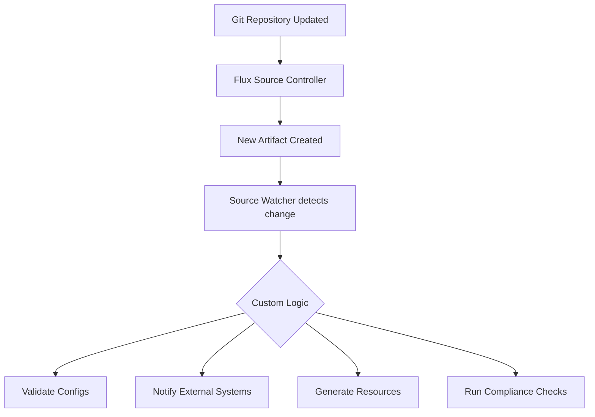

# How to Configure Flux CD Source Watcher for Custom Controllers

Author: [nawazdhandala](https://github.com/nawazdhandala)

Tags: flux cd, source watcher, custom controllers, kubernetes, gitops, controller development, operator

Description: Learn how to build custom Kubernetes controllers that watch Flux CD source artifacts and react to changes, extending your GitOps pipeline with custom automation.

---

## Introduction

Flux CD's source controller manages the lifecycle of source artifacts such as Git repositories, Helm charts, and OCI artifacts. By building custom controllers that watch these source artifacts, you can extend your GitOps pipeline with custom automation that triggers whenever a source changes. This is useful for tasks like configuration validation, secret injection, custom deployment strategies, or integration with external systems.

This guide walks through building a custom controller that watches Flux CD source artifacts and performs custom actions when changes are detected.

## Prerequisites

- A Kubernetes cluster (v1.28 or later)
- Flux CD v2.4 or later installed
- Go 1.22 or later for controller development
- kubebuilder or controller-runtime knowledge
- Familiarity with the Kubernetes controller pattern

## Understanding the Source Watcher Pattern



The Source Watcher pattern involves:

1. Subscribing to Flux source artifact changes via the Kubernetes API
2. Downloading and processing the artifact contents
3. Executing custom business logic
4. Optionally updating status or creating new resources

## Setting Up the Controller Project

Initialize a new controller project using kubebuilder:

```bash
# Create the project directory
mkdir flux-source-watcher && cd flux-source-watcher

# Initialize the Go module
go mod init github.com/your-org/flux-source-watcher

# Initialize kubebuilder project
kubebuilder init --domain your-org.com --repo github.com/your-org/flux-source-watcher

# Add Flux CD dependencies
go get github.com/fluxcd/pkg/runtime@latest
go get github.com/fluxcd/source-controller/api@latest
```

## Building the Source Watcher Controller

Here is the core controller implementation:

```go
// internal/controller/source_watcher.go
package controller

import (
	"context"
	"fmt"
	"io"
	"net/http"
	"os"
	"path/filepath"

	sourcev1 "github.com/fluxcd/source-controller/api/v1"
	"k8s.io/apimachinery/pkg/runtime"
	ctrl "sigs.k8s.io/controller-runtime"
	"sigs.k8s.io/controller-runtime/pkg/client"
	"sigs.k8s.io/controller-runtime/pkg/log"
	"sigs.k8s.io/controller-runtime/pkg/predicate"
)

// SourceWatcherReconciler watches Flux GitRepository sources
type SourceWatcherReconciler struct {
	client.Client
	Scheme     *runtime.Scheme
	HttpClient *http.Client
}

// Reconcile is called whenever a GitRepository source changes
func (r *SourceWatcherReconciler) Reconcile(
	ctx context.Context,
	req ctrl.Request,
) (ctrl.Result, error) {
	logger := log.FromContext(ctx)

	// Fetch the GitRepository resource
	var repository sourcev1.GitRepository
	if err := r.Get(ctx, req.NamespacedName, &repository); err != nil {
		// Resource was deleted, nothing to do
		return ctrl.Result{}, client.IgnoreNotFound(err)
	}

	// Check if the artifact is ready
	artifact := repository.GetArtifact()
	if artifact == nil {
		logger.Info("Artifact not ready, skipping")
		return ctrl.Result{}, nil
	}

	logger.Info("Processing artifact",
		"revision", artifact.Revision,
		"url", artifact.URL,
	)

	// Download the artifact
	tmpDir, err := r.downloadArtifact(artifact)
	if err != nil {
		logger.Error(err, "Failed to download artifact")
		return ctrl.Result{}, err
	}
	defer os.RemoveAll(tmpDir)

	// Execute custom logic on the artifact contents
	if err := r.processArtifact(ctx, tmpDir, &repository); err != nil {
		logger.Error(err, "Failed to process artifact")
		return ctrl.Result{}, err
	}

	logger.Info("Successfully processed artifact",
		"revision", artifact.Revision,
	)

	return ctrl.Result{}, nil
}

// downloadArtifact fetches the artifact tarball and extracts it
func (r *SourceWatcherReconciler) downloadArtifact(
	artifact *sourcev1.Artifact,
) (string, error) {
	// Create a temporary directory for extraction
	tmpDir, err := os.MkdirTemp("", "source-watcher-*")
	if err != nil {
		return "", fmt.Errorf("failed to create temp dir: %w", err)
	}

	// Download the artifact from the source controller
	resp, err := r.HttpClient.Get(artifact.URL)
	if err != nil {
		return "", fmt.Errorf("failed to download artifact: %w", err)
	}
	defer resp.Body.Close()

	if resp.StatusCode != http.StatusOK {
		return "", fmt.Errorf("unexpected status code: %d", resp.StatusCode)
	}

	// Save the tarball
	tarPath := filepath.Join(tmpDir, "artifact.tar.gz")
	f, err := os.Create(tarPath)
	if err != nil {
		return "", fmt.Errorf("failed to create file: %w", err)
	}
	defer f.Close()

	if _, err := io.Copy(f, resp.Body); err != nil {
		return "", fmt.Errorf("failed to write artifact: %w", err)
	}

	return tmpDir, nil
}

// processArtifact contains your custom business logic
func (r *SourceWatcherReconciler) processArtifact(
	ctx context.Context,
	dir string,
	repo *sourcev1.GitRepository,
) error {
	// Walk the extracted artifact and process files
	return filepath.Walk(dir, func(
		path string, info os.FileInfo, err error,
	) error {
		if err != nil {
			return err
		}
		if info.IsDir() {
			return nil
		}
		// Add your custom processing logic here
		// Examples: validate YAML, check policies, notify systems
		return nil
	})
}

// SetupWithManager configures the controller
func (r *SourceWatcherReconciler) SetupWithManager(
	mgr ctrl.Manager,
) error {
	return ctrl.NewControllerManagedBy(mgr).
		// Watch GitRepository resources
		For(&sourcev1.GitRepository{}).
		// Only reconcile when the artifact revision changes
		WithEventFilter(predicate.Or(
			predicate.GenerationChangedPredicate{},
			predicate.AnnotationChangedPredicate{},
		)).
		Complete(r)
}
```

## Configuring RBAC for the Controller

The controller needs permissions to read Flux source resources:

```yaml
# config/rbac/role.yaml
apiVersion: rbac.authorization.k8s.io/v1
kind: ClusterRole
metadata:
  name: source-watcher-role
rules:
  # Read Flux GitRepository resources
  - apiGroups:
      - source.toolkit.fluxcd.io
    resources:
      - gitrepositories
    verbs:
      - get
      - list
      - watch
  # Read GitRepository status (for artifact URL)
  - apiGroups:
      - source.toolkit.fluxcd.io
    resources:
      - gitrepositories/status
    verbs:
      - get
  # Access to create events
  - apiGroups:
      - ""
    resources:
      - events
    verbs:
      - create
      - patch
  # Read ConfigMaps and Secrets if needed by your logic
  - apiGroups:
      - ""
    resources:
      - configmaps
      - secrets
    verbs:
      - get
      - list
      - watch
---
# config/rbac/rolebinding.yaml
apiVersion: rbac.authorization.k8s.io/v1
kind: ClusterRoleBinding
metadata:
  name: source-watcher-rolebinding
roleRef:
  apiGroup: rbac.authorization.k8s.io
  kind: ClusterRole
  name: source-watcher-role
subjects:
  - kind: ServiceAccount
    name: source-watcher-sa
    namespace: flux-system
```

## Deploying the Custom Controller

Deploy the controller as a Kubernetes Deployment:

```yaml
# config/manager/deployment.yaml
apiVersion: apps/v1
kind: Deployment
metadata:
  name: source-watcher-controller
  namespace: flux-system
  labels:
    app: source-watcher
spec:
  replicas: 1
  selector:
    matchLabels:
      app: source-watcher
  template:
    metadata:
      labels:
        app: source-watcher
    spec:
      serviceAccountName: source-watcher-sa
      containers:
        - name: controller
          image: your-registry/source-watcher:v1.0.0
          args:
            # Leader election for HA deployments
            - --leader-elect=true
            # Metrics bind address
            - --metrics-bind-address=:8080
            # Health probe bind address
            - --health-probe-bind-address=:8081
          ports:
            - containerPort: 8080
              name: metrics
            - containerPort: 8081
              name: health
          livenessProbe:
            httpGet:
              path: /healthz
              port: health
            initialDelaySeconds: 15
            periodSeconds: 20
          readinessProbe:
            httpGet:
              path: /readyz
              port: health
            initialDelaySeconds: 5
            periodSeconds: 10
          resources:
            limits:
              cpu: 500m
              memory: 256Mi
            requests:
              cpu: 100m
              memory: 128Mi
---
apiVersion: v1
kind: ServiceAccount
metadata:
  name: source-watcher-sa
  namespace: flux-system
```

## Watching Specific Sources with Label Selectors

Filter which sources the controller watches using label selectors:

```go
// internal/controller/source_watcher.go
// Add label selector to only watch specific repositories

func (r *SourceWatcherReconciler) SetupWithManager(
	mgr ctrl.Manager,
) error {
	return ctrl.NewControllerManagedBy(mgr).
		For(&sourcev1.GitRepository{}).
		// Only watch sources with a specific label
		WithEventFilter(predicate.NewPredicateFuncs(
			func(object client.Object) bool {
				labels := object.GetLabels()
				// Only process repositories labeled for watching
				val, ok := labels["source-watcher/enabled"]
				return ok && val == "true"
			},
		)).
		Complete(r)
}
```

Then label the sources you want to watch:

```yaml
# sources/watched-repo.yaml
apiVersion: source.toolkit.fluxcd.io/v1
kind: GitRepository
metadata:
  name: app-config
  namespace: flux-system
  labels:
    # Enable this source for custom watching
    source-watcher/enabled: "true"
spec:
  interval: 5m
  url: https://github.com/your-org/app-config
  ref:
    branch: main
```

## Example: Configuration Validator Controller

Here is a practical example that validates Kubernetes manifests in source artifacts:

```go
// internal/controller/validator.go
package controller

import (
	"context"
	"fmt"
	"os"
	"path/filepath"
	"strings"

	"k8s.io/apimachinery/pkg/apis/meta/v1/unstructured"
	"k8s.io/apimachinery/pkg/util/yaml"
)

// validateManifests checks all YAML files in the artifact
func (r *SourceWatcherReconciler) validateManifests(
	ctx context.Context,
	dir string,
) ([]string, error) {
	var violations []string

	err := filepath.Walk(dir, func(
		path string, info os.FileInfo, err error,
	) error {
		if err != nil {
			return err
		}
		// Skip non-YAML files
		if info.IsDir() ||
			(!strings.HasSuffix(path, ".yaml") &&
				!strings.HasSuffix(path, ".yml")) {
			return nil
		}

		// Read and parse the YAML file
		data, err := os.ReadFile(path)
		if err != nil {
			return fmt.Errorf("failed to read %s: %w", path, err)
		}

		// Parse as unstructured Kubernetes resource
		var obj unstructured.Unstructured
		decoder := yaml.NewYAMLOrJSONDecoder(
			strings.NewReader(string(data)), 4096,
		)
		if err := decoder.Decode(&obj.Object); err != nil {
			violations = append(violations,
				fmt.Sprintf("invalid YAML in %s: %v", path, err),
			)
			return nil
		}

		// Check for required labels
		labels := obj.GetLabels()
		if _, ok := labels["app.kubernetes.io/name"]; !ok {
			violations = append(violations,
				fmt.Sprintf("%s: missing app.kubernetes.io/name label", path),
			)
		}

		// Check for resource limits on Deployments
		if obj.GetKind() == "Deployment" {
			containers, found, _ := unstructured.NestedSlice(
				obj.Object,
				"spec", "template", "spec", "containers",
			)
			if found {
				for i, c := range containers {
					container := c.(map[string]interface{})
					if _, ok := container["resources"]; !ok {
						violations = append(violations,
							fmt.Sprintf(
								"%s: container %d missing resource limits",
								path, i,
							),
						)
					}
				}
			}
		}

		return nil
	})

	return violations, err
}
```

## Configuring Notifications from the Watcher

Send notifications from your custom controller to Flux notification system:

```yaml
# notifications/watcher-alerts.yaml
apiVersion: notification.toolkit.fluxcd.io/v1beta3
kind: Alert
metadata:
  name: source-watcher-alerts
  namespace: flux-system
spec:
  eventSeverity: info
  eventSources:
    - kind: GitRepository
      name: "*"
      namespace: flux-system
  # Custom event metadata filter
  eventMetadata:
    source: "source-watcher-controller"
  providerRef:
    name: slack-provider
---
apiVersion: notification.toolkit.fluxcd.io/v1beta3
kind: Provider
metadata:
  name: slack-provider
  namespace: flux-system
spec:
  type: slack
  channel: gitops-events
  secretRef:
    name: slack-webhook
```

## Managing the Controller with Flux

Deploy the controller itself via Flux for a fully GitOps-managed setup:

```yaml
# clusters/my-cluster/source-watcher/kustomization.yaml
apiVersion: kustomize.toolkit.fluxcd.io/v1
kind: Kustomization
metadata:
  name: source-watcher
  namespace: flux-system
spec:
  interval: 10m
  sourceRef:
    kind: GitRepository
    name: flux-system
  path: ./infrastructure/source-watcher
  prune: true
  healthChecks:
    - apiVersion: apps/v1
      kind: Deployment
      name: source-watcher-controller
      namespace: flux-system
  # Ensure Flux is ready before deploying
  dependsOn:
    - name: flux-system
```

## Monitoring the Controller

Add Prometheus metrics and monitor the controller:

```yaml
# config/monitoring/service-monitor.yaml
apiVersion: monitoring.coreos.com/v1
kind: ServiceMonitor
metadata:
  name: source-watcher-metrics
  namespace: flux-system
spec:
  selector:
    matchLabels:
      app: source-watcher
  endpoints:
    - port: metrics
      interval: 30s
      path: /metrics
---
# config/monitoring/service.yaml
apiVersion: v1
kind: Service
metadata:
  name: source-watcher-metrics
  namespace: flux-system
  labels:
    app: source-watcher
spec:
  selector:
    app: source-watcher
  ports:
    - name: metrics
      port: 8080
      targetPort: metrics
```

## Troubleshooting

### Controller Not Receiving Events

```bash
# Check if the controller is running
kubectl get pods -n flux-system -l app=source-watcher

# Check controller logs
kubectl logs -n flux-system deploy/source-watcher-controller

# Verify RBAC permissions
kubectl auth can-i list gitrepositories.source.toolkit.fluxcd.io \
  --as=system:serviceaccount:flux-system:source-watcher-sa
```

### Artifact Download Failures

```bash
# Verify the source controller is accessible
kubectl get svc -n flux-system source-controller

# Check network policies
kubectl get networkpolicies -n flux-system

# Test artifact URL from within the cluster
kubectl run -it --rm debug --image=curlimages/curl -- \
  curl -sI http://source-controller.flux-system.svc/gitrepository/flux-system/app-config/latest.tar.gz
```

## Best Practices

1. **Use leader election**: Enable leader election for high availability when running multiple replicas.

2. **Implement idempotent logic**: Your processing logic should be safe to run multiple times for the same artifact revision.

3. **Cache processed revisions**: Track which artifact revisions have already been processed to avoid redundant work.

4. **Handle large artifacts**: Set appropriate timeouts and memory limits for downloading and processing large artifacts.

5. **Use structured logging**: Log artifact revisions and processing results in a structured format for easy troubleshooting.

6. **Test with unit tests**: Write unit tests for your processing logic using mock artifacts before deploying to a cluster.

## Conclusion

Building custom controllers that watch Flux CD source artifacts extends your GitOps pipeline with organization-specific automation. Whether you need configuration validation, compliance checking, external system integration, or custom deployment logic, the Source Watcher pattern provides a clean, Kubernetes-native way to hook into the Flux CD reconciliation lifecycle. By following the patterns in this guide, you can build reliable, production-ready controllers that seamlessly integrate with your Flux CD deployment.
