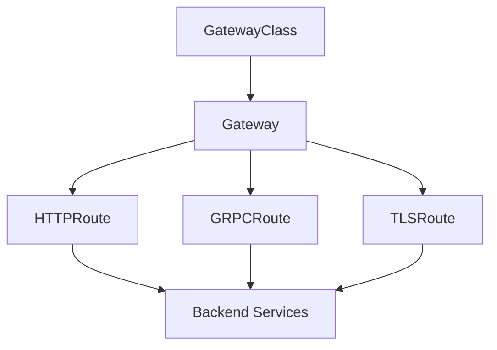

# How to Configure Kubernetes Gateway API with Flux CD

Author: [nawazdhandala](https://github.com/nawazdhandala)

Tags: flux cd, gateway api, kubernetes, gitops, networking, ingress, httproute

Description: A comprehensive guide to configuring the Kubernetes Gateway API using Flux CD for modern, standards-based traffic management.

---

## Introduction

The Kubernetes Gateway API is the next-generation standard for managing ingress and service networking in Kubernetes. It replaces the traditional Ingress resource with a more expressive, extensible, and role-oriented model. The Gateway API introduces resources like GatewayClass, Gateway, and HTTPRoute that provide fine-grained control over traffic routing.

This guide demonstrates how to set up the Gateway API with Flux CD, deploy a compatible controller, and configure routes declaratively.

## Prerequisites

- A Kubernetes cluster (v1.26 or later recommended)
- Flux CD installed and bootstrapped
- kubectl configured for your cluster
- A Git repository connected to Flux CD

## Gateway API Concepts



The Gateway API separates concerns into three roles:

- **Infrastructure Provider** manages GatewayClass resources
- **Cluster Operator** manages Gateway resources
- **Application Developer** manages Route resources (HTTPRoute, GRPCRoute, etc.)

## Installing Gateway API CRDs

First, install the Gateway API CRDs using a Flux Kustomization that pulls from the official release.

```yaml
# clusters/my-cluster/gateway-api/crds-source.yaml
apiVersion: source.toolkit.fluxcd.io/v1
kind: OCIRepository
metadata:
  name: gateway-api-crds
  namespace: flux-system
spec:
  interval: 12h
  url: oci://ghcr.io/fluxcd/manifests/gateway-api
  ref:
    tag: v1.2.0
```

```yaml
# clusters/my-cluster/gateway-api/crds-kustomization.yaml
apiVersion: kustomize.toolkit.fluxcd.io/v1
kind: Kustomization
metadata:
  name: gateway-api-crds
  namespace: flux-system
spec:
  interval: 1h
  sourceRef:
    kind: OCIRepository
    name: gateway-api-crds
  path: ./
  prune: false
  wait: true
```

## Deploying a Gateway Controller

The Gateway API requires a controller implementation. We will use Envoy Gateway as the controller.

```yaml
# clusters/my-cluster/sources/envoy-gateway-helmrepository.yaml
apiVersion: source.toolkit.fluxcd.io/v1
kind: HelmRepository
metadata:
  name: envoy-gateway
  namespace: flux-system
spec:
  interval: 1h
  url: https://gateway.envoyproxy.io/charts
```

```yaml
# clusters/my-cluster/helm-releases/envoy-gateway.yaml
apiVersion: helm.toolkit.fluxcd.io/v1
kind: HelmRelease
metadata:
  name: envoy-gateway
  namespace: envoy-gateway-system
spec:
  interval: 30m
  chart:
    spec:
      chart: gateway-helm
      version: "1.2.x"
      sourceRef:
        kind: HelmRepository
        name: envoy-gateway
        namespace: flux-system
      interval: 12h
  install:
    createNamespace: true
  values:
    # Controller configuration
    config:
      envoyGateway:
        logging:
          level:
            default: info
    # Resource limits for the controller
    resources:
      requests:
        cpu: 100m
        memory: 256Mi
      limits:
        cpu: 500m
        memory: 512Mi
```

## Creating a GatewayClass

The GatewayClass defines which controller handles the Gateway resources.

```yaml
# clusters/my-cluster/gateway-api/gatewayclass.yaml
apiVersion: gateway.networking.k8s.io/v1
kind: GatewayClass
metadata:
  name: envoy-gateway
spec:
  controllerName: gateway.envoyproxy.io/gatewayclass-controller
  description: "Envoy Gateway managed GatewayClass"
```

## Creating a Gateway

The Gateway resource defines the listeners (ports, protocols, and hostnames).

```yaml
# clusters/my-cluster/gateway-api/gateway.yaml
apiVersion: gateway.networking.k8s.io/v1
kind: Gateway
metadata:
  name: main-gateway
  namespace: default
spec:
  gatewayClassName: envoy-gateway
  listeners:
    # HTTP listener
    - name: http
      protocol: HTTP
      port: 80
      allowedRoutes:
        namespaces:
          from: All
    # HTTPS listener
    - name: https
      protocol: HTTPS
      port: 443
      tls:
        mode: Terminate
        certificateRefs:
          - kind: Secret
            name: wildcard-tls-secret
      allowedRoutes:
        namespaces:
          from: All
    # Listener restricted to a specific hostname
    - name: api-https
      protocol: HTTPS
      port: 443
      hostname: "api.example.com"
      tls:
        mode: Terminate
        certificateRefs:
          - kind: Secret
            name: api-tls-secret
      allowedRoutes:
        namespaces:
          from: Selector
          selector:
            matchLabels:
              gateway-access: "true"
```

## Configuring HTTPRoutes

HTTPRoute resources define how HTTP traffic is routed to backend services.

### Basic Routing

```yaml
# apps/my-app/httproute.yaml
apiVersion: gateway.networking.k8s.io/v1
kind: HTTPRoute
metadata:
  name: my-app-route
  namespace: default
spec:
  parentRefs:
    - name: main-gateway
      sectionName: https
  hostnames:
    - "app.example.com"
  rules:
    - matches:
        - path:
            type: PathPrefix
            value: /
      backendRefs:
        - name: my-app-service
          port: 80
          weight: 100
```

### Path-Based Routing

```yaml
# apps/my-app/httproute-paths.yaml
apiVersion: gateway.networking.k8s.io/v1
kind: HTTPRoute
metadata:
  name: api-routes
  namespace: default
spec:
  parentRefs:
    - name: main-gateway
      sectionName: https
  hostnames:
    - "api.example.com"
  rules:
    # Route /users to the users service
    - matches:
        - path:
            type: PathPrefix
            value: /users
      backendRefs:
        - name: users-service
          port: 8080
    # Route /orders to the orders service
    - matches:
        - path:
            type: PathPrefix
            value: /orders
      backendRefs:
        - name: orders-service
          port: 8080
    # Header-based routing
    - matches:
        - headers:
            - name: X-API-Version
              value: "v2"
          path:
            type: PathPrefix
            value: /users
      backendRefs:
        - name: users-service-v2
          port: 8080
```

### Traffic Splitting (Canary Deployments)

```yaml
# apps/my-app/httproute-canary.yaml
apiVersion: gateway.networking.k8s.io/v1
kind: HTTPRoute
metadata:
  name: canary-route
  namespace: default
spec:
  parentRefs:
    - name: main-gateway
  hostnames:
    - "app.example.com"
  rules:
    - matches:
        - path:
            type: PathPrefix
            value: /
      backendRefs:
        # 90% of traffic to stable version
        - name: my-app-stable
          port: 80
          weight: 90
        # 10% of traffic to canary version
        - name: my-app-canary
          port: 80
          weight: 10
```

### HTTP Redirect and URL Rewrite

```yaml
# apps/my-app/httproute-filters.yaml
apiVersion: gateway.networking.k8s.io/v1
kind: HTTPRoute
metadata:
  name: redirect-route
  namespace: default
spec:
  parentRefs:
    - name: main-gateway
      sectionName: http
  hostnames:
    - "app.example.com"
  rules:
    # Redirect HTTP to HTTPS
    - filters:
        - type: RequestRedirect
          requestRedirect:
            scheme: https
            statusCode: 301
```

## Flux Kustomization for Gateway Resources

```yaml
# clusters/my-cluster/gateway-kustomization.yaml
apiVersion: kustomize.toolkit.fluxcd.io/v1
kind: Kustomization
metadata:
  name: gateway-api-config
  namespace: flux-system
spec:
  interval: 10m
  sourceRef:
    kind: GitRepository
    name: flux-system
  path: ./clusters/my-cluster/gateway-api
  prune: true
  dependsOn:
    - name: gateway-api-crds
    - name: envoy-gateway
  timeout: 5m
```

## Verifying the Configuration

```bash
# Check GatewayClass status
kubectl get gatewayclass

# Check Gateway status and assigned addresses
kubectl get gateways -A

# List all HTTPRoutes
kubectl get httproutes -A

# Describe the gateway for detailed status
kubectl describe gateway main-gateway

# Check the Envoy Gateway controller logs
kubectl logs -n envoy-gateway-system deploy/envoy-gateway
```

## Conclusion

The Kubernetes Gateway API provides a modern, role-oriented approach to traffic management that is more expressive than the traditional Ingress resource. When managed through Flux CD, all gateway and route configurations are versioned in Git and automatically reconciled. This combination gives you a powerful, standards-based networking stack that is easy to maintain and evolve.
