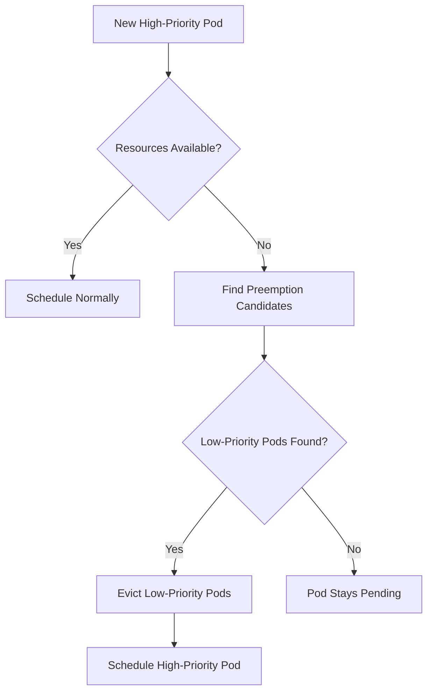

# How to Configure Pod Priority and Preemption with Flux CD

Author: [nawazdhandala](https://github.com/nawazdhandala)

Tags: Flux CD, Pod Priority, Preemption, Kubernetes, Scheduling, Resource Management, GitOps

Description: A practical guide to configuring Pod Priority and Preemption on Kubernetes using Flux CD for workload scheduling control and resource guarantees.

---

## Introduction

Pod Priority and Preemption is a Kubernetes scheduling feature that allows you to assign importance levels to pods. When cluster resources are scarce, the scheduler can evict (preempt) lower-priority pods to make room for higher-priority pods. This ensures that critical workloads like production APIs and databases always get the resources they need, even during resource contention.

By managing PriorityClasses and pod configurations through Flux CD, you maintain consistent scheduling policies across clusters via GitOps.

## Prerequisites

- A Kubernetes cluster (v1.25+)
- Flux CD installed and bootstrapped
- kubectl and flux CLI tools installed
- Understanding of Kubernetes scheduling concepts

## How Priority and Preemption Works



## Repository Structure

```text
clusters/
  my-cluster/
    priority-classes/
      system-priority-classes.yaml
      application-priority-classes.yaml
      example-workloads.yaml
      resource-quota.yaml
      kustomization.yaml
```

## Step 1: Define System-Level PriorityClasses

Create PriorityClasses for system components that must always run.

```yaml
# clusters/my-cluster/priority-classes/system-priority-classes.yaml
apiVersion: scheduling.k8s.io/v1
kind: PriorityClass
metadata:
  name: system-cluster-critical
  labels:
    app.kubernetes.io/managed-by: flux
# Highest priority for cluster-critical system components
# Built-in system-cluster-critical has value 2000000000
# We define custom levels below that
value: 1000000
# Setting globalDefault to false means pods without a priorityClassName
# will use the default priority (0)
globalDefault: false
# Description helps operators understand when to use this class
description: "Reserved for critical cluster infrastructure components like ingress controllers and DNS."
# PreemptionPolicy controls whether this class can preempt others
preemptionPolicy: PreemptLowerPriority
---
apiVersion: scheduling.k8s.io/v1
kind: PriorityClass
metadata:
  name: system-monitoring
  labels:
    app.kubernetes.io/managed-by: flux
# High priority for monitoring and observability
value: 900000
globalDefault: false
description: "For monitoring stack components (Prometheus, Grafana, alerting)."
preemptionPolicy: PreemptLowerPriority
---
apiVersion: scheduling.k8s.io/v1
kind: PriorityClass
metadata:
  name: system-security
  labels:
    app.kubernetes.io/managed-by: flux
# High priority for security components
value: 950000
globalDefault: false
description: "For security components (cert-manager, OPA, Vault agent)."
preemptionPolicy: PreemptLowerPriority
```

## Step 2: Define Application-Level PriorityClasses

Create a tiered priority system for application workloads.

```yaml
# clusters/my-cluster/priority-classes/application-priority-classes.yaml
apiVersion: scheduling.k8s.io/v1
kind: PriorityClass
metadata:
  name: production-critical
  labels:
    app.kubernetes.io/managed-by: flux
    tier: production
# Production-critical services (APIs, databases)
value: 500000
globalDefault: false
description: "Production-critical workloads that must always be running (APIs, databases, payment systems)."
preemptionPolicy: PreemptLowerPriority
---
apiVersion: scheduling.k8s.io/v1
kind: PriorityClass
metadata:
  name: production-standard
  labels:
    app.kubernetes.io/managed-by: flux
    tier: production
# Standard production services
value: 400000
globalDefault: false
description: "Standard production workloads (background workers, internal services)."
preemptionPolicy: PreemptLowerPriority
---
apiVersion: scheduling.k8s.io/v1
kind: PriorityClass
metadata:
  name: staging
  labels:
    app.kubernetes.io/managed-by: flux
    tier: staging
# Staging environment workloads
value: 200000
globalDefault: false
description: "Staging environment workloads. Can be preempted by production workloads."
preemptionPolicy: PreemptLowerPriority
---
apiVersion: scheduling.k8s.io/v1
kind: PriorityClass
metadata:
  name: development
  labels:
    app.kubernetes.io/managed-by: flux
    tier: development
# Development and testing workloads
value: 100000
globalDefault: false
description: "Development and testing workloads. Lowest application priority."
preemptionPolicy: PreemptLowerPriority
---
apiVersion: scheduling.k8s.io/v1
kind: PriorityClass
metadata:
  name: batch-low
  labels:
    app.kubernetes.io/managed-by: flux
    tier: batch
# Batch jobs that can tolerate preemption
value: 50000
globalDefault: false
description: "Low-priority batch jobs. Will be preempted when resources are needed."
preemptionPolicy: PreemptLowerPriority
---
apiVersion: scheduling.k8s.io/v1
kind: PriorityClass
metadata:
  name: best-effort
  labels:
    app.kubernetes.io/managed-by: flux
    tier: best-effort
# Best-effort workloads that run only when resources are available
value: 10000
globalDefault: false
description: "Best-effort workloads. First to be evicted during resource pressure."
# Never preempt - these pods wait for resources to become available
preemptionPolicy: Never
---
apiVersion: scheduling.k8s.io/v1
kind: PriorityClass
metadata:
  name: default-priority
  labels:
    app.kubernetes.io/managed-by: flux
# Default priority for pods that do not specify a priorityClassName
value: 100000
# Set as the global default
globalDefault: true
description: "Default priority class for workloads without explicit priority."
preemptionPolicy: PreemptLowerPriority
```

## Step 3: Example Workloads with Priority

```yaml
# clusters/my-cluster/priority-classes/example-workloads.yaml
# Production-critical API
apiVersion: apps/v1
kind: Deployment
metadata:
  name: payment-api
  namespace: default
  labels:
    app: payment-api
    tier: production
spec:
  replicas: 3
  selector:
    matchLabels:
      app: payment-api
  template:
    metadata:
      labels:
        app: payment-api
    spec:
      # Assign the highest application priority
      priorityClassName: production-critical
      # Spread across zones for availability
      topologySpreadConstraints:
        - maxSkew: 1
          topologyKey: topology.kubernetes.io/zone
          whenUnsatisfiable: DoNotSchedule
          labelSelector:
            matchLabels:
              app: payment-api
      containers:
        - name: api
          image: payment-api:latest
          resources:
            requests:
              cpu: 500m
              memory: 512Mi
            limits:
              cpu: 2000m
              memory: 1Gi
          ports:
            - containerPort: 8080
---
# Background worker with standard priority
apiVersion: apps/v1
kind: Deployment
metadata:
  name: email-worker
  namespace: default
  labels:
    app: email-worker
    tier: production
spec:
  replicas: 5
  selector:
    matchLabels:
      app: email-worker
  template:
    metadata:
      labels:
        app: email-worker
    spec:
      # Standard production priority - can be preempted by critical
      priorityClassName: production-standard
      containers:
        - name: worker
          image: email-worker:latest
          resources:
            requests:
              cpu: 250m
              memory: 256Mi
            limits:
              cpu: 1000m
              memory: 512Mi
---
# Batch job with low priority
apiVersion: batch/v1
kind: Job
metadata:
  name: data-export
  namespace: default
spec:
  template:
    metadata:
      labels:
        app: data-export
    spec:
      # Low priority - will be preempted if production needs resources
      priorityClassName: batch-low
      restartPolicy: OnFailure
      containers:
        - name: exporter
          image: data-exporter:latest
          resources:
            requests:
              cpu: 1000m
              memory: 2Gi
            limits:
              cpu: 4000m
              memory: 8Gi
---
# Best-effort workload that runs only when spare capacity exists
apiVersion: apps/v1
kind: Deployment
metadata:
  name: ml-training
  namespace: default
  labels:
    app: ml-training
spec:
  replicas: 2
  selector:
    matchLabels:
      app: ml-training
  template:
    metadata:
      labels:
        app: ml-training
    spec:
      # Best-effort: never preempts others, first to be evicted
      priorityClassName: best-effort
      containers:
        - name: trainer
          image: ml-trainer:latest
          resources:
            requests:
              cpu: 2000m
              memory: 4Gi
            limits:
              cpu: 8000m
              memory: 16Gi
```

## Step 4: ResourceQuota with Priority

Limit resource consumption by priority class.

```yaml
# clusters/my-cluster/priority-classes/resource-quota.yaml
apiVersion: v1
kind: ResourceQuota
metadata:
  name: production-critical-quota
  namespace: default
spec:
  hard:
    # Limit total resources for production-critical pods
    requests.cpu: "20"
    requests.memory: 40Gi
    limits.cpu: "40"
    limits.memory: 80Gi
    pods: "50"
  scopeSelector:
    matchExpressions:
      - scopeName: PriorityClass
        operator: In
        values: ["production-critical"]
---
apiVersion: v1
kind: ResourceQuota
metadata:
  name: batch-low-quota
  namespace: default
spec:
  hard:
    # Tighter limits for batch workloads
    requests.cpu: "10"
    requests.memory: 20Gi
    limits.cpu: "20"
    limits.memory: 40Gi
    pods: "20"
  scopeSelector:
    matchExpressions:
      - scopeName: PriorityClass
        operator: In
        values: ["batch-low", "best-effort"]
```

## Step 5: Use Priority with Cluster Autoscaler

Configure the Cluster Autoscaler to respect priority during scaling decisions.

```yaml
# clusters/my-cluster/priority-classes/priority-expander.yaml
apiVersion: v1
kind: ConfigMap
metadata:
  name: cluster-autoscaler-priority-expander
  namespace: cluster-autoscaler
data:
  # When scaling up, prioritize node groups based on workload priority
  priorities: |
    100:
      # Scale up on-demand nodes first for critical workloads
      - .*on-demand.*
    50:
      # Use spot nodes for lower-priority workloads
      - .*spot.*
```

## Step 6: Monitoring Priority and Preemption

```yaml
# clusters/my-cluster/priority-classes/monitoring.yaml
apiVersion: monitoring.coreos.com/v1
kind: PrometheusRule
metadata:
  name: priority-preemption-alerts
  namespace: monitoring
spec:
  groups:
    - name: pod-priority
      rules:
        # Alert when high-priority pods are pending
        - alert: HighPriorityPodPending
          expr: |
            kube_pod_status_phase{phase="Pending"} *
            on(namespace, pod)
            group_left(priority_class)
            kube_pod_info{priority_class=~"production-critical|system-cluster-critical"}
            > 0
          for: 5m
          labels:
            severity: critical
          annotations:
            summary: "High-priority pod {{ $labels.namespace }}/{{ $labels.pod }} has been pending for 5 minutes"

        # Alert on excessive preemptions
        - alert: ExcessivePreemptions
          expr: |
            increase(kube_pod_preemption_victims[1h]) > 10
          for: 5m
          labels:
            severity: warning
          annotations:
            summary: "More than 10 pods preempted in the last hour, consider adding capacity"

        # Track resource usage by priority class
        - record: pod_resource_requests_by_priority
          expr: |
            sum by (priority_class, resource) (
              kube_pod_container_resource_requests *
              on(namespace, pod)
              group_left(priority_class)
              kube_pod_info
            )
```

## Step 7: Flux Kustomization

```yaml
# clusters/my-cluster/priority-classes/kustomization.yaml
apiVersion: kustomize.toolkit.fluxcd.io/v1
kind: Kustomization
metadata:
  name: priority-classes
  namespace: flux-system
spec:
  interval: 10m
  path: ./clusters/my-cluster/priority-classes
  prune: true
  sourceRef:
    kind: GitRepository
    name: flux-system
  # PriorityClasses should be applied before workloads
  wait: true
  timeout: 2m
```

## Verifying the Configuration

```bash
# List all PriorityClasses and their values
kubectl get priorityclasses -o custom-columns=NAME:.metadata.name,VALUE:.value,DEFAULT:.globalDefault,PREEMPTION:.preemptionPolicy

# Check which priority class a pod is using
kubectl get pods -A -o custom-columns=NAMESPACE:.metadata.namespace,NAME:.metadata.name,PRIORITY:.spec.priorityClassName,PRIORITY_VALUE:.spec.priority

# View pods sorted by priority
kubectl get pods -A -o json | jq -r '.items | sort_by(.spec.priority) | reverse[] | "\(.spec.priority)\t\(.spec.priorityClassName)\t\(.metadata.namespace)/\(.metadata.name)"'

# Check resource quota usage by priority
kubectl describe resourcequota -n default

# Verify Flux reconciliation
flux get kustomization priority-classes
```

## Troubleshooting

```bash
# Check for preemption events
kubectl get events -A --field-selector reason=Preempted

# Find pods that were preempted
kubectl get events -A | grep -i preempt

# Check scheduler logs for priority decisions
kubectl logs -n kube-system -l component=kube-scheduler --tail=30 | grep -i priority

# Verify a pod's effective priority
kubectl get pod <pod-name> -o jsonpath='{.spec.priority} {.spec.priorityClassName}'

# Check pending pods and why they cannot be scheduled
kubectl describe pod <pending-pod-name> | grep -A10 "Events"

# View resource quota consumption
kubectl get resourcequota -n default -o yaml
```

## Best Practices

- Define a clear priority hierarchy with well-separated values (gaps of 100000+)
- Set a sensible `globalDefault` PriorityClass to prevent pods from having zero priority
- Use `preemptionPolicy: Never` for workloads that should not evict others
- Combine priority with PodDisruptionBudgets to protect minimum availability
- Use ResourceQuotas with priority scopes to prevent priority abuse
- Monitor preemption events and set alerts for unusual preemption rates
- Document your priority tiers so teams know which class to use
- Test preemption behavior in staging before rolling out to production
- Keep system-level priorities separate from application-level priorities
- Avoid creating too many priority levels -- 5 to 8 tiers is usually sufficient

## Conclusion

Pod Priority and Preemption with Flux CD provides a GitOps-managed scheduling policy that ensures critical workloads always get the resources they need. By defining PriorityClasses as code and assigning them to workloads declaratively, you create a predictable resource allocation hierarchy. Combined with ResourceQuotas and monitoring, this approach gives you fine-grained control over how cluster resources are distributed during contention, all managed through the Flux CD GitOps pipeline.
