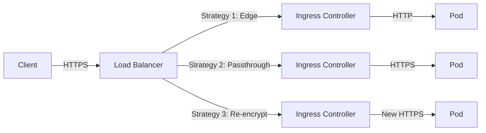

# How to Configure TLS Termination with Flux CD

Author: [nawazdhandala](https://github.com/nawazdhandala)

Tags: Flux CD, TLS Termination, Kubernetes, GitOps, Networking, SSL, Ingresses, Security

Description: A detailed guide to configuring TLS termination strategies in Kubernetes using Flux CD for secure, GitOps-managed HTTPS traffic handling.

---

## Introduction

TLS termination is the process of decrypting encrypted HTTPS traffic at a specific point in your infrastructure before forwarding it to backend services. In Kubernetes, TLS can be terminated at different layers: the ingress controller, a service mesh sidecar, or the application itself. Properly configuring TLS termination is critical for both security and performance.

This guide covers different TLS termination strategies in Kubernetes, all managed through Flux CD for a GitOps approach to secure networking.

## Prerequisites

- A Kubernetes cluster (v1.24 or later)
- Flux CD installed and bootstrapped
- An ingress controller deployed (nginx-ingress or similar)
- cert-manager installed for certificate management
- kubectl configured for your cluster

## TLS Termination Strategies



There are three primary strategies:

1. **Edge Termination** - TLS is terminated at the ingress controller. Traffic between ingress and pods is unencrypted (HTTP).
2. **TLS Passthrough** - The ingress controller passes encrypted traffic directly to the backend pod. The pod handles TLS.
3. **Re-encryption** - TLS is terminated at the ingress, then re-encrypted with a new TLS connection to the backend.

## Edge TLS Termination with NGINX Ingress

This is the most common approach. The ingress controller terminates TLS and forwards plain HTTP to the backend.

### TLS Secret

```yaml
# apps/my-app/tls/tls-secret.yaml
# This secret can be created by cert-manager automatically
# or manually for pre-existing certificates
apiVersion: v1
kind: Secret
metadata:
  name: app-tls-secret
  namespace: default
type: kubernetes.io/tls
data:
  # Base64-encoded certificate and key
  tls.crt: LS0tLS1CRUdJTi...  # Your certificate chain
  tls.key: LS0tLS1CRUdJTi...  # Your private key
```

### Ingress with Edge Termination

```yaml
# apps/my-app/ingress-edge-tls.yaml
apiVersion: networking.k8s.io/v1
kind: Ingress
metadata:
  name: my-app-edge-tls
  namespace: default
  annotations:
    # Auto-issue certificate via cert-manager
    cert-manager.io/cluster-issuer: letsencrypt-production
    # Force HTTPS redirect
    nginx.ingress.kubernetes.io/force-ssl-redirect: "true"
    # HSTS header
    nginx.ingress.kubernetes.io/hsts: "true"
    nginx.ingress.kubernetes.io/hsts-max-age: "31536000"
    nginx.ingress.kubernetes.io/hsts-include-subdomains: "true"
    nginx.ingress.kubernetes.io/hsts-preload: "true"
    # SSL ciphers configuration
    nginx.ingress.kubernetes.io/ssl-ciphers: "ECDHE-ECDSA-AES128-GCM-SHA256:ECDHE-RSA-AES128-GCM-SHA256:ECDHE-ECDSA-AES256-GCM-SHA384:ECDHE-RSA-AES256-GCM-SHA384"
    # Minimum TLS version
    nginx.ingress.kubernetes.io/ssl-prefer-server-ciphers: "true"
spec:
  ingressClassName: nginx
  tls:
    - hosts:
        - app.example.com
      secretName: app-tls-secret
  rules:
    - host: app.example.com
      http:
        paths:
          - path: /
            pathType: Prefix
            backend:
              service:
                name: my-app-service
                port:
                  number: 80
```

## TLS Passthrough

With passthrough, the ingress controller forwards the encrypted connection directly to the backend without decrypting it. This is useful when the application must handle its own TLS.

### NGINX Ingress Passthrough Configuration

First, enable passthrough in the NGINX ingress controller Helm values.

```yaml
# clusters/my-cluster/helm-releases/nginx-ingress.yaml
apiVersion: helm.toolkit.fluxcd.io/v1
kind: HelmRelease
metadata:
  name: nginx-ingress
  namespace: ingress-nginx
spec:
  interval: 30m
  chart:
    spec:
      chart: ingress-nginx
      version: "4.11.x"
      sourceRef:
        kind: HelmRepository
        name: ingress-nginx
        namespace: flux-system
      interval: 12h
  values:
    controller:
      # Enable TLS passthrough
      extraArgs:
        enable-ssl-passthrough: "true"
      resources:
        requests:
          cpu: 100m
          memory: 128Mi
        limits:
          cpu: 500m
          memory: 256Mi
```

### Ingress with Passthrough

```yaml
# apps/my-app/ingress-passthrough.yaml
apiVersion: networking.k8s.io/v1
kind: Ingress
metadata:
  name: my-app-passthrough
  namespace: default
  annotations:
    # Enable SSL passthrough for this ingress
    nginx.ingress.kubernetes.io/ssl-passthrough: "true"
    # Backend protocol is HTTPS since TLS is not terminated
    nginx.ingress.kubernetes.io/backend-protocol: "HTTPS"
spec:
  ingressClassName: nginx
  rules:
    - host: secure-app.example.com
      http:
        paths:
          - path: /
            pathType: Prefix
            backend:
              service:
                name: my-secure-app
                port:
                  number: 443
```

### Backend Application with TLS

The backend pod must be configured to handle TLS itself.

```yaml
# apps/my-app/deployment-tls.yaml
apiVersion: apps/v1
kind: Deployment
metadata:
  name: my-secure-app
  namespace: default
spec:
  replicas: 2
  selector:
    matchLabels:
      app: my-secure-app
  template:
    metadata:
      labels:
        app: my-secure-app
    spec:
      containers:
        - name: app
          image: my-secure-app:latest
          ports:
            - containerPort: 443
              name: https
          volumeMounts:
            # Mount the TLS certificate into the pod
            - name: tls-certs
              mountPath: /etc/tls
              readOnly: true
      volumes:
        - name: tls-certs
          secret:
            secretName: backend-tls-secret
```

## Re-encryption (Backend HTTPS)

Re-encryption terminates TLS at the ingress and establishes a new TLS connection to the backend.

```yaml
# apps/my-app/ingress-reencrypt.yaml
apiVersion: networking.k8s.io/v1
kind: Ingress
metadata:
  name: my-app-reencrypt
  namespace: default
  annotations:
    cert-manager.io/cluster-issuer: letsencrypt-production
    # Tell NGINX to use HTTPS when connecting to the backend
    nginx.ingress.kubernetes.io/backend-protocol: "HTTPS"
    # Verify the backend certificate (optional, for mTLS)
    nginx.ingress.kubernetes.io/proxy-ssl-verify: "on"
    nginx.ingress.kubernetes.io/proxy-ssl-secret: "default/backend-ca-secret"
spec:
  ingressClassName: nginx
  tls:
    - hosts:
        - app.example.com
      secretName: frontend-tls-secret
  rules:
    - host: app.example.com
      http:
        paths:
          - path: /
            pathType: Prefix
            backend:
              service:
                name: my-secure-backend
                port:
                  number: 443
```

## Mutual TLS (mTLS) at the Ingress

Configure the ingress to require client certificates for mutual authentication.

```yaml
# apps/my-app/ingress-mtls.yaml
apiVersion: networking.k8s.io/v1
kind: Ingress
metadata:
  name: my-app-mtls
  namespace: default
  annotations:
    cert-manager.io/cluster-issuer: letsencrypt-production
    # Enable client certificate authentication
    nginx.ingress.kubernetes.io/auth-tls-verify-client: "on"
    # CA certificate to verify client certificates
    nginx.ingress.kubernetes.io/auth-tls-secret: "default/client-ca-secret"
    # Depth of client certificate chain verification
    nginx.ingress.kubernetes.io/auth-tls-verify-depth: "2"
    # Pass client certificate to backend
    nginx.ingress.kubernetes.io/auth-tls-pass-certificate-to-upstream: "true"
spec:
  ingressClassName: nginx
  tls:
    - hosts:
        - secure-api.example.com
      secretName: api-tls-secret
  rules:
    - host: secure-api.example.com
      http:
        paths:
          - path: /
            pathType: Prefix
            backend:
              service:
                name: secure-api-service
                port:
                  number: 80
```

### Client CA Secret

```yaml
# apps/my-app/tls/client-ca-secret.yaml
apiVersion: v1
kind: Secret
metadata:
  name: client-ca-secret
  namespace: default
type: Opaque
data:
  # Base64-encoded CA certificate for verifying client certs
  ca.crt: LS0tLS1CRUdJTi...
```

## Gateway API TLS Termination

If using the Kubernetes Gateway API, TLS termination is configured on the Gateway listener.

```yaml
# clusters/my-cluster/gateway/gateway-tls.yaml
apiVersion: gateway.networking.k8s.io/v1
kind: Gateway
metadata:
  name: tls-gateway
  namespace: default
spec:
  gatewayClassName: envoy-gateway
  listeners:
    # Edge termination
    - name: https
      protocol: HTTPS
      port: 443
      tls:
        mode: Terminate
        certificateRefs:
          - kind: Secret
            name: gateway-tls-secret
      allowedRoutes:
        namespaces:
          from: All
    # TLS passthrough
    - name: tls-passthrough
      protocol: TLS
      port: 8443
      tls:
        mode: Passthrough
      allowedRoutes:
        namespaces:
          from: All
```

## Flux Kustomization

```yaml
# clusters/my-cluster/tls-kustomization.yaml
apiVersion: kustomize.toolkit.fluxcd.io/v1
kind: Kustomization
metadata:
  name: tls-config
  namespace: flux-system
spec:
  interval: 10m
  sourceRef:
    kind: GitRepository
    name: flux-system
  path: ./clusters/my-cluster/tls-config
  prune: true
  dependsOn:
    - name: cert-manager-config
    - name: nginx-ingress
  decryption:
    provider: sops
    secretRef:
      name: sops-age
  timeout: 5m
```

## Verifying TLS Configuration

```bash
# Test TLS connection and view certificate details
openssl s_client -connect app.example.com:443 -servername app.example.com </dev/null 2>/dev/null | openssl x509 -text -noout

# Check TLS version and cipher in use
curl -vI https://app.example.com 2>&1 | grep -E "SSL|TLS|subject|issuer"

# Verify HSTS header
curl -sI https://app.example.com | grep -i strict-transport

# Check ingress TLS configuration
kubectl describe ingress my-app-edge-tls -n default

# Verify the TLS secret exists
kubectl get secret app-tls-secret -n default -o yaml
```

## Troubleshooting

```bash
# Check NGINX ingress controller logs for TLS errors
kubectl logs -n ingress-nginx deploy/ingress-nginx-controller | grep -i ssl

# Verify certificate chain
openssl s_client -connect app.example.com:443 -showcerts

# Check if cert-manager issued the certificate
kubectl get certificates -A
kubectl describe certificate app-tls-secret -n default

# Test mTLS with a client certificate
curl --cert client.crt --key client.key --cacert ca.crt https://secure-api.example.com/
```

## Conclusion

TLS termination is a critical component of Kubernetes networking security. By managing all TLS configurations through Flux CD, you ensure that your security posture is consistent, auditable, and automatically enforced. Whether you choose edge termination for simplicity, passthrough for end-to-end encryption, or re-encryption for defense in depth, Flux CD keeps your configuration in sync with your desired state in Git.
