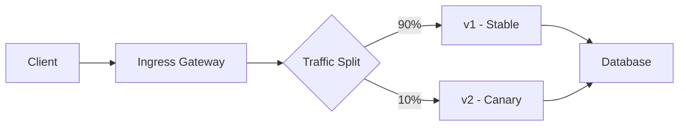

# How to Configure Traffic Splitting with Flux CD and Service Mesh

Author: [nawazdhandala](https://github.com/nawazdhandala)

Tags: flux cd, traffic splitting, service mesh, gitops, kubernetes, canary, istio, linkerd

Description: A practical guide to implementing traffic splitting strategies for canary deployments and A/B testing using Flux CD with various service meshes.

---

## Introduction

Traffic splitting is a core service mesh capability that allows you to route portions of traffic to different service versions. This enables canary deployments, A/B testing, and blue-green deployments without downtime. When managed through Flux CD, traffic splitting configurations become version-controlled and automatically reconciled, making progressive delivery both safe and repeatable.

This guide covers traffic splitting patterns using Istio, Linkerd, and the Gateway API, all orchestrated through Flux CD.

## Prerequisites

Before starting, ensure you have:

- A Kubernetes cluster (v1.25 or later)
- Flux CD bootstrapped on the cluster
- A service mesh installed (Istio or Linkerd)
- Two versions of an application deployed (stable and canary)
- kubectl access to the cluster

## Architecture Overview

The traffic splitting architecture routes incoming requests through the service mesh proxy, which distributes traffic based on configured weights.



## Deploying Application Versions

First, deploy both the stable and canary versions of your application.

```yaml
# apps/my-app/deployment-stable.yaml
apiVersion: apps/v1
kind: Deployment
metadata:
  name: my-app-stable
  namespace: production
  labels:
    app: my-app
    version: stable
spec:
  replicas: 3
  selector:
    matchLabels:
      app: my-app
      version: stable
  template:
    metadata:
      labels:
        app: my-app
        version: stable
    spec:
      containers:
        - name: my-app
          image: my-registry/my-app:v1.0.0
          ports:
            - containerPort: 8080
          # Readiness probe ensures traffic only goes to healthy pods
          readinessProbe:
            httpGet:
              path: /health
              port: 8080
            initialDelaySeconds: 5
            periodSeconds: 10
          resources:
            requests:
              memory: "128Mi"
              cpu: "100m"
```

```yaml
# apps/my-app/deployment-canary.yaml
apiVersion: apps/v1
kind: Deployment
metadata:
  name: my-app-canary
  namespace: production
  labels:
    app: my-app
    version: canary
spec:
  # Start with fewer replicas for the canary
  replicas: 1
  selector:
    matchLabels:
      app: my-app
      version: canary
  template:
    metadata:
      labels:
        app: my-app
        version: canary
    spec:
      containers:
        - name: my-app
          image: my-registry/my-app:v2.0.0
          ports:
            - containerPort: 8080
          readinessProbe:
            httpGet:
              path: /health
              port: 8080
            initialDelaySeconds: 5
            periodSeconds: 10
          resources:
            requests:
              memory: "128Mi"
              cpu: "100m"
```

## Creating Kubernetes Services

Define services that target each version using label selectors.

```yaml
# apps/my-app/services.yaml
apiVersion: v1
kind: Service
metadata:
  name: my-app
  namespace: production
  labels:
    app: my-app
spec:
  # Main service targets all versions
  selector:
    app: my-app
  ports:
    - port: 80
      targetPort: 8080
      name: http
---
apiVersion: v1
kind: Service
metadata:
  name: my-app-stable
  namespace: production
  labels:
    app: my-app
    version: stable
spec:
  # Targets only the stable version
  selector:
    app: my-app
    version: stable
  ports:
    - port: 80
      targetPort: 8080
      name: http
---
apiVersion: v1
kind: Service
metadata:
  name: my-app-canary
  namespace: production
  labels:
    app: my-app
    version: canary
spec:
  # Targets only the canary version
  selector:
    app: my-app
    version: canary
  ports:
    - port: 80
      targetPort: 8080
      name: http
```

## Traffic Splitting with Istio

Configure Istio VirtualService and DestinationRule for traffic splitting.

```yaml
# apps/my-app/istio/destination-rule.yaml
apiVersion: networking.istio.io/v1
kind: DestinationRule
metadata:
  name: my-app
  namespace: production
spec:
  host: my-app
  trafficPolicy:
    connectionPool:
      tcp:
        maxConnections: 100
  subsets:
    # Define the stable subset
    - name: stable
      labels:
        version: stable
    # Define the canary subset
    - name: canary
      labels:
        version: canary
```

```yaml
# apps/my-app/istio/virtual-service.yaml
apiVersion: networking.istio.io/v1
kind: VirtualService
metadata:
  name: my-app
  namespace: production
spec:
  hosts:
    - my-app
  http:
    - route:
        # Send 90% of traffic to the stable version
        - destination:
            host: my-app
            subset: stable
            port:
              number: 80
          weight: 90
        # Send 10% of traffic to the canary version
        - destination:
            host: my-app
            subset: canary
            port:
              number: 80
          weight: 10
      # Configure retries for failed requests
      retries:
        attempts: 3
        perTryTimeout: 2s
        retryOn: gateway-error,connect-failure,refused-stream
      # Set request timeout
      timeout: 10s
```

## Header-Based Traffic Routing with Istio

Route specific users to the canary version based on HTTP headers.

```yaml
# apps/my-app/istio/virtual-service-header.yaml
apiVersion: networking.istio.io/v1
kind: VirtualService
metadata:
  name: my-app-header-routing
  namespace: production
spec:
  hosts:
    - my-app
  http:
    # Route beta testers to the canary version
    - match:
        - headers:
            x-beta-tester:
              exact: "true"
      route:
        - destination:
            host: my-app
            subset: canary
            port:
              number: 80
    # Route internal testing traffic to canary
    - match:
        - headers:
            x-internal-test:
              regex: "^(qa|staging)$"
      route:
        - destination:
            host: my-app
            subset: canary
            port:
              number: 80
    # All other traffic goes to stable
    - route:
        - destination:
            host: my-app
            subset: stable
            port:
              number: 80
          weight: 100
```

## Traffic Splitting with Linkerd and SMI

Use the SMI TrafficSplit resource for Linkerd-based traffic splitting.

```yaml
# apps/my-app/linkerd/traffic-split.yaml
apiVersion: split.smi-spec.io/v1alpha4
kind: TrafficSplit
metadata:
  name: my-app-split
  namespace: production
spec:
  # The root service that receives incoming traffic
  service: my-app
  backends:
    # Send 90% to the stable service
    - service: my-app-stable
      weight: 900
    # Send 10% to the canary service
    - service: my-app-canary
      weight: 100
```

## Traffic Splitting with Gateway API

Use the Kubernetes Gateway API HTTPRoute for traffic splitting.

```yaml
# apps/my-app/gateway-api/httproute.yaml
apiVersion: gateway.networking.k8s.io/v1
kind: HTTPRoute
metadata:
  name: my-app-route
  namespace: production
spec:
  parentRefs:
    - name: main-gateway
      namespace: gateway-system
  hostnames:
    - "my-app.example.com"
  rules:
    - matches:
        - path:
            type: PathPrefix
            value: /
      backendRefs:
        # Route 90% of traffic to the stable version
        - name: my-app-stable
          port: 80
          weight: 90
        # Route 10% of traffic to the canary version
        - name: my-app-canary
          port: 80
          weight: 10
      # Configure request timeout
      timeouts:
        request: 10s
```

## Progressive Traffic Shifting with Flux

Automate progressive traffic shifting by using Flux variable substitution.

```yaml
# apps/my-app/kustomization.yaml
apiVersion: kustomize.toolkit.fluxcd.io/v1
kind: Kustomization
metadata:
  name: my-app-traffic-split
  namespace: flux-system
spec:
  interval: 5m
  sourceRef:
    kind: GitRepository
    name: flux-system
  path: ./apps/my-app
  prune: true
  wait: true
  # Substitute traffic weights from ConfigMap
  postBuild:
    substituteFrom:
      - kind: ConfigMap
        name: traffic-weights
```

```yaml
# clusters/my-cluster/traffic-weights.yaml
apiVersion: v1
kind: ConfigMap
metadata:
  name: traffic-weights
  namespace: flux-system
data:
  # Adjust these values to shift traffic progressively
  # Stage 1: 10% canary
  STABLE_WEIGHT: "90"
  CANARY_WEIGHT: "10"
  # Stage 2: Update to 50/50 after validation
  # STABLE_WEIGHT: "50"
  # CANARY_WEIGHT: "50"
  # Stage 3: Full rollout
  # STABLE_WEIGHT: "0"
  # CANARY_WEIGHT: "100"
```

Then reference these variables in your VirtualService template.

```yaml
# apps/my-app/istio/virtual-service-template.yaml
apiVersion: networking.istio.io/v1
kind: VirtualService
metadata:
  name: my-app
  namespace: production
spec:
  hosts:
    - my-app
  http:
    - route:
        - destination:
            host: my-app
            subset: stable
          # Weight is substituted from the ConfigMap
          weight: ${STABLE_WEIGHT}
        - destination:
            host: my-app
            subset: canary
          weight: ${CANARY_WEIGHT}
```

## Setting Up Flux Notifications for Traffic Changes

Monitor traffic splitting changes with Flux alerts.

```yaml
# infrastructure/notifications/traffic-alert.yaml
apiVersion: notification.toolkit.fluxcd.io/v1beta3
kind: Alert
metadata:
  name: traffic-split-alert
  namespace: flux-system
spec:
  providerRef:
    name: slack-provider
  eventSeverity: info
  eventSources:
    - kind: Kustomization
      name: my-app-traffic-split
  # Only alert on specific events
  exclusionList:
    - ".*no changes.*"
```

## Verifying Traffic Distribution

Confirm that traffic is being split correctly.

```bash
# Check Istio VirtualService configuration
kubectl get virtualservice my-app -n production -o yaml

# Check Linkerd TrafficSplit
kubectl get trafficsplit my-app-split -n production -o yaml

# Verify Flux reconciliation
flux get kustomizations my-app-traffic-split

# Monitor traffic distribution (Istio)
kubectl exec -n production deploy/my-app-stable -- curl -s localhost:15000/stats | grep upstream_rq

# Check Gateway API HTTPRoute
kubectl get httproute my-app-route -n production -o yaml

# Watch real-time traffic with Linkerd
linkerd viz stat deploy -n production
```

## Summary

Traffic splitting with Flux CD and service meshes enables safe progressive delivery of application updates. By storing traffic split configurations in Git, you gain full audit trails of traffic weight changes across environments. Whether using Istio VirtualServices, Linkerd TrafficSplits, or Gateway API HTTPRoutes, Flux CD ensures these configurations are automatically reconciled to match the desired state in your repository.
