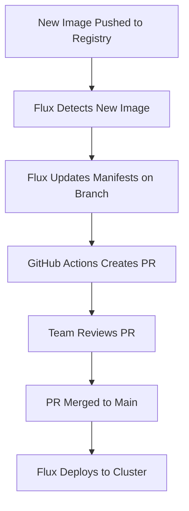

# How to Create Pull Requests for Flux Image Updates with GitHub Actions

Author: [nawazdhandala](https://github.com/nawazdhandala)

Tags: Flux CD, GitHub Actions, Pull Requests, Image Updates, Automation, GitOps, Review workflow

Description: Learn how to automate pull request creation for Flux image updates using GitHub Actions, enabling a review-based workflow for container image deployments.

---

## Introduction

By default, Flux image update automation commits changes directly to your main branch. While this works for some teams, many organizations require a review process before deployments. By combining Flux image update detection with GitHub Actions, you can automatically create pull requests when new container images are available, allowing team members to review and approve changes before they reach production.

This guide shows you how to set up an automated PR creation workflow for Flux image updates, complete with approval gates and status checks.

## Prerequisites

- A Kubernetes cluster with Flux CD bootstrapped
- Flux image reflector and automation controllers installed
- A GitHub repository for your Flux configuration
- GitHub Actions enabled on the repository

## Architecture Overview



## Step 1: Configure Flux Image Scanning

First, set up the image repository and policy for scanning:

```yaml
# clusters/production/image-repository.yaml
apiVersion: image.toolkit.fluxcd.io/v1
kind: ImageRepository
metadata:
  name: my-app
  namespace: flux-system
spec:
  image: ghcr.io/my-org/my-app
  interval: 5m
  secretRef:
    name: ghcr-credentials

---
# clusters/production/image-policy.yaml
apiVersion: image.toolkit.fluxcd.io/v1
kind: ImagePolicy
metadata:
  name: my-app
  namespace: flux-system
spec:
  imageRepositoryRef:
    name: my-app
  policy:
    semver:
      range: ">=1.0.0"
```

## Step 2: Configure Flux to Push to a Staging Branch

Instead of pushing directly to main, configure Flux image update automation to push to a separate branch. GitHub Actions will then create a PR from this branch.

```yaml
# clusters/production/image-update-automation.yaml
apiVersion: image.toolkit.fluxcd.io/v1
kind: ImageUpdateAutomation
metadata:
  name: image-updates
  namespace: flux-system
spec:
  interval: 30m
  sourceRef:
    kind: GitRepository
    name: flux-system
  git:
    checkout:
      ref:
        branch: main
    commit:
      author:
        email: flux@example.com
        name: Flux Bot
      messageTemplate: |
        chore: update image tags

        {{ range .Changed.Changes }}
        - {{ .OldValue }} -> {{ .NewValue }}
        {{ end }}
    push:
      # Push to a staging branch instead of main
      branch: flux-image-updates
  update:
    path: ./clusters/production
    strategy: Setters
```

## Step 3: Create the PR Automation Workflow

Set up a GitHub Actions workflow that creates a pull request when Flux pushes to the staging branch.

```yaml
# .github/workflows/flux-image-update-pr.yaml
name: Create PR for Flux Image Updates

on:
  push:
    branches:
      # Trigger when Flux pushes to the staging branch
      - flux-image-updates

permissions:
  contents: write
  pull-requests: write

jobs:
  create-pr:
    runs-on: ubuntu-latest
    steps:
      - name: Checkout repository
        uses: actions/checkout@v4
        with:
          ref: flux-image-updates
          # Fetch full history for diff comparison
          fetch-depth: 0

      - name: Extract changed images
        id: changes
        run: |
          # Compare the staging branch with main to find image changes
          DIFF=$(git diff origin/main..HEAD -- '*.yaml' '*.yml')

          # Extract old and new image references
          CHANGES=""
          while IFS= read -r line; do
            if echo "$line" | grep -q "^-.*image:"; then
              OLD_IMAGE=$(echo "$line" | sed 's/^-.*image: //')
              CHANGES="${CHANGES}Old: ${OLD_IMAGE}\n"
            fi
            if echo "$line" | grep -q "^+.*image:"; then
              NEW_IMAGE=$(echo "$line" | sed 's/^+.*image: //')
              CHANGES="${CHANGES}New: ${NEW_IMAGE}\n"
            fi
          done <<< "$DIFF"

          # Store the changes for the PR body
          echo "changes<<EOF" >> $GITHUB_OUTPUT
          echo -e "$CHANGES" >> $GITHUB_OUTPUT
          echo "EOF" >> $GITHUB_OUTPUT

      - name: Check for existing PR
        id: check-pr
        run: |
          # Check if a PR already exists for the staging branch
          EXISTING_PR=$(gh pr list \
            --head flux-image-updates \
            --state open \
            --json number \
            --jq '.[0].number // empty')

          echo "existing_pr=$EXISTING_PR" >> $GITHUB_OUTPUT
        env:
          GH_TOKEN: ${{ secrets.GITHUB_TOKEN }}

      - name: Create or update pull request
        run: |
          if [ -n "${{ steps.check-pr.outputs.existing_pr }}" ]; then
            # Update the existing PR body with the latest changes
            gh pr edit ${{ steps.check-pr.outputs.existing_pr }} \
              --body "$(cat <<'EOF'
          ## Flux Image Updates

          This PR was automatically created by Flux image update automation.

          ### Changed Images
          ${{ steps.changes.outputs.changes }}

          ### Review Checklist
          - [ ] Verify the new image versions are correct
          - [ ] Check that no breaking changes are introduced
          - [ ] Confirm staging tests have passed

          > This PR will be automatically updated when new image versions are detected.
          EOF
          )"
            echo "Updated existing PR #${{ steps.check-pr.outputs.existing_pr }}"
          else
            # Create a new PR
            gh pr create \
              --title "chore: update container images (Flux automation)" \
              --head flux-image-updates \
              --base main \
              --body "$(cat <<'EOF'
          ## Flux Image Updates

          This PR was automatically created by Flux image update automation.

          ### Changed Images
          ${{ steps.changes.outputs.changes }}

          ### Review Checklist
          - [ ] Verify the new image versions are correct
          - [ ] Check that no breaking changes are introduced
          - [ ] Confirm staging tests have passed

          > This PR will be automatically updated when new image versions are detected.
          EOF
          )"
          fi
        env:
          GH_TOKEN: ${{ secrets.GITHUB_TOKEN }}
```

## Step 4: Add Validation Checks to the PR

Create a workflow that runs validation checks on the PR to ensure the manifests are valid.

```yaml
# .github/workflows/validate-manifests.yaml
name: Validate Kubernetes Manifests

on:
  pull_request:
    branches:
      - main
    paths:
      - "clusters/**"
      - "apps/**"
      - "infrastructure/**"

jobs:
  validate:
    runs-on: ubuntu-latest
    steps:
      - name: Checkout repository
        uses: actions/checkout@v4

      - name: Set up Flux CLI
        uses: fluxcd/flux2/action@main

      - name: Validate Flux resources
        run: |
          # Validate all Kustomization and HelmRelease files
          find . -name "*.yaml" -o -name "*.yml" | while read file; do
            echo "Validating $file"
            # Check for valid YAML syntax
            python3 -c "
          import yaml, sys
          try:
              with open('$file') as f:
                  yaml.safe_load_all(f)
              print('  OK')
          except yaml.YAMLError as e:
              print(f'  FAILED: {e}')
              sys.exit(1)
          "
          done

      - name: Run kustomize build
        run: |
          # Install kustomize
          curl -s "https://raw.githubusercontent.com/kubernetes-sigs/kustomize/master/hack/install_kustomize.sh" | bash
          sudo mv kustomize /usr/local/bin/

          # Build each kustomization path to verify
          for dir in clusters/production apps infrastructure; do
            if [ -d "$dir" ] && [ -f "$dir/kustomization.yaml" ]; then
              echo "Building $dir"
              kustomize build "$dir"
            fi
          done

      - name: Diff against running cluster
        if: github.event.pull_request.head.ref == 'flux-image-updates'
        run: |
          # Show what will change compared to main
          git diff origin/main..HEAD -- '*.yaml' '*.yml'
```

## Step 5: Add Auto-Merge for Low-Risk Updates

For patch version updates that are low risk, you can enable auto-merge:

```yaml
# .github/workflows/auto-merge-patches.yaml
name: Auto-Merge Patch Updates

on:
  pull_request:
    types:
      - opened
      - synchronize

jobs:
  auto-merge:
    runs-on: ubuntu-latest
    # Only run on Flux image update PRs
    if: startsWith(github.head_ref, 'flux-image-updates')
    permissions:
      contents: write
      pull-requests: write
    steps:
      - name: Checkout repository
        uses: actions/checkout@v4
        with:
          fetch-depth: 0

      - name: Check if changes are patch-only
        id: check-patch
        run: |
          # Extract version changes from the diff
          DIFF=$(git diff origin/main..HEAD -- '*.yaml' '*.yml')

          IS_PATCH_ONLY=true

          # Parse old and new versions from image tags
          OLD_VERSIONS=$(echo "$DIFF" | grep "^-.*image:" | grep -oP ':\K[0-9]+\.[0-9]+\.[0-9]+' || true)
          NEW_VERSIONS=$(echo "$DIFF" | grep "^+.*image:" | grep -oP ':\K[0-9]+\.[0-9]+\.[0-9]+' || true)

          # Compare major.minor versions
          if [ -n "$OLD_VERSIONS" ] && [ -n "$NEW_VERSIONS" ]; then
            OLD_MINOR=$(echo "$OLD_VERSIONS" | head -1 | cut -d. -f1,2)
            NEW_MINOR=$(echo "$NEW_VERSIONS" | head -1 | cut -d. -f1,2)

            if [ "$OLD_MINOR" != "$NEW_MINOR" ]; then
              IS_PATCH_ONLY=false
            fi
          fi

          echo "is_patch_only=$IS_PATCH_ONLY" >> $GITHUB_OUTPUT

      - name: Enable auto-merge for patch updates
        if: steps.check-patch.outputs.is_patch_only == 'true'
        run: |
          # Enable auto-merge on the PR
          gh pr merge --auto --squash "${{ github.event.pull_request.number }}"
        env:
          GH_TOKEN: ${{ secrets.GITHUB_TOKEN }}

      - name: Add label for non-patch updates
        if: steps.check-patch.outputs.is_patch_only == 'false'
        run: |
          # Add a label indicating manual review is required
          gh pr edit "${{ github.event.pull_request.number }}" \
            --add-label "requires-review"
        env:
          GH_TOKEN: ${{ secrets.GITHUB_TOKEN }}
```

## Step 6: Configure Branch Protection

Set up branch protection rules to enforce the review workflow:

```bash
# Using the GitHub CLI to configure branch protection
gh api repos/$GITHUB_REPOSITORY/branches/main/protection \
  --method PUT \
  --field required_status_checks='{"strict":true,"contexts":["validate"]}' \
  --field enforce_admins=true \
  --field required_pull_request_reviews='{"required_approving_review_count":1}' \
  --field restrictions=null
```

## Step 7: Add Notification for PR Creation

Notify the team when a new image update PR is created:

```yaml
# Add to the flux-image-update-pr.yaml workflow
      - name: Notify team on Slack
        if: steps.check-pr.outputs.existing_pr == ''
        uses: slackapi/slack-github-action@v1
        with:
          payload: |
            {
              "text": "New Flux image update PR created",
              "blocks": [
                {
                  "type": "section",
                  "text": {
                    "type": "mrkdwn",
                    "text": "A new <${{ github.event.repository.html_url }}/pulls|pull request> has been created for Flux image updates. Please review and merge."
                  }
                }
              ]
            }
        env:
          SLACK_WEBHOOK_URL: ${{ secrets.SLACK_WEBHOOK }}
```

## Step 8: Verify the Workflow

Test the complete PR-based image update flow:

```bash
# Push a new image tag to trigger the update
docker tag my-app:latest ghcr.io/my-org/my-app:1.1.0
docker push ghcr.io/my-org/my-app:1.1.0

# Wait for Flux to detect the new image (up to 5 minutes)
flux get image policy my-app --watch

# Check that Flux pushed to the staging branch
git fetch origin
git log origin/flux-image-updates --oneline -5

# Check that the PR was created
gh pr list --head flux-image-updates

# Review and merge the PR
gh pr review --approve
gh pr merge --squash
```

## Troubleshooting

### Flux Not Pushing to the Staging Branch

```bash
# Check image update automation status
flux get image update

# View the image automation controller logs
kubectl logs -n flux-system deployment/image-automation-controller

# Verify the Git credentials have push access
kubectl get secret flux-system -n flux-system -o yaml
```

### PR Not Being Created

```bash
# Check the GitHub Actions workflow run
gh run list --workflow=flux-image-update-pr.yaml

# View the workflow logs
gh run view --log-failed

# Verify the branch exists
git ls-remote --heads origin flux-image-updates
```

### Merge Conflicts

```bash
# If the staging branch has conflicts with main, reset it
# Flux will recreate the changes on the next interval
git push origin --delete flux-image-updates

# Force Flux to reconcile
flux reconcile image update image-updates
```

## Conclusion

You now have a review-based workflow for Flux image updates. When new container images are detected, Flux pushes changes to a staging branch, GitHub Actions creates a pull request, validation checks run automatically, and the team can review before merging to production. This approach balances automation with oversight, ensuring that every deployment change goes through your team's review process.
